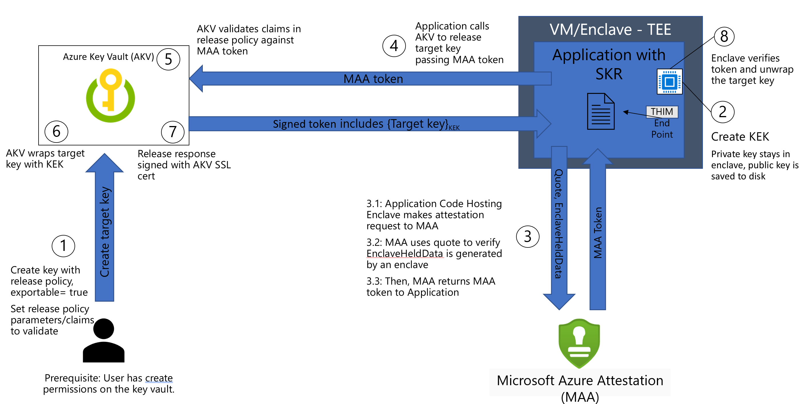

# Secure Key Release feature with AKV and Azure Confidential Computing (ACC)

Secure Key Release (SKR) is a functionality of Azure Key Vault (AKV) Managed HSM and Premium offering. Secure key release enables the release of an HSM protected key from AKV to an attested Trusted Execution Environment (TEE), such as a secure enclave, VM based TEEs etc. SKR adds another layer of access protection to your data decryption/encryption keys where you can target an application + TEE runtime environment with known configuration get access to the key material. The SKR policies defined at the time of exportable key creation govern the access to these keys.

## SKR support with AKV offerings

- [Azure Key Vault Premium](../security/fundamentals/key-management.md)
- [Azure Key Vault Managed HSM](../key-vault/managed-hsm/overview.md)

## Overall Secure Key Release Flow with TEE

SKR can only release keys based on the Microsoft Azure Attestation (MAA) generated claims. There's a tight integration on the SKR policy definition to MAA claims.



The below steps are for AKV Premium. 

### Step 1: Create a Key Vault Premium HSM Backed

[Follow the details here for Az CLI based AKV creation](../key-vault/general/quick-create-cli.md)

Make sure to set the value of [--sku] to "premium".

### Step 2: Create a Secure Key Release Policy

A Secure Key Release Policy is a json format release policy as defined [here](/rest/api/keyvault/keys/create-key/create-key?tabs=HTTP#keyreleasepolicy) that specifies a set of claims required in addition to authorization to release the key. The claims here are MAA based claims as referenced [here for SGX](/azure/attestation/attestation-token-examples#sample-jwt-generated-for-sgx-attestation) and here for [AMD SEV-SNP CVM](/azure/attestation/attestation-token-examples#sample-jwt-generated-for-sev-snp-attestation).

Visit the TEE specific [examples page for more details](skr-policy-examples.md). For more information on the SKR policy grammar, see [Azure Key Vault secure key release policy grammar](../key-vault/keys/policy-grammar.md).

Before you set an SKR policy make sure to run your TEE application through the remote attestation flow. Remote attestation isn't covered as part of this tutorial.

Example

```json
{
    "version": "1.0.0",
    "anyOf": [ // Always starts with "anyOf", meaning you can multiple, even varying rules, per authority.
        {
            "authority": "https://sharedweu.weu.attest.azure.net",
            "allOf": [ // can be replaced by "anyOf", though you cannot nest or combine "anyOf" and "allOf" yet.
                {
                    "claim": "x-ms-isolation-tee.x-ms-attestation-type", // These are the MAA claims.
                    "equals": "sevsnpvm"
                },
                {
                    "claim": "x-ms-isolation-tee.x-ms-compliance-status",
                    "equals": "azure-compliant-cvm"
                }
            ]
        }
    ]
}


```

### Step 3: Create an exportable key in AKV with attached SKR policy

Exact details of the type of key and other attributes associated can be found [here](../key-vault/general/quick-create-cli.md).

```azurecli
az keyvault key create --exportable true --vault-name "vault name from step 1" --kty RSA-HSM --name "keyname" --policy "jsonpolicyfromstep3 -can be a path to JSON" --protection hsm --vault-name "name of vault created from step1"               
```

### Step 4: Application running within a TEE doing a remote attestation

This step can be specific to the type of TEE you're running your application Intel SGX Enclaves or AMD SEV-SNP based Confidential Virtual Machines (CVM) or Confidential Containers running in CVM Enclaves with AMD SEV-SNP etc.

Follow these references examples for various TEE types offering with Azure:

- [Application within AMD EV-SNP based CVM's performing Secure Key Release](skr-flow-confidential-vm-sev-snp.md)
- [Confidential containers with Azure Container Instances (ACI) with SKR side-car containers](skr-flow-confidential-containers-azure-container-instance.md)
- [Intel SGX based applications performing Secure Key Release - Open Source Solution Mystikos Implementation](https://github.com/deislabs/mystikos/tree/main/samples/confidential_ml#environment)

## Frequently Asked Questions (FAQ)

### Can I perform SKR with non confidential computing offerings?

No. The policy attached to SKR only understands MAA claims that are associated to hardware based TEEs.

### Can I bring my own attestation provider or service and use those claims for AKV to validate and release?

No. AKV only understands and integrates with MAA today.

### Can I use AKV SDKs to perform key RELEASE?

Yes. Latest SDK integrated with 7.3 AKV API's support key RELEASE.

### Can you share some examples of the key release policies?

Yes, detailed examples by TEE type are listed [here.](./skr-policy-examples.md)

## Can I attach SKR type of policy with certificates and secrets?

No. Not at this time.

## References

[SKR Policy Examples](skr-policy-examples.md)

[Azure Container Instance with confidential containers Secure Key Release with container side-cars](skr-flow-confidential-containers-azure-container-instance.md)

[CVM on AMD SEV-SNP Applications with Secure Key Release Example](skr-flow-confidential-vm-sev-snp.md)

[AKV REST API With SKR Details](/rest/api/keyvault/keys/create-key/create-key?tabs=HTTP)

[Azure Key Vault secure key release policy grammar](../key-vault/keys/policy-grammar.md)

[AKV SDKs](../key-vault/general/client-libraries.md)
