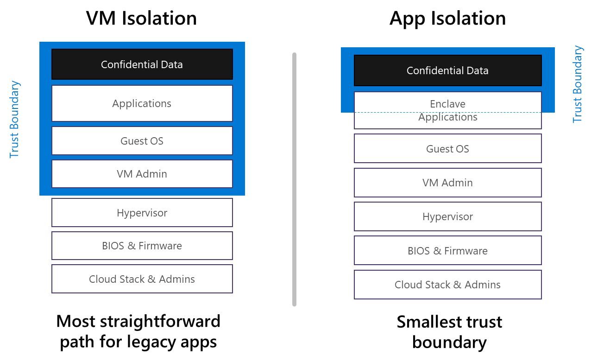
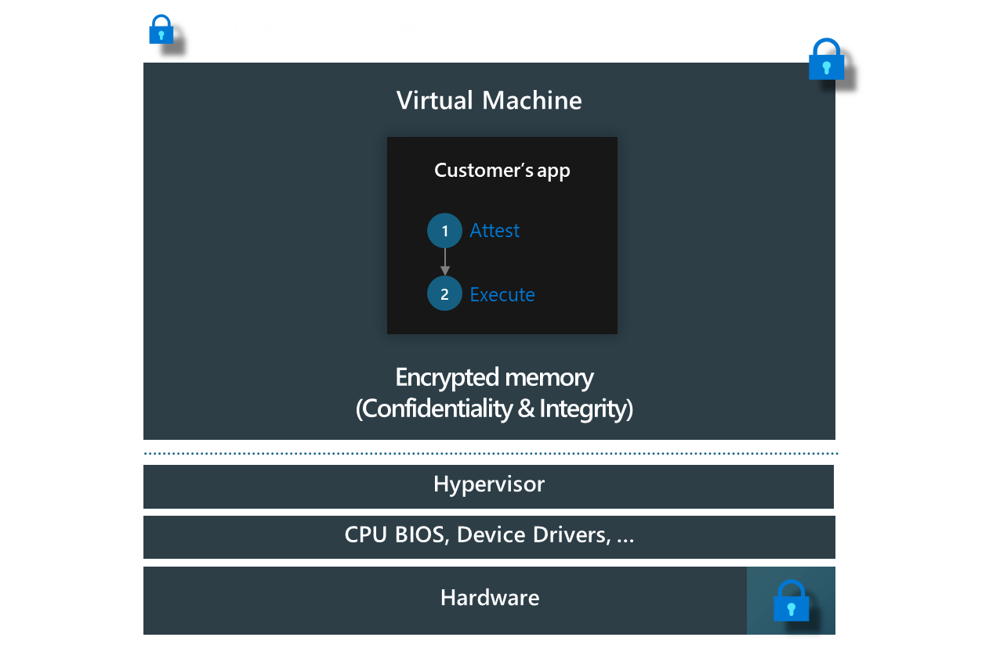
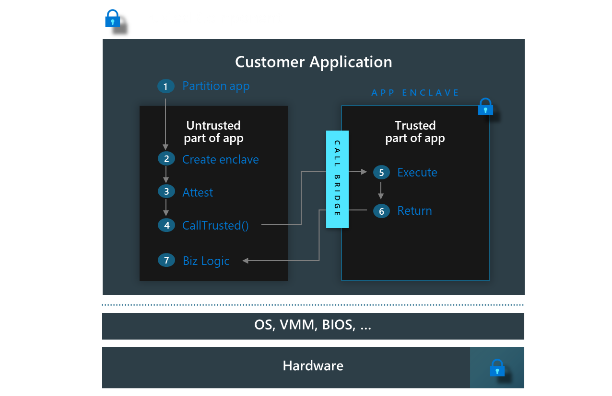

# Confidential computing deployment models

Azure confidential computing supports multiple deployment models. These different models support the wide variety of customer security requirements for modern cloud computing.

## Infrastructure as a Service (IaaS)

Under Infrastructure as a Service (IaaS) deployment model, you can use **Confidential VMs** (CVMs) based on [AMD SEV-SNP](confidential-vm-overview.md) or [Intel TDX](tdx-confidential-vm-overview.md) for VM isolation or **Application Enclaves** with [Intel SGX](confidential-computing-enclaves.md) for App isolation. These options provide organizations with differing deployment models depending your trust boundary, or desired ease of deployment.

Infrastructure as a Service (IaaS) is a cloud computing deployment model that grants access to scalable computing resources, such as servers, storage, networking, and virtualization, on demand. By adopting IaaS deployment model, organizations can forego the process of procuring, configuring, and managing their own infrastructure, instead only paying for the resources they utilize. This makes it a cost-effective solution.

In the domain of cloud computing, IaaS deployment model enables businesses to rent individual services from cloud service providers like Azure. Azure assumes responsibility for managing and maintaining the infrastructure, empowering organizations to concentrate on installing, configuring, and managing their software. Azure also offers supplementary services such as comprehensive billing management, logging, monitoring, storage resiliency, and security.

Scalability constitutes another significant advantage of IaaS deployment model in cloud computing. Enterprises can swiftly scale their resources up and down according to their requirements. This flexibility facilitates faster development life cycles, accelerating time to market for new products and ideas. Additionally, IaaS deployment model ensures reliability by eliminating single points of failure. Even in the event of a hardware component failure, the service remains accessible.

In conclusion, IaaS deployment model in combination with Azure Confidential Computing offers benefits, including cost savings, increased efficiency, innovation opportunities, reliability, high scalability, and all secured by a robust and comprehensive security solution designed specifically to protect highly sensitive data.

## Platform as a Service (PaaS)

For Platform as a Service (PaaS), you can use [confidential containers](confidential-containers.md) in confidential computing. This offering includes enclave-aware containers in Azure Kubernetes Service (AKS).

Choosing the right deployment model depends on many factors. You might need to consider the existence of legacy applications, operating system capabilities, and migration from on-premises networks.

While there are still many reasons to use VMs, containers provide extra flexibility for the many software environments of modern IT. 

Containers can support apps that:

- Run on multiple clouds.
- Connect to microservices.
- Use various programming languages and frameworks.
- Use automation and Azure Pipelines, including continuous integration and continuous deployment (CI/CD) implementation.

Containers also increase portability of applications, and improve resource usage, by applying the elasticity of the Azure cloud.

Normally, you might deploy your solution on confidential VMs if:

- You've got legacy applications that cannot be modified or containerized. However, you still need to introduce protection of data in memory, while the data is being processed.
- You're running multiple applications requiring different operating systems (OS) on a single piece of infrastructure.
- You want to emulate an entire computing environment, including all OS resources.
- You're migrating your existing VMs from on-premises to Azure.

You might opt for a confidential container-based approach when:

- You're concerned about cost and resource allocation. However, you need a more agile platform for deployment of your proprietary apps and datasets.
- You're building a modern cloud-native solution. You also have full control of source code and the deployment process.
- You need multi-cloud support.

Both options offer the highest security level for Azure services. 

There are some differences in the security postures of [confidential VMs](#confidential-vms) and [confidential containers](#application-enclaves) as follows.

### Confidential VMs

**Confidential VMs** offer hardware-encrypted protection of the entire VM from unauthorized access by the host administrator. This level typically includes the hypervisor, which the cloud service provider (CSP) manages. You can use this type of confidential VM to prevent the CSP accessing data and code executed within the VM.

VM admins or any other app or service running inside the VM, operate beyond the protected boundaries. These users and services can access data and code within the VM.

### Application Enclaves

**Application Enclaves** protects memory spaces inside a VM with hardware-based encryption. The security boundary of application enclaves is more restricted than confidential VMs. For Intel SGX, the security boundary applies to portions of memory within a VM. Guest admins, apps, and services running inside the VM can't access any data and code in execution inside the enclave.

Intel SGX enhances application security by isolating data in use. It creates secure enclaves that prevent modifications to selected code and data, ensuring that only authorized code can access them. Even with high-level permissions, entities outside the enclave, including the OS and hypervisor, cannot access enclave memory through standard calls. Accessing enclave functions requires specific Intel SGX CPU instructions, which include multiple security checks.

## Next steps

- [Learn about confidential containers](confidential-containers.md)
- [Learn about confidential computing enclaves](confidential-computing-enclaves.md)
