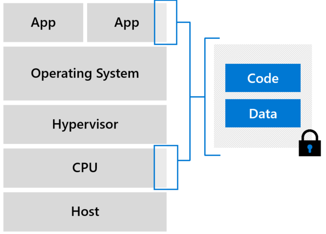

# SGX enclaves 

Intel SGX technology allows customers to create enclaves that protect data, and keep data encrypted while the CPU processes the data. 

Enclaves are secured portions of the hardware's processor and memory. You can't view data or code inside the enclave, even with a debugger. If untrusted code tries to change content in enclave memory, SGX disables the environment and denies the operations. These unique capabilities help you protect your secrets from being accessible in the clear.  

Think of an enclave as a secured lockbox. You put encrypted code and data inside the lockbox. From the outside, you can't see anything. You give the enclave a key to decrypt the data. The enclave processes and re-encrypts the data, before sending the data back out.

Azure confidential computing offers [DCsv2-series](../virtual-machines/dcv2-series.md) and [DCsv3/DCdsv3-series](../virtual-machines/dcv3-series.md) virtual machines (VMs). These VMs have support for [Intel® Software Guard Extensions (SGX)](https://intel.com/sgx). 

Each enclave has an encrypted page cache (EPC) with a set size. The EPC determines the amount of memory that an enclave can hold. [DCsv2-series](../virtual-machines/dcv2-series.md) VMs hold up to 168 MiB. [DCsv3/DCdsv3-series](../virtual-machines/dcv3-series.md) VMs hold up to 256 GB for more memory-intensive workloads.

## Developing for enclaves

You can use various [software tools for developing applications that run in enclaves](application-development.md). These tools help you shield portions of your code and data inside the enclave. Make sure nobody outside your trusted environment can view or modify your data with these tools.

## Next Steps
- [Develop an enclave-aware application](application-development.md)
- [Deploy a Intel SGX VM](quick-create-portal.md)