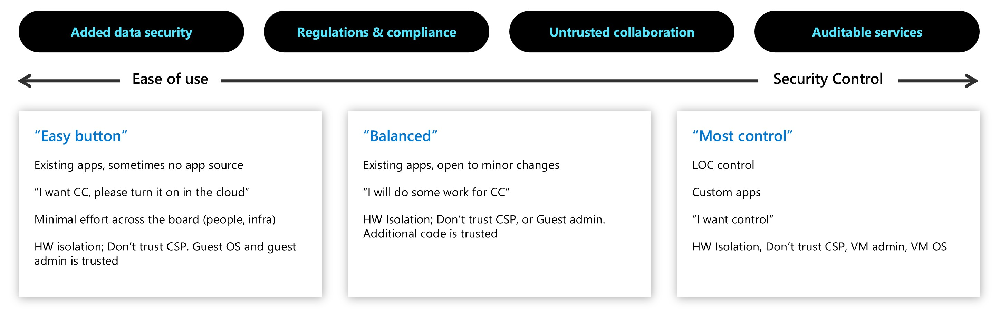

# Building confidential computing solutions

Azure confidential computing offers various options for building confidential solutions. The spectrum of option ranges from enabling "lift and shift" scenarios of existing applications, to a full control of various features of security. These features include control on the level of access. You set the host provider or guest operator access levels to data and code. You can also control other rootkit or malware access that may compromise the integrity of workloads running in the cloud.

## Solutions

Technologies such as secure enclaves or confidential virtual machines allow for customers to choose the approach that they want to take in building confidential solutions.

- Existing applications with no access to source code may benefit from confidential VMs based on AMD SEV-SNP technology for easy onboarding to the Azure confidential computing platform.
- Sophisticated workloads that include proprietary code to protect from any trust vector, may benefit of secure application enclave technology. Azure current offers application enclaves in VMs based on Intel SGX. Intel SGX provides protection of data and code running in a hardware-encrypted memory space. These applications typically require communication with an attested secure enclave, which is obtained by using open-source frameworks.
- Containerized solutions running on [confidential containers](confidential-containers.md) enabled in Azure Kubernetes Service may fit customers looking for a balanced approach to confidentiality. In these scenarios, existing apps can be packaged and deployed in containers with limited changes, but still offering full security isolation from the cloud service provider and administrators.

## Learn more

To use the power of enclaves and isolated environments, you'll need to use tools that support confidential computing. There are various tools that support enclave application development. Read about [enclave application development](application-development.md) for more information. 

Learn about [open-source tools](enclave-development-oss.md) for building solutions for Intel SGX enclave applications for virtual machines.

Use [partners and open-source tools for confidential containers](confidential-containers.md). You can also use some of these tools for Azure Kubernetes workloads.

## Next steps

- [Learn about application enclave development](application-development.md)
