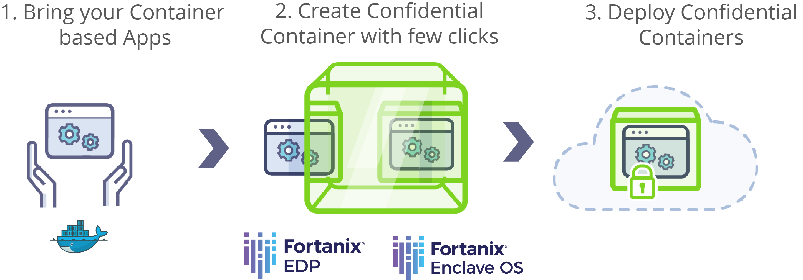
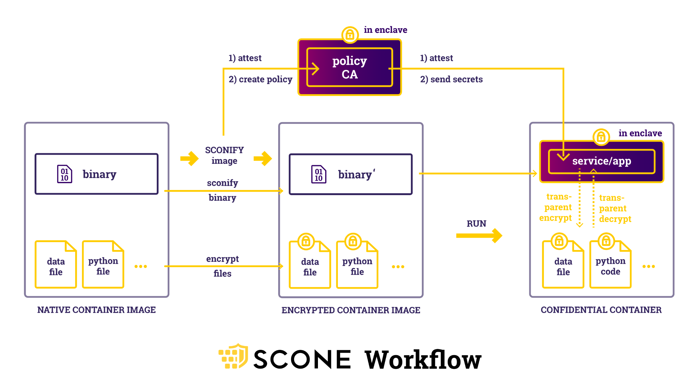
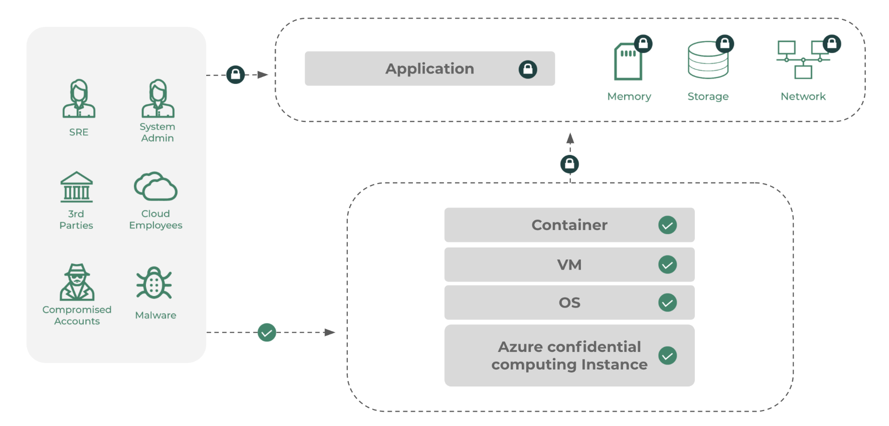

# Confidential containers on Azure Kubernetes Service(AKS) with Intel SGX enclaves

[Confidential containers](confidential-containers.md) help you run existing unmodified container applications of most **common programming languages** runtimes (Python, Node, Java etc.) in the Intel SGX based Trusted Execution Environment(TEE).
This packaging model typically does not need any source-code modifications or recompilation and is the fastest method to run in Intel SGX enclaves. Typical deployment process for running your standard docker containers requires an Open-Source SGX Wrapper or Azure Partner Solution. 
In this packaging and execution model each container application is loaded in the trusted boundary (enclave) and with a hardware-based isolation enforced by Intel SGX CPU. Each container running in an enclave receives its own memory encryption key delivered from the Intel SGX CPU.
This model works well for off the shelf container applications available in the market or custom apps currently running on general purpose nodes.
To run an existing Docker container, applications on confidential computing nodes require an Intel Software Guard Extensions (SGX) wrapper software to help the container execution within the bounds of special CPU instruction set. 
SGX creates a direct execution to the CPU to remove the guest operating system (OS), host OS, or hypervisor from the trust boundary. This step reduces the overall surface attack areas and vulnerabilities while achieving process level isolation within a single node.

The overall process for running unmodified containers involves changes to how your container is packaged today as detailed below.

:::image type="content" source="./media/confidential-containers/confidential-containers-deploy-steps.png" alt-text="Diagram of confidential container conversion, with new steps for enabling Intel SGX and AKS.":::

The SGX wrapper software needed to help run standard containers are offered by Azure software partners or Open Source Software (OSS)solutions. 

## Partner enablers

Developers can choose software providers based on their features, integration with Azure services and tooling support. 

> [!IMPORTANT]
> Azure software partners often involve licensing fees on top of your Azure infrastructure. Please verify all partner software terms independently. 

### Fortanix

[Fortanix](https://www.fortanix.com/) has portal and Command Line Interface (CLI) experiences to convert their containerized applications to SGX-capable confidential containers. You don't need to modify or recompile the application. Fortanix provides the flexibility to run and manage a broad set of applications. You can use existing applications, new enclave-native applications, and pre-packaged applications. Start with Fortanix's [Enclave Manager](https://em.fortanix.com/) UI or [REST APIs](https://www.fortanix.com/api/). Create confidential containers using the Fortanix's [quickstart guide for AKS](https://hubs.li/Q017JnNt0).

### SCONE (Scontain)

[SCONE](https://scontain.com/) (Scontain) security policies generate certificates, keys, and secrets. Only services with attestation for an application see these credentials. Application services automatically do attestation for each other through TLS. You don't need to modify the applications or TLS. For more explanation, see SCONE's [Flask application demo](https://sconedocs.github.io/flask_demo/).

SCONE can convert most existing binaries into applications that run inside enclaves. SCONE also protects interpreted languages like Python by encrypting both data files and Python code files. You can use SCONE security policies to protect encrypted files against unauthorized access, modifications, and rollbacks. For more information, see SCONE's documentation on [how to use SCONE with an existing Python application](https://sconedocs.github.io/sconify_image/).

You can deploy SCONE on Azure confidential computing nodes with AKS following this [SCONE sample AKS application deployment](https://sconedocs.github.io/aks/).

### Anjuna

[Anjuna](https://www.anjuna.io/) provides SGX platform software to run unmodified containers on AKS. For more information, see Anjuna's [documentation about functionality and sample applications](https://www.anjuna.io/partners/microsoft-azure).

Get started with a sample Redis Cache and Python Custom Application [here](https://www.anjuna.io/partners/microsoft-azure)

## OSS enablers

> [!NOTE]
> Azure confidential computing and Microsoft aren't directly affiliated with these projects and solutions.  

### Gramine

[Gramine](https://grapheneproject.io/) is a lightweight guest OS, designed to run a single Linux application with minimal host requirements. Gramine can run applications in an isolated environment. There's tooling support for converting existing Docker container to SGX ready containers.

For more information, see the Gramine's [sample application and deployment on AKS](https://github.com/gramineproject/contrib/tree/master/Examples/aks-attestation)

### Occlum

[Occlum](https://occlum.io/) is a memory-safe, multi-process library OS (LibOS) for Intel SGX. The OS enables legacy applications to run on SGX with little to no modifications to source code. Occlum transparently protects the confidentiality of user workloads while allowing an easy "lift and shift" to existing Docker applications.

For more information, see Occlum's [deployment instructions and sample apps on AKS](https://github.com/occlum/occlum/blob/master/docs/azure_aks_deployment_guide.md).

### Marblerun

[Marblerun](https://marblerun.sh/) is an orchestration framework for confidential containers. You can run and scale confidential services on SGX-enabled Kubernetes. Marblerun takes care of boilerplate tasks like verifying the services in your cluster, managing secrets for them, and establishing enclave-to-enclave mTLS connections between them. Marblerun also ensures that your cluster of confidential containers adheres to a manifest defined in simple JSON. You can verify the manifest with external clients through remote attestation.

This framework extends the confidentiality, integrity, and verifiability properties of a single enclave to a Kubernetes cluster.

Marblerun supports confidential containers created with Graphene, Occlum, and EGo, with [examples for each SDK](https://docs.edgeless.systems/marblerun/#/examples?id=examples). The framework runs on Kubernetes alongside your existing cloud-native tooling. There's a CLI and helm charts. Marblerun also supports confidential computing nodes on AKS. Follow Marblerun's [guide to deploy Marblerun on AKS](https://docs.edgeless.systems/marblerun/#/deployment/cloud?id=cloud-deployment).

## Confidential Containers reference architectures

- [Confidential data messaging for healthcare reference architecture and sample with Intel SGX confidential containers](https://github.com/Azure-Samples/confidential-container-samples/blob/main/confidential-healthcare-scone-confinf-onnx/README.md). 
- [Confidential big-data processing with Apache Spark on AKS with Intel SGX confidential containers](/azure/architecture/example-scenario/confidential/data-analytics-containers-spark-kubernetes-azure-sql). 

## Get in touch

Do you have questions about your implementation? Do you want to become an enabler for confidential containers? Send an email to <acconaks@microsoft.com>.

## Next steps

- [Deploy AKS cluster with Intel SGX Confidential VM Nodes](./confidential-enclave-nodes-aks-get-started.md)
- [Microsoft Azure Attestation](../attestation/overview.md)
- [Intel SGX Confidential Virtual Machines](virtual-machine-solutions-sgx.md)
- [Azure Kubernetes Service (AKS)](../aks/intro-kubernetes.md)
