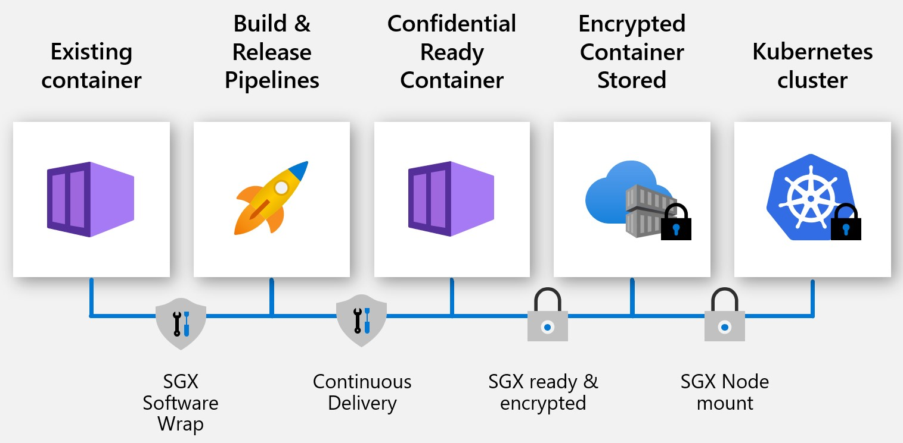

# Confidential Containers

## Overview

Enable developers to bring an **existing docker application (new or existing)** and run it securely on Azure Kubernetes Service (AKS) through confidential computing nodes support.

Confidential containers help protect:

- data integrity 
- data confidentiality
- code integrity
- container code protection through encryption
- hardware-based assurances
- allow running existing apps
- create hardware root of trust

A hardware based Trusted Execution Environment (TEE) is an important component that is used to provide strong assurances through hardware and software measurements from trusted computing base (TCB) components. Verifications of these measurements help with validation of the expected computation and verify any tampering of the container apps.

Confidential containers support custom applications developed with **Python, Java, Node JS, etc. or packaged software applications like NGINX, Redis Cache, MemCache**,  and so on, to be run unmodified on AKS.

Confidential containers are the fastest path to container confidentiality, including the container protection through encryption, enabling lift and shift with no/minimal changes to your business logic.

## Confidential Container Enablers

To run an existing docker container, applications on confidential computing nodes require an abstraction layer or SGX software to leverage the special CPU instruction set. The SGX software also enables your sensitive applications code to be protected and create a direct execution to CPU to remove the Guest OS, Host OS, or Hypervisor. This protection reduces the overall surface attack areas and vulnerabilities with operating system or hypervisor layers.

Confidential containers are fully supported on AKS and enabled through Azure Partners and Open Source Software (OSS) projects. Developers can choose software providers based on the features, integration to Azure services and tooling support.

## Partner Enablers
> [!NOTE]
> The below solutions are offered through Azure Partners and may incur licensing fees. Please verify the partner software terms independently. 

### Fortanix

[Fortanix](https://www.fortanix.com/) offers developers a choice of a portal and CLI-based experience to bring their containerized applications and covert them to SGX capable confidential containers without any need to modify or recompile the application. Fortanix provides the flexibility to run and manage the broadest set of applications, including existing applications, new enclave-native applications, and pre-packaged applications. Users can start with [Enclave Manager](https://em.fortanix.com/) UI or [REST APIs](https://www.fortanix.com/api/em/) to create confidential containers by following the [Quick Start](https://support.fortanix.com/hc/en-us/articles/360049658291-Fortanix-Confidential-Container-on-Azure-Kubernetes-Service) guide for Azure Kubernetes Service.

### Scone (Scontain)

[SCONE](https://scontain.com/index.html?lang=en) supports security policies that can generate certificates, keys, and secrets, and ensures they are only visible to attested services of an application. In this way, the services of an application automatically attest each other via TLS - without the need to modify the applications nor TLS. This is explained with the help of a simple
Flask application here: https://sconedocs.github.io/flask_demo/  

SCONE can convert existing most binaries into applications that run inside of enclaves without needing to change the application or to recompile that application. SCONE also protects interpreted languages like Python by encrypting both data files as well as Python code files. With the help of a SCONE security policy, one can protect the encrypted files against unauthorized accesses, modifications, and rollbacks. How to "sconify" an existing Python application is explained [here](https://sconedocs.github.io/sconify_image/)

Scone deployments on confidential computing nodes with AKS are fully supported and integrated. Get started with a sample application here https://sconedocs.github.io/aks/

### Anjuna

[Anjuna](https://www.anjuna.io/) provides SGX platform software that enables you to run unmodified containers on AKS. Learn more on the functionality and check out the sample applications [here](https://www.anjuna.io/microsoft-azure-confidential-computing-aks-lp).

Get started with a sample Redis Cache and Python Custom Application [here](https://www.anjuna.io/microsoft-azure-confidential-computing-aks-lp)

## OSS Enablers 
> [!NOTE]
> The below solutions are offered through Open Source Projects and are not directly affiliated with Azure Confidential Computing (ACC) or Microsoft.  

### Graphene

[Graphene](https://grapheneproject.io/) is a lightweight guest OS, designed to run a single Linux application with minimal host requirements. Graphene can run applications in an isolated environment with benefits comparable to running a complete OS and has good tooling support for converting existing docker container application to Graphene Shielded Containers (GSC).

Get started with a sample application and deployment on AKS [here](https://graphene.readthedocs.io/en/latest/cloud-deployment.html#azure-kubernetes-service-aks)

### Occlum
[Occlum](https://occlum.io/) is a memory-safe, multi-process library OS (LibOS) for Intel SGX. It enables legacy applications to run on SGX with little to no modifications to source code. Occlum transparently protects the confidentiality of user workloads while allowing an easy lift and shift to existing docker applications.

Occlum supports AKS deployments. Follow the deployment instructions with various sample apps [here](https://github.com/occlum/occlum/blob/master/docs/azure_aks_deployment_guide.md)

## Confidential Containers Demo
View the confidential healthcare demo with confidential containers. Sample is available [here](https://github.com/Azure-Samples/confidential-container-samples/blob/main/confidential-healthcare-scone-confinf-onnx/README.md). 

> [!VIDEO https://www.youtube.com/embed/PiYCQmOh0EI]

## Get In Touch

Have questions with your implementation or want to become an enabler? Send an email to acconaks@microsoft.com

## Reference Links

[Microsoft Azure Attestation](../attestation/overview.md)

[DCsv2 Virtual Machines](virtual-machine-solutions.md)

[Azure Kubernetes Service (AKS)](../aks/intro-kubernetes.md)
