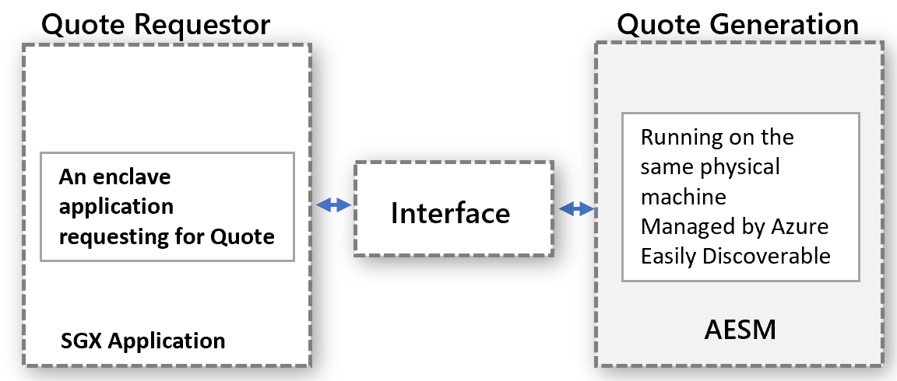

# Confidential computing plugin for Confidential VMs

Azure Kubernetes Service (AKS) provides a plugin for Azure confidential computing virtual machines (VMs). The plugin, `confcom`, is a daemon set. The plugin only runs for Intel Software Guard Extensions (SGX) confidential VMs in an AKS cluster. This plugin is registered at the AKS cluster level. You can use the plugin to manage confidential nodes easily. [Enable to plugin on your AKS cluster](./confidential-enclave-nodes-aks-get-started.md) before you begin.

## Intel SGX Device plugin for AKS

The SGX Device plugin implements the Kubernetes device plugin interface for Enclave Page Cache (EPC) memory. In effect, this plugin makes EPC memory another resource type in Kubernetes. Users can specify limits on EPC just like other resources. Apart from the scheduling function, the device plugin helps assign SGX device driver permissions to confidential workload containers. [A sample implementation of the EPC memory-based deployment](https://github.com/Azure-Samples/confidential-computing/blob/main/containersamples/helloworld/helm/templates/helloworld.yaml) (`kubernetes.azure.com/sgx_epc_mem_in_MiB`) is available.

## PSW with SGX quote helper

Enclave applications that do remote attestation need to generate a quote. The quote provides cryptographic proof of the identity and the state of the application, along with the enclave's host environment. Quote generation relies on certain trusted software components from Intel, which are part of the SGX Platform Software Components (PSW/DCAP). This PSW is packaged as a daemon set that runs per node. You can use PSW when requesting attestation quote from enclave apps. Using the AKS provided service helps better maintain the compatibility between the PSW and other SW components in the host. Read the feature details below.

[Enclave applications](confidential-computing-enclaves.md) that do remote attestation require a generated quote. This quote provides cryptographic proof of the application's identity, state, and running environment. The generation requires trusted software components that are part of Intel's PSW.

### Overview

> [!NOTE]
> This feature is only required for DCsv2/DCsv3 VMs that use specialized Intel SGX hardware. 
 
Intel supports two attestation modes to run the quote generation. For how to choose which type, see the [attestation type differences] (#attestation-type-differences).

- **in-proc**: hosts the trusted software components inside the enclave application process. This method is useful when you are performing local attestation (between 2 enclave apps in a single VM node)

- **out-of-proc**: hosts the trusted software components outside of the enclave application. This is a preferred method when performing remote attestation.
 
SGX applications are built using Open Enclave SDK by default use in-proc attestation mode. SGX-based applications allow out-of-proc and require extra hosting. These applications expose the required components such as Architectural Enclave Service Manager (AESM), external to the application.

It's highly recommended to use this feature. This feature enhances uptime for your enclave apps during Intel Platform updates or DCAP driver updates.

### Attestation type differences

No updates are required for quote generation components of PSW for each containerized application.

With out-of-proc, container owners don’t need to manage updates within their container. Container owners instead rely on the provided interface that invokes the centralized service outside of the container. 

For out-of-proc, there's no concern of failures because of out-of-date PSW components. The quote generation involves the trusted SW components - Quoting Enclave (QE) & Provisioning Certificate Enclave (PCE), which are part of the trusted computing base (TCB). These SW components must be up to date to maintain the attestation requirements. The provider manages the updates to these components. Customers never have to deal with attestation failures because of out-of-date trusted SW components within their container.

Out-of-proc better uses EPC memory. In in-proc attestation mode, each enclave application instantiates the copy of QE and PCE for remote attestation. With out-of-proc, the container doesn't host those enclaves, and doesn’t consume enclave memory from the container quota.

There are also safeguards against Kernel enforcement. When the SGX driver is streamed up into Linux kernel, an enclave has higher privilege. This privilege allows the enclave to invoke PCE, which breaks the enclave application running in in-proc mode. By default, enclaves don't get this permission. Granting this privilege to an enclave application requires changes to the application installation process. The provider of the service that handles out-of-proc requests makes sure the service is installed with this privilege.

You don't have to check for backward compatibility with PSW and DCAP. The provider validates updates to the quote generation components of PSW for backward compatibility. This step handles compatibility issues upfront and addresses them before deploying updates for confidential workloads.

### Out-of-proc attestation for confidential workloads

The out-of-proc attestation model works for confidential workloads. The quote requestor and quote generation are executed separately, but on the same physical machine. The quote generation happens in a centralized manner and serves requests for QUOTES from all entities. Properly define the interface and make the interface discoverable for any entity to request quotes.



The abstract model applies to confidential workload scenarios. This model uses the already available AESM service. AESM is containerized and deployed as a daemon set across the Kubernetes cluster. Kubernetes guarantees a single instance of an AESM service container, wrapped in a pod, to be deployed on each agent node. The new SGX Quote daemon set has a dependency on the `sgx-device-plugin` daemon set, since the AESM service container would request EPC memory from `sgx-device-plugin` for launching QE and PCE enclaves.

Each container needs to opt in to use out-of-proc quote generation by setting the environment variable `SGX_AESM_ADDR=1` during creation. The container also must include the package `libsgx-quote-ex`, which directs the request to default Unix domain socket

An application can still use the in-proc attestation as before. However, you can't simultaneously use both in-proc and out-of-proc within an application. The out-of-proc infrastructure is available by default and consumes resources.

> [!NOTE]
> If you are using a Intel SGX wrapper software (OSS/ISV) to run your unmodified containers the attestation interaction with hardware is typically handled for your higher level apps. Please refer to the attestation implementation per provider. 

### Sample implementation

By default, this service is not enabled for your AKS Cluster with "confcom" addon. Please update the addon with the below command 

```azurecli
az aks addon update --addon confcom --name " YourAKSClusterName " --resource-group "YourResourceGroup " --enable-sgxquotehelper
```
Once the service is up, use the below docker sample for an Open Enclave-based application to validate the flow. Set the `SGX_AESM_ADDR=1` environment variable in the Docker file. Or, set the variable in the deployment file. Follow this sample for the Docker file and deployment YAML details. 

> [!Note] 
> The **libsgx-quote-ex** package from Intel needs to be packaged in the application container for out-of-proc attestation to work properly. The instructions below have the details.
    
```yaml
# Refer to Intel_SGX_Installation_Guide_Linux for detail
FROM ubuntu:18.04 as sgx_base
RUN apt-get update && apt-get install -y \
    wget \
    gnupg

# Add the repository to sources, and add the key to the list of
# trusted keys used by the apt to authenticate packages
RUN echo "deb [arch=amd64] https://download.01.org/intel-sgx/sgx_repo/ubuntu bionic main" | tee /etc/apt/sources.list.d/intel-sgx.list \
    && wget -qO - https://download.01.org/intel-sgx/sgx_repo/ubuntu/intel-sgx-deb.key | apt-key add -
# Add Microsoft repo for az-dcap-client
RUN echo "deb [arch=amd64] https://packages.microsoft.com/ubuntu/18.04/prod bionic main" | tee /etc/apt/sources.list.d/msprod.list \
    && wget -qO - https://packages.microsoft.com/keys/microsoft.asc | apt-key add -

FROM sgx_base as sgx_sample
RUN apt-get update && apt-get install -y \
    clang-7 \
    libssl-dev \
    gdb \
    libprotobuf10 \
    libsgx-dcap-ql \
    libsgx-quote-ex \
    az-dcap-client \
    open-enclave
WORKDIR /opt/openenclave/share/openenclave/samples/attestation
RUN . /opt/openenclave/share/openenclave/openenclaverc \
    && make build
# this sets the flag for out of proc attestation mode, alternatively you can set this flag on the deployment files
ENV SGX_AESM_ADDR=1 

CMD make run
```
Instead, set the out-of-proc attestation mode in the deployment YAML file as follows:

```yaml
apiVersion: batch/v1
kind: Job
metadata:
  name: sgx-test
spec:
  template:
    spec:
      containers:
      - name: sgxtest
        image: <registry>/<repository>:<version>
        env:
        - name: SGX_AESM_ADDR
          value: 1
        resources:
          limits:
            kubernetes.azure.com/sgx_epc_mem_in_MiB: 10
        volumeMounts:
        - name: var-run-aesmd
          mountPath: /var/run/aesmd
      restartPolicy: "Never"
      volumes:
      - name: var-run-aesmd
        hostPath:
          path: /var/run/aesmd
```

The deployment should succeed and allow your apps to perform remote attestation using the SGX Quote Helper service.


## Next Steps

- [Set up Confidential Nodes (DCsv2/DCsv3-Series) on AKS](./confidential-enclave-nodes-aks-get-started.md)
- [Quick starter samples for confidential containers](https://github.com/Azure-Samples/confidential-container-samples)
- [DCsv2 SKU List](../virtual-machines/dcv2-series.md)
- [DCSv3 SKU List](../virtual-machines/dcv3-series.md)
- [Azure Attestation](../attestation/index.yml)
- [Intel SGX Confidential Virtual Machines on Azure](./virtual-machine-solutions-sgx.md)
