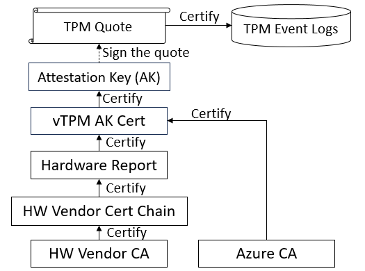

# Confidential VM Guest Attestation Design Detail

This document provides a detailed overview of the [Azure confidential VM Guest Attestation](guest-attestation-confidential-vms.md) design.

## vTPM-Based Design

Azure confidential virtual machines (VMs) utilize a vTPM-based design for the guest attestation. The approach ensures a consistent interface across guest operating systems (Linux and Windows) and hardware platforms (AMD SEV-SNP and Intel TDX).

## Attestation Flow

The guest attestation process involves two main steps: evidence generation and evidence verification. A user requests the Azure confidential VM to generate vTPM evidence and then send the evidence to a trusted party (for example, [Microsoft Azure Attestation (MAA)](https://azure.microsoft.com/products/azure-attestation)) for verification.

A relying party, such as [Azure Key Vault Premium](../security/fundamentals/key-management.md) or [Azure Key Vault Managed HSM](/azure/key-vault/managed-hsm/overview), can assess the trustworthiness of the Azure confidential VM based on the verification results. If the VM is deemed trustworthy, the relying party can securely provision secrets to the VM, using mechanisms like [Secure Key Release](concept-skr-attestation.md).

### vTPM Evidence

A vTPM evidence consists of a TPM quote and endorsements used to verify the quote, as outlined in the rest of the section.
- TPM Quote
  - A standard TPM quote that is the output of `TPM2_Quote` command defined by TPM 2.0 specification.
  - Includes a list of Platform Configuration Registers (PCRs) that captures the measurements of the guest OS (for example, boot process).
  - The usage of PCRs conforms to Linux and Windows standards (each having its usage definition).
  - Signed by vTPM attestation private key (AK); that is, AK is specified as the signing key in the `TPM2_Quote` command.

- TPM Event Log
  - An event log stored in the system that can be used to reproduce PCR values in the TPM quote.
  - Refer to [TPM specification](https://trustedcomputinggroup.org/wp-content/uploads/TCG-Guidance-Integrity-Measurements-Event-Log-Processing_v1_r0p118_24feb2022-1.pdf) for more detail.

- vTPM AK Certificate
  - Issued by Azure (signed by Azure CA).
  - Backed by hardware (the vTPM attestation public key, AK public, is captured in the hardware report).

- Hardware Report
  - Generated and signed by the hardware.
  - Capture the following information
    - AK public
    - The measurement of Microsoft-built guest paravisor where the vTPM runs
      - Learn more in [Confidential VMs on Azure](https://techcommunity.microsoft.com/t5/windows-os-platform-blog/confidential-vms-on-azure/ba-p/3836282)).
    - Hardware information
      - Refer to AMD SEV-SNP and Intel TDX specifications for more detail.

- Hardware Vendor Certificate Chain
  - Issued by hardware vendor (AMD and Intel) to certify the signature of the hardware report.
    - AMD SEV-SNP: Versioned Chip Endorsement Key (VCEK) Certificates
    - Intel TDX: Provisioning Certificate Key (PCK) Certificates

### What are being covered by a vTPM Evidence?

| Component                        | Covered by       |
| :---                             | :---             |
| Guest OS                         | TPM Quote (PCRs) |
| UEFI                             | Hardware Report  |
| Guest Paravisor (including vTPM) | Hardware Report  |

### How is vTPM Evidence verified?

The verifier ([Microsoft Azure Attestation (MAA)](https://azure.microsoft.com/products/azure-attestation)) verified the vTPM evidence based on the trusted chain, as shown in the following figure. Successful verification implies that the attested Azure confidential VM is trustworthy and protected by the hardware.



## Developer's Reference

This section provides a reference to the vTPM-based guest attestation design used by Azure confidential VM.

### Azure-Reserved TPM NV Indexes

| Name | NV Index | Size (bytes) | Description |
| :--- | :--- | :--- | :--- |
| Attestation Report | 0x01400001 | 2600 | Azure-defined format with the hardware report embedded. |
| Report Data        | 0x01400002 | 64   | The report data to be included in the Runtime Data. |
| vTPM AK Cert       | 0x01C101D0 | 4096  | The certificate used to verify the TPM Quote signed by the vTPM AK. |
| vTPM AK            | 0x81000003 | Depending on the key type | The key used to sign the TPM Quote. |

Refer to [Azure Confidential VMs attestation guidance & FAQ](https://github.com/Azure/confidential-computing-cvm-guest-attestation/blob/main/cvm-guest-attestation.md) for sample TPM commands.

### Attestation Report Format

#### Attestation Report

| Name | Offset (bytes) | Size (bytes) | Description |
| :--- | :--- | :--- | :--- |
| Header         | 0    | 32 | The report header (not endorsed by the hardware report). |
| Report Payload | 32   | 1184 | The hardware report. |
| Data Size      | 1216 | 4 | The size of Runtime Data |
| Runtime Data   | 1220 | variable length | The runtime data includes claims endorsed by the hardware report. |


#### Header

| Name | Offset (bytes) | Size (bytes) | Description |
| :--- | :--- | :--- | :--- |
| Signature    | 0 | 4   | Embedded signature. Expected: 0x414c4348 (`HCLA`). |
| Version      | 4 | 4   | Format version. Expected: 2.
| Report Size  | 8 | 4   | Size of the Report Payload. Expected: 1184 (AMD SEV-SNP), 1024 (Intel TDX). |
| Request Type | 12 | 4  | Azure-specific usage of the attestation report. Expected: 2. |
| Status       | 16 | 4  | Reserved. |
| Reserved     | 20 | 12 | Reserved. |

#### Report Payload

The report generated by the hardware (AMD SEV-SNP or Intel TDX). The report_data field of the report captures the hash of the Runtime Claims in the Runtime Data. Refer to specifications from hardware vendors for more detail.

#### Runtime Data

| Name | Offset (bytes) | Size (bytes) | Description | Measured |
| :--- | :--- | :--- | :--- | :--- |
| Version        | 0  | 4 | Format version. Expected: 1. | No |
| Report Type    | 4  | 4 | The type of hardware report. Expected: 2 (AMD SEV-SNP), 4 (Intel TDX) | No |
| Hash Type      | 8 | 4 | The algorithm used to hash the runtime data. The hash value is captured in the report_data field of the hardware report. Expected: 1 (SHA-256), 2 (SHA-384), 3 (SHA-512) | No |
| Claims Size    | 12 | 4 | The size of Runtime Claims. | No |
| Runtime Claims | 16 | variable length | The runtime claims in JSON format. | Yes |

#### Runtime Claims

| JSON Field | Description |
| :--- | :--- |
| keys | An array of keys in JWK format. Expected `kid`:  `HCLAkPub` (vTPM AK public),  `HCLEkPub` (vTPM EK public). |
| vm_configuration | Selective Azure confidential VM configuration. |
| user_data | 64-byte data (HEX string) read from `0x01400002` NV index (Report Data). |

Example

```JSON
{
  "keys": [
    {
      "kid": "HCLAkPub",
      "key_ops": [
        "sign"
      ],
      "kty": "RSA",
      "e": "AQAB",
      "n": "rAipdAAArL6V1FNnSQ-39i3VH-a8PuOeVRo2VpecspDWbJNmgHJ4-VGGFEx4sdVbvDC6fyo_VM2ebE-_AKxTmrNVEr-KIZveJMD_vlOqvMvjtllsWwA-vsRfpqiduvQdFcdCvyHzfxBRHYqdmxgKq-3QI-XBbZv9cCMMMPHkNp4mWkyahjQxXVJVwB1egCrJGKSk1bRXlP1dXNG_Pe4-W5O-YEGRKdLIA31G0Yh8VBnrEUCAMjDAuh6fncMkwdMVskI5Ta-kJgGw4GepIj6_smIyYhxg3o8Ik4qPntxj1TrV0bVW2IiNMLHoM67y1ErOir7bv00xqgqouFodI-vM3Q"
    },
    {
      "kid": "HCLEkPub",
      "key_ops": [
        "encrypt"
      ],
      "kty": "RSA",
      "e": "AQAB",
      "n": "m3AfPAAA-_HY3M_-x4bQbr0p2nkvAgig1mENl-BColvqq0aKKAqIHr-DFQ9-iB2z7EzhYVon5R7Nc1jzqBsmxahE8uaQfD-sp8bWOtbvy4V9nAqLY4HOwfxlJ99cEOOpxNXfCNesYOk8T0ntG05w7oBRjFw0LMVKS-1S3j5-oMnNnpJoo7rX5hNM8JVpxEuVa1IOf1NmvRey6wjwSHbjUay_IMUTAq1wzpx8wo_hjeY4JMd0Ka1ewLjJDaTQSpSxZI36ujyR6EGho0FBXSKN-9W9DAXkO8-RKuLUrmTXA6ETJRYApMuYGiUDCk1Y5zQTQsyWS6pLjnf2mg2tEntZZw"
    }
  ],
  "vm-configuration": {
    "root-cert-thumbprint": "",
    "console-enabled": true,
    "secure-boot": true,
    "tpm-enabled": true,
    "tpm-persisted": true,
    "vmUniqueId": "68dc0ac0-2ed9-4b2a-a03e-4953e416d939"
  },
  "user-data": "00000000000000000000000000000000000000000000000000000000000000000000000000000000000000000000000000000000000000000000000000000000"
}
```

## Next Steps

- [Learn more about the guest attestation APIs](guest-attestation-confidential-vms.md)
- [Learn to use a sample application with the guest attestation APIs](guest-attestation-example.md)
- [Learn how to use Microsoft Defender for Cloud integration with confidential VMs with guest attestation installed](guest-attestation-defender-for-cloud.md)
- [Learn about Azure confidential VMs](confidential-vm-overview.md)
