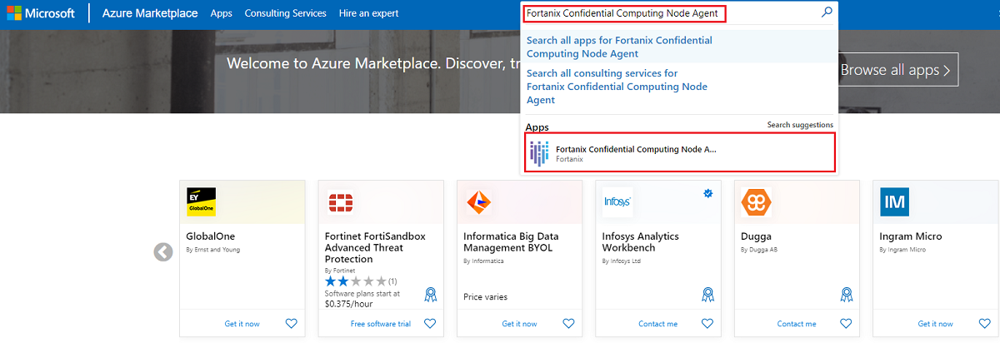

# Run an application by using Fortanix Confidential Computing Manager

Learn how to run your application in Azure confidential computing by using [Fortanix Confidential Computing Manager](https://azuremarketplace.microsoft.com/marketplace/apps/fortanix.em_managed?tab=Overview) and [Node Agent](https://azuremarketplace.microsoft.com/marketplace/apps/fortanix.rte_node_agent) from [Fortanix](https://www.fortanix.com/).


Fortanix is a third-party software vendor that provides products and services that work with the Azure infrastructure. There are other third-party providers that offer similar confidential computing services for Azure.

> [!Note]
> Some of the products referenced in this document aren't provided by Microsoft. Microsoft is providing this information only as a convenience. References to these non-Microsoft products doesn't imply endorsement by Microsoft.

This tutorial shows you how to convert your application image into a confidential compute-protected image. The environment uses [Fortanix](https://www.fortanix.com/) software, powered by Azure DCsv2-series Intel SGX-enabled virtual machines. The solution orchestrates critical security policies like identity verification and data access control.

For Fortanix support, join the [Fortanix Slack community](https://fortanix.com/community/). Use the `#enclavemanager` channel.

## Prerequisites

- If you don't have a Fortanix Confidential Computing Manager account, [sign up](https://ccm.fortanix.com/auth/sign-up) before you start.
- You need a private [Docker](https://docs.docker.com/) registry to push converted application images.
- If you don't have an Azure subscription, [create an account](https://azure.microsoft.com/pricing/purchase-options/pay-as-you-go/) before you start.

> [!NOTE]
> Free trial accounts don't have access to the virtual machines used in this tutorial. To complete the tutorial, you need a pay-as-you-go subscription.

## Add an application to Fortanix Confidential Computing Manager
### Create and select an account

1. Sign in to [Fortanix Confidential Computing Manager (Fortanix CCM)](https://ccm.fortanix.com).
1. Go to the **Accounts** page and select **ADD ACCOUNT** to create a new account:

   :::image type="content" source="media/how-to-fortanix-confidential-computing-manager-node-agent/create-account-latest.png" alt-text="Screenshot that shows how to create an account.":::

1. After your account is created, click **SELECT ACCOUNT** to select the newly created account. Click **GO TO ACCOUNT** to enter the account and start enrolling the compute nodes and creating applications.
1. If you disabled the attestation for compute nodes, you would see a warning in the Fortanix CCM dashboard **“Test-only deployment: Compute nodes can be enrolled into Fortanix CCM without attesting to Intel’s IAS attestation service”**.

   :::image type="content" source="media/how-to-fortanix-confidential-computing-manager-node-agent/test-only-deployment.png" alt-text="Screenshot that shows test only deployment.":::

### Add a group

1. Navigate to **Groups** from the menu list and click **+ ADD GROUP** to add a group.

   :::image type="content" source="media/how-to-fortanix-confidential-computing-manager-node-agent/add-group.png" alt-text="Screenshot that shows group creation.":::

1. Click the **ADD GROUP** button to create a new group.
1. Enter the required **Name** for the group and add **Labels** with **Key:Value** pairs.
1. Click the **CREATE GROUP** button. The group is now successfully created.

### Add an application
1. Navigate to the **Applications** menu item from the CCM UI left navigation bar and click **+ ADD APPLICATION** to add an application. In this example, we'll be adding a Flask Server Enclave OS application.

   :::image type="content" source="media/how-to-fortanix-confidential-computing-manager-node-agent/create-application-new.png" alt-text="Screenshot that shows how to create an application.":::

1. Select the **ADD** button for the **Enclave OS Application**:

    :::image type="content" source="media/how-to-fortanix-confidential-computing-manager-node-agent/add-applications-enclave-os.png" alt-text="Screenshot that shows how to add an EOS application.":::

   > [!NOTE]
   > This tutorial covers adding Enclave OS Applications only.
   - [Learn more](https://support.fortanix.com/hc/en-us/articles/360044746932-Bringing-EDP-Rust-Apps-to-Confidential-Computing-Manager) about bringing EDP Rust Applications to Fortanix Confidential Computing Manager.
   - [Learn more](https://support.fortanix.com/hc/en-us/articles/360043527431-User-s-Guide-Add-and-Edit-an-Application#add-aci-application-0-8) about adding an ACI Application to Fortanix Confidential Computing Manager.

1. In this tutorial, we'll use the Fortanix Docker registry for the sample application. Fill in the details from the following information. Use your private docker registry to keep the output image.

    - **Application name**: Python Application Server
    - **Description**: Python Flask Server
    - **Input image name**: docker.io/fortanix/python-flask
    - **Output image name**: docker.io/fortanx/python-flask-sgx
    - **ISVPRODID**: 1
    - **ISVSVM**: 1
    - **Memory size**: 1 GB
    - **Thread count**: 128

      *Optional*: Run the application.
    - **Docker Hub**: [https://hub.docker.com/u/fortanix](https://hub.docker.com/u/fortanix)
    - **App**: fortanix/python-flask

      Run the following command:

      ```bash
         sudo docker run fortanix/python-flask
      ```

1. Add a certificate. Enter the following values, and then select **NEXT**:
    - **Type**: Certificate Issued by Confidential Computing Manager
    - **Key path**: /appkey.pem
    - **Key type**: RSA
    - **Certificate path**: /appcert.pem
    - **RSA Key Size**: 2048 Bits

## Create an image

A Fortanix CCM Image is a software release or version of an application. Each image is associated with one enclave hash (MRENCLAVE).

1. After you create an Enclave OS application, on the **Add Image** page, enter the **REGISTRY CREDENTIALS** for **Output image name**. These credentials are used to access the private docker registry where the image will be pushed. Since the input image is stored in a public registry, there is no need to provide credentials for the input image.

   :::image type="content" source="media/how-to-fortanix-confidential-computing-manager-node-agent/nitro-create-enclave-os-image.png" alt-text="Screenshot that shows how to create an AWs Nitro image.":::

1. Provide the image tag. Use “latest” if you want to use the latest image builds.
1. If you selected the **Image Type** as **Intel SGX**, enter the following details:
    - **ISVPRODID** is a numeric product identifier. A user must choose a unique value in the range of 0-65535 for their  applications.
    - **ISVSVN** is a numeric security version to be assigned to the Enclave. This number should be incremented if security relevant change is made to the application.
    - **Memory size** – Choose the memory size from the drop-down to change the memory size of the enclave.
    - **Thread count** – Change the thread count to support the application.

1. Select **Create** to proceed.
1. Upon completing the image creation, you will see a notification that the image was successfully created and your application will be listed in the Applications screen.

   :::image type="content" source="media/how-to-fortanix-confidential-computing-manager-node-agent/create-image.png" alt-text="Screenshot that shows how to create an image.":::


## Domain and image approval

An application whose domain is approved, will get a TLS Certificate from Fortanix Confidential Computing Manager. This certificate will have the domain as a subject name which will allow all requests from this domain to be served by the application. If this domain is not approved, the image will run but it will not be issued any TLS certificate from Fortanix Confidential Computing Manager.

Switch to the **Tasks** menu on the left and select **Approve** to approve the pending requests to allow the domain and image.

## Enroll the compute node agent in Azure

### Create and copy join token

In Fortanix Confidential Computing Manager, you'll create a token. This token allows a compute node in Azure to authenticate itself. You'll need to give this token to your Azure virtual machine.

1. Select the **Infrastructure** → **Compute Nodes** menu item from the CCM left navigation bar and click the **+ ENROLL NODE** button.
1. Click **COPY** to copy the Join Token. This Join Token is used by the compute node to authenticate itself.

   :::image type="content" source="media/how-to-fortanix-confidential-computing-manager-node-agent/nitro-join-token.png" alt-text="Screenshot that shows how to copy the join token.":::

### Enroll nodes into Fortanix Node Agent in Azure Marketplace

Creating a Fortanix Node Agent will deploy a virtual machine, network interface, virtual network, network security group, and a public IP address into your Azure resource group. Your Azure subscription will be billed hourly for the virtual machine. Before you create a Fortanix Node Agent, review the Azure [virtual machine pricing page](https://azure.microsoft.com/pricing/details/virtual-machines/linux/) for DCsv2-Series. Delete Azure resources when not in use.

1. Go to the [Azure Marketplace](https://azuremarketplace.microsoft.com/marketplace/) and sign in with your Azure credentials.
1. In the search bar, type **Fortanix Confidential Computing Node Agent**. Select the App that shows up in the search box called **Fortanix Confidential Computing Node Agent** to go to the offering's home page.

    
1. Select **Get It Now**, fill in your information if necessary, and select **Continue**. You'll be redirected to the Azure portal.
1. Select **Create** to go to the Fortanix Confidential Computing Node Agent deployment page.
1. On this page, you'll be entering information to deploy a virtual machine. Specifically, this VM is a DCsv2-Series Intel SGX-enabled virtual machine from Azure with Fortanix Node Agent software installed. The Node Agent will allow your converted image to run securely on Intel SGX nodes in Azure.  Select the **subscription** and **resource group** where you want to deploy the virtual machine and associated resources.

> [!NOTE]
> There are constraints when deploying DCsv2-Series virtual machines in Azure. You may need to request quota for additional cores. Read about [confidential computing solutions on Azure VMs](./virtual-machine-solutions.md) for more information.

1. Select an available region.
1. Select the **OS Type**.
1. Leave the default **OS Disk Size** as 200 and select a VM size (Standard_DC4s_v2 will suffice for this tutorial).
1. Enter a name for your virtual machine in **Compute Node Name**.
1. Enter a username and password (or SSH Key) for authenticating into the virtual machine.
1. Paste the token generated earlier in **Join Token**.

   :::image type="content" source="media/how-to-fortanix-confidential-computing-manager-node-agent/create-node-agent.png" alt-text="Screenshot that shows how to create a node agent.":::
   :::image type="content" source="media/how-to-fortanix-confidential-computing-manager-node-agent/create-node-agent-1.png" alt-text="Screenshot that shows how to create a node agent-1.":::
   :::image type="content" source="media/how-to-fortanix-confidential-computing-manager-node-agent/create-node-agent-2.png" alt-text="Screenshot that shows how to create a node agent-2.":::

1. Select **Review + create**. Ensure the validation passes and then select **Create**. When all the resources deploy, the compute node is now enrolled in Fortanix Confidential Computing Manager.

## Run the application image on the enrolled compute node

Run the application by executing the following command. Ensure you change the Node Agent Host IP, Port, and Converted Image Name as inputs for your specific application.

1. Install docker on the enrolled compute node. To install docker, use the command:

   ```bash
       sudo apt install docker.io
   ```

1. Run the application image on the node by using the following command:

   ```bash
       sudo docker run `
           --privileged --volume /dev:/dev `
           -v /var/run/aesmd/aesm.socket:/var/run/aesmd/aesm.socket `
           -e NODE_AGENT_BASE_URL=http://52.152.206.164:9092/v1/ fortanix-private/python-flask-sgx
   ```

Where:

- `52.152.206.164` is the Node Agent Host IP.
- `9092` is the default port on which the Node Agent listens to.
- `fortanix/python-flask-sgx` is the converted app that can be found in the Images menu under the **Image Name** column in the **Images** table in the Fortanix Confidential Computing Manager Web Portal.

## Verify and monitor the running application

1. Return to [Fortanix Confidential Computing Manager](https://ccm.fortanix.com/console).
1. Ensure you're working inside the **Account** where you enrolled the node.
1. Select the **Applications** menu on the left navigation pane.
1. Verify that there's a running application with an associated compute node.

## Clean up resources

When they are no longer needed, you can delete the resource group, virtual machine, and associated resources. Deleting the resource group will unenroll the nodes associated with your converted image.

Select the resource group for the virtual machine, then select **Delete**. Confirm the name of the resource group to finish deleting the resources.

To delete the Fortanix Confidential Computing Manager account you created, go the [Accounts Page](https://ccm.fortanix.com/accounts) in the Fortanix Confidential Computing Manager. Hover over the account you want to delete. Select the vertical black dots in the upper right-hand corner and select **Delete Account**.

   :::image type="content" source="media/how-to-fortanix-confidential-computing-manager-node-agent/delete-ccm-account.png" alt-text="Screenshot that shows how to delete the account.":::

## Next steps

In this quickstart, you used Fortanix tooling to convert your application image to run on top of a confidential computing virtual machine. For more information about confidential computing virtual machines on Azure, see [Solutions on Virtual Machines](virtual-machine-solutions.md).

To learn more about Azure's confidential computing offerings, see [Azure confidential computing overview](overview.md).

Learn how to complete similar tasks using other third-party offerings on Azure, like [Anjuna](https://azuremarketplace.microsoft.com/marketplace/apps/anjuna-5229812.aee-az-v1) and [Scone](https://sconedocs.github.io).
