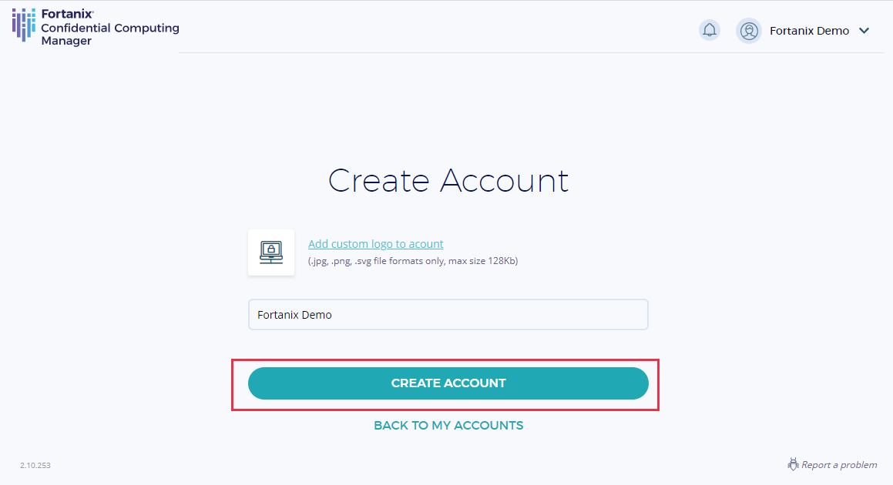
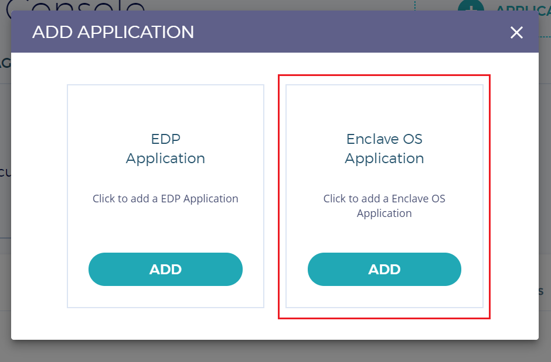
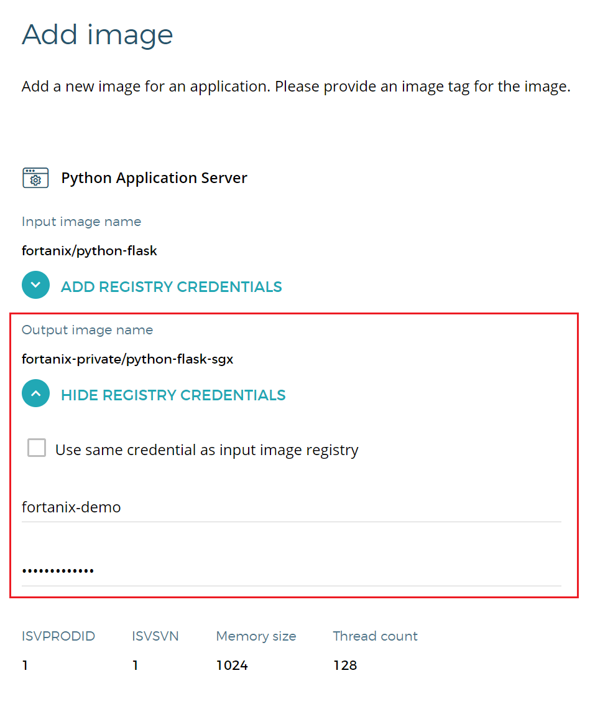
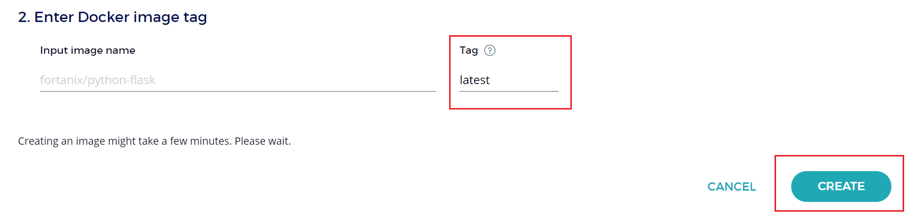
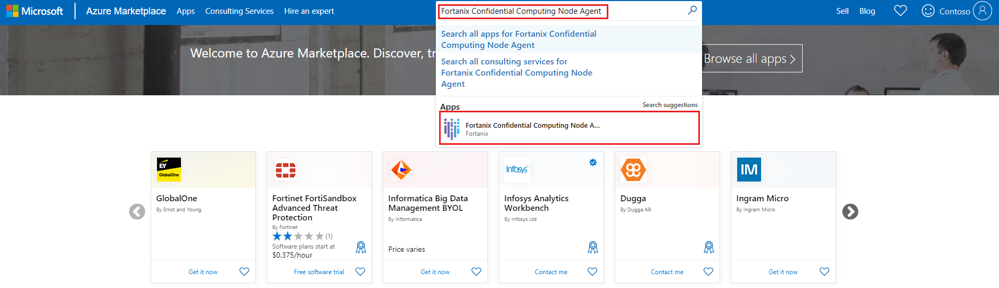
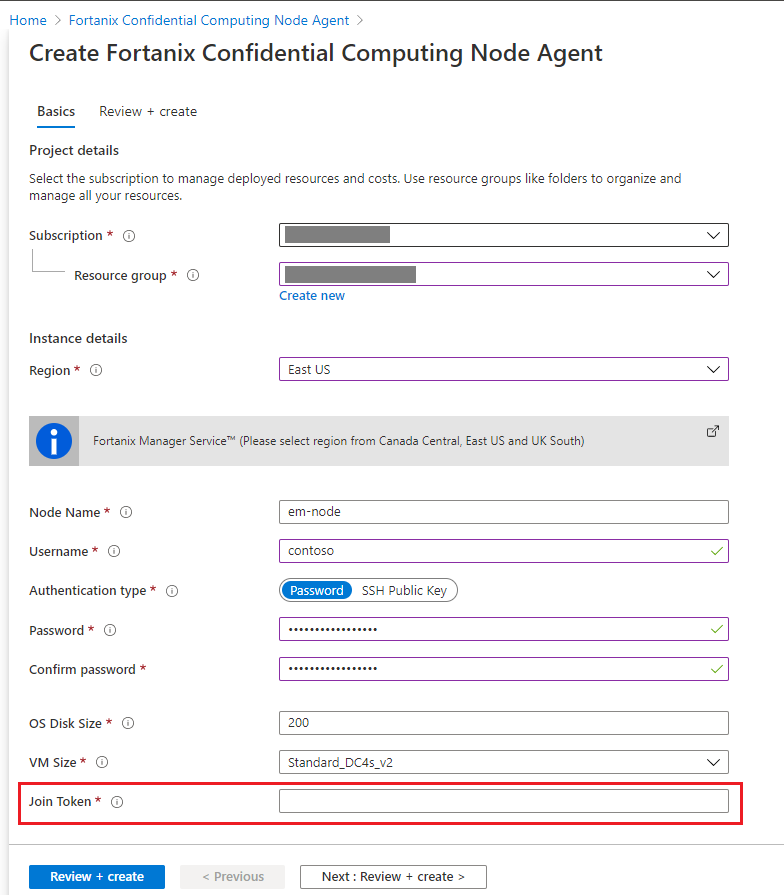
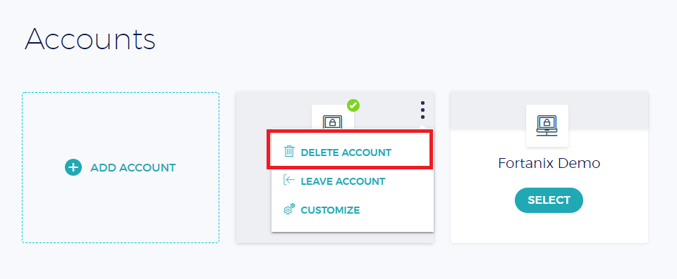

# How To: Run an application with Fortanix Enclave Manager 

Start running your application in Azure confidential computing using [Fortanix Enclave Manager](https://azuremarketplace.microsoft.com/marketplace/apps/fortanix.enclave_manager?tab=Overview) and [Fortanix Node Agent](https://azuremarketplace.microsoft.com/marketplace/apps/fortanix.rte_node_agent) from [Fortanix](https://www.fortanix.com/).


Fortanix is a 3rd party software vendor with products and services built on top of Azure infrastructure. There are other third party providers offering similar confidential computing services on Azure.

> [!Note] 
 > The products referenced in this document are not under the control of Microsoft. Microsoft is providing this information to you only as a convenience, and the reference to these non-Microsoft products do not imply endorsement by Microsoft.


This tutorial shows you how to convert your application image to a confidential compute-protected image. This environment uses [Fortanix](https://www.fortanix.com/) software, powered by Azure's DCsv2-Series Intel SGX-enabled virtual machines. This solution orchestrates critical security policies such as identity verification and data access control.

 For Fortanix-specific support, join the [Fortanix Slack community](https://fortanix.com/community/) and use the channel #enclavemanager.


## Prerequisites

1. If you don't have a Fortanix Enclave Manager account, [sign-up](https://em.fortanix.com/auth/sign-up) before you begin.
1. A private [Docker](https://docs.docker.com/) registry to push converted application images.
1. If you don't have an Azure subscription, [create an account](https://azure.microsoft.com/pricing/purchase-options/pay-as-you-go/) before you begin.

> [!NOTE]
> Free trial accounts do not have access to the virtual machines used in this tutorial. Please upgrade to a Pay-As-You-Go subscription.

## Add an application to Fortanix Enclave Manager
1. Sign in to [Fortanix Enclave Manager (Fortanix EM)](https://em.fortanix.com)
1. Navigate to the **Accounts** page and select **ADD ACCOUNT** to create a new account. 
    


1. After your account is created, hit **SELECT** to select the newly created account. Now we can start enrolling the compute nodes and creating applications. 
1. Select the **+ APPLICATION** button to add an application. In this example, we'll be adding a Flask Server Enclave OS application. 

1. Select the **ADD** button for the Enclave OS Application. 

    

    > [!NOTE]
    > This tutorial covers adding Enclave OS Applications only. [Read more](https://support.fortanix.com/hc/en-us/articles/360044746932-Bringing-EDP-Rust-Apps-to-Enclave-Manager) about bringing EDP Rust Applications to Fortanix Enclave Manager. 

6. In this tutorial, we'll use Fortanix's docker registry for the sample application. Fill in the details from the following information. Use your private docker registry to keep the output image. 
 
    - **Application name**: Python Application Server
    - **Description**: Python Flask Server
    - **Input image name**: fortanix/python-flask
    - **Output image name**: fortanx-private/python-flask-sgx
    - **ISVPRODID**: 1
    - **ISVSVM**: 1
    - **Memory size**: 1 GB
    - **Thread count**: 128

    *Optional*: Run the application.
    - **Docker Hub**: [https://hub.docker.com/u/fortanix](https://hub.docker.com/u/fortanix)
    - **App**: fortanix/python-flask

        Run the following command:
         ```bash
            sudo docker run fortanix/python-flask
         ```

1. Add a certificate. Fill in the information using the details below and then select **NEXT**:
    - **Domain**: myapp.domain.dom
    - **Type**: Certificate Issued by Enclave Manager 
    - **Key path**: /appkey.pem
    - **Key type**: RSA
    - **Certificate path**: /appcert.pem
    - **RSA Key Size**: 2048 Bits
    

## Create an Image
A Fortanix EM Image is a software release or version of an application. Each image is associated with one enclave hash (MRENCLAVE). 
1. On the **Add Image** page, enter the **REGISTRY CREDENTIALS** for **Output image name**. These credentials are used to access the private docker registry where the image will be pushed. 

    
1. Provide the image tag and select **Create**.

    

## Domain and Image allow listing 
An application whose domain is added to the allow list, will get a TLS Certificate from Fortanix Enclave Manager. Similarly, when an application runs from the converted image, it will try to contact Fortanix Enclave Manager. The application will then ask for a TLS Certificate. 

Switch to the **Tasks** tab on the left and approve the pending requests to allow the domain and image. 

## Enroll compute node agent in Azure

### Generate and copy Join token
In Fortanix Enclave Manager, you'll create a token. This token allows a compute node in Azure to authenticate itself. You'll need to give this token to your Azure virtual machine.
1. In the management console, select the **+ ENROLL NODE** button. 
1. Select **GENERATE TOKEN** to generate the Join token. Copy the token.

### Enroll nodes into Fortanix Node Agent in Azure Marketplace

Creating a Fortanix Node Agent will deploy a virtual machine, network interface, virtual network, network security group, and a public IP address into your Azure resource group. Your Azure subscription will be billed hourly for the virtual machine. Before you create a Fortanix Node Agent, review the Azure [virtual machine pricing page](https://azure.microsoft.com/pricing/details/virtual-machines/linux/) for DCsv2-Series. Delete Azure resources when not in use. 

1. Go to the [Azure Marketplace](https://azuremarketplace.microsoft.com/marketplace/) and sign in with your Azure credentials.
1. In the search bar, type **Fortanix Confidential Computing Node Agent**. Select the App that shows up in the search box called **Fortanix Confidential Computing Node Agent** to navigate to the offering's home page. 
     
1. Select **Get It Now**, fill in your information if necessary, and select **Continue**. You'll get redirected to the Azure portal. 
1. Select **Create** to enter the Fortanix Confidential Computing Node Agent deployment page.
1. On this page, you'll be entering information to deploy a virtual machine. Specifically, this VM is a DCsv2-Series Intel SGX-enabled virtual machine from Azure with Fortanix Node Agent software installed. The Node Agent will allow your converted image to run securely on Intel SGX nodes in Azure.  Select the **subscription** and **resource group** where you want to deploy the virtual machine and associated resources. 
 
    > [!NOTE]
    > There are constraints when deploying DCsv2-Series virtual machines in Azure. You may need to request quota for additional cores. Read about [confidential computing solutions on Azure VMs](https://docs.microsoft.com/azure/confidential-computing/virtual-machine-solutions) for more information. 

1. Select an available region.
1. Enter a name for your virtual machine in the **Node Name** field. 
1. Enter and username and password (or SSH Key) for authenticating into the virtual machine.
1. Leave the default OS Disk Size as 200 and select a VM Size (Standard_DC4s_v2 will suffice for this tutorial)
1. Paste the token generated earlier in the **Join Token** field.

     

1. Select **Review + Create**. Ensure the validation passes and then select **Create**. Once all the resources deploy, the compute node is now enrolled in Enclave Manager. 

## Run the application image on the compute node
Run the application by executing the following command. Ensure you change the Node IP, Port, and Converted Image Name as inputs for your specific application. 
 
In this tutorial, the command to execute is:     

```bash
    sudo docker run `
        --device /dev/isgx:/dev/isgx `
        --device /dev/gsgx:/dev/gsgx `
        -v /var/run/aesmd/aesm.socket:/var/run/aesmd/aesm.socket `
        -e NODE_AGENT_BASE_URL=http://52.152.206.164:9092/v1/ fortanix-private/python-flask-sgx
```

where, 
- *52.152.206.164* is the Node Agent Host IP
- *9092* is the port that Node Agent listens up
- *fortanix-private/python-flask-sgx* is the converted app that can be found in the Images tab under the **Image Name** column in the **Images** table in the Fortanix Enclave Manage Web Portal. 
    
## Verify and monitor the running application
1. Head back to the [Fortanix Enclave Manager](https://em.fortanix.com/console)
1. Ensure you're working inside the **Account** where you enrolled the node
1. Navigate to the **Management Console** by selecting the top icon on the left navigation pane. 
1. Select the **Application** tab
1. Verify that there's a running application with an associated compute node


## Clean up resources

When no longer needed, you can delete the resource group, virtual machine, and associated resources. Deleting the resource group will unenroll the nodes associated with your converted image. 

Select the resource group for the virtual machine, then select **Delete**. Confirm the name of the resource group to finish deleting the resources.

To delete the Fortanix Enclave Manager Account you created, go the [Accounts Page](https://em.fortanix.com/accounts) in the Enclave Manager. Hover over the account you wish to delete. Select the vertical black dots in the upper right-hand corner and select **Delete Account**.

  

## Next steps

In this quickstart, you used Fortanix tooling to convert your application image to run on top of a confidential computing virtual machine. For more information about confidential computing virtual machines on Azure, see [Solutions on Virtual Machines](virtual-machine-solutions.md). 

To learn more about Azure's confidential computing offerings, see [Azure confidential computing Overview](overview.md)

 Learn how to complete similar tasks using other third-party offerings on Azure, like [Anjuna](https://azuremarketplace.microsoft.com/marketplace/apps/anjuna-5229812.aee-az-v1) and [Scone](https://sconedocs.github.io).  