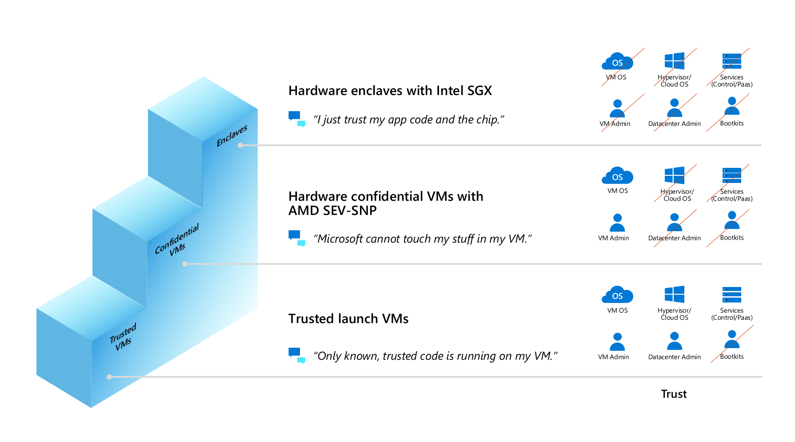

# Confidential Computing on Azure

> [!VIDEO https://www.youtube.com/embed/rT6zMOoLEqI]

 Azure already offers many tools to safeguard [**data at rest**](../security/fundamentals/encryption-atrest.md) through models such as client-side encryption and server-side encryption. Additionally, Azure offers mechanisms to encrypt [**data in transit**](../security/fundamentals/data-encryption-best-practices.md#protect-data-in-transit) through secure protocols like TLS and HTTPS. This page introduces  a third leg of data encryption - the encryption of **data in use**.

Azure Confidential Computing makes it easier to trust the cloud provider, by reducing the need for trust across various aspects of the compute cloud infrastructure. Azure confidential computing minimizes trust for the host OS kernel, the hypervisor, the VM admin, and the host admin.

Azure Confidential Computing can help you:

- **Prevent unauthorized access**: Run sensitive data in the cloud. Trust that Azure provides the best data protection possible, with little to no change from what gets done today.

- **Meet regulatory compliance**: Migrate to the cloud and keep full control of data to satisfy government regulations for protecting personal information and secure organizational IP.

- **Ensure secure and untrusted collaboration**: Tackle industry-wide work-scale problems by combing data across organizations, even competitors, to unlock broad data analytics and deeper insights.

- **Isolate processing**: Offer a new wave of products that remove liability on private data with blind processing. User data cannot even be retrieved by the service provider. 

<!-- **Reduce your attack surface via**: 
***Confidential VM deployment solutions*** running on AMD SEV-SNP, you can lift-and-shift existing workloads and protect data from the cloud operator with VM-level confidentiality. 
***VMs with confidential app enclaves*** with Intel SGX application provides line-of-code control in applications to minimize your TCB and protect data from both cloud operators and your operators. 
***Independent Software Vendor (ISV) partner or open source software (OSS)*** can be leveraged to run your existing apps inside an application enclave.  -->

<!-- ### Trust ladder

Azure offers different virtual machines for confidential computing IaaS workloads and customers can choose what's best for them depending on their preferred security posture. The "trust ladder" figure shows what customers can expect from a security posture perspective on these IaaS offerings. -->

<!--  -->

Verifying that applications are running confidentially form the very foundation of confidential computing. This verification is multi-pronged and relies on the following suite of Azure offerings. 
<!-- Azure differentiates itself from competitiors by also enabling a rich suite of third party ISVs to integrate into Azure and independently verify and attest to the confidentiality of your organization's resources. -->

## Azure Confidetial Computing offerings

- [Microsoft Azure Attestation](../attestation/overview.md), a remote attestation service for validating the trustworthiness of multiple Trusted Execution Environments (TEEs) and verifying integrity of the binaries running inside the TEEs.

- [Azure Key Vault Managed HSM](../key-vault/managed-hsm/index.yml), a fully managed, highly available, single-tenant, standards-compliant cloud service that enables you to safeguard cryptographic keys for your cloud applications, using FIPS 140-2 Level 3 validated Hardware Security Modules (HSM).

- [Trusted Launch](../virtual-machines/trusted-launch.md) is available across all Generation 2 VMs bringing hardened security features – secure boot, virtual trusted platform module, and boot integrity monitoring – that protect against boot kits, rootkits, and kernel-level malware.

- [Azure Confidential Ledger](../confidential-ledger/overview.md). ACL is a tamper-proof register for storing sensitive data for record keeping and auditing or for data transparency in multi-party scenarios. It offers Write-Once-Read-Many guarantees, which make data non-erasable and non-modifiable. The service is built on Microsoft Research's [Confidential Consortium Framework](https://www.microsoft.com/research/project/confidential-consortium-framework/).

- [Azure IoT Edge](../iot-edge/deploy-confidential-applications.md) supports confidential applications that run within secure enclaves on an Internet of Things (IoT) device. IoT devices are often exposed to tampering and forgery because they're physically accessible by bad actors. Confidential IoT Edge devices add trust and integrity at the edge by protecting the access to data captured by and stored inside the device itself before streaming it to the cloud.

- [Always Encrypted with secure enclaves in Azure SQL](/sql/relational-databases/security/encryption/always-encrypted-enclaves). The confidentiality of sensitive data is protected from malware and high-privileged unauthorized users by running SQL queries directly inside a TEE when the SQL statement contains any operations on encrypted data that require the use of the secure enclave where the database engine runs.

Technologies like [Intel Software Guard Extensions](https://www.intel.com.au/content/www/au/en/architecture-and-technology/software-guard-extensions-enhanced-data-protection.html) (Intel SGX), or [AMD Secure Encrypted Virtualization](https://www.amd.com/en/processors/amd-secure-encrypted-virtualization) (SEV-SNP) are recent CPU improvements supporting confidential computing implementations. These technologies are designed as virtualization extensions and provide feature sets including memory encryption and integrity, CPU-state confidentiality and integrity, and attestation, for building the confidential computing threat model. Azure Computational Computing leverages these technologies in the following compuutation resources: 

- [Confidential VMs with Intel SGX application enclaves](confidential-computing-enclaves.md). Azure offers the [DCsv2](../virtual-machines/dcv2-series.md), [DCsv3, and DCdsv3](../virtual-machines/dcv3-series.md) series built on Intel SGX technology for hardware-based enclave creation. You can build secure enclave-based applications to run in a series of VMs to protect your application data and code in use.

- [App-enclave aware containers](enclave-aware-containers.md) running on Azure Kubernetes Service (AKS). Confidential computing nodes on AKS use Intel SGX to create isolated enclave environments in the nodes between each container application.

- Confidential VMs based on [AMD SEV-SNP technology](https://azure.microsoft.com/blog/azure-and-amd-enable-lift-and-shift-confidential-computing/) enable lift-and-shift of existing workloads and protect data from the cloud operator with VM-level confidentiality.

- [Confidential Inference ONNX Runtime](https://github.com/microsoft/onnx-server-openenclave), a Machine Learning (ML) inference server that restricts the ML hosting party from accessing both the inferencing request and its corresponding response.

## Next steps

- [Learn common confidential computing scenarios](use-cases-scenarios.md)