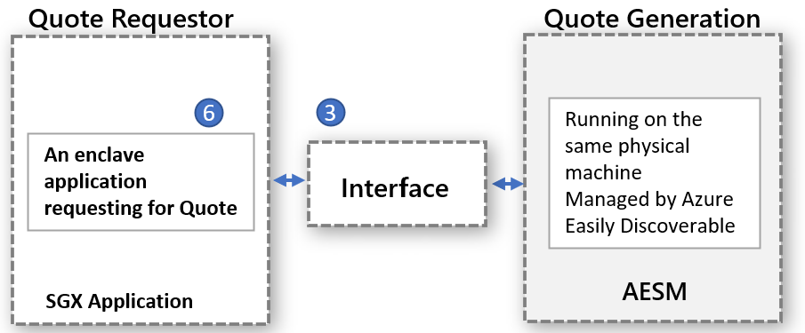

# Platform Software Management with SGX quote helper daemon set

Enclave application that performs remote attestation requires to generate QUOTE that provides a cryptographically proof of the identity and the state of the application as well as the environment the enclave is running. The generation of the QUOTE requires trusted software components from Intel that are part of the Intel’s Platform Software Components (PSW/DCAP) among others. 
 
Intel supports two attestation modes to run the quote generation through PSW components:
1. in-proc: hosts the trusted software components inside the enclave application process

1. out-of-proc. hosts the trusted software components outside of the enclave application.
 
SGX applications built using Open Enclave SDK by default use in-proc attestation mode. SGX based applications allow out-of-proc and would require extra hosting and exposing the required components such as Architectural Enclave Service Manager (AESM) external to the application.

## Why and What are the benefits of out-of-proc?

1.	No more updates required for quote generation trusted components at application level. 
The quote generation involves the trusted SW components - Quoting Enclave (QE) & Provisioning Certificate Enclave (PCE), which are part of the TCB and must be up to date to maintain the attestation requirements. With out-of-proc container owners don’t need to manage them with in their container instead rely on the provider provided interface that will be updated and managed in a centralized way.

2.	No need to worry about attestation failures due to out-of-date PSW components
Since provider manages the updates to the PSW components that provide Quote generation outside of the container, customers will never have to deal with attestation failures due to out-of-date trusted SW components.

3.	Better utilization of EPC memory
In in-proc attestation mode each enclave application needs to instantiate the copy of QE and PCE for remote attestation. With out-of-proc, there is no need for container to host those enclaves and thus doesn’t consume enclave memory out of the application.

4.	Safeguards against Kernel enforcement 
When the SGX driver is up streamed into Linux kernel there will be enforcement for an enclave to have higher privilege in order to invoke PCE, which will break the enclave application running in in-proc mode as by default this permission is not provided. To grant this privilege to an enclave application would require changes to the application installation process. This is handled easily for out-of-proc model as the service that handles out-of-proc requests is installed with this privilege.

5.	No need to check for backward compatibility with PSW & DCAP. The updates to quote generation components of PSW are validated for the backward compatibility by the provider before installation. This will help in handling the compatibility issues upfront and address them before letting updates deployed and available for confidential workloads.

## How does the out-of-proc attestation mode work for confidential workloads scenario?

The high-level design follows the model where the quote requestor and quote generation are executed separately but on the same physical machine. The quote generation will be done in a centralized manner and serves all types of entities that request quotes. The interface needs to be properly defined and discoverable for any entity to request quotes.



The above abstract model applied to confidential workload that makes use of already available AESM service that is containerized and deployed as a DaemonSet across a Kubernetes cluster. Kubernetes guarantees a single instance of an AESM service container, wrapped in a Pod, to be deployed on each agent node. The new SGX Quote DaemonSet will have a dependency on the sgx-device-plugin DaemonSet, since the AESM service container would request EPC memory from sgx-device-plugin for launching QE and PCE enclaves.


Each container needs to opt in to use out-of-proc quote generation by setting the environment variable SGX_AESM_ADDR=1 during creation. The container should also include the package libsgx-quote-ex that is responsible to direct the request to default Unix domain socket

Any application can still use the in-proc attestation as before, but both in-proc and out-of-proc can’t be used simultaneously within an application. Note the out-of-proc infrastructure is available by default and consumes resources.

## Sample Implementation

The below docker file sample is for an Open Enclave based application whereby setting the SGX_AESM_ADDR=1 environment variable the SGX application will automatically invoke AESM service that is running on the host as a daemon set.

```yaml
# Refer to Intel_SGX_Installation_Guide_Linux for detail
FROM ubuntu:18.04 as sgx_base
RUN apt-get update && apt-get install -y \
    wget \
    gnupg

# Add the repository to sources, and add the key to the list of
# trusted keys used by the apt to authenticate packages
RUN echo "deb [arch=amd64] https://download.01.org/intel-sgx/sgx_repo/ubuntu bionic main" | tee /etc/apt/sources.list.d/intel-sgx.list \
    && wget -qO - https://download.01.org/intel-sgx/sgx_repo/ubuntu/intel-sgx-deb.key | apt-key add -
# Add Microsoft repo for az-dcap-client
RUN echo "deb [arch=amd64] https://packages.microsoft.com/ubuntu/18.04/prod bionic main" | tee /etc/apt/sources.list.d/msprod.list \
    && wget -qO - https://packages.microsoft.com/keys/microsoft.asc | apt-key add -

FROM sgx_base as sgx_sample
RUN apt-get update && apt-get install -y \
    clang-7 \
    libssl-dev \
    gdb \
    libprotobuf10 \
    libsgx-dcap-ql \
    libsgx-quote-ex \
    az-dcap-client \
    open-enclave
WORKDIR /opt/openenclave/share/openenclave/samples/remote_attestation
RUN . /opt/openenclave/share/openenclave/openenclaverc \
    && make build
# this sets the flag for out of proc attestation mode. alternatively you can set this flag on the deployment files
ENV SGX_AESM_ADDR=1 

CMD make run
```
Alternatively the out-of-proc attestation can set in the deployment yaml file as shown below

```yaml
apiVersion: batch/v1
kind: Job
metadata:
  name: sgx-test
spec:
  template:
    spec:
      containers:
      - name: sgxtest
        image: <registry>/<repository>:<version>
        env:
        - name: SGX_AESM_ADDR
          value: 1
        resources:
          limits:
            kubernetes.azure.com/sgx_epc_mem_in_MiB: 10
        volumeMounts:
        - name: var-run-aesmd
          mountPath: /var/run/aesmd
      restartPolicy: "Never"
      volumes:
      - name: var-run-aesmd
        hostPath:
          path: /var/run/aesmd
```

## Getting Started

[Provision Confidential Nodes (DCsv2-Series) on AKS](./confidential-nodes-aks-getstarted.md)

[Quick starter samples confidential containers](https://github.com/Azure-Samples/confidential-container-samples)

[DCsv2 SKU List](https://docs.microsoft.com/en-us/azure/virtual-machines/dcv2-series)

<!-- LINKS - external -->
[Azure Attestation]: https://docs.microsoft.com/en-us/azure/attestation/


<!-- LINKS - internal -->
[DC Virtual Machine]: /confidential-computing/virtual-machine-solutions