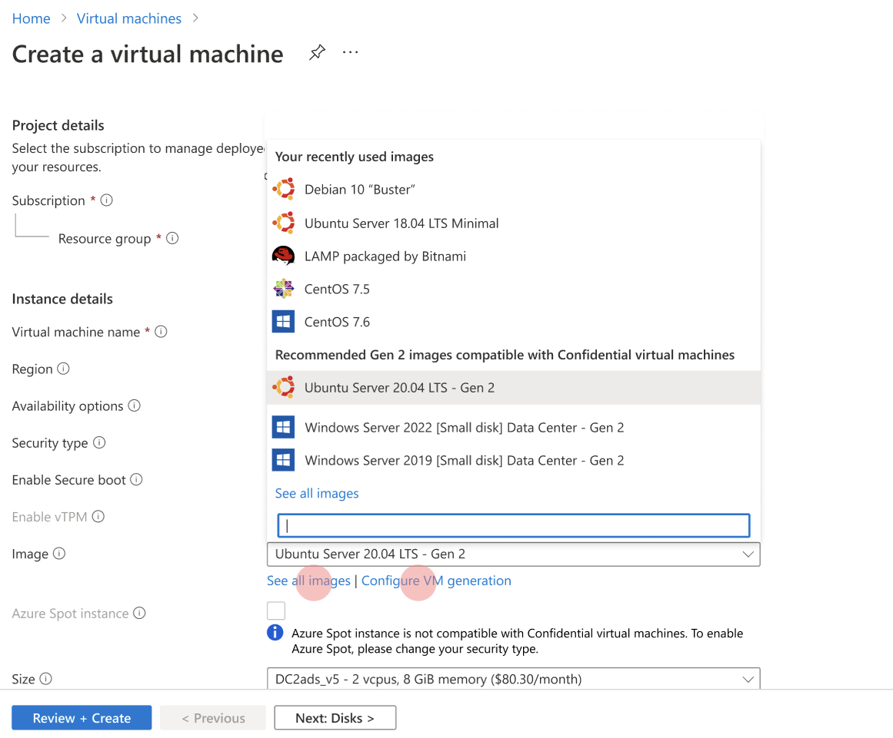

# Quickstart: Deploy an Azure Confidential virtual machine in the Azure portal

Get started with Azure confidential computing by using the Azure portal to create a Confidential virtual machine (VM) backed by AMD SEV-SNP to achieve VM memory encryption and isolation. 

This tutorial is recommended for you if you're interested in deploying a confidential virtual machine with custom configuration. Otherwise, we recommend following the [confidential Computing virtual machine deployment steps for the Microsoft commercial marketplace](quick-create-marketplace.md).


## Prerequisites

If you don't have an Azure subscription, [create an account](https://azure.microsoft.com/pricing/purchase-options/pay-as-you-go/) before you begin.

> [!NOTE]
> Free trial accounts do not have access to the virtual machines used in this tutorial. Please upgrade to a Pay-As-You-Go subscription.


## Sign in to Azure

1. Sign in to the [Azure portal](https://portal.azure.com/).

1. At the top, select **Create a resource**.

1. In the **Marketplace** pane, select **Compute** on the left.

1. Find and select **Virtual machine**.

    

1. On the Virtual machine landing page, select **Create**.


## Configure a Confidential virtual machine

1. In the **Basics** tab, select your **Subscription** and **Resource Group**.

1. For **Virtual machine name**, enter a name for your new VM.

1. Type or select the following values:

   * **Region**: Select the Azure region that's right for you.

    > [!NOTE]
     > Confidential compute virtual machines only run on specialized hardware available in specific regions. For the latest available regions for Confidential virtual machines, see [available regions](https://azure.microsoft.com/global-infrastructure/services/?products=virtual-machines).
1. Choose **Security Type** as Confidential virtual machines.
1. Configure the operating system image that you would like to use for your Confidential virtual machine.

    * **Choose Image**: For this tutorial, select Ubuntu 20.04 LTS. You may also select Windows Server 2019, Windows Server 2022, or and Ubuntu 16.04 LTS. If you choose to do so, you'll be redirected in this tutorial accordingly.
    

    * **Toggle the image for Gen 2**: Confidential  virtual machines only run on [Generation 2](../virtual-machines/generation-2.md) images. Click the **Configure VM generation** under Image selection where you're configuring the virtual machine. If Gen1 VM is selected, error message will pop out.
    

        


1. Choose Confidential virtual machine size based on your requirements by clicking **size**.

    > [!TIP]
    > Confidential virtual machine supports **DCasv5**, **DCadsv5**, **ECasv5**, and **ECadsv5** VM families. Detailed VM spec can check out thru here [Learn more](virtual-machine-solutions.md).


1. Fill in the following information:

   * **Authentication type**: Select **SSH public key** if you're creating a Linux VM. 

        > [!NOTE]
        > You have the choice of using an SSH public key or a Password for authentication. SSH is more secure. For instructions on how to generate an SSH key, see [Create SSH keys on Linux and Mac for Linux VMs in Azure](../virtual-machines/linux/mac-create-ssh-keys.md).

    * **Username**: Enter the Administrator name for the VM.

    * **SSH public key**: If applicable, enter your RSA public key.
    
    * **Password**: If applicable, enter your password for authentication.

    * **Public inbound ports**: Choose **Allow selected ports** and select **SSH (22)** and **HTTP (80)** in the **Select public inbound ports** list. If you're deploying a Windows VM, select **HTTP (80)** and **RDP (3389)**.  

    >[!Note]
    > Allowing RDP/SSH ports is not recommended for production deployments.  

     


1. Go to Disk tab. 
    * Under OS disk, click **Confidential compute encryption** if you want to encrypt Confidential virtual machine OS disk before VM provisioning. 
    * Two options can be chosen from **Confidential compute encryption type**: Confidential Disk encryption with platform-managed key or Confidential Disk encryption with customer-managed key. 
     >[!Note]
     > If Confidential Disk encryption with customer-managed key is selected, Confidential Disk Encryption Set (DES) will be required. Please see link here.

     

1. Make any changes you want to the settings in the following tabs or keep the default settings.

    * **Networking**
    * **Management**
    * **Guest config**
    * **Tags**

1. Select **Review + create**.

1. In the **Review + create** pane, select **Create**.

> [!NOTE]
> Proceed to the next section and continue with this tutorial if you deployed a Linux VM. If you deployed a Windows VM, [follow these steps to connect to your Windows VM](../virtual-machines/windows/connect-logon.md) and then [install the OE SDK on Windows](https://github.com/openenclave/openenclave/blob/master/docs/GettingStartedDocs/install_oe_sdk-Windows.md).


## Connect to the Linux VM

If you already use a BASH shell, connect to the Azure VM using the **ssh** command. In the following command, replace the VM user name and IP address to connect to your Linux VM.

```bash
ssh azureadmin@"VM IP address"
```

You can find the Public IP address of your VM in the Azure portal, under the Overview section of your virtual machine.


If you're running on Windows and don't have a BASH shell, install an SSH client, such as PuTTY.

1. [Download and install PuTTY](https://www.chiark.greenend.org.uk/~sgtatham/putty/download.html).

1. Run PuTTY.

1. On the PuTTY configuration screen, enter your VM's public IP address.

1. Select **Open** and enter your username and password at the prompts.

For more information about connecting to Linux VMs, see [Create a Linux VM on Azure using the Portal](../virtual-machines/linux/quick-create-portal.md).

> [!NOTE]
> If you see a PuTTY security alert about the server's host key not being cached in the registry, choose from the following options. If you trust this host, select **Yes** to add the key to PuTTy's cache and continue connecting. If you want to carry on connecting just once, without adding the key to the cache, select **No**. If you don't trust this host, select **Cancel** to abandon the connection.


## Clean up resources

When no longer needed, you can delete the resource group, virtual machine, and all related resources. 

Select the resource group for the virtual machine, then select **Delete**. Confirm the name of the resource group to finish deleting the resources.

## Next steps

In this quickstart, you deployed a confidential virtual machine. For more information about confidential computing virtual machines on Azure, see [Solutions on Virtual Machines](virtual-machine-solutions.md). 

