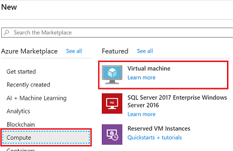
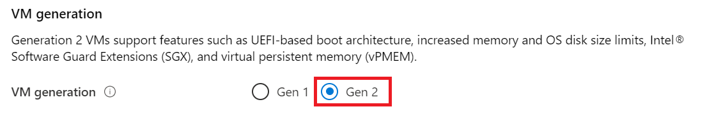
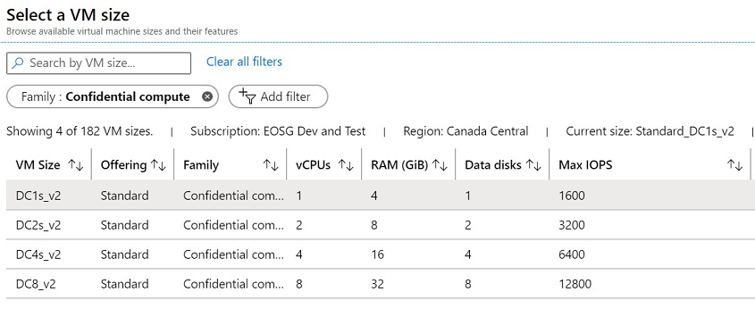
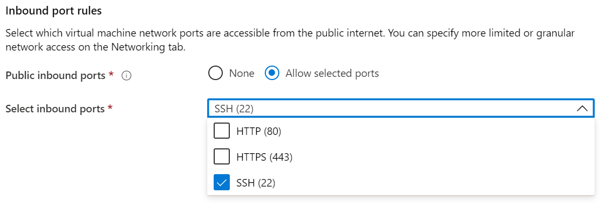

# Quickstart: Deploy an Azure confidential computing VM in the Azure portal

Get started with Azure confidential computing by using the Azure portal to create a virtual machine (VM) backed by Intel SGX. You'll then install the Open Enclave Software Development Kit (SDK) to set up your development environment. 

This tutorial is recommended for you if you're interested in deploying a confidential compute virtual machine with custom configuration. Otherwise, we recommend following the [confidential Computing virtual machine deployment steps for the Microsoft commercial marketplace](quick-create-marketplace.md).


## Prerequisites

If you don't have an Azure subscription, [create an account](https://azure.microsoft.com/pricing/purchase-options/pay-as-you-go/) before you begin.

> [!NOTE]
> Free trial accounts do not have access to the virtual machines used in this tutorial. Please upgrade to a Pay-As-You-Go subscription.


## Sign in to Azure

1. Sign in to the [Azure portal](https://portal.azure.com/).

1. At the top, select **Create a resource**.

1. In the **Marketplace** pane, select **Compute** on the left.

1. Find and select **Virtual machine**.

    

1. On the Virtual machine landing page, select **Create**.


## Configure a confidential computing virtual machine

1. In the **Basics** tab, select your **Subscription** and **Resource Group**.

1. For **Virtual machine name**, enter a name for your new VM.

1. Type or select the following values:

   * **Region**: Select the Azure region that's right for you.

        > [!NOTE]
        > Confidential compute virtual machines only run on specialized hardware available in specific regions. For the latest available regions for DCsv2-Series VMs, see [available regions](https://azure.microsoft.com/global-infrastructure/services/?products=virtual-machines).

1. Configure the operating system image that you would like to use for your virtual machine.

    * **Choose Image**: For this tutorial, select Ubuntu 18.04 LTS. You may also select Windows Server 2019, Windows Server 2016, or and Ubuntu 20.04 LTS. If you choose to do so, you'll be redirected in this tutorial accordingly.
    
    * **Toggle the image for Gen 2**: Confidential compute virtual machines only run on [Generation 2](../virtual-machines/generation-2.md) images. Ensure the image you select is a Gen 2 image. Click the **Advanced** tab above where you're configuring the virtual machine. Scroll down until you find the section labeled "VM Generation". Select Gen 2 and then go back to the **Basics** tab.
    

        


        

    * **Return to basic configuration**: Go back to the **Basics** tab using the navigation at the top.

1. Choose a virtual machine with confidential compute capabilities in the size selector by choosing **change size**. In the virtual machine size selector, click **Clear all filters**. Choose **Add filter**, select **Family** for the filter type, and then select only **Confidential compute**.

    

    > [!TIP]
    > You should see sizes **DC1s_v2**, **DC2s_v2**, **DC4s_V2**, and **DC8_v2**. These are the only virtual machine sizes that currently support Intel SGX confidential computing. [Learn more](virtual-machine-solutions.md).

1. Fill in the following information:

   * **Authentication type**: Select **SSH public key** if you're creating a Linux VM. 

        > [!NOTE]
        > You have the choice of using an SSH public key or a Password for authentication. SSH is more secure. For instructions on how to generate an SSH key, see [Create SSH keys on Linux and Mac for Linux VMs in Azure](../virtual-machines/linux/mac-create-ssh-keys.md).

    * **Username**: Enter the Administrator name for the VM.

    * **SSH public key**: If applicable, enter your RSA public key.
    
    * **Password**: If applicable, enter your password for authentication.

    * **Public inbound ports**: Choose **Allow selected ports** and select **SSH (22)** and **HTTP (80)** in the **Select public inbound ports** list. If you're deploying a Windows VM, select **HTTP (80)** and **RDP (3389)**. In this quickstart, this step is necessary to connect to the VM and complete the Open Enclave SDK configuration. 

     


1. Make changes in the **Disks** tab.

   * If you chose a **DC1s_v2**, **DC2s_v2**, **DC4s_V2** virtual machine, choose a disk type that is either **Standard SSD** or **Premium SSD**. 
   * If you chose a **DC8_v2** virtual machine, choose **Standard SSD** as your disk type.

1. Make any changes you want to the settings in the following tabs or keep the default settings.

    * **Networking**
    * **Management**
    * **Guest config**
    * **Tags**

1. Select **Review + create**.

1. In the **Review + create** pane, select **Create**.

> [!NOTE]
> Proceed to the next section and continue with this tutorial if you deployed a Linux VM. If you deployed a Windows VM, [follow these steps to connect to your Windows VM](../virtual-machines/windows/connect-logon.md) and then [install the OE SDK on Windows](https://github.com/openenclave/openenclave/blob/master/docs/GettingStartedDocs/install_oe_sdk-Windows.md).


## Connect to the Linux VM

If you already use a BASH shell, connect to the Azure VM using the **ssh** command. In the following command, replace the VM user name and IP address to connect to your Linux VM.

```bash
ssh azureadmin@40.55.55.555
```

You can find the Public IP address of your VM in the Azure portal, under the Overview section of your virtual machine.

:::image type="content" source="media/quick-create-portal/public-ip-virtual-machine.png" alt-text="IP address in Azure portal":::

If you're running on Windows and don't have a BASH shell, install an SSH client, such as PuTTY.

1. [Download and install PuTTY](https://www.chiark.greenend.org.uk/~sgtatham/putty/download.html).

1. Run PuTTY.

1. On the PuTTY configuration screen, enter your VM's public IP address.

1. Select **Open** and enter your username and password at the prompts.

For more information about connecting to Linux VMs, see [Create a Linux VM on Azure using the Portal](../virtual-machines/linux/quick-create-portal.md).

> [!NOTE]
> If you see a PuTTY security alert about the server's host key not being cached in the registry, choose from the following options. If you trust this host, select **Yes** to add the key to PuTTy's cache and continue connecting. If you want to carry on connecting just once, without adding the key to the cache, select **No**. If you don't trust this host, select **Cancel** to abandon the connection.

## Install the Open Enclave SDK (OE SDK) <a id="Install"></a>

Follow the step-by-step instructions to install the [OE SDK](https://github.com/openenclave/openenclave) on your DCsv2-Series virtual machine running an Ubuntu 18.04 LTS Gen 2 image. 

If your virtual machine runs on Ubuntu 18.04 LTS Gen 2, you'll need to follow [installation instructions for Ubuntu 18.04](https://github.com/openenclave/openenclave/blob/master/docs/GettingStartedDocs/install_oe_sdk-Ubuntu_18.04.md).

#### 1. Configure the Intel and Microsoft APT Repositories

```bash
echo 'deb [arch=amd64] https://download.01.org/intel-sgx/sgx_repo/ubuntu bionic main' | sudo tee /etc/apt/sources.list.d/intel-sgx.list
wget -qO - https://download.01.org/intel-sgx/sgx_repo/ubuntu/intel-sgx-deb.key | sudo apt-key add -

echo "deb http://apt.llvm.org/bionic/ llvm-toolchain-bionic-7 main" | sudo tee /etc/apt/sources.list.d/llvm-toolchain-bionic-7.list
wget -qO - https://apt.llvm.org/llvm-snapshot.gpg.key | sudo apt-key add -

echo "deb [arch=amd64] https://packages.microsoft.com/ubuntu/18.04/prod bionic main" | sudo tee /etc/apt/sources.list.d/msprod.list
wget -qO - https://packages.microsoft.com/keys/microsoft.asc | sudo apt-key add -
```

#### 2. Install the Intel SGX DCAP Driver
Some versions of Ubuntu may already have the Intel SGX driver installed. Check using the following command: 

```bash
dmesg | grep -i sgx
[  106.775199] sgx: intel_sgx: Intel SGX DCAP Driver {version}
``` 
If the output is blank, install the driver: 

```bash
sudo apt update
sudo apt -y install dkms
wget https://download.01.org/intel-sgx/sgx-dcap/1.7/linux/distro/ubuntu18.04-server/sgx_linux_x64_driver_1.35.bin -O sgx_linux_x64_driver.bin
chmod +x sgx_linux_x64_driver.bin
sudo ./sgx_linux_x64_driver.bin
```

> [!WARNING]
> Please use the latest Intel SGX DCAP driver from [Intel's SGX site](https://01.org/intel-software-guard-extensions/downloads).

#### 3. Install the Intel and Open Enclave packages and dependencies


```bash
sudo apt -y install clang-8 libssl-dev gdb libsgx-enclave-common libprotobuf10 libsgx-dcap-ql libsgx-dcap-ql-dev az-dcap-client open-enclave
```

> [!NOTE] 
> This step also installs the [az-dcap-client](https://github.com/microsoft/azure-dcap-client) package which is necessary for performing remote attestation in Azure.

#### 4. **Verify the Open Enclave SDK install**

See [Using the Open Enclave SDK](https://github.com/openenclave/openenclave/blob/master/docs/GettingStartedDocs/Linux_using_oe_sdk.md) on GitHub for verifying and using the installed SDK.

## Clean up resources

When no longer needed, you can delete the resource group, virtual machine, and all related resources. 

Select the resource group for the virtual machine, then select **Delete**. Confirm the name of the resource group to finish deleting the resources.

## Next steps

In this quickstart, you deployed a confidential computing virtual machine, and installed the Open Enclave SDK. For more information about confidential computing virtual machines on Azure, see [Solutions on Virtual Machines](virtual-machine-solutions.md). 

Discover how you can build confidential computing applications, by continuing to the Open Enclave SDK samples on GitHub. 

> [!div class="nextstepaction"]
> [Building Open Enclave SDK Samples](https://github.com/openenclave/openenclave/blob/master/samples/README.md)
