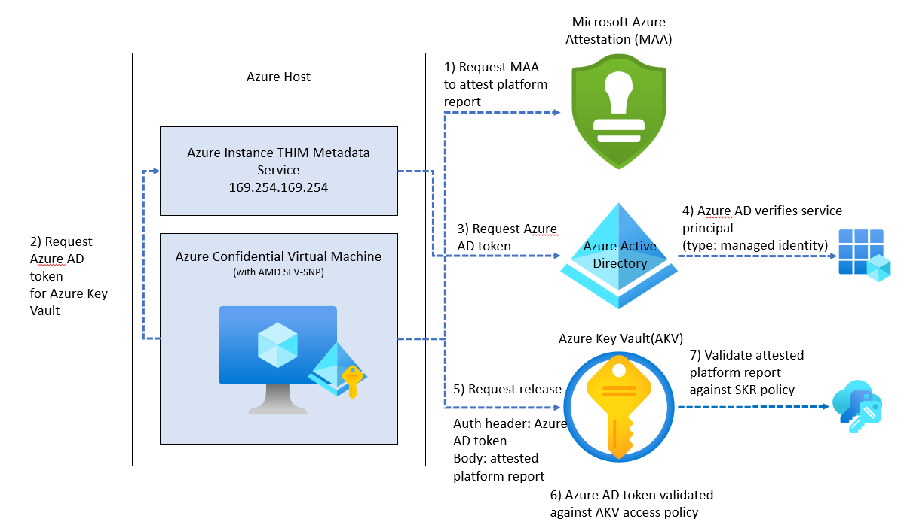
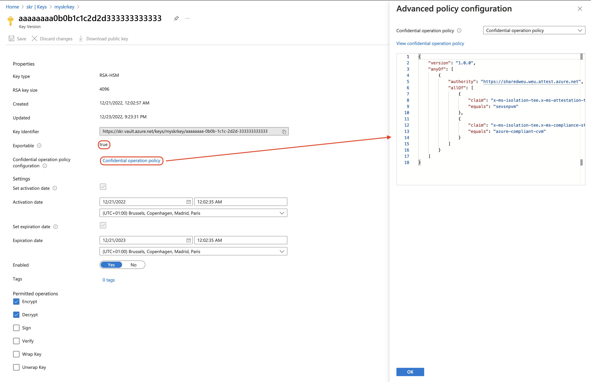

# Secure Key Release with Confidential VMs How To Guide

The below article describes how to perform a Secure Key Release from Azure Key Vault when your applications are running with an AMD SEV-SNP based confidential virtual machine. To learn more about Secure Key Release and Azure Confidential Computing, [go here.](./concept-skr-attestation.md).

SKR requires that an application performing SKR shall go through a remote guest attestation flow using Microsoft Azure Attestation (MAA) as described [here](guest-attestation-confidential-vms.md).

## Overall flow and architecture

To allow Azure Key Vault to release a key to an attested confidential virtual machine, there are certain steps that need to be followed:

1. Assign a managed identity to the confidential virtual machine. System-assigned managed identity or a user-assigned managed identity are supported.
1. Set a Key Vault access policy to grant the managed identity the "release" key permission. A policy allows the confidential virtual machine to access the Key Vault and perform the release operation. If using Key Vault Managed HSM, assign the "Managed HSM Crypto Service Release User" role membership.
1. Create a Key Vault key that is marked as exportable and has an associated release policy. The key release policy associates the key to an attested confidential virtual machine and that the key can only be used for the desired purpose.
1. To perform the release, send an HTTP request to the Key Vault from the confidential virtual machine. The HTTP request must include the Confidential VMs attested platform report in the request body. The attested platform report is used to verify the trustworthiness of the state of the Trusted Execution Environment-enabled platform, such as the Confidential VM. The Microsoft Azure Attestation service can be used to create the attested platform report and include it in the request.



## Deploying an Azure Key Vault

Set up AKV Premium or AKV mHSM with an exportable key. Follow the detailed instructions from here [setting up SKR exportable keys](concept-skr-attestation.md)

### Bicep

```bicep
@description('Required. Specifies the Azure location where the key vault should be created.')
param location string = resourceGroup().location

@description('Specifies the Azure Active Directory tenant ID that should be used for authenticating requests to the key vault. Get it by using Get-AzSubscription cmdlet.')
param tenantId string = subscription().tenantId

resource keyVault 'Microsoft.KeyVault/vaults@2021-11-01-preview' = {
  name: 'mykeyvault'
  location: location
  properties: {
    tenantId: tenantId
    sku: {
      name: 'premium'
      family: 'A'
    }
  }
}
```

### ARM template

```json
    {
      "type": "Microsoft.KeyVault/vaults",
      "apiVersion": "2021-11-01-preview",
      "name": "mykeyvault",
      "location": "[parameters('location')]",
      "properties": {
        "tenantId": "[parameters('tenantId')]",
        "sku": {
          "name": "premium",
          "family": "A"
        }
      }
    }
```

## Deploy a confidential virtual machine

Follow the quickstart instructions on how to "[Deploy confidential VM with ARM template](quick-create-confidential-vm-arm-amd.md)"

## Enable system-assigned managed identity

[Managed identities](../active-directory/managed-identities-azure-resources/overview.md) for Azure resources provide Azure services with an automatically managed identity in Microsoft Entra ID. You can use this identity to authenticate to any service that supports Microsoft Entra authentication, without having credentials in your code.

To enable system-assigned managed identity on a CVM, your account needs the [Virtual Machine Contributor](../role-based-access-control/built-in-roles.md#virtual-machine-contributor) role assignment.  No other Microsoft Entra directory role assignments are required.

### [Bicep 1](#tab/bicep)

1. Whether you sign in to Azure locally or via the Azure portal, use an account that is associated with the Azure subscription that contains the VM.

2. To enable system-assigned managed identity, load the template into an editor, locate the `Microsoft.Compute/virtualMachines` resource of interest and add the `"identity"` property at the same level as the `name: vmName` property. Use the following syntax:

   ```bicep
      identity:{
        type: 'SystemAssigned'
      }
   ```

3. Add the `resource` details to the template.

   ```bicep
    resource confidentialVm 'Microsoft.Compute/virtualMachines@2021-11-01' = {
      name: vmName
      location: location
      identity:{
        type: 'SystemAssigned'
      }
      // other resource provider properties
    }
   ```

### [ARM template 1](#tab/arm-template)

1. Use an Azure account that is associated to the Azure subscription that contains the VM.

2. To enable system-assigned managed identity, load the template into an editor, locate the `Microsoft.Compute/virtualMachines` resource of interest within the `resources` section and add the `"identity"` property at the same level as the `"type": "Microsoft.Compute/virtualMachines"` property. Use the following syntax:

   ```json
   "identity": {
       "type": "SystemAssigned"
   },
   ```

3. The final template looks the below example

   ```json
    "resources": [
        {
            "apiVersion": "2021-11-01",
            "type": "Microsoft.Compute/virtualMachines",
            "name": "[parameters('vmName')]",
            "location": "[parameters('location')]",
            "identity": {
                "type": "SystemAssigned",
              },
            //other resource provider properties...
        }
    ]
   ```


## Add the access policy to Azure Key Vault

Once you enable a system-assigned managed identity for your CVM, you have to provide it with access to the Azure Key Vault data plane where key objects are stored. To ensure that only our confidential virtual machine can execute the release operation, we'll only grant the specific permission required.

> [!NOTE]
> You can find the managed identity object ID in the virtual machine identity options, in the Azure portal. Alternatively you can retrieve it with [PowerShell](../active-directory/managed-identities-azure-resources/how-to-assign-app-role-managed-identity-powershell.md), [Azure CLI](../active-directory/managed-identities-azure-resources/how-to-assign-app-role-managed-identity-cli.md), Bicep or ARM templates.

### [Bicep 1]

```bicep
@description('Required. Specifies the object ID of a user, service principal or security group in the Azure Active Directory tenant for the vault. The object ID must be unique for the list of access policies. Get it by using Get-AzADUser or Get-AzADServicePrincipal cmdlets.')
param objectId string

resource keyVaultCvmAccessPolicy 'Microsoft.KeyVault/vaults/accessPolicies@2022-07-01' = {
  parent: keyVault
  name: 'add'
  properties: {
    accessPolicies: [
      {
        objectId: objectId
        tenantId: tenantId
        permissions: {
          keys: [
            'release'
          ]
        }
      }
    ]
  }
}
```

### [ARM template 2]

```json
    {
      "type": "Microsoft.KeyVault/vaults/accessPolicies",
      "apiVersion": "2022-07-01",
      "name": "[format('{0}/{1}', 'mykeyvault', 'add')]",
      "properties": {
        "accessPolicies": [
          {
            "objectId": "[parameters('objectId')]",
            "tenantId": "[parameters('tenantId')]",
            "permissions": {
              "keys": [
                "release"
              ]
            }
          }
        ]
      },
      "dependsOn": [
        "[resourceId('Microsoft.KeyVault/vaults', 'mykeyvault')]"
      ]
    }
```

## Prepare the release policy

Key Vault Secure Key Release Policies are modeled after __Azure Policy__, with a [slightly different grammar](../key-vault/keys/policy-grammar.md).
The idea is when we __pass the attested platform report__, in the form of a JSON Web Token (JWT), to Key Vault. It will, in turn, look at the JWT and check whether or not the attested platform report claims match the claims in the policy.

For example, let's say we want to release a key only when our attested platform report has properties like:

-  Attested by [Microsoft Azure Attestation (MAA)](../attestation/overview.md) service endpoint "https://sharedweu.weu.attest.azure.net".
  - This `authority` value from the policy is compared to the `iss` (issuer) property, in the token.
- And that it also contains an object called `x-ms-isolation-tee` with a property called `x-ms-attestation-type`, which holds value `sevsnpvm`.
  - MAA as an Azure service has attested that the CVM is running in an AMD SEV-SNP genuine processor.
- And that it also contains an object called `x-ms-isolation-tee` with a property called `x-ms-compliance-status`, which holds the value `azure-compliant-cvm`.
  - MAA as an Azure service has the ability to attest that the CVM is a compliant Azure confidential virtual machine.

Create a new folder called `assets` and add the following JSON content to a file named `cvm-release-policy.json`:

```json
{
    "version": "1.0.0",
    "anyOf": [
        {
            "authority": "https://sharedweu.weu.attest.azure.net",
            "allOf": [
                {
                    "claim": "x-ms-isolation-tee.x-ms-attestation-type",
                    "equals": "sevsnpvm"
                },
                {
                    "claim": "x-ms-isolation-tee.x-ms-compliance-status",
                    "equals": "azure-compliant-cvm"
                }
            ]
        }
    ]
}
```

Release policy is an `anyOf` condition containing an array of key authorities. A `claim` condition is a JSON object that identifies a claim name, a condition for matching, and a value. The `AnyOf` and `AllOf` condition objects allow for the modeling of a logical `OR` and `AND`. Currently, we can only perform an `equals` comparison on a `claim`.  Condition properties are placed together with `authority` properties.

> [!IMPORTANT]
> An environment assertion contains at least __a key encryption key and one or more claims about the target environment__ (for example, TEE type, publisher, version) that are matched against the Key Release Policy. The key-encryption key is a public RSA key owned and protected by the target execution environment that is used for key export. It must appear in the TEE keys claim (x-ms-runtime/keys). This claim is a JSON object representing a JSON Web Key Set. Within the JWKS, one of the keys must meet the requirements for use as an encryption key (key_use is "enc", or key_ops contains "encrypt"). The first suitable key is chosen.

Key Vault picks the first suitable key from "`keys`" array property in the "`x-ms-runtime`" object, it looks for a public RSA key with `"key_use": ["enc"]` or `"key_ops": ["encrypt"]`. An example of an attested platform report would look like:

```json
{
    //...
    "x-ms-runtime": {
        "client-payload": {
            "nonce": "MTIzNA=="
        },
        "keys": [
            {
                "e": "AQAB",
                "key_ops": [
                    "encrypt"
                ],
                "kid": "TpmEphemeralEncryptionKey",
                "kty": "RSA",
                "n": "9v2XQgAA6y18CxV8dSGnh..."
            }
        ]
    },
    //...
}
```

In this example, we have only one key under the `$.x-ms-runtime.keys` path. Key Vault uses the `TpmEphemeralEncryptionKey` key as the key-encryption key.

> [!NOTE]
> Notice that there may be a key under `$.x-ms-isolation-tee.x-ms-runtime.keys`, this is __not__ the key that Key Vault will be using.

## Create an exportable key with release policy

We create a Key Vault access policy that lets an Azure Confidential Virtual Machine perform the `release` key operation. Finally, we must include our release policy as a base64 encoded string during the key creation. The key must be an __exportable__ key, backed by an HSM.

> [!NOTE]
> HSM-backed keys are available with Azure Key Vault Premium and Azure Key Vault Managed HSM.

### [Bicep 2]

```bicep
@description('The type of the key. For valid values, see JsonWebKeyType. Must be backed by HSM, for secure key release.')
@allowed([
  'EC-HSM'
  'RSA-HSM'
])
param keyType string = 'RSA-HSM'

@description('Not before date in seconds since 1970-01-01T00:00:00Z.')
param keyNotBefore int = -1

@description('Expiry date in seconds since 1970-01-01T00:00:00Z.')
param keyExpiration int = -1

@description('The elliptic curve name. For valid values, see JsonWebKeyCurveName.')
@allowed([
  'P-256'
  'P-256K'
  'P-384'
  'P-521'
])
param curveName string

@description('The key size in bits. For example: 2048, 3072, or 4096 for RSA.')
param keySize int = -1

resource exportableKey 'Microsoft.KeyVault/vaults/keys@2022-07-01' = {
  parent: keyVault
  name: 'mykey'
  properties: {
    kty: keyType
    attributes: {
      exportable: true
      enabled: true
      nbf: keyNotBefore == -1 ? null : keyNotBefore
      exp: keyExpiration == -1 ? null : keyExpiration
    }
    curveName: curveName // applicable when using key type (kty) 'EC'
    keySize: keySize == -1 ? null : keySize
    keyOps: ['encrypt','decrypt'] // encrypt and decrypt only work with RSA keys, not EC
    release_policy: {
      contentType: 'application/json; charset=utf-8'
      data: loadFileAsBase64('assets/cvm-release-policy.json')
    }
  }
}
```

### [ARM template 2]

```json
   {
      "type": "Microsoft.KeyVault/vaults/keys",
      "apiVersion": "2022-07-01",
      "name": "[format('{0}/{1}', 'mykeyvault', 'mykey')]",
      "properties": {
        "kty": "RSA-HSM",
        "attributes": {
          "exportable": true,
          "enabled": true,
          "nbf": "[if(equals(parameters('keyNotBefore'), -1), null(), parameters('keyNotBefore'))]",
          "exp": "[if(equals(parameters('keyExpiration'), -1), null(), parameters('keyExpiration'))]"
        },
        "curveName": "[parameters('curveName')]",
        "keySize": "[if(equals(parameters('keySize'), -1), null(), parameters('keySize'))]",
        "keyOps": [
          "encrypt",
          "decrypt"
        ],
        "release_policy": {
          "contentType": "application/json; charset=utf-8",
          "data": "[variables('cvmReleasePolicyBase64EncodedString')]"
        }
      },
      "dependsOn": [
        "[resourceId('Microsoft.KeyVault/vaults', 'mykeyvault')]"
      ]
    }
```

We can verify that Key Vault has created a new, __HSM-backed__, key and that it contains our secure key __release policy__ by navigating to the Azure portal and selecting our key. The intended key will be marked as "__exportable__".



## Guest attestation client

Attestation helps us to _cryptographically assess_ that something is running in the intended operating state. It is the process by which one party, the verifier, assesses the trustworthiness of a potentially untrusted peer, the attester. With remote guest attestation, the trusted execution environment offers a platform that allows you to run an entire operating system inside of it.

> [!IMPORTANT]
> Microsoft offers a C/C++ library, for both [Windows](https://www.nuget.org/packages/Microsoft.Azure.Security.GuestAttestation) and [Linux](https://packages.microsoft.com/repos/azurecore/pool/main/a/azguestattestation1/) that can help your development efforts. The library makes it easy to acquire a __a SEV-SNP platform report__ from the hardware and to also have it attested by an instance of Azure Attestation service. The Azure Attestation service can either be one hosted by Microsoft (shared) or your own private instance.

A [open sourced](https://github.com/Azure/confidential-computing-cvm-guest-attestation) Windows and Linux client binary that utilizes the guest attestation library can be chosen to make the guest attestation process easy with CVMs. The client binary returns the attested platform report as a JSON Web Token, which is what is needed for Key Vault's `release` key operation.

> [!NOTE]
> A token from the Azure Attestation service is valid for [8 hours](../attestation/faq.yml).

### [Linux]

1. Sign in to your VM.

1. Clone the [sample Linux application](https://github.com/Azure/confidential-computing-cvm-guest-attestation/tree/main/cvm-platform-checker-exe/Linux).

1. Install the `build-essential` package. This package installs everything required for compiling the sample application.

    ```bash
    sudo apt-get install build-essential
    ```

1. Install the `libcurl4-openssl-dev` and `libjsoncpp-dev` packages.

    ```bash
    sudo apt-get install libcurl4-openssl-dev
    ```

    ```bash
    sudo apt-get install libjsoncpp-dev
    ```

1. [Download](https://packages.microsoft.com/repos/azurecore/pool/main/a/azguestattestation1/) the attestation package.

1. Install the attestation package. Make sure to replace `<version>` with the version that you downloaded.

    ```bash
    sudo dpkg -i azguestattestation1_<latest-version>_amd64.deb
    ```

1. To run the sample client, navigate inside the unzipped folder and run the below command:

    ```sh
    sudo ./AttestationClient -a <attestation-url> -n <nonce-value> -o token
    ```

> [!NOTE]
> If `-o` is not specified to as `token`, the exe prints a binary result true or false depending on the attestation result and the platform being `sevsnp`.

### [Windows](#tab/windows)

1. Sign in to your VM.
1. Clone the [sample Windows application](https://github.com/Azure/confidential-computing-cvm-guest-attestation/tree/main/cvm-platform-checker-exe/Windows).
1. Navigate inside the unzipped folder and run `VC_redist.x64.exe`. VC_redist will install Microsoft C and C++ (MSVC) runtime libraries on the machine.
1. To run the sample client, navigate inside the unzipped folder and run the below command:

    ```sh
    sudo ./AttestationClient -a <attestation-url> -n <nonce-value> -o token
    ```

> [!NOTE]
> If `-o` is not specified to as `token`, the exe prints a binary result true or false depending on the attestation result and the platform being `sevsnp`.

### Guest Attestation result

The result from the Guest Attestation client simply is a base64 encoded string. This encoded string value is a signed JSON Web Token (__JWT__), with a header, body and signature. You can split the string by the `.` (dot) value and base64 decode the results.

```text
eyJhbGciO...
```

The header contains a `jku`, also known as [JWK Set URI](https://www.rfc-editor.org/rfc/rfc7515#section-4.1.2) which links to a set of JSON-encoded public keys. One of which corresponds to the key used to digitally sign the JWS. The `kid` indicates which key was used to sign the JWS.

```json
{
    "alg": "RS256",
    "jku": "https://sharedweu.weu.attest.azure.net/certs",
    "kid": "dRKh+hBcWUfQimSl3Iv6ZhStW3TSOt0ThwiTgUUqZAo=",
    "typ": "JWT"
}
```

The body of the guest attestation response will get validated by Azure Key Vault as input to test against the key release policy. As previously noted, Azure Key Vault uses the "`TpmEphemeralEncryptionKey`" as the key-encryption key.

```json
{
    "exp": 1671865218,
    "iat": 1671836418,
    "iss": "https://sharedweu.weu.attest.azure.net",
    "jti": "ce395e5de9c638d384cd3bd06041e674edee820305596bba3029175af2018da0",
    "nbf": 1671836418,
    "secureboot": true,
    "x-ms-attestation-type": "azurevm",
    "x-ms-azurevm-attestation-protocol-ver": "2.0",
    "x-ms-azurevm-attested-pcrs": [
        0,
        1,
        2,
        3,
        4,
        5,
        6,
        7
    ],
    "x-ms-azurevm-bootdebug-enabled": false,
    "x-ms-azurevm-dbvalidated": true,
    "x-ms-azurevm-dbxvalidated": true,
    "x-ms-azurevm-debuggersdisabled": true,
    "x-ms-azurevm-default-securebootkeysvalidated": true,
    "x-ms-azurevm-elam-enabled": false,
    "x-ms-azurevm-flightsigning-enabled": false,
    "x-ms-azurevm-hvci-policy": 0,
    "x-ms-azurevm-hypervisordebug-enabled": false,
    "x-ms-azurevm-is-windows": false,
    "x-ms-azurevm-kerneldebug-enabled": false,
    "x-ms-azurevm-osbuild": "NotApplication",
    "x-ms-azurevm-osdistro": "Ubuntu",
    "x-ms-azurevm-ostype": "Linux",
    "x-ms-azurevm-osversion-major": 20,
    "x-ms-azurevm-osversion-minor": 4,
    "x-ms-azurevm-signingdisabled": true,
    "x-ms-azurevm-testsigning-enabled": false,
    "x-ms-azurevm-vmid": "6506B531-1634-431E-99D2-42B7D3414AD0",
    "x-ms-isolation-tee": {
        "x-ms-attestation-type": "sevsnpvm",
        "x-ms-compliance-status": "azure-compliant-cvm",
        "x-ms-runtime": {
            "keys": [
                {
                    "e": "AQAB",
                    "key_ops": [
                        "encrypt"
                    ],
                    "kid": "HCLAkPub",
                    "kty": "RSA",
                    "n": "tXkRLAABQ7vgX96..1OQ"
                }
            ],
            "vm-configuration": {
                "console-enabled": true,
                "current-time": 1671835548,
                "secure-boot": true,
                "tpm-enabled": true,
                "vmUniqueId": "6506B531-1634-431E-99D2-42B7D3414AD0"
            }
        },
        "x-ms-sevsnpvm-authorkeydigest": "0000000000000..00",
        "x-ms-sevsnpvm-bootloader-svn": 3,
        "x-ms-sevsnpvm-familyId": "01000000000000000000000000000000",
        "x-ms-sevsnpvm-guestsvn": 2,
        "x-ms-sevsnpvm-hostdata": "0000000000000000000000000000000000000000000000000000000000000000",
        "x-ms-sevsnpvm-idkeydigest": "57486a44..96",
        "x-ms-sevsnpvm-imageId": "02000000000000000000000000000000",
        "x-ms-sevsnpvm-is-debuggable": false,
        "x-ms-sevsnpvm-launchmeasurement": "ad6de16..23",
        "x-ms-sevsnpvm-microcode-svn": 115,
        "x-ms-sevsnpvm-migration-allowed": false,
        "x-ms-sevsnpvm-reportdata": "c6500..0000000",
        "x-ms-sevsnpvm-reportid": "cf5ea742f08cb45240e8ad4..7eb7c6c86da6493",
        "x-ms-sevsnpvm-smt-allowed": true,
        "x-ms-sevsnpvm-snpfw-svn": 8,
        "x-ms-sevsnpvm-tee-svn": 0,
        "x-ms-sevsnpvm-vmpl": 0
    },
    "x-ms-policy-hash": "wm9mHlvTU82e8UqoOy1..RSNkfe99-69IYDq9eWs",
    "x-ms-runtime": {
        "client-payload": {
            "nonce": ""
        },
        "keys": [
            {
                "e": "AQAB",
                "key_ops": [
                    "encrypt"
                ],
                "kid": "TpmEphemeralEncryptionKey", // key-encryption key candidate!
                "kty": "RSA",
                "n": "kVTLSwAAQpg..Q"
            }
        ]
    },
    "x-ms-ver": "1.0"
}
```

The documentation for Microsoft Azure Attestation service has an extensive list containing descriptions of all of these [SEV-SNP-related claims](../attestation/claim-sets.md#sev-snp-attestation).

## Performing the key release operation

We can use any scripting or programming language to receive an attested platform report using the AttestationClient binary. Since the virtual machine we deployed in a previous step has managed identity enabled, we should get an __Azure AD token for Key Vault__ from the instance metadata service (__IMDS__).

By configuring the attested platform report as the body payload and the Microsoft Entra token in our __authorization header__, you have everything needed to perform the key `release` operation.

```powershell
#Requires -Version 7
#Requires -RunAsAdministrator
#Requires -PSEdition Core

<#
.SYNOPSIS
    Perform Secure Key Release operation in Azure Key Vault, provided this script is running inside an Azure Confidential Virtual Machine.
.DESCRIPTION
    Perform Secure Key Release operation in Azure Key Vault, provided this script is running inside an Azure Confidential Virtual Machine.
     The release key operation is applicable to all key types. The target key must be marked exportable. This operation requires the keys/release permission.
.PARAMETER -AttestationTenant
    Provide the attestation instance base URI, for example https://mytenant.attest.azure.net.
.PARAMETER -VaultBaseUrl
    Provide the vault name, for example https://myvault.vault.azure.net.
.PARAMETER -KeyName
    Provide the name of the key to get.
.PARAMETER -KeyName
    Provide the version parameter to retrieve a specific version of a key.
.INPUTS
    None.
.OUTPUTS
    System.Management.Automation.PSObject
.EXAMPLE
    PS C:\> .\Invoke-SecureKeyRelease.ps1 -AttestationTenant "https://sharedweu.weu.attest.azure.net" -VaultBaseUrl "https://mykeyvault.vault.azure.net/" -KeyName "mykey" -KeyVersion "e473cd4c66224d16870bbe2eb4c58078"
#>

param (
    [Parameter(Mandatory = $true)]
    [string]
    $AttestationTenant,
    [Parameter(Mandatory = $true)]
    [string]
    $VaultBaseUrl,
    [Parameter(Mandatory = $true)]
    [string]
    $KeyName,
    [Parameter(Mandatory = $false)]
    [string]
    $KeyVersion
)
# Check if AttestationClient* exists.
$fileExists = Test-Path -Path "AttestationClient*"
if (!$fileExists) {
    throw "AttestationClient binary not found. Please download it from 'https://github.com/Azure/confidential-computing-cvm-guest-attestation'."
}

$cmd = $null
if ($isLinux) {
    $cmd = "sudo ./AttestationClient -a $attestationTenant -o token"
}
elseif ($isWindows) {
    $cmd = "./AttestationClientApp.exe -a $attestationTenant -o token"
}

$attestedPlatformReportJwt = Invoke-Expression -Command $cmd
if (!$attestedPlatformReportJwt.StartsWith("eyJ")) {
    throw "AttestationClient failed to get an attested platform report."
}

## Get access token from IMDS for Key Vault
$imdsUrl = 'http://169.254.169.254/metadata/identity/oauth2/token?api-version=2018-02-01&resource=https://vault.azure.net'
$kvTokenResponse = Invoke-WebRequest -Uri  $imdsUrl -Headers @{Metadata = "true" }
if ($kvTokenResponse.StatusCode -ne 200) {
    throw "Unable to get access token. Ensure Azure Managed Identity is enabled."
}
$kvAccessToken = ($kvTokenResponse.Content | ConvertFrom-Json).access_token

# Perform release key operation
if ([string]::IsNullOrEmpty($keyVersion)) {
    $kvReleaseKeyUrl = "{0}/keys/{1}/release?api-version=7.3" -f $vaultBaseUrl, $keyName
}
else {
    $kvReleaseKeyUrl = "{0}/keys/{1}/{2}/release?api-version=7.3" -f $vaultBaseUrl, $keyName, $keyVersion
}

$kvReleaseKeyHeaders = @{
    Authorization  = "Bearer $kvAccessToken"
    'Content-Type' = 'application/json'
}

$kvReleaseKeyBody = @{
    target = $attestedPlatformReportJwt
}

$kvReleaseKeyResponse = Invoke-WebRequest -Method POST -Uri $kvReleaseKeyUrl -Headers $kvReleaseKeyHeaders -Body ($kvReleaseKeyBody | ConvertTo-Json)
if ($kvReleaseKeyResponse.StatusCode -ne 200) {
    Write-Error -Message "Unable to perform release key operation."
    Write-Error -Message $kvReleaseKeyResponse.Content
}
else {
    $kvReleaseKeyResponse.Content | ConvertFrom-Json
}
```

### Key Release Response

The secure key release operation only returns a single property inside of its JSON payload. The contents, however, have been base64 encoded as well.

```json
{
  "value": "eyJhbGciOiJSUzI1NiIsImtpZCI6Ijg4RUFDM.."
}
```

Here we have another header, though this one has a [X.509 certificate chain](https://www.rfc-editor.org/rfc/rfc7515#section-4.1.6) as a property.

```json
{
    "alg": "RS256",
    "kid": "88EAC2DB6BE4E051B0E05AEAF6CB79E675296121",
    "x5t": "iOrC22vk4FGw4Frq9st55nUpYSE",
    "typ": "JWT",
    "x5t#S256": "BO7jbeU3BG0FEjetF8rSisRbkMfcdy0olhcnmYEwApA",
    "x5c": [
        "MIIIfDCCBmSgA..XQ==",
        "MII..8ZZ8m",
        "MII..lMrY="
    ]
}
```

You can read from the "`x5c`" array in PowerShell, this can help you verify that this is a valid certificate. Below is an example:

```powershell
$certBase64 = "MIIIfDCCBmSgA..XQ=="
$cert = [System.Security.Cryptography.X509Certificates.X509Certificate2]([System.Convert]::FromBase64String($certBase64))
$cert | Format-List *

# NotAfter             : 9/18/2023 6:14:06 PM
# NotBefore            : 9/23/2022 6:14:06 PM
# ...
# Issuer               : CN=Microsoft Azure TLS Issuing CA 06, O=Microsoft Corporation, C=US
# Subject              : CN=vault.azure.net, O=Microsoft Corporation, L=Redmond, S=WA, C=US
```

The response's JWT token body looks incredibly similar to the response that you get when invoking the `get` key operation. However, the `release` operation includes the `key_hsm` property, amongst other things.

```json
{
    "request": {
        "api-version": "7.3",
        "enc": "CKM_RSA_AES_KEY_WRAP",
        "kid": "https://mykeyvault.vault.azure.net/keys/mykey"
    },
    "response": {
        "key": {
            "key": {
                "kid": "https://mykeyvault.vault.azure.net/keys/mykey/e473cd4c66224d16870bbe2eb4c58078",
                "kty": "RSA-HSM",
                "key_ops": [
                    "encrypt",
                    "decrypt"
                ],
                "n": "nwFQ8p..20M",
                "e": "AQAB",
                "key_hsm": "eyJzY2hlbW..GIifQ"
            },
            "attributes": {
                "enabled": true,
                "nbf": 1671577355,
                "exp": 1703113355,
                "created": 1671577377,
                "updated": 1671827011,
                "recoveryLevel": "Recoverable+Purgeable",
                "recoverableDays": 90,
                "exportable": true
            },
            "tags": {},
            "release_policy": {
                "data": "eyJ2ZXJzaW9uIjoiMS4wLjAiLCJhbnlPZiI6W3siYXV0aG9yaXR5IjoiaHR0cHM6Ly9zaGFyZWR3ZXUud2V1LmF0dGVzdC5henVyZS5uZXQiLCJhbGxPZiI6W3siY2xhaW0iOiJ4LW1zLWlzb2xhdGlvbi10ZWUueC1tcy1hdHRlc3RhdGlvbi10eXBlIiwiZXF1YWxzIjoic2V2c25wdm0ifSx7ImNsYWltIjoieC1tcy1pc29sYXRpb24tdGVlLngtbXMtY29tcGxpYW5jZS1zdGF0dXMiLCJlcXVhbHMiOiJhenVyZS1jb21wbGlhbnQtY3ZtIn1dfV19",
                "immutable": false
            }
        }
    }
}
```

Should your base64 decode the value under `$.response.key.release_policy.data`, you get the JSON representation of the Key Vault key release policy that we defined in an earlier step.

The `key_hsm` property base64 decoded value looks like this:

```json
{
    "schema_version": "1.0",
    "header": {
        "kid": "TpmEphemeralEncryptionKey", // (key identifier of KEK)
        "alg": "dir", // Direct mode, i.e. the referenced 'kid' is used to directly protect the ciphertext
        "enc": "CKM_RSA_AES_KEY_WRAP"
    },
    "ciphertext": "Rftxvr..lb"
}
```

## Next steps

[SKR Policy Examples](skr-policy-examples.md)
[Learn how to use Microsoft Defender for Cloud integration with confidential VMs with guest attestation installed](guest-attestation-defender-for-cloud.md)
[Learn more about the guest attestation feature](guest-attestation-confidential-vms.md)
[Learn about Azure confidential VMs](confidential-vm-overview.md)
