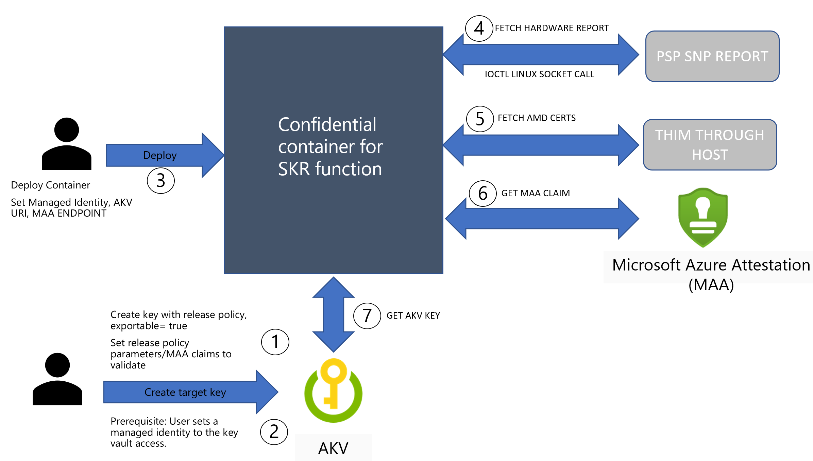

# Secure Key Release with Confidential containers on Azure Container Instance (ACI)

With confidential containers offerings there are two ways you can implement the Secure Key Release (SKR) Flow with Azure Key Vault (AKV). Confidential containers run a guest enlightened AMD SEV-SNP Linux Kernel that leverages in guest firmware with necessary Hyper-V related patches that we refer as Direct Linux Boot (DLB). This platform does not use vTPM and HCL based that Confidential VMs with AMD SEV-SNP support. These concept document assumes you plan to run the containers in [Azure Container Support choosing a confidential computing SKU](../container-instances/container-instances-tutorial-deploy-confidential-containers-cce-arm.md)

1. Side-Car Helper Container provided by Azure
1. Custom implementation with your container application

## Side-Car helper container provided by Azure

An [open sourced GitHub project "confidential side-cars"](https://github.com/microsoft/confidential-sidecar-containers) details how to build this container and what parameters/environment variables are required for you to prepare and run this side-car container. The current side car implementation provides various HTTP REST API's that your primary application container can use to fetch the key from AKV. The integration through Microsoft Azure Attestation(MAA) ia already build in. The preparation steps to run the side-car SKR container can be found in details [here](https://github.com/microsoft/confidential-sidecar-containers/tree/main/examples/skr).

Your main application container application can call the side-car WEB API end points as defined in the example blow. Side-cars runs within the same container group and is a local endpoint to your application container. Full details of the API can be found [here](https://github.com/microsoft/confidential-sidecar-containers/blob/main/cmd/skr/README.md)
 
The `key/release` POST method expects a JSON of the following format:

```json
{	
    "maa_endpoint": "<maa endpoint>", //https://learn.microsoft.com/en-us/azure/attestation/quickstart-portal#attestation-provider
    "akv_endpoint": "<akv endpoint>", //AKV URI
    "kid": "<key identifier>" //key name,
    "access_token": "optional aad token if the command will run in a resource without proper managed identity assigned"
}
```

Upon success, the `key/release` POST method response carries a `StatusOK` header and a payload of the following format:

```json
{
    "key": "<key in JSON Web Key format>"
}
```

Upon error, the `key/release` POST method response carries a `StatusForbidden` header and a payload of the following format:

```json
{
    "error": "<error message>"
}
```

## Custom implementation with your container application

To perform a custom container application that extends the capability of SKR please follow the below high level flow as guidance. The easy approach is to review the current side-car implementation code in this [side-car Github project](https://github.com/microsoft/confidential-sidecar-containers/tree/d933d0f4e3d5498f7ed9137189ab6a23ade15466/pkg/common).



1. **Step 1:** Setup AKV with Exportable Key and attach the release policy. More [here](concept-skr-attestation.md)
1. **Step 2:** Setup a managed identity with Azure Active Directory and attach that to AKV. More [here](../container-instances/container-instances-managed-identity.md)
1. **Step 3:** Deploy your container application with required parameters within ACI by setting up a confidential computing enforcement policy. More [here](../container-instances/container-instances-tutorial-deploy-confidential-containers-cce-arm.md)
1. **Step 4:** In this step your application shall fetch a RAW AMD SEV-SNP hardware report by doing a IOCTL Linux Socket call. You do not need any guest attestation library to perform this action. More on existing side-car [implementation](https://github.com/microsoft/confidential-sidecar-containers/blob/d933d0f4e3d5498f7ed9137189ab6a23ade15466/pkg/attest/snp.go)
1. **Step 5:** Fetch the AMD SEV-SNP cert chain for the container group. These certs are delivered form Azure host IMDS endpoint. More [here](https://github.com/microsoft/confidential-sidecar-containers/blob/d933d0f4e3d5498f7ed9137189ab6a23ade15466/pkg/common/info.go)
1. **Step 6:** Send the SNP RAW hardware report and cert details to MAA for verification and return claims. More [here](../attestation/basic-concepts)
1. **Step 7:** Send the MAA token and the managed identity token generated by ACI to AKV for key release. More [here](.../rest/api/keyvault/keys/create-key/create-key?tabs=HTTP)

On success of the key fetch from AKV, you can consume the key for decrypting the data sets or encrypt the data going out of the confidential container environment.

## References

[ACI with Confidential container deployments](../container-instances/container-instances-tutorial-deploy-confidential-containers-cce-arm.md)

[Side-Car Implementation with encrypted blob fetch and decrypt with SKR AKV key](https://github.com/microsoft/confidential-sidecar-containers/#encrypted-filesystem-sidecar)

[AKV SKR with Confidential VM's AMD SEV-SNP](/skr-flow-cvm-sevsnp-attestation.md)

[Microsoft Azure Attestation (MAA)](../attestation)
