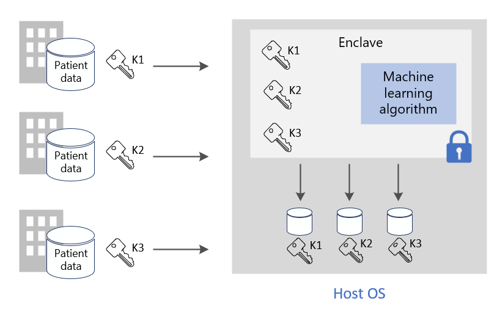
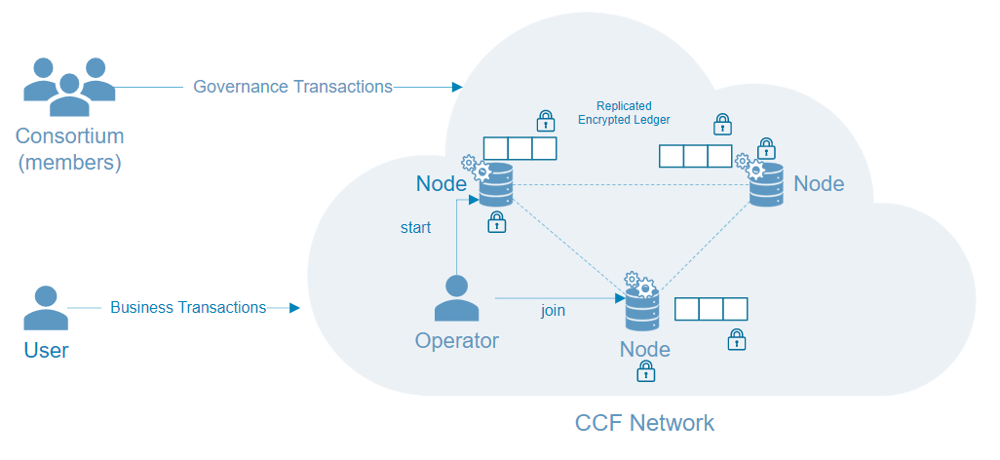

# Common scenarios for Azure confidential computing

This article provides an overview of several common scenarios for Azure confidential computing. The recommendations in this article serve as a starting point as you develop your application using confidential computing services and frameworks. 

After reading this article, you'll be able to answer the following questions:

- What are some scenarios for Azure confidential computing?-
- What are the benefits of using Azure confidential computing for multi-party scenarios?
- What are the benefits of using Azure confidential computing on a blockchain network?

## Secure multi-party computation
Azure confidential computing lets you process data from multiple sources without exposing the input data to other parties. This type of secure computation enables many scenarios like: anti-money laundering, fraud-detection, and secure analysis of healthcare data.

Multiple sources can upload their data to one enclave in a virtual machine. One party tells the enclave to do computation or processing on the data. No parties (not even the one executing the analysis) can actually see other party's data that was uploaded into the enclave. 

In secure multi-party computing, encrypted data goes into the enclave, the enclave decrypts the data using a key, performs analysis, gets a result, and sends back an encrypted result that a party can decrypt with the designated key. 

**Protect data in use**: 
- Use a DCsv2-Series virtual machine (VM) on Azure with enabled Intel SGX support. These VMs are enabled with trusted execution environments (TEEs) that secure and isolate portions of your application data and code.
- Use an enclave aware SDK to create an enclave inside the virtual machine. Within the enclave, the data won't be exposed to any one, even the VM provider. The data in the enclave will be encrypted by hardware support.
    - For example, you can use the [OE SDK](https://github.com/openenclave/openenclave) for the server-side processing. 

**Protect data in transit** 
- Use attested TLS as a secured channel to guarantee the security of data in transit
- The client ensures  the data is only sent to the same server, which is protected by the enclave. 

**Protect data at rest**
- Use protected and secure data stores to ensure security of data while at rest 

### Anti-money laundering
In this secure multi-party computation example, multiple banks share data with each other without exposing personal data of their customers. Banks run agreed-upon analytics on the combined sensitive data set. The analytics on the aggregated data set can detect the movement of money by one user between multiple banks, without the banks accessing each other's data.

Through confidential computing, these financial institutions can increase fraud detection rates, address money laundering scenarios, reduce false positives, and continue learning from larger data sets. 

### Drug development in healthcare
Partnered health facilities contribute private health data sets to train an ML model. Each facility can only see their own data set. No other facility or even the cloud provider, can see the data or training model. 

All facilities benefit from using the trained model. By creating the model with more data, the model became more accurate. Each facility that contributed to training the model can use it and receive useful results. 

## Blockchain

A blockchain network is a decentralized network of nodes. These nodes are run and maintained by operators or validators who wish to ensure integrity and reach consensus on the state of the network. The nodes themselves are replicas of ledgers and are used to track blockchain transactions. 
Each node has a full copy of the transaction history, ensuring integrity and availability in a distributed network.

Blockchain technologies built on top of confidential computing can use hardware-based privacy to enable data confidentiality and secure computations. In some cases, the entire ledger is encrypted to safeguard data access. Sometimes, the transaction itself can occur within a compute module inside the enclave within the node.

### Confidential Consortium Framework (CCF)
The [CCF](https://www.microsoft.com/research/project/confidential-consortium-framework/) is one example of a distributed blockchain framework built on top of Azure confidential computing. Spearheaded by Microsoft Research, this framework leverages the power of trusted execution environments (TEEs) to create a network of remote enclaves for attestation. Nodes can run on top of Azure virtual machines ([DCsv2-Series](confidential-computing-enclaves.md)) and take advantage of the enclave infrastructure. Through attestation protocols, users of the blockchain can verify the integrity of one CCF node, and effective verify the entire network. 

In the CCF, the decentralized ledger is made up of recorded changes to a Key-Value store that is replicated across all the network nodes. Each of these nodes runs a transaction engine that can be triggered by users of the blockchain over TLS. When you trigger an endpoint, you mutate the Key-Value store. Before the encrypted change is recorded to the decentralized ledger, it must be agreed upon by a certain number of nodes to reach consensus. 

## Next Steps
[Deploy](quick-create-marketplace.md) a DCsv2-Series virtual machine.

