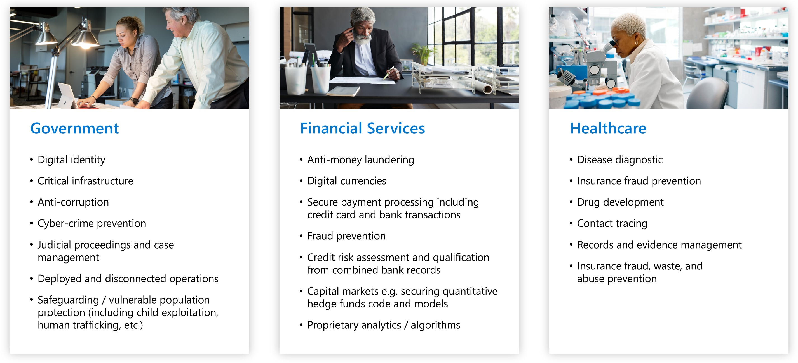
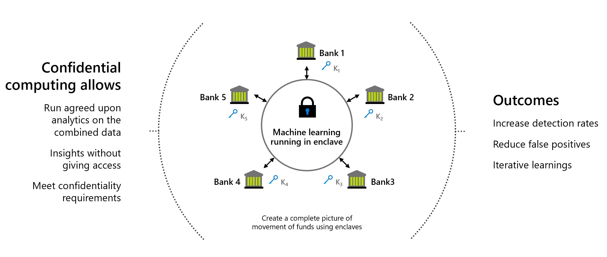
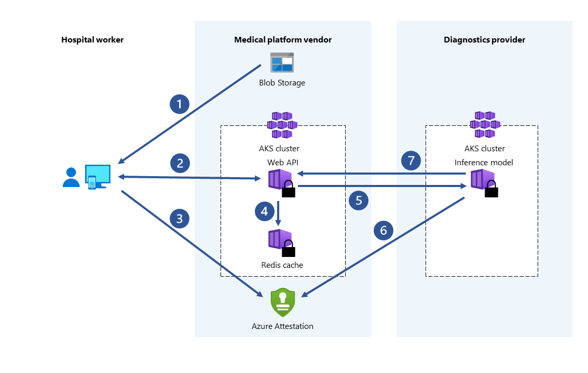
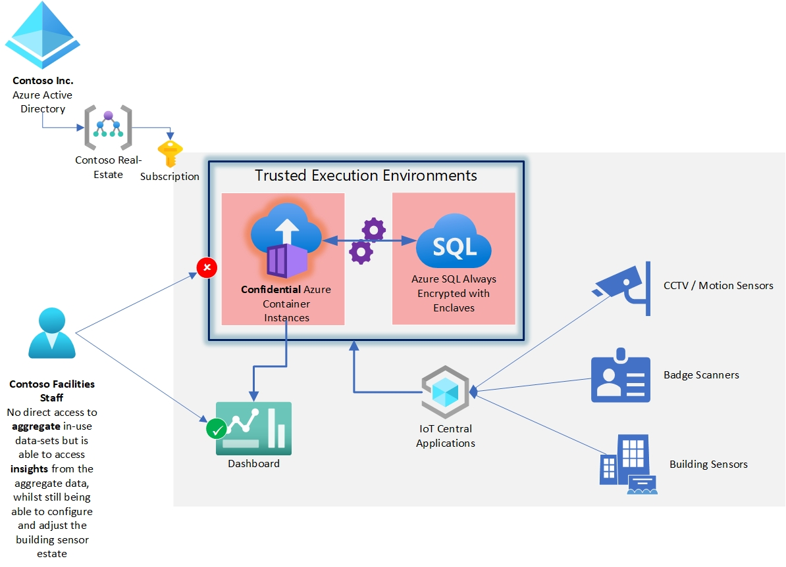
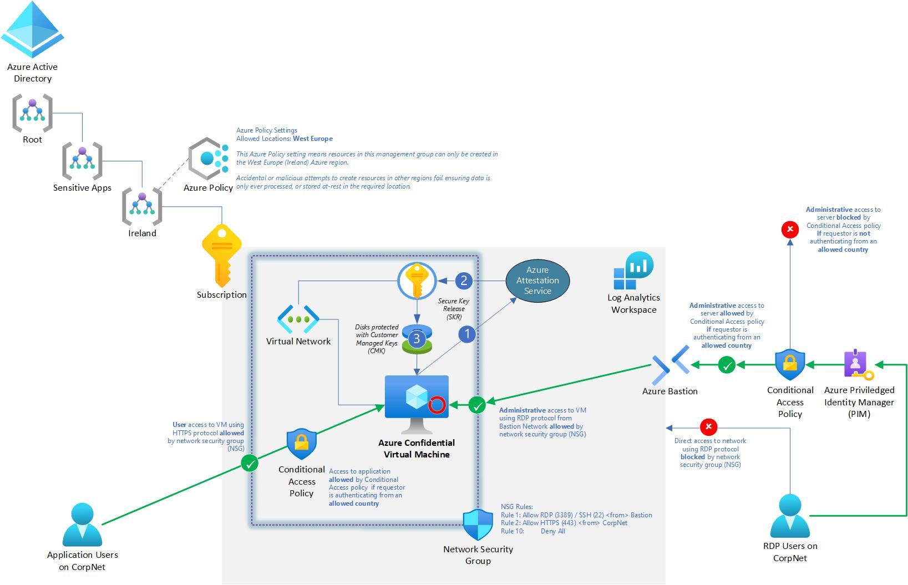
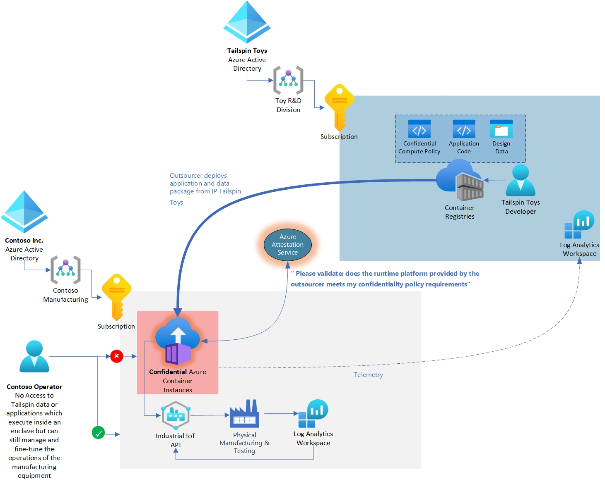

# Use cases and scenarios
Confidential computing applies to various use cases for protecting data in regulated industries such as government, financial services, and healthcare institutes. For example, preventing access to sensitive data helps protect the digital identity of citizens from all parties involved, including the cloud provider that stores it. The same sensitive data may contain biometric data that is used for finding and removing known images of child exploitation, preventing human trafficking, and aiding digital forensics investigations.

This article provides an overview of several common scenarios for Azure confidential computing. The recommendations in this article serve as a starting point as you develop your application using confidential computing services and frameworks.

After reading this article, you'll be able to answer the following questions:

- What are some scenarios for Azure confidential computing?
- What are the benefits of using Azure confidential computing for multi-party scenarios, enhanced customer data privacy, and blockchain networks?

## Secure multi-party computation

Business transactions and project collaboration require sharing information amongst multiple parties. Often, the data being shared is confidential. The data may be personal information, financial records, medical records, private citizen data, etc. Public and private organizations require their data be protected from unauthorized access. Sometimes these organizations even want to protect data from computing infrastructure operators or engineers, security architects, business consultants, and data scientists.

For example, using machine learning for healthcare services has grown massively as we've obtained access to larger datasets and imagery of patients captured by medical devices. Disease diagnostic and drug development benefit from multiple data sources. Hospitals and health institutes can collaborate by sharing their patient medical records with a centralized trusted execution environment (TEE). Machine learning services running in the TEE aggregate and analyze data. This aggregated data analysis can provide higher prediction accuracy due to training models on consolidated datasets. With confidential computing, the hospitals can minimize risks of compromising the privacy of their patients.

Azure confidential computing lets you process data from multiple sources without exposing the input data to other parties. This type of secure computation enables scenarios such as anti-money laundering, fraud-detection, and secure analysis of healthcare data.

Multiple sources can upload their data to one enclave in a virtual machine. One party tells the enclave to perform computation or processing on the data. No parties (not even the one executing the analysis) can see another party's data that was uploaded into the enclave.

In secure multi-party computing, encrypted data goes into the enclave. The enclave decrypts the data using a key, performs analysis, gets a result, and sends back an encrypted result that a party can decrypt with the designated key.

### Anti-money laundering

In this secure multi-party computation example, multiple banks share data with each other without exposing personal data of their customers. Banks run agreed-upon analytics on the combined sensitive data set. The analytics on the aggregated data set can detect the movement of money by one user between multiple banks, without the banks accessing each other's data.

Through confidential computing, these financial institutions can increase fraud detection rates, address money laundering scenarios, reduce false positives, and continue learning from larger data sets.

### Drug development in healthcare

Partnered health facilities contribute private health data sets to train an ML model. Each facility can only see their own data set. No other facility or even the cloud provider, can see the data or training model. All facilities benefit from using the trained model. By creating the model with more data, the model became more accurate. Each facility that contributed to training the model can use it and receive useful results.

### Protecting privacy with IoT and smart-building solutions

Many countries/regions have strict privacy laws about gathering and using data on people’s presence and movements inside buildings. This may include data that is directly personally identifiable data from CCTV or security badge scans. Or, indirectly identifiable where different sets of sensor data could be considered personally identifiable when grouped together.

Privacy needs to be balanced with cost & environmental needs where organizations are keen to understand occupancy/movement in-order to provide the most efficient use of energy to heat and light a building.

Determining which areas of corporate real-estate are under or over-occupied by staff from individual departments typically requires processing some personally identifiable data alongside less individual data like temperature and light sensors.

In this use-case the primary goal is allowing analysis of occupancy data and temperature sensors to be processed alongside CCTV motion tracing sensors and badge-swipe data to understand usage without exposing the raw aggregate data to anyone.

Confidential compute is used here by placing the analysis application (in this example running on Confidential Container Instances) inside a trusted execution environment where the in-use data is protected by encryption.

The aggregate data-sets from many types of sensor and data feed are managed in an Azure SQL Always Encrypted with Enclaves database, this protects in-use queries by encrypting them in-memory. This prevents a server administrator from being able to access the aggregate data set while it is being queried and analyzed.

## Legal or jurisdictional requirements

Commonly applicable to FSI and healthcare where there are legal or regulatory requirements that limit where certain workloads can be processed and be stored at-rest.

In this use-case we use a combination of Azure Confidential Compute technologies with Azure Policy, Network Security Groups (NSGs) and Azure Active Directory Conditional Access to ensure that the following protection goals are met for the ‘lift & shift’ of an existing application:

- Application is protected from the cloud operator whilst in-use using Confidential Compute
- Application resources can only be deployed in the West Europe Azure region
- Consumers of the application authenticating with modern authentication protocols can be mapped to the sovereign region they're connecting from, and denied access unless they are in an allowed region.
- Access using administrative protocols (RDP, SSH etc.) is limited to access from the Azure Bastion service that is integrated with Privileged Identity Management (PIM). The PIM policy requires a Conditional Access Policy that validates which sovereign region the administrator is accessing from.
- All services log actions to Azure Monitor.

## Manufacturing – IP Protection

Manufacturing organizations protect the IP around their manufacturing processes and technologies, often manufacturing is outsourced to third parties who deal with the physical production processes, which could be considered ‘hostile’ environments where there are active threats to steal that IP.

In this example Tailspin Toys are developing a new toy-line, the specific dimensions and innovative designs of their toys are company proprietary and they want to keep them safe, whilst being flexible over which company they choose to physically produce their prototypes.

Contoso, a high-quality 3D printing and testing company provide the systems that physically print prototypes at large-scale and run them through safety tests required for safety approvals. 

Contoso deploy customer managed containerized applications and data within the Contoso tenant, which uses their 3D printing machinery via an IoT-type API.

Contoso use the telemetry from the physical manufacturing systems to drive their billing, scheduling and materials ordering systems whilst Tailspin Toys use telemetry from their application suite to determine how successfully their toys can be manufactured and defect rates.

Contoso operators are able to load the Tailspin Toys application suite into the Contoso tenant using the provided container images over the Internet. 

Tailspin Toys configuration policy mandates deployment on Confidential Compute enabled hardware so that all Tailspin application servers and databases are protected whilst in-use from Contoso administrators even though they are running in the Contoso tenant.

If, for example a rogue admin at Contoso tries moving the Tailspin Toys provided containers to general x86 compute hardware that isn't able to provide a Trusted Execution Environment, it could mean potential exposure of confidential IP.

In this case, the Azure Container Instance policy engine would refuse to release the decryption keys or start containers if the attestation call reveals that the policy requirements aren't able to be met, ensuring Tailspin Toys IP is protected in-use and at-rest.

The Tailspin Toys application itself is coded to periodically make a call to the attestation service and report the results back to Tailspin Toys over the Internet to ensure there's a continual heartbeat of security status. 

The attestation service returns cryptographically signed details from the hardware supporting the Contoso tenant to validate that the workload is running inside a confidential enclave as expected, the attestation is outside the control of the Contoso administrators and is based on the hardware root of trust that Confidential Compute provides.

## Enhanced customer data privacy

Despite the security level provided by Microsoft Azure is quickly becoming one of the top drivers for cloud computing adoption, customers trust their provider to different extents. Customer asks for:

- Minimal hardware, software, and operational TCBs (trusted computing bases) for sensitive workloads.
- Technical enforcement, rather than just business policies and processes.
- Transparency about the guarantees, residual risks, and mitigations that they get.

Confidential computing goes in this direction by allowing customers incremental control over the TCB used to run their cloud workloads. Azure confidential computing allows customers to precisely define all the hardware and software that have access to their workloads (data and code), and it provides the technical mechanisms to verifiably enforce this guarantee. In short, customers retain full control over their secrets.

### Data sovereignty

In Government and public agencies, Azure confidential computing is a solution to raise the degree of trust towards the ability to protect data sovereignty in the public cloud. Moreover, thanks to the increasing adoption of confidential computing capabilities into PaaS services in Azure, a higher degree of trust can be achieved with a reduced impact to the innovation ability provided by public cloud services. This combination of protecting data sovereignty with a reduced impact to the innovation ability makes Azure confidential computing a very effective response to the needs of sovereignty and digital transformation of Government services.

### Reduced chain of trust

Enormous investment and revolutionary innovation in confidential computing has enabled the removal of the cloud service provider from the trust chain to an unprecedented degree. Azure confidential computing delivers the highest level of sovereignty available in the market today. This allows customer and governments to meet their sovereignty needs today and still leverage innovation tomorrow.

Confidential computing can expand the number of workloads eligible for public cloud deployment. This can result in a rapid adoption of public services for migrations and new workloads, rapidly improving the security posture of customers, and quickly enabling innovative scenarios.

### BYOK (Bring Your Own Key) scenarios

The adoption of hardware secure modules (HSM) enables secure transfer of keys and certificates to a protected cloud storage - [Azure Key Vault Managed HSM](../key-vault/managed-hsm/overview.md) – without allowing the cloud service provider to access such sensitive information. Secrets being transferred never exist outside an HSM in plaintext form, enabling scenarios for sovereignty of keys and certificates that are client generated and managed, but still using a cloud-based secure storage.

## Secure blockchain

A blockchain network is a decentralized network of nodes. These nodes are run and maintained by operators or validators who wish to ensure integrity and reach consensus on the state of the network. The nodes themselves are replicas of ledgers and are used to track blockchain transactions. Each node has a full copy of the transaction history, ensuring integrity and availability in a distributed network.

Blockchain technologies built on top of confidential computing can use hardware-based privacy to enable data confidentiality and secure computations. In some cases, the entire ledger is encrypted to safeguard data access. Sometimes, the transaction itself can occur within a compute module inside the enclave within the node.
