# Connect to Microsoft Dataverse (previously Common Data Service) from workflows in Azure Logic Apps

[!INCLUDE [logic-apps-sku-consumption-standard](../../includes/logic-apps-sku-consumption-standard.md)]

> [!IMPORTANT]
>
> On August 30, 2022, the connector operations for Common Data Service 2.0, also known as Microsoft Dataverse 
> (Legacy), migrate to the current Microsoft Dataverse connector. Legacy operations bear the "legacy" label, 
> while current operations bear the "preview" label. You can use the current Dataverse connector in any 
> existing or new logic app workflows. For backward compatibility, existing workflows continue to work 
> with the legacy Dataverse connector. However, make sure to review these workflows, and update them promptly.
>
> Starting October 2023, the legacy version becomes unavailable for new workflows. Existing workflows continue 
> to work, but you *must* use the current Dataverse connector for new workflows. At that time, a timeline for the shutdown date for the legacy actions and triggers will be announced.
>
> Since November 2020, the Common Data Service connector was renamed Microsoft Dataverse (Legacy).

You can create and run automated workflows that manage rows in your [Microsoft Dataverse database, formerly Common Data Service database](/powerapps/maker/common-data-service/data-platform-intro) by using [Azure Logic Apps](../logic-apps/logic-apps-overview.md) and the [Microsoft Dataverse connector](/connectors/commondataserviceforapps/). These workflows can create rows, update rows, and perform other operations. You can also get information from your Dataverse database and make the output available for other actions to use in your workflows. For example, when a row is added, updated, or deleted in your Dataverse database, you can send an email by using the Office 365 Outlook connector.

This article shows how you can create a logic app workflow that creates a task row whenever a new lead row is created.

## Connector reference

For technical information based on the connector's Swagger description, such as operations, limits, and other details, review the [managed connector reference page](/connectors/commondataserviceforapps/).

## Prerequisites

* An Azure account and subscription. If you don't have an Azure subscription, [sign up for a free Azure account](https://azure.microsoft.com/free/?WT.mc_id=A261C142F).

* A [Dataverse Data Service environment and database](/power-platform/admin/environments-overview), which is a space where your organization stores, manages, and shares business data in a Dataverse database. For more information, review the following resources:

  * [Learn: Create and manage Dataverse environments](/training/modules/create-manage-environments/)

  * [Power Platform - Environments overview](/power-platform/admin/environments-overview)

* Basic knowledge about how to create either Consumption or Standard logic app workflows and the logic app from where you want to access the rows in your Dataverse database. To start your logic app with a Common Data Service trigger, you need a blank workflow. For more information, review the following resources:

  * [Create an example Consumption logic app workflow](../logic-apps/quickstart-create-example-consumption-workflow.md)

  * [Create an example Standard logic app workflow](../logic-apps/create-single-tenant-workflows-azure-portal.md)

## Add a Dataverse trigger

[!INCLUDE [Create connection general intro](../../includes/connectors-create-connection-general-intro.md)]

This example uses the Dataverse trigger that starts your workflow when a row is added, updated, or deleted.

> [!NOTE]
> The Dataverse connector has operation-specific parameters and database-specific parameters. For example, 
> when you select a table, the parameters available for that table vary and differ from other tables.

### [Consumption](#tab/consumption)

1. In the [Azure portal](https://portal.azure.com), open your logic app workflow in the designer.

1. On the designer, under the search box, select **All**. In the search box, enter **dataverse**.

1. From the triggers list, select the trigger named **When a row is added, modified or deleted**.

   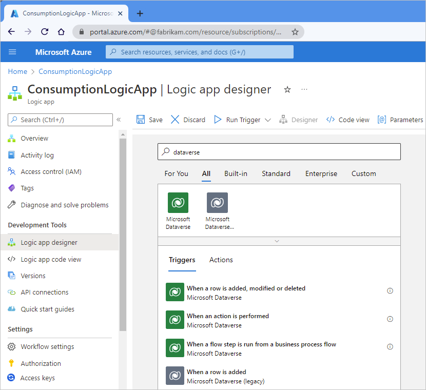

1. If necessary, sign in to your Dataverse environment or database. In the trigger information box, provide the necessary values. For the example trigger, review [When a row is added, modified or deleted](/connectors/commondataserviceforapps/#when-a-row-is-added,-modified-or-deleted).

   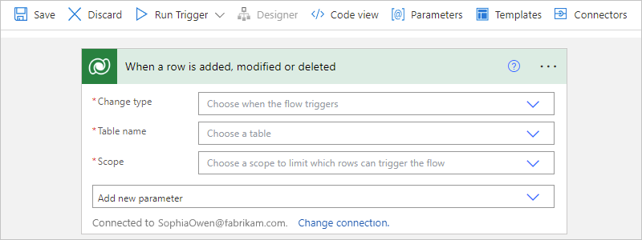

1. When you're done, save your logic app workflow. On the designer toolbar, select **Save**.

1. Now add at least one action for your workflow to perform when the trigger fires. For example, you can add a Dataverse action or an action that sends email based on the outputs from the trigger.

### [Standard](#tab/standard)

1. In the [Azure portal](https://portal.azure.com), open your logic app workflow in the designer.

1. On the designer, select **Choose an operation**. In the **Add a trigger** pane that opens, under the search box, select **Azure**.

1. In the search box, enter **dataverse**. From the triggers list, select the trigger named **When a row is added, modified or deleted**.

   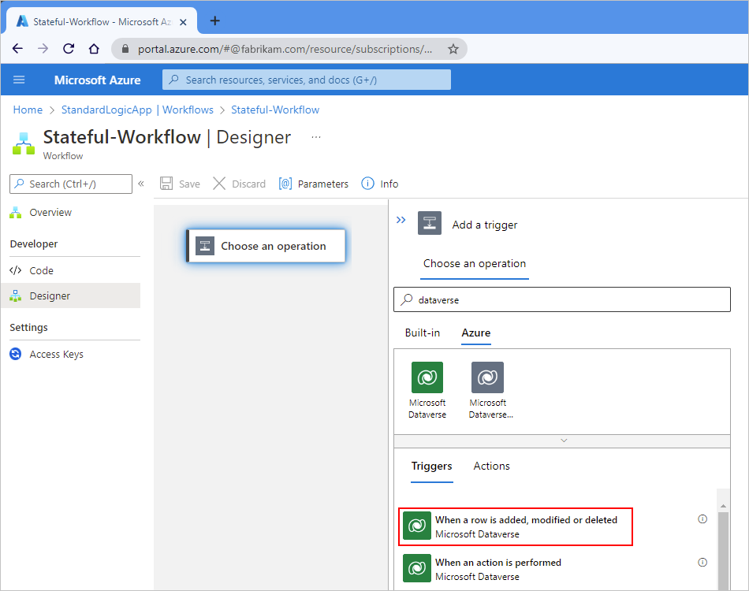

1. If necessary, sign in to your Dataverse environment or database. In the trigger information box, provide the necessary values. For the example trigger, review [When a row is added, modified or deleted](/connectors/commondataserviceforapps/#when-a-row-is-added,-modified-or-deleted).

   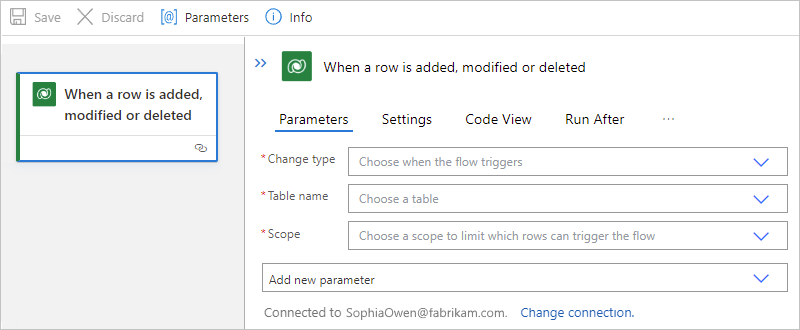

1. When you're done, save your logic app workflow. On the designer toolbar, select **Save**.

1. Now add at least one action for your workflow to perform when the trigger fires. For example, you can add a Dataverse action or an action that sends email based on the outputs from the trigger.

---

## Add a Dataverse action

[!INCLUDE [Create connection general intro](../../includes/connectors-create-connection-general-intro.md)]

This example uses the Dataverse action that adds a new row to your database.

> [!NOTE]
> The Dataverse connector has operation-specific parameters and database-specific parameters. For example, 
> when you select a table, the parameters available for that table vary and differ from other tables.

### [Consumption](#tab/consumption)

1. Under the **When a row is added, modified or deleted** trigger, select **New step**.

1. On the designer, under the search box, select **All**. In the search box, enter **dataverse**.

1. From the actions list, select the action named **Add a new row**.

   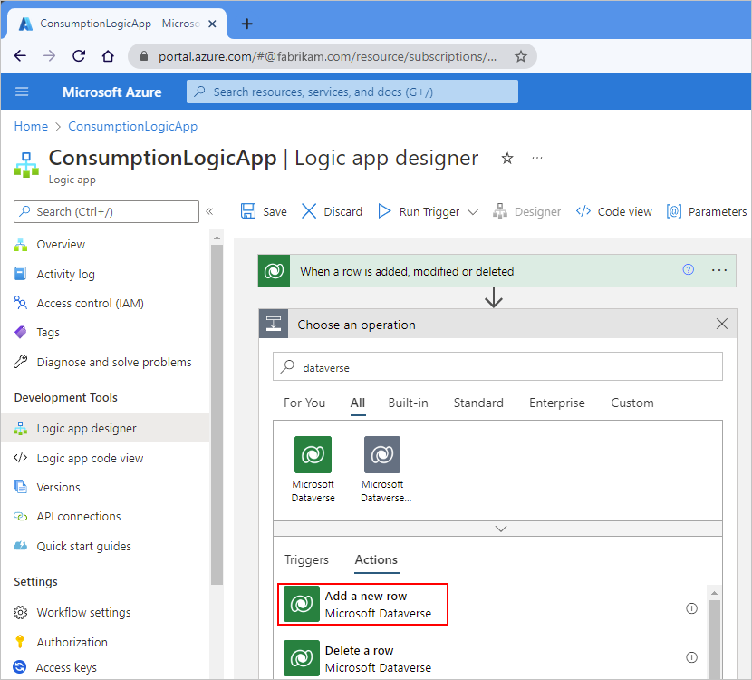

1. If necessary, sign in to your Dataverse environment or database. In the action information box, provide the necessary values. For the example action, review [Add a new row](/connectors/commondataserviceforapps/#add-a-new-row).

   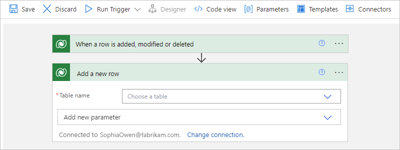

1. When you're done, save your logic app workflow. On the designer toolbar, select **Save**.

1. Continue adding more actions, if you want.

### [Standard](#tab/standard)

1. On the designer, under the previously added trigger or action, select **Add an action**, which is represented by a plus sign (**+**).

   The plus sign changes to the **Choose an operation** prompt, and the **Add an action** pane opens.

1. In the **Add an action** pane, under the search box, select **Azure**. In the search box, enter **dataverse**.

1. From the actions list, select the action named **Add a new row**.

   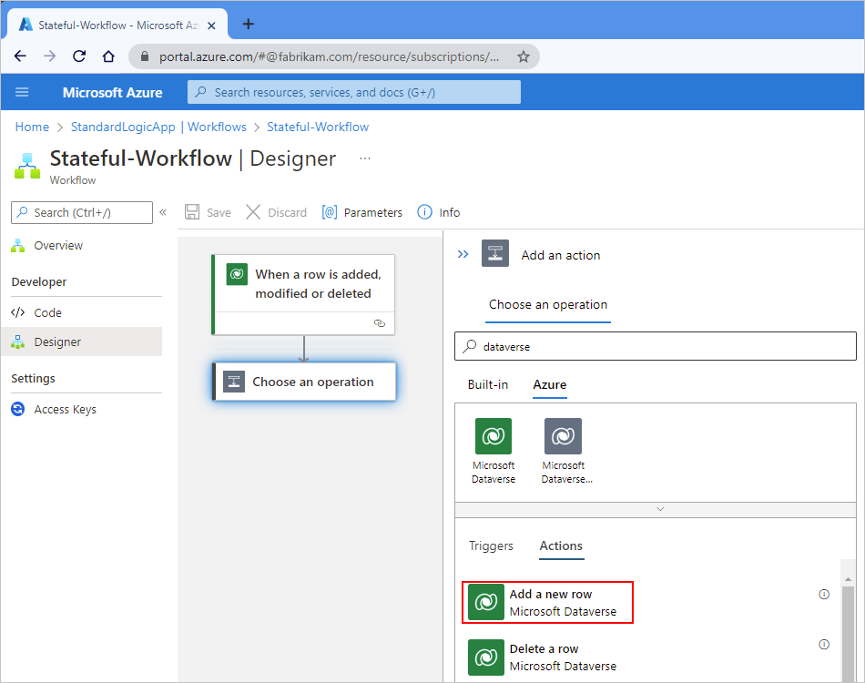

1. If necessary, sign in to your Dataverse environment or database. In the action information box, provide the necessary values. For the example action, review [Add a new row](/connectors/commondataserviceforapps/#add-a-new-row).

   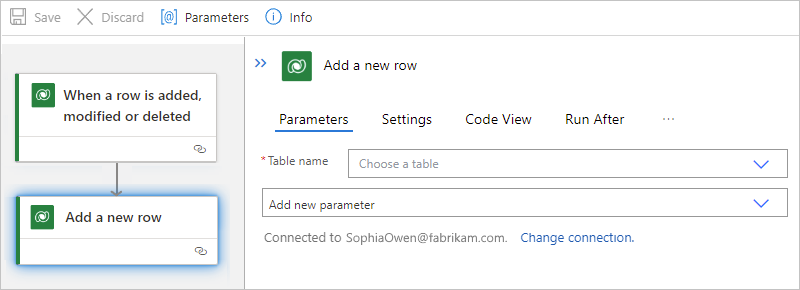

1. When you're done, save your logic app workflow. On the designer toolbar, select **Save**.

1. Continue adding more actions, if you want.

---

## Test your workflow

To test and trigger the workflow, follow these steps:

1. On the designer toolbar, select **Run Trigger** > **Run**.

1. Reproduce the conditions that the trigger requires for your workflow to run.

## Return rows based on a filter

For actions that return rows, such as the **List rows** action, you can use an ODATA query that returns rows based on the specified filter. For example, you can set up the action to return only rows for active accounts. For more information about the example action, review [List rows](/connectors/commondataserviceforapps/#list-rows).

### [Consumption](#tab/consumption)

1. On the designer, in the action, open the **Add new parameter** list, and select the **Filter rows** property.

   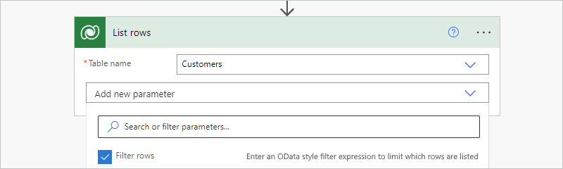

1. In the **Filter rows** property that now appears in the action, enter an ODATA query expression, for example:

   `statuscode eq 1`

   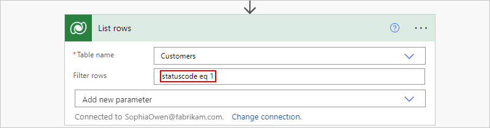

For more information about `$filter` system query options, review [Query data using the Web API - Filter results](/power-apps/developer/data-platform/webapi/query-data-web-api#filter-results).

### [Standard](#tab/standard)

1. On the designer, in the action, open the **Add new parameter** list, and select the **Filter rows** property.

   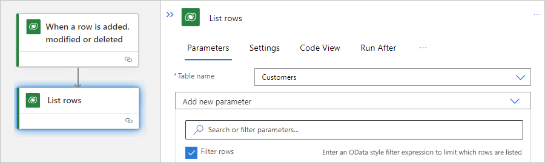

1. In the **Filter rows** property that now appears in the action, enter an ODATA query expression, for example:

   `statuscode eq 1`

   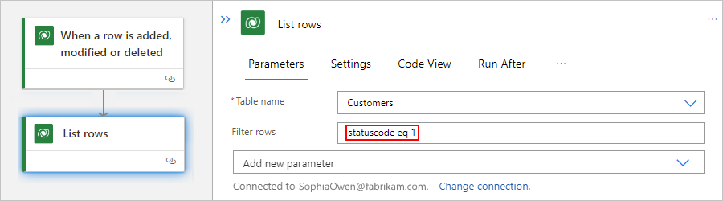

For more information about `$filter` system query options, review [Query data using the Web API - Filter results](/power-apps/developer/data-platform/webapi/query-data-web-api#filter-results).

---

## Return rows based on a sort order

For actions that return rows, such as the **List rows** action, you can use an ODATA query that returns rows in a specific sequence, which varies based on the rows that the action returns. For example, you can set up the action to return rows organized by the account name. For more information about the example action, review [List rows](/connectors/commondataserviceforapps/#list-rows).

### [Consumption](#tab/consumption)

1. On the designer, in the action, open the **Add new parameter** list, and select the **Sort By** property.

   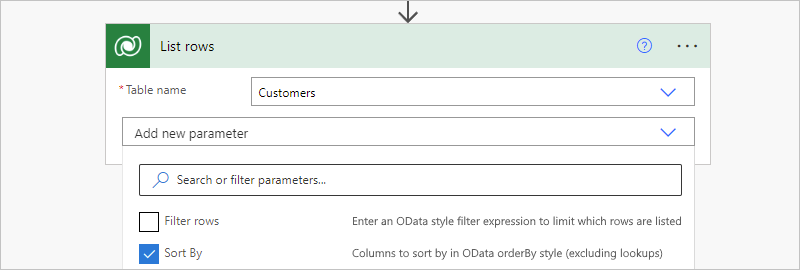

1. In the **Sort By** property that now appears in the action, enter the column name to use for sorting, for example, **name**:

   

For more information about `$orderby` system query options, review [Query data using the Web API - Sort By](/power-apps/developer/data-platform/webapi/query-data-web-api#sort-by).

### [Standard](#tab/standard)

1. On the designer, in the action, open the **Add new parameter** list, and select the **Sort By** property.

   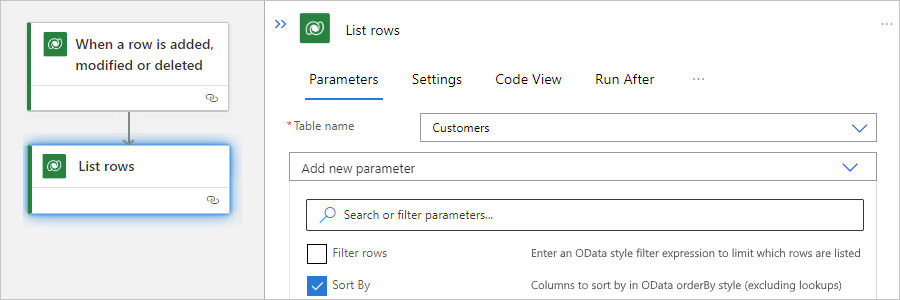

1. In the **Sort By** property that now appears in the action, enter the column name to use for sorting, for example, **name**:

   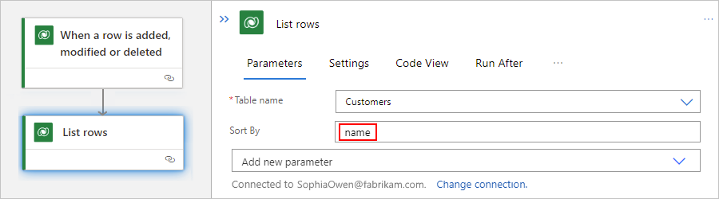

For more information about `$orderby` system query options, review [Query data using the Web API - Sort By](/power-apps/developer/data-platform/webapi/query-data-web-api#sort-by).

---

## Field data types

In a trigger or action, a field value's data type must match the field's required data type. This requirement applies whether you manually enter the value or select the value from the dynamic content list.

> [!NOTE]
> The Dataverse connector has operation-specific parameters and database-specific parameters. For example, 
> when you select a table, the parameters available for that table vary and differ from other tables.

For example, suppose that you have a table named **Tasks**. This table has fields that apply only to that table, while other tables have their own fields. For the example **Tasks** table, the following table describes some sample field types and the data types that those fields require for their values.

| Field | Data type | Description |
|-------|-----------|-------------|
| Text field | Single line of text | Requires either a single line of text or dynamic content that has the text data type, for example, these properties:   - **Description**  - **Category** |
| Integer field | Whole number | Requires either an integer or dynamic content that has the integer data type, for example, these properties:   - **Percent Complete**  - **Duration** |
| Date field | Date and Time | Requires either a date in MM/DD/YYY format or dynamic content that has the date data type, for example, these properties:   - **Created On**  - **Start Date**  - **Actual Start**  - **Actual End**  - **Due Date** |
| Field that references another entity row | Primary key | Requires both a row ID, such as a GUID, and a lookup type, which means that values from the dynamic content list won't work, for example, these properties:   - **Owner**: Must be a valid user ID or a team row ID.  - **Owner Type**: Must be a lookup type such as `systemusers` or `teams`, respectively.   - **Regarding**: Must be a valid row ID such as an account ID or a contact row ID.  - **Regarding Type**: Must be a lookup type such as `accounts` or `contacts`, respectively.   - **Customer**: Must be a valid row ID such as an account ID or contact row ID.  - **Customer Type**: Must be the lookup type, such as `accounts` or `contacts`, respectively. |
||||

For the example **Tasks** table, suppose you use the **Add a new row** action to create a new row that's associated with other entity rows, specifically a user row and an account row. So, in this action, you must specify the IDs and lookup types for those entity rows by using values that match the expected data types for the relevant properties.

* Based on the **Owner** property, which specifies a user ID, and the **Owner Type** property, which specifies the `systemusers` lookup type, the action associates the new row with a specific user.

* Based on the **Regarding** property, which specifies a row ID, and the **Regarding Type** property, which specifies the `accounts` lookup type, the action associates the new row with a specific account.

### [Consumption](#tab/consumption)

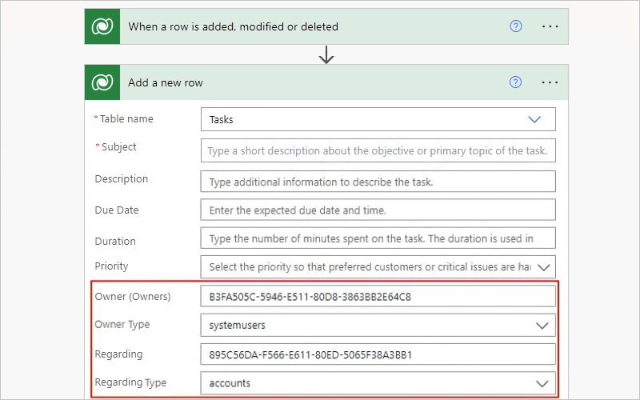

### [Standard](#tab/standard)

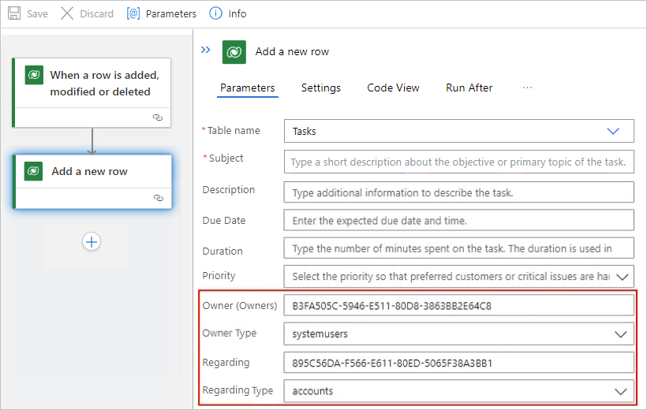

---

## Troubleshooting problems

### Calls from multiple environments

The Dataverse connector stores information about the logic app workflows that get and require notifications about database entity changes by using the `callbackregistrations` entity in your Dataverse database. If you copy a Dataverse organization, any webhooks are copied too. If you copy your organization before you disable workflows that are mapped to your organization, any copied webhooks also point at the same logic app workflows, which then get notifications from multiple organizations.

To stop unwanted notifications, delete the `callbackregistrations` entity from the organization that sends those notifications by following these steps:

1. Identify and sign in to the Dataverse organization from where you want to remove notifications.

1. In the Chrome browser, find the callback registration that you want to delete.

   1. Review the generic list for all the callback registrations at the following OData URI so that you can view the data inside the `callbackregistrations` entity:

      `https://{organization-name}.crm{instance-number}.dynamics.com/api/data/v9.0/callbackregistrations`:

      > [!NOTE]
      > If no values are returned, you might not have permissions to view this entity type, 
      > or you might not have signed in to the correct organization.

   1. Filter on the triggering entity's logical name `entityname` and the notification event that matches your logic app workflow (message). Each event type is mapped to the message integer as follows:

      | Event type | Message integer |
      |------------|-----------------|
      | Create | 1 |
      | Delete | 2 |
      | Update | 3 |
      | CreateOrUpdate | 4 |
      | CreateOrDelete | 5 |
      | UpdateOrDelete | 6 |
      | CreateOrUpdateOrDelete | 7 |
      |||

      The following example shows how you can filter for `Create` notifications on an entity named `nov_validation` by using the following OData URI for a sample organization:

      `https://fabrikam-preprod.crm1.dynamics.com/api/data/v9.0/callbackregistrations?$filter=entityname eq 'nov_validation' and message eq 1`

      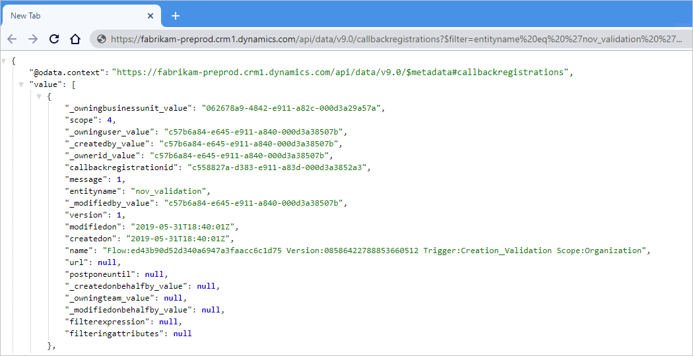

      > [!NOTE]
      >
      > If multiple triggers exist for the same entity or event, you can filter the list by using additional filters such as 
      > the `createdon` and `_owninguser_value` attributes. The owner user's name appears under `/api/data/v9.0/systemusers({id})`.

   1. After you find the ID for the callback registration that you want to delete, follow these steps:
   
      1. In your Chrome browser, open the Chrome Developer Tools (Keyboard: F12).

      1. In the window, at the top, select the **Console** tab.

      1. On the command-line prompt, enter this command, which sends a request to delete the specified callback registration:

         `fetch('http://{organization-name}.crm{instance-number}.dynamics.com/api/data/v9.0/callbackregistrations({ID-to-delete})', { method: 'DELETE'})`

         > [!IMPORTANT]
         > Make sure that you make the request from a non-Unified Client Interface (UCI) page, for example, from the 
         > OData or API response page itself. Otherwise, logic in the app.js file might interfere with this operation.

   1. To confirm that the callback registration no longer exists, check the callback registrations list.

## Next steps

* [Managed connectors for Azure Logic Apps](managed.md)
* [Built-in connectors for Azure Logic Apps](built-in.md)
* [What are connectors in Azure Logic Apps](introduction.md)
