# Create and manage records in Common Data Service by using Azure Logic Apps

With [Azure Logic Apps](../logic-apps/logic-apps-overview.md) and the [Common Data Service connector](https://docs.microsoft.com/connectors/commondataservice/), you can build automated workflows that manage records in your [Common Data Service](https://docs.microsoft.com/powerapps/maker/common-data-service/data-platform-intro) database. These workflows can create records, update records, and perform other operations. You can also get information from your Common Data Service database and make the output available for other actions to use in your logic app. For example, when a record is updated in your Common Data Service database, you can send an email by using the Office 365 Outlook connector.

This article shows how you can build a logic app that creates a task record whenever a new lead record is created.

## Prerequisites

* An Azure subscription. If you don't have an Azure subscription, [sign up for a free Azure account](https://azure.microsoft.com/free/).

* A [Common Data Service environment](https://docs.microsoft.com/power-platform/admin/environments-overview), which is a space where your organization stores, manages, and shares business data and a Common Data Service database. For more information, see these resources:

  * [Learn: Get started with Common Data Service](https://docs.microsoft.com/learn/modules/get-started-with-powerapps-common-data-service/)
  * [Power Platform - Environments overview](https://docs.microsoft.com/power-platform/admin/environments-overview)

* Basic knowledge about [how to create logic apps](../logic-apps/quickstart-create-first-logic-app-workflow.md) and the logic app from where you want to access the records in your Common Data Service database. To start your logic app with a Common Data Service trigger, you need a blank logic app. If you're new to Azure Logic Apps, review [Quickstart: Create your first workflow by using Azure Logic Apps](../logic-apps/quickstart-create-first-logic-app-workflow.md).

## Add Common Data Service trigger

[!INCLUDE [Create connection general intro](../../includes/connectors-create-connection-general-intro.md)]

For this example, add the Common Data Service trigger that fires when a new record is created.

1. In the [Azure portal](https://portal.azure.com), open your blank logic app in Logic App Designer, if not open already.

1. In the search box, enter `common data service`. For this example, under the triggers list, select this trigger: **When a record is created**

   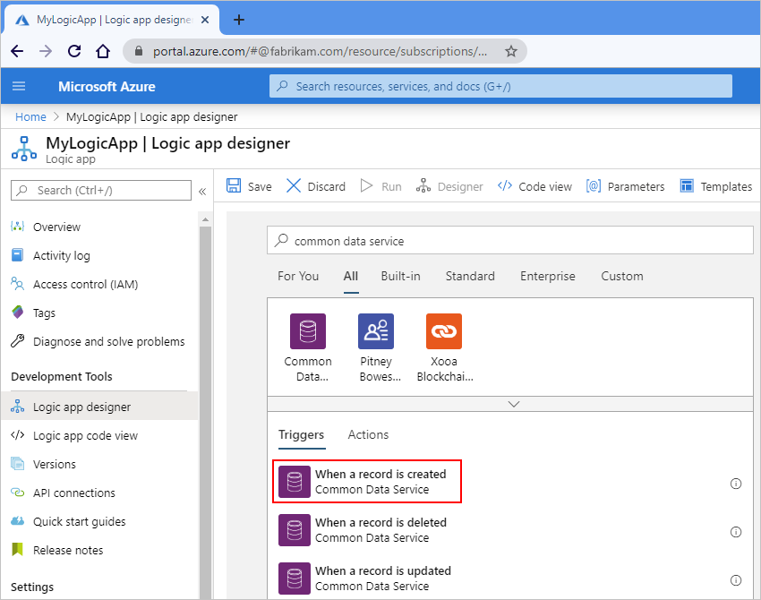

1. If prompted, sign in to the Common Data Service.

1. In the trigger, provide information about the environment where you want to monitor for new "Leads" records, for example:

   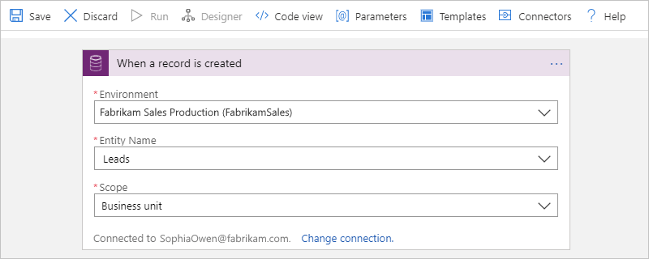

   | Property | Required | Description |
   |----------|----------|-------------|
   | **Environment** | Yes | The environment to monitor, for example, "Fabrikam Sales Production". For more information, see [Power Platform - Environments overview](https://docs.microsoft.com/power-platform/admin/environments-overview). |
   | **Entity Name** | Yes | The entity to monitor, for example, "Leads" |
   | **Scope** | Yes | The source that created the new record, for example, a user in your business unit or any user in your organization. This example uses "Business unit". |
   ||||

## Add Common Data Service action

Now add a Common Data Service action that creates a task record for a new "Leads" record.

1. Under the **When a record is created** trigger, select **New step**.

1. In the search box, enter `common data service`. From the actions list, select this action: **Create a new record**

   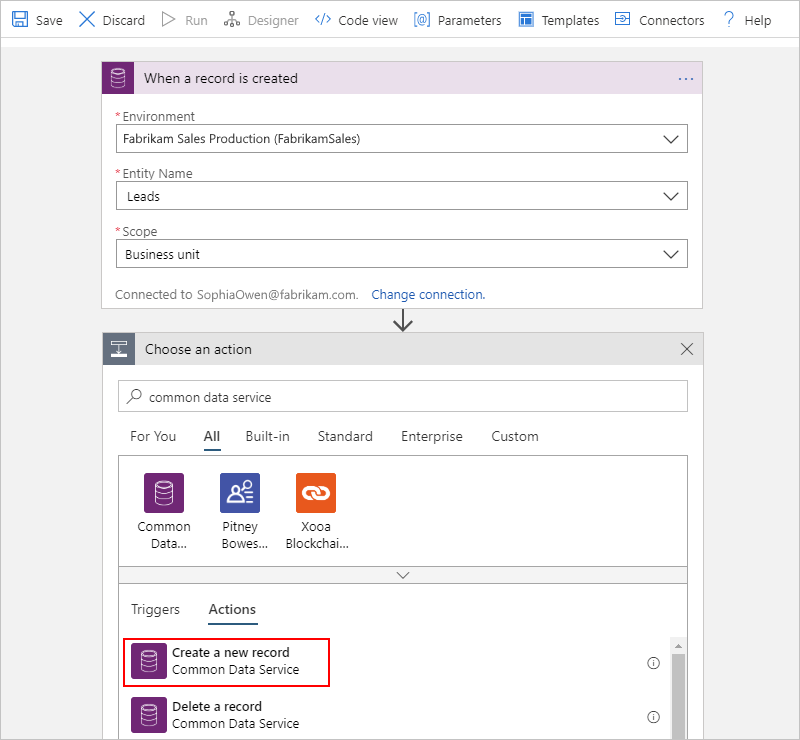

1. In the action, provide the information about the environment where you want to create the new task record. If available, other properties also appear based on the entity that you selected for this action, for example:

   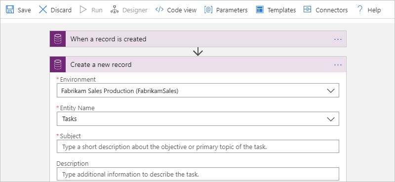

   | Property | Required | Description |
   |----------|----------|-------------|
   | **Organization Name** | Yes | The environment where you want to create the record, which doesn't have to be the same environment in your trigger, but is "Fabrikam Sales Production" in this example |
   | **Entity Name** | Yes | The entity where you want to create the record, for example, "Tasks" |
   | **Subject** | Yes, based on the entity selected in this example | A short description about the objective for this task |
   ||||

   1. For the **Subject** property, enter this text with a trailing space:

      `Follow up with new lead:`

   1. Keep your pointer inside the **Subject** box so that dynamic content list stays visible.
   
   1. In the list, from the **When a record is created** section, select the trigger outputs that you want to include in the task record, for example:

      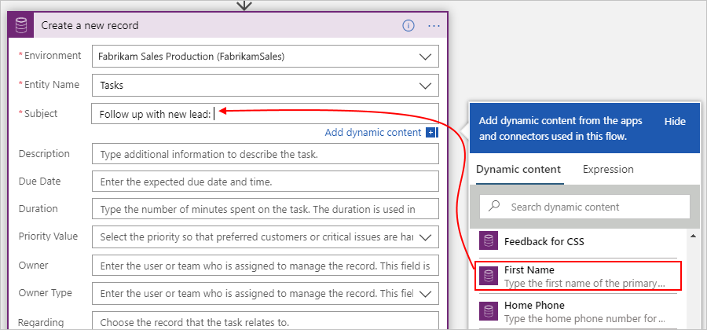

      | Trigger output | Description |
      |----------------|-------------|
      | **First Name** | The first name from the lead record to use as the primary contact in the task record |
      | **Last Name** | The last name from the lead record to use as the primary contact in the task record |
      | **Description** | Other outputs to include in the task record, such as email address and business phone number |
      |||

   When you're done, the action might look like this example:

   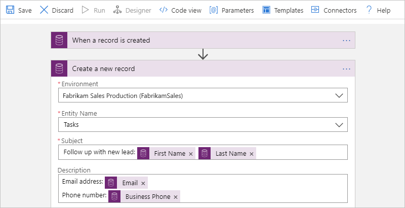

1. Save your logic app. On the designer toolbar, select **Save**.

1. To manually start the logic app, on the designer toolbar, select **Run**. To test your logic app, create a new "Leads" record.

## Trigger only on updated attributes

For triggers that run when records are updated, such as the **When a record is updated** action, you can use filter attributes so that your logic app runs only when the specified attributes are updated. This capability helps you prevent unnecessary logic app runs.

1. In the trigger, from the **Add new parameter** list, select **Attribute Filters**.

   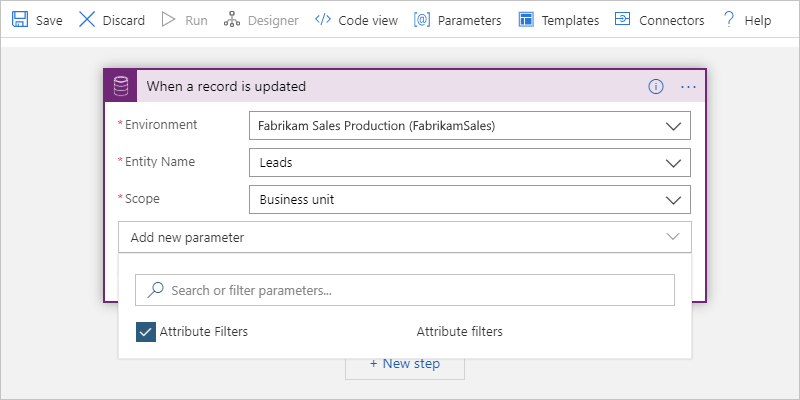

1. For each **Attribute Filters Item**, select the attribute that you want to monitor for updates, for example:

   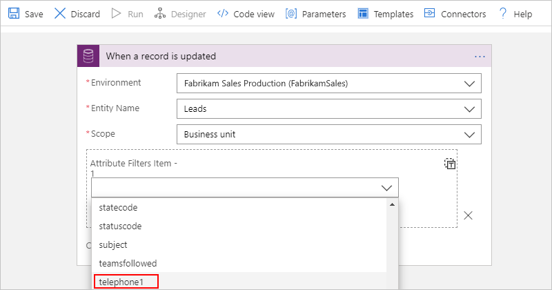

## List records based on a filter

For actions that return records, such as the **List records** action, you can use an ODATA query that returns records based on the specified filter. For example, you have the action list only the records for active accounts.

1. In the action, open the **Add new parameter** list, and select the **Filter Query** property.

   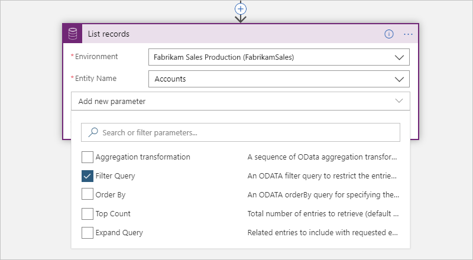

1. In the **Filter Query** property that now appears in the action, enter this ODATA filter query: `statuscode eq 1`

   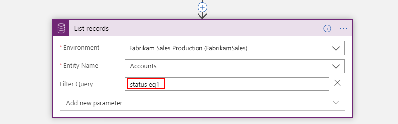

For more information about `$filter` system query options, see [Common Data Service - Filter results](https://docs.microsoft.com/powerapps/developer/common-data-service/webapi/query-data-web-api#filter-results).

## List records based on an order

For actions that return records, such as the **List records** action, you can use an ODATA query that returns records in a specified order, which varies based on the records that the action returns. For example, you can have the action list the records based on the account name.

1. In the action, open the **Add new parameter** list, and select the **Order By** property.

   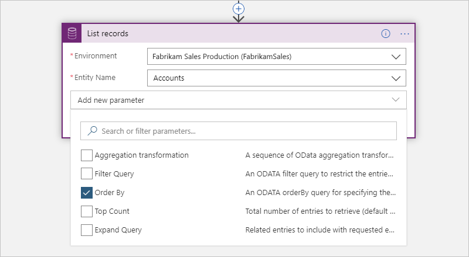

1. In the **Order By** property that now appears in the action, enter this ODATA filter query: `name`

   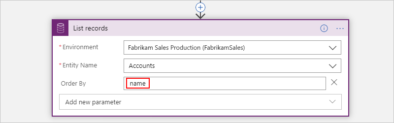

For more information about `$orderby` system query options, see [Common Data Service - Order results](https://docs.microsoft.com/powerapps/developer/common-data-service/webapi/query-data-web-api#order-results).

## Field data types

Regardless whether you manually enter a value or select a value from the dynamic content list for a field in a trigger or action, the value's data type must match the field's required data type.

This table describes some field types and the data types that those fields require for their values.

| Field | Data type | Description |
|-------|-----------|-------------|
| Text field | Single line of text | Requires either a single line of text or dynamic content that has the text data type, for example, these properties: 

- **Description**  - **Category** |
| Integer field | Whole number | Requires either an integer or dynamic content that has the integer data type, for example, these properties: 

- **Percent Complete**  - **Duration** |
| Date field | Date and Time | Requires either a date in MM/DD/YYY format or dynamic content that has the date data type, for example, these properties: 

- **Created On**  - **Start Date**  - **Actual Start**  - **Actual End**  - **Due Date** |
| Field that references another entity record | Primary key | Requires both a record ID, such as a GUID, and a lookup type, which means that values from the dynamic content list won't work, for example, these properties: 

- **Owner**: Must be a valid user ID or a team record ID.  - **Owner Type**: Must be a lookup type such as `systemusers` or `teams`, respectively. 

- **Regarding**: Must be a valid record ID such as an account ID or a contact record ID.  - **Regarding Type**: Must be a lookup type such as `accounts` or `contacts`, respectively. 

- **Customer**: Must be a valid record ID such as an account ID or contact record ID.  - **Customer Type**: Must be the lookup type, such as `accounts` or `contacts`, respectively. |
||||

This example shows how the **Create a new record** action creates a new "Tasks" record that's associated with other entity records, specifically a user record and an account record. The action specifies the IDs and lookup types for those entity records by using values that match the expected data types for the relevant properties.

* Based on the **Owner** property, which specifies a user ID, and the **Owner Type** property, which specifies the `systemusers` lookup type, the action associates the new "Tasks" record with a specific user.

* Based on the **Regarding** property, which specifies a record ID, and the **Regarding Type** property, which specifies the `accounts` lookup type, the action associates the new "Tasks" record with a specific account.

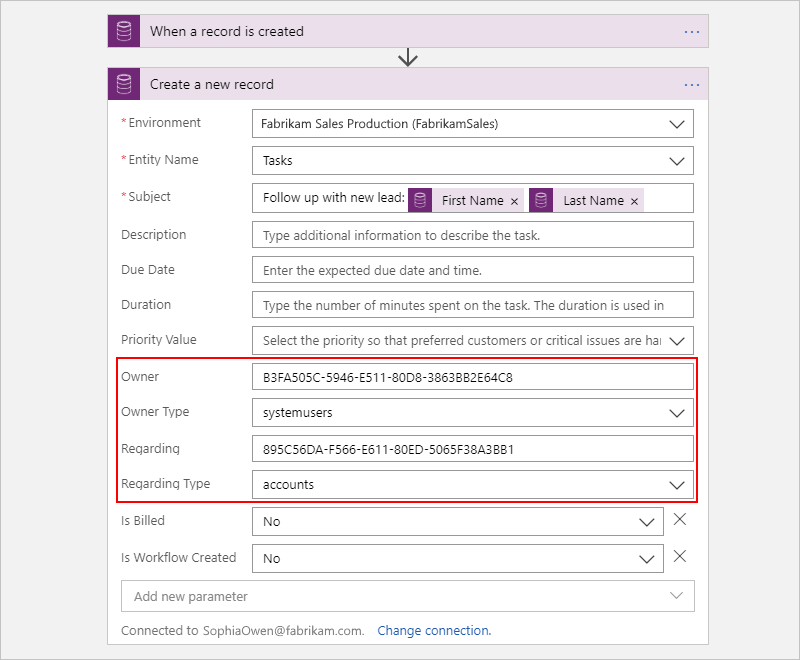

## Connector reference

For technical information based on the connector's Swagger description, such as triggers, actions, limits, and other details, see the [connector's reference page](https://docs.microsoft.com/connectors/commondataservice/).

## Next steps

* Learn about other [connectors for Azure Logic Apps](../connectors/apis-list.md)