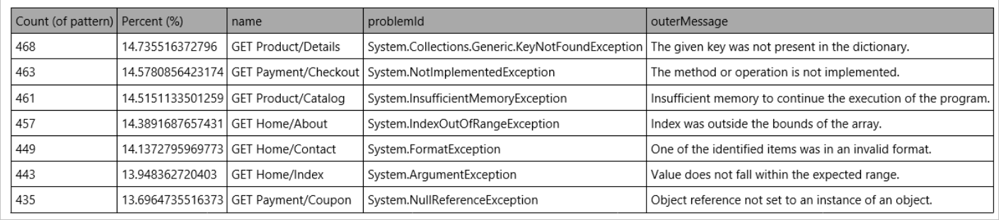

# Connect to Log Analytics or Application Insights from workflows in Azure Logic Apps

[!INCLUDE [logic-apps-sku-consumption](../../includes/logic-apps-sku-consumption.md)]

> [!NOTE]
> 
> The Azure Monitor Logs connector replaces the [Azure Log Analytics connector](/connectors/azureloganalytics/) 
> and the [Azure Application Insights connector](/connectors/applicationinsights/). This connector provides 
> the same functionality as the other connectors and is the preferred method for running a query against a 
> Log Analytics workspace or an Application Insights resource. For example, when you connect to your Application 
> Insights resource, you don't have to create or provide an application ID and API key. Authentication is 
> integrated with Microsoft Entra ID.

To build workflows in Azure Logic Apps that retrieve data from a Log Analytics workspace or an Application Insights resource in Azure Monitor, you can use the Azure Monitor Logs connector.

For example, you can create a logic app workflow that sends Azure Monitor log data in an email message from your Office 365 Outlook account, create a bug in Azure DevOps, or post a Slack message. This connector provides only actions, so to start a workflow, you can use a Recurrence trigger to specify a simple schedule or any trigger from another service.

This how-to guide describes how to build a [Consumption logic app workflow](../logic-apps/logic-apps-overview.md#resource-environment-differences) that sends the results of an Azure Monitor log query by email.

## Connector technical reference

For technical information about this connector's operations, see the [connector's reference documentation](/connectors/azuremonitorlogs/).

> [!NOTE]
> 
> Both of the following actions can run a log query against a Log Analytics workspace or 
> Application Insights resource. The difference exists in the way that data is returned.
> 
> | Action | Description |
> |--------|-------------|
> | [Run query and and list results](/connectors/azuremonitorlogs/#run-query-and-list-results) | Returns each row as its own object. Use this action when you want to work with each row separately in the rest of the workflow. The action is typically followed by a [For each action](../logic-apps/logic-apps-control-flow-loops.md). |
> | [Run query and and visualize results](/connectors/azuremonitorlogs/#run-query-and-visualize-results) | Returns a JPG file that depicts the query result set. This action lets you use the result set in the rest of the workflow by sending the results in an email, for example. The action only returns a JPG file if the query returns results. |

## Limitations

- The connector has the following limits, which your workflow might reach, based on the query that you use and the size of the results:

  | Limit | Value | Notes | 
  |-------|-------|-------|
  | Max query response size | ~16.7 MB or 16 MiB | The connector infrastructure dictates that the size limit is set lower than the query API limit. |
  | Max number of records | 500,000 records ||
  | Max connector timeout | 110 seconds ||
  | Max query timeout | 100 seconds ||

  To avoid reaching these limits, try aggregating data to reduce the results size, or adjusting the workflow recurrence to run more frequently across a smaller time range. However, due to caching, frequent queries with intervals less than 120 seconds aren't recommended.

- Visualizations on the Logs page and the connector use different charting libraries. So, the connector currently doesn't include some functionality.

## Prerequisites

- An Azure account and subscription. If you don't have an Azure subscription, [sign up for a free Azure account](https://azure.microsoft.com/free/?WT.mc_id=A261C142F).

- The [Log Analytics workspace](../azure-monitor/logs/quick-create-workspace.md) or [Application Insights resource](../azure-monitor/app/app-insights-overview.md) that you want to connect.

- The [Consumption logic app workflow](../logic-apps/logic-apps-overview.md#resource-environment-differences) from where you want to access your Log Analytics workspace or Application Insights resource. To use an Azure Monitor Logs action, start your workflow with any trigger. This guide uses the [**Recurrence** trigger](connectors-native-recurrence.md).

  > [!NOTE]
  > 
  > Although you can turn on the Log Analytics setting in a logic app resource to collect information about runtime data 
  > and events as described in the how-to guide [Set up Azure Monitor logs and collect diagnostics data for Azure Logic Apps](../logic-apps/monitor-workflows-collect-diagnostic-data.md), this setting isn't required 
  > for you to use the Azure Monitor Logs connector.

- An Office 365 Outlook account to complete the example in this guide. Otherwise, you can use any email provider that has an available connector in Azure Logic Apps.

## Add an Azure Monitor Logs action

1. In the [Azure portal](https://portal.azure.com), open your logic app workflow in the designer.

1. In your workflow where you want to add the Azure Monitor Logs action, follow one of these steps:

   - To add an action under the last step, select **New step**.

   - To add an action between steps, move your pointer use over the connecting arrow. Select the plus sign (**+**) that appears, and then select **Add an action**.

   For more information about adding an action, see [Build a workflow by adding a trigger or action](../logic-apps/create-workflow-with-trigger-or-action.md).

1. Under the **Choose an operation** search box, select **Standard**. In the search box, enter **Azure Monitor Logs**.

1. From the actions list, select the action that you want.

   This example continues with the action named **Run query and visualize results**.

1. In the connection box, from the **Tenant** list, select your Microsoft Entra tenant, and then select **Create**.

   > [!NOTE]
   > 
   > The account associated with the current connection is used later to send the email. 
   > To use a different account, select **Change connection**.

1. In the **Run query and visualize results** action box, provide the following information:

   | Property | Required | Value | Description |
   |----------|----------|-------|-------------| 
   | **Subscription** | Yes | <*Azure-subscription*> | The Azure subscription for your Log Analytics workspace or Application Insights application. |
   | **Resource Group** | Yes | <*Azure-resource-group*> | The Azure resource group for your Log Analytics workspace or Application Insights application. |
   | **Resource Type** | Yes | **Log Analytics Workspace** or **Application Insights** | The resource type to connect from your workflow. This example continues by selecting **Log Analytics Workspace**. |
   | **Resource Name** | Yes | <*Azure-resource-name*> | The name for your Log Analytics workspace or Application Insights resource. |

1. In the **Query** box, enter the following Kusto query to retrieve the specified log data from the following sources:

   * Log Analytics workspace

     The following example query selects errors that occurred within the last day, reports their total number, and sorts them in ascending order.

     ```Kusto
     Event
     | where EventLevelName == "Error" 
     | where TimeGenerated > ago(1day)
     | summarize TotalErrors=count() by Computer
     | sort by Computer asc
     ```

   * Application Insights resource

     The following example query selects the failed requests within the last day and correlates them with exceptions that occurred as part of the operation, based on the `operation_Id` identifier. The query then segments the results by using the `autocluster()` algorithm.

     ```kusto
     requests
     | where timestamp > ago(1d)
     | where success == "False"
     | project name, operation_Id
     | join ( exceptions
         | project problemId, outerMessage, operation_Id
     ) on operation_Id
     | evaluate autocluster()
     ```

   > [!NOTE]
   >
   > When you create your own queries, make sure they work correctly in Log Analytics before you add them to your Azure Monitor Logs action.

1. For **Time Range**, select **Set in query**.

1. For **Chart Type**, select **Html Table**.

1. Save your workflow. On the designer toolbar, select **Save**.

## Add an email action

1. In your workflow where you want to add the Office 365 Outlook action, follow one of these steps:

   - To add an action under the last step, select **New step**.

   - To add an action between steps, move your pointer use over the connecting arrow. Select the plus sign (**+**) that appears, and then select **Add an action**.

1. Under the **Choose an operation** search box, select **Standard**. In the search box, enter **Office 365 send email**.

1. From the actions list, select the action named **Send an email (V2)**.

1. In the **To** box, enter the recipient's email address. For this example, use your own email address.

1. In the **Subject** box, enter a subject for the email, for example, **Top daily errors or failures**.

1. In the **Body** box, click anywhere inside to open the **Dynamic content** list, which shows the outputs from the previous steps in the workflow.

   1. In the **Dynamic content** list, next to the **Run query and visualize results** section name, select **See more**.

   1. From the outputs list, select **Body**, which represents the results of the query that you previously entered in the Log Analytics action.

1. From the **Add new parameter** list, select **Attachments**.

   The **Send an email** action now includes the **Attachments Name** and **Attachments Content** properties.

1. For the added properties, follow these steps:

   1. In the **Attachment Name** box, from the dynamic content list that appears, under **Run query and visualize results**, select the **Attachment Name** output.

   1. In the **Attachment Content** box, from the dynamic content list that appears, under **Run query and visualize results**, select the **Attachment Content** output.

1. Save your workflow. On the designer toolbar, select **Save**.

### Test your workflow

1. On the designer toolbar, select **Run Trigger** > **Run**.

1. When the workflow completes, check your email.

   > [!NOTE]
   >
   > The workflow generates an email with a JPG file that shows the query result set. 
   > If your query doesn't return any results, the workflow won't create a JPG file.

   For the Log Analytics workspace example, the email that you receive has a body that looks similar to the following example:

   

   For an Application Insights resource, the email that you receive has a body that looks similar to the following example:

   

## Next steps

- Learn more about [log queries in Azure Monitor](../azure-monitor/logs/log-query-overview.md)
- Learn more about [queries for Log Analytics](../azure-monitor/logs/get-started-queries.md)
