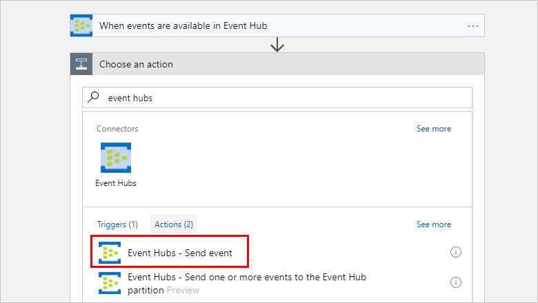

# Monitor, receive, and send events with the Event Hubs connector

To set up an event monitor so that your logic app can detect events, receive events, 
and send events, connect to an [Azure Event Hub](https://azure.microsoft.com/services/event-hubs) 
from your logic app. Learn more about [Azure Event Hubs](../event-hubs/event-hubs-what-is-event-hubs.md) 
and [how pricing works for Logic Apps connectors](../logic-apps/logic-apps-pricing.md).

## Prerequisites

Before you can use the Event Hubs connector, you must have these items:

* An [Azure Event Hubs namespace and Event Hub](../event-hubs/event-hubs-create.md)
* A [logic app](../logic-apps/quickstart-create-first-logic-app-workflow.md)

## Connect to Azure Event Hubs

Before your logic app can access any service, 
you have to create a [*connection*](./connectors-overview.md) 
between your logic app and the service, if you haven't already. 
This connection authorizes your logic app to access data. 
For your logic app to access your Event Hub, 
check your permissions and get the connection string for your Event Hubs namespace.

1.  Sign in to the [Azure portal](https://portal.azure.com "Azure portal"). 

2.  Go to your Event Hubs *namespace*, not a specific Event Hub. 
On the namespace page, under **Settings**, choose **Shared access policies**. 
Under **Claims**, check that you have **Manage** permissions for that namespace.

    

3. If you want to later manually enter your connection information, 
get the connection string for your Event Hubs namespace. 
Choose **RootManageSharedAccessKey**. Next to your primary key connection string, 
choose the copy button. Save the connection string for later use.

    

    > [!TIP]
    > To confirm whether your connection string is 
    > associated with your Event Hubs namespace or with a specific event hub, 
    > check the connection string for the `EntityPath` parameter. 
    > If you find this parameter, the connection string is for a specific 
    > Event Hub "entity", and is not the correct string to use with your logic app.

## Trigger workflow when your Event Hub gets new events

A [*trigger*](../logic-apps/logic-apps-overview.md#logic-app-concepts) 
is an event that starts a workflow in your logic app. To start a workflow
when new events are sent to your Event Hub, follow these steps for adding 
the trigger that detects this event.

1. In the [Azure portal](https://portal.azure.com "Azure portal"), 
go to your existing logic app or create a blank logic app.

2. In Logic Apps Designer, enter "event hubs" in the search box as your filter. 
Select this trigger: **When events are available in Event Hub**

   

   1. If you don't already have a connection to your Event Hubs namespace, 
   you're prompted to create this connection now. Give your connection a name, 
   and select the Event Hubs namespace that you want to use.

      

      Or, to manually enter the connection string, 
      choose **Manually enter connection information**. 
      Learn [how to find your connection string](#permissions-connection-string).

   2. Now select the Event Hubs policy to use, and choose **Create**.

      

3. Select the Event Hub to monitor, and set up the interval and frequency for when to check the Event Hub.

    
    
    > [!NOTE]
    > All Event Hub triggers are *long-polling* triggers, which means that when a trigger fires, 
    > the trigger processes all the events
    > and then waits for 30 seconds for more events to appear in the Event Hub.
    > If no events are received in 30 seconds, the trigger run is skipped. Otherwise, 
    > the trigger continues reading events until Event Hub is empty.
    > The next trigger poll is based on the recurrence interval specified in the trigger's properties.

4. To optionally select some of the advanced trigger options, choose **Show advanced options**.

    

    | Property | Details |
    | --- | --- |
    | Content type  |Select the events' content type from the drop-down list. By default, application/octet-stream is selected. |
    | Content schema |Enter the content schema in JSON for the events that are read from the Event Hub. |
    | Consumer group name |Enter the Event Hub [consumer group name](../event-hubs/event-hubs-features.md#consumer-groups) to read the events. When consumer group name is not specified, default consumer group is used. |
    | Minimum partition key |Enter the minimum [partition](../event-hubs/event-hubs-features.md#partitions) ID to read. By default, all partitions are read. |
    | Maximum partition key |Enter the maximum [partition](../event-hubs/event-hubs-features.md#partitions) ID to read. By default, all partitions are read. |
    | Maximum events count |Enter a value for the maximum number of events. The trigger returns between one and the number of events specified by this property. |
    |||

5. Save your logic app. On the designer toolbar, choose **Save**.

Now, when your logic app checks the selected Event Hub and finds 
a new event, the trigger runs the actions in your logic app 
for the found event.

## Send events to your Event Hub from your logic app

An [*action*](../logic-apps/logic-apps-overview.md#logic-app-concepts) 
is a task performed by your logic app workflow. After you add a trigger to your logic app, 
you can add an action to perform operations with data generated by that trigger. 
To send an event to your Event Hub from your logic app, follow these steps.

1. In Logic Apps Designer, under your trigger, choose **New step** > **Add an action**.

2. In the search box, enter "event hubs" as your filter.
Select this action: **Event Hubs - Send event**

   

3. Select the Event Hub for where to send the event. 
Then, enter the event content and any other details.

   

4. Save your logic app.

You've now set up an action that sends events from your logic app. 

## Connector-specific details

To learn more about triggers and actions defined by the Swagger file and any limits, 
review the [connector details](/connectors/eventhubs/).

## Get support

* For questions, visit the [Azure Logic Apps forum](https://social.msdn.microsoft.com/Forums/en-US/home?forum=azurelogicapps).
* To submit or vote on feature ideas, visit the [Logic Apps user feedback site](http://aka.ms/logicapps-wish).

## Next steps

* Learn more about [other connectors for Azure Logic apps](../connectors/apis-list.md)