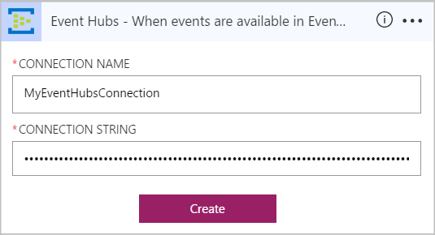
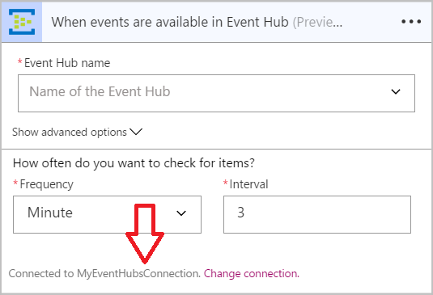
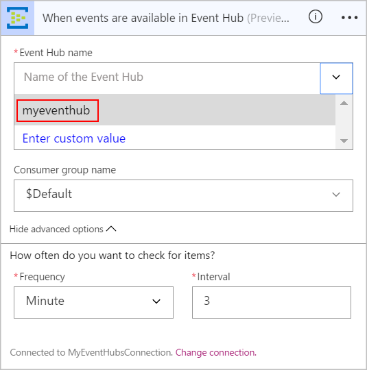
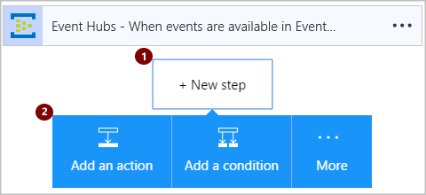
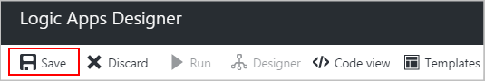

# Monitor, receive, and send events with the Event Hubs connector

To set up an event monitor so that your logic app can detect events, receive events, and send events, 
connect to an [Azure Event Hub](https://azure.microsoft.com/services/event-hubs) 
from your logic app. Learn more about [Azure Event Hubs](../event-hubs/event-hubs-what-is-event-hubs.md).

## Requirements

* You have to have an [Event Hubs namespace and Event Hub](../event-hubs/event-hubs-create.md) 
in Azure. Learn 
[how to create an Event Hubs namespace and Event Hub](../event-hubs/event-hubs-create.md). 

* To use [any connector](https://docs.microsoft.com/azure/connectors/apis-list) 
in your logic app, you have to create a logic app first. Learn 
[how to create a logic app](../logic-apps/logic-apps-create-a-logic-app.md).

## Check Event Hubs namespace permissions and find the connection string

For your logic app to access any service, 
you have to create a [*connection*](./connectors-overview.md) 
between your logic app and the service, if you haven't already. 
This connection authorizes your logic app to access data.
For your logic app to access your Event Hub, 
you have to have **Manage** permissions and the 
connection string for your Event Hubs namespace.

To check your permissions and get the connection string, 
follow these steps.

1.  Sign in to the [Azure portal](https://portal.azure.com "Azure portal"). 

2.  Go to your Event Hubs *namespace*, not the specific Event Hub. 
On the namespace blade, under **Settings**, choose **Shared access policies**. 
Under **Claims**, check that you have **Manage** permissions for that namespace.

    

3.  To copy the connection string for the Event Hubs namespace, 
choose **RootManageSharedAccessKey**. Next to your primary key connection string, 
choose the copy button.

    

    > [!TIP]
    > To confirm whether your connection string is 
    > associated with your Event Hubs namespace or with a specific Event Hub, 
    > check the connection string for the `EntityPath` parameter. 
    > If you find this parameter, the connection string is for a specific 
    > Event Hub "entity", and is not the correct string to use with your logic app.

4.  Now when you're prompted for credentials after adding 
an Event Hubs trigger or action to your logic app, 
you can connect to your Event Hubs namespace. 
Give your connection a name, enter the connection string that you copied, 
and choose **Create**.

    

    After you create your connection, 
    the connection name should appear in the Event Hubs trigger or action. 
    You can then continue with the other steps in your logic app.

    

## Start workflow when your Event Hub receives new events

A [*trigger*](../logic-apps/logic-apps-what-are-logic-apps.md#logic-app-concepts) 
is an event that starts a workflow in your logic app. To start a workflow
when new events are sent to your Event Hub, follow these steps for adding 
the trigger that detects this event.

1.  In the [Azure portal](https://portal.azure.com "Azure portal"), 
go to your existing logic app or create a blank logic app.

2.  In the search box for the Logic App Designer, enter `event hubs` for your filter. 
Select this trigger: **When events are available in Event Hub**

    

    If you don't already have a connection to your Event Hubs namespace, 
    you're prompted to create this connection now. Give your connection a name, 
    and enter the connection string for your Event Hubs namespace. 
    If necessary, learn [how to find your connection string](#permissions-connection-string).

    

    After you create the connection, 
    the settings for the **When an event in available in an Event Hub** trigger appear.

    

3.  Enter or select the name for the Event Hub that you want to monitor. 
Select the frequency and interval for how often you want to check the Event Hub.

    > [!TIP]
    > To optionally select a consumer group for reading events, 
    > choose **Show advanced options**. 

    

    You've now set up a trigger to start a workflow for your logic app. 
    Your logic app checks the specified Event Hub based on the schedule that you set. 
    If your app finds new events in the Event Hub, 
    the trigger runs other actions or triggers in your logic app.

## Send events to your Event Hub from your logic app

An [*action*](../logic-apps/logic-apps-what-are-logic-apps.md#logic-app-concepts) 
is a task performed by your logic app workflow. After you add a trigger to your logic app, 
you can add an action to perform operations with data generated by that trigger. 
To send an event to your Event Hub from your logic app, follow these steps.

1.  In Logic App Designer, under your logic app trigger, 
choose **New step** > **Add an action**.

    

    Now you can find and select an action to perform. 
    Although you can select any action, for this example, 
    we want the Event Hubs action to send events.

2.  In the search box, enter `event hubs` for your filter.
Select this action: **Send event**

    

3.  Enter the required details for the event, 
such as the name for the Event Hub where you want to send the event. 
Enter any other optional details about the event, such as content for that event.

    > [!TIP]
    > To optionally specify the Event Hub partition where to send the event, 
    > choose **Show advanced options**. 

    

6.  Save your changes.

    

    You've now set up an action to send events from your logic app. 

## Connector-specific details

View any triggers and actions defined in the swagger, and also see any limits in the [connector details](/connectors/eventhubs/). 

## Get help

To ask questions, answer questions, and see what other Azure Logic Apps users are doing, visit the 
[Azure Logic Apps forum](https://social.msdn.microsoft.com/Forums/en-US/home?forum=azurelogicapps).

To help improve Logic Apps and connectors, vote on or submit ideas at the 
[Logic Apps user feedback site](http://aka.ms/logicapps-wish).

## Next steps

*  [Find other connectors for Azure Logic apps](./apis-list.md)