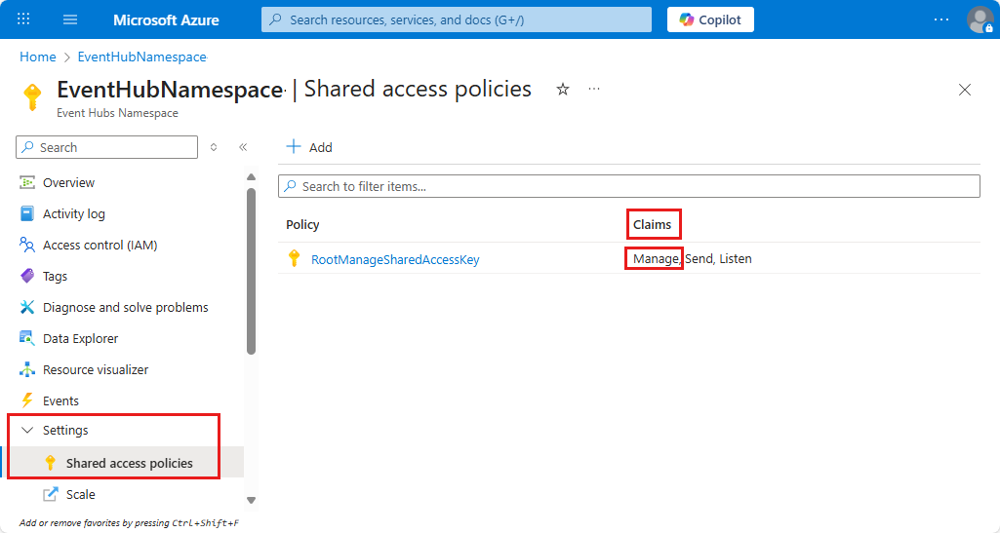
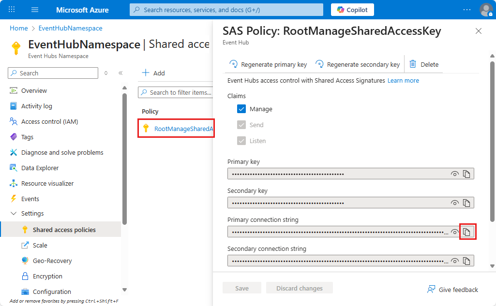
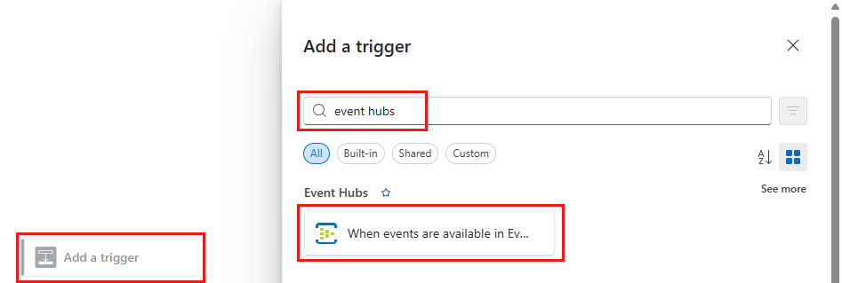
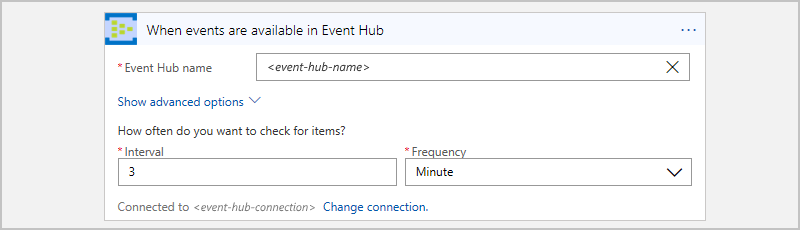
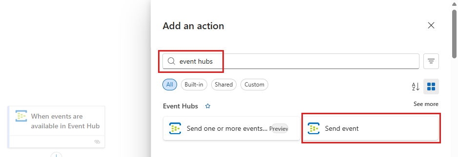
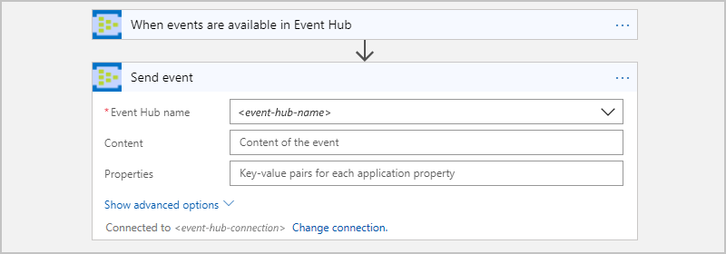
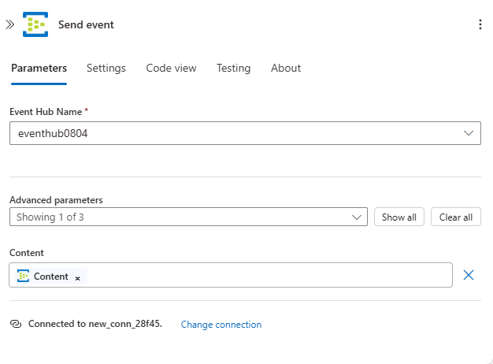
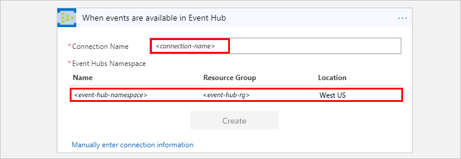
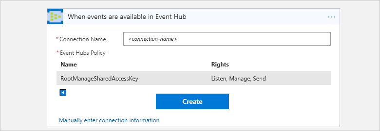

# Monitor, receive, and send events with Azure Event Hubs and Azure Logic Apps

This article shows how you can monitor and manage events sent to 
[Azure Event Hubs](../event-hubs/event-hubs-what-is-event-hubs.md) 
from inside a logic app with the Azure Event Hubs connector. 
That way, you can create logic apps that automate tasks and workflows 
for checking, sending, and receiving events from your Event Hub. 
For connector-specific technical information, see the 
[Azure Event Hubs connector reference](https://docs.microsoft.com/connectors/eventhubs/)</a>.

## Prerequisites

* An Azure subscription. If you don't have an Azure subscription, 
[sign up for a free Azure account](https://azure.microsoft.com/free/). 

* An [Azure Event Hubs namespace and Event Hub](../event-hubs/event-hubs-create.md)

* The logic app where you want to access your Event Hub. 
To start your logic app with an Azure Event Hubs trigger, you need a 
[blank logic app](../logic-apps/quickstart-create-first-logic-app-workflow.md).
If you're new to logic apps, review 
[What is Azure Logic Apps](../logic-apps/logic-apps-overview.md) 
and [Quickstart: Create your first logic app](../logic-apps/quickstart-create-first-logic-app-workflow.md).

## Check permissions and get connection string

To make sure that your logic app can access your Event Hub, 
check your permissions and get the connection 
string for your Event Hubs namespace.

1. Sign in to the [Azure portal](https://portal.azure.com).

1. Go to your Event Hubs *namespace*, not a specific Event Hub. 

1. On the namespace menu, under **Settings**, select **Shared access policies**. 
Under **Claims**, check that you have **Manage** permissions for that namespace.

   

1. If you want to later manually enter your connection information, 
get the connection string for your Event Hubs namespace.

   1. Under **Policy**, choose **RootManageSharedAccessKey**.

   1. Find your primary key's connection string. Choose the copy button, 
   and save the connection string for later use.

      

      > [!TIP]
      > To confirm whether your connection string is associated with 
      > your Event Hubs namespace or with a specific event hub, 
      > make sure the connection string doesn't have the `EntityPath` parameter. 
      > If you find this parameter, the connection string is for a specific 
      > Event Hub "entity" and is not the correct string to use with your logic app.

1. Now continue with [Add an Event Hubs trigger](#add-trigger) 
or [Add an Event Hubs action](#add-action).

## Add Event Hubs trigger

In Azure Logic Apps, every logic app must start with a 
[trigger](../logic-apps/logic-apps-overview.md#logic-app-concepts), 
which fires when a specific event happens or when a 
specific condition is met. Each time the trigger fires, 
the Logic Apps engine creates a logic app instance 
and starts running your app's workflow.

This example shows how you can start a logic app workflow
when new events are sent to your Event Hub. 

1. In the Azure portal or Visual Studio, 
create a blank logic app, which opens Logic Apps Designer. 
This example uses the Azure portal.

1. In the search box, enter "event hubs" as your filter. 
From the triggers list, select this trigger:
**When events are available in Event Hub - Event Hubs**

   

1. If you're prompted for connection details, 
[create your Event Hubs connection now](#create-connection). 

1. In the trigger, provide information about the Event Hub that you want to monitor. 
For more properties, open the **Add new parameter** list. Selecting a parameter 
adds that property to the trigger card.

   

   | Property | Required | Description |
   |----------|----------|-------------|
   | **Event Hub name** | Yes | The name for the Event Hub that you want to monitor |
   | **Content type** | No | The event's content type. The default is `application/octet-stream`. |
   | **Consumer group name** | No | The [name for the Event Hub consumer group](../event-hubs/event-hubs-features.md#consumer-groups) to use for reading events. If not specified, the default consumer group is used. |
   | **Maximum events count** | No | The maximum number of events. The trigger returns between one and the number of events specified by this property. |
   | **Interval** | Yes | A positive integer that describes how often the workflow runs based on the frequency |
   | **Frequency** | Yes | The unit of time for the recurrence |
   ||||

   **Additional properties**

   | Property | Required | Description |
   |----------|----------|-------------|
   | **Content schema** | No | The JSON content schema for the events to read from the Event Hub. For example, if you specify the content schema, you can trigger the logic app for only those events that match the schema. |
   | **Minimum partition key** | No | Enter the minimum [partition](../event-hubs/event-hubs-features.md#partitions) ID to read. By default, all partitions are read. |
   | **Maximum partition key** | No | Enter the maximum [partition](../event-hubs/event-hubs-features.md#partitions) ID to read. By default, all partitions are read. |
   | **Time zone** | No | Applies only when you specify a start time because this trigger doesn't accept UTC offset. Select the time zone that you want to apply. 
For more information, see [Create and run recurring tasks and workflows with Azure Logic Apps](../connectors/connectors-native-recurrence.md). |
   | **Start time** | No | Provide a start time in this format: 
YYYY-MM-DDThh:mm:ss if you select a time zone
-or-
YYYY-MM-DDThh:mm:ssZ if you don't select a time zone
For more information, see [Create and run recurring tasks and workflows with Azure Logic Apps](../connectors/connectors-native-recurrence.md). |
   ||||

1. When you're done, on the designer toolbar, choose **Save**.

1. Now continue adding one or more actions to your logic app 
for the tasks you want to perform with the trigger results. 

   For example, to filter events based on a specific value, 
   such as a category, you can add a condition so that the 
   **Send event** action sends only the events that 
   meet your condition. 

> [!NOTE]
> All Event Hub triggers are *long-polling* triggers, 
> which means that when a trigger fires, the trigger processes all the events
> and then waits for 30 seconds for more events to appear in your Event Hub.
> If no events are received in 30 seconds, the trigger run is skipped. 
> Otherwise, the trigger continues reading events until your Event Hub is empty.
> The next trigger poll happens based on the recurrence 
> interval that you specify in the trigger's properties.

## Add Event Hubs action

In Azure Logic Apps, an [action](../logic-apps/logic-apps-overview.md#logic-app-concepts) 
is a step in your workflow that follows a trigger or another action. 
For this example, the logic app starts with an Event Hubs trigger 
that checks for new events in your Event Hub.

1. In the Azure portal or Visual Studio, 
open your logic app in Logic Apps Designer. 
This example uses the Azure portal.

1. Under the trigger or action, choose **New step**.

   To add an action between existing steps, 
   move your mouse over the connecting arrow. 
   Choose the plus sign (**+**) that appears, 
   and then select **Add an action**.

1. In the search box, enter "event hubs" as your filter.
From the actions list, select this action: 
**Send event - Event Hubs**

   

1. If you're prompted for connection details, 
[create your Event Hubs connection now](#create-connection). 

1. In the action, provide information about the events that you want to send. 
For more properties, open the **Add new parameter** list. Selecting a parameter 
adds that property to the action card.

   

   | Property | Required | Description |
   |----------|----------|-------------|
   | **Event Hub name** | Yes | The Event Hub where you want to send the event |
   | **Content** | No | The content for the event you want to send |
   | **Properties** | No | The app properties and values to send |
   | **Partition key** | No | The [partition](../event-hubs/event-hubs-features.md#partitions) ID for where to send the event |
   ||||

   For example, you can send the output from your Event Hubs trigger to another Event Hub:

   

1. When you're done, on the designer toolbar, choose **Save**.

## Connect to your Event Hub

[!INCLUDE [Create connection general intro](../../includes/connectors-create-connection-general-intro.md)] 

1. When you're prompted for connection information, 
provide these details:

   | Property | Required | Value | Description |
   |----------|----------|-------|-------------|
   | **Connection Name** | Yes | <*connection-name*> | The name to create for your connection |
   | **Event Hubs Namespace** | Yes | <*event-hubs-namespace*> | Select the Event Hubs namespace you want to use. |
   |||||  

   For example:

   

   To manually enter the connection string, 
   select **Manually enter connection information**. 
   Learn [how to find your connection string](#permissions-connection-string).

2. Select the Event Hubs policy to use, 
if not already selected. Choose **Create**.

   

3. After you create your connection, 
continue with [Add Event Hubs trigger](#add-trigger) 
or [Add Event Hubs action](#add-action).

## Connector reference

For technical details, such as triggers, actions, and limits, as described by the connector's Swagger file, see the [connector's reference page](https://docs.microsoft.com/connectors/eventhubs/).

> [!NOTE]
> For logic apps in an [integration service environment (ISE)](../logic-apps/connect-virtual-network-vnet-isolated-environment-overview.md), 
> this connector's ISE-labeled version uses the [ISE message limits](../logic-apps/logic-apps-limits-and-config.md#message-size-limits) instead.

## Next steps

* Learn about other [Logic Apps connectors](../connectors/apis-list.md)