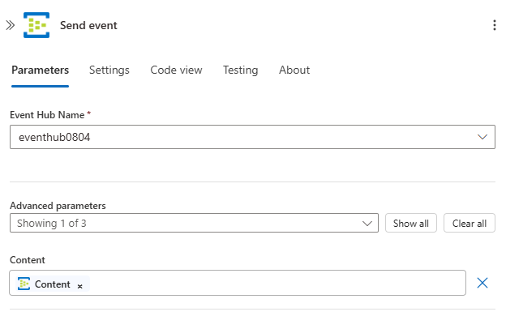

# Connect to an event hub from workflows in Azure Logic Apps

The Azure Event Hubs connector helps you connect your logic app workflows to event hubs in Azure. You can then have your workflows monitor and manage events that are sent to an event hub. For example, your workflow can check, send, and receive events from your event hub. This article provides a get started guide to using the Azure Event Hubs connector by showing how to connect to an event hub and add an Event Hubs trigger or action to your workflow.

For more information about Azure Event Hubs or Azure Logic Apps, review [What is Azure Event Hubs](../event-hubs/event-hubs-about.md) or [What is Azure Logic Apps](../logic-apps/logic-apps-overview.md).

## Available operations

For all the operations and other technical information, such as properties, limits, and so on, review the [Event Hubs connector's reference page](/connectors/eventhubs/).

> [!NOTE]
> For logic apps hosted in an [integration service environment (ISE)](../logic-apps/connect-virtual-network-vnet-isolated-environment-overview.md), 
> the connector's ISE version uses the [ISE message limits](../logic-apps/logic-apps-limits-and-config.md#message-size-limits) instead.

## Prerequisites

* An Azure account and subscription. If you don't have an Azure subscription, [sign up for a free Azure account](https://azure.microsoft.com/free/?WT.mc_id=A261C142F).

* An [Event Hubs namespace and event hub](../event-hubs/event-hubs-create.md)

* The logic app workflow where you want to access your event hub

  To start a workflow with an Event Hubs trigger, you need an empty workflow. If you're new to [Azure Logic Apps](../logic-apps/logic-apps-overview.md), try this [quickstart to create an example Consumption logic app workflow](../logic-apps/quickstart-create-example-consumption-workflow.md).

## Check permissions and get connection string

To make sure that your workflow can access your event hub, check your permissions, and then get the connection string for your event hub's namespace.

1. In the [Azure portal](https://portal.azure.com), go to your Event Hubs *namespace*, not a specific event hub.

1. On the namespace menu, under **Settings**, select **Shared access policies**. In the **Claims** column, check that you have at least **Manage** permissions for that namespace.

   

1. If you want to later manually enter your connection information, get the connection string for your event hub namespace.

   1. In the **Policy** column, select **RootManageSharedAccessKey**.

   1. Find your primary key's connection string. Copy and save the connection string for later use.

      

      > [!TIP]
      > To confirm whether your connection string is associated with your Event Hubs namespace or with 
      > a specific event hub, make sure the connection string doesn't have the `EntityPath` parameter. 
      > If you find this parameter, the connection string is for a specific Event Hubs "entity" and is 
      > not the correct string to use with your workflow.

## Create an event hub connection

When you add an Event Hubs trigger or action for the first time, you're prompted to create a connection to your event hub.

1. When you're prompted, choose one of the following options:

   * Provide the following connection information:

     | Property | Required | Value | Description |
     |----------|----------|-------|-------------|
     | **Connection Name** | Yes | <*connection-name*> | The name to create for your connection |
     | **Event Hubs Namespace** | Yes | <*event-hubs-namespace*> | Select the Event Hubs namespace that you want to use. |
     |||||

   * To manually enter your previously saved connection string, select **Manually enter connection information**. Learn [how to find your connection string](#permissions-connection-string).

1. Select the Event Hubs policy to use, if not already selected, and then select **Create**.

   

1. After you create your connection, continue with [Add an Event Hubs trigger](#add-trigger) or [Add an Event Hubs action](#add-action).

## Add Event Hubs trigger

In Azure Logic Apps, every workflow must start with a [trigger](../logic-apps/logic-apps-overview.md#logic-app-concepts), which fires when a specific condition is met. Each time the trigger fires, the Logic Apps service creates a workflow instance and starts running the steps in the workflow.

The following steps describe the general way to add a trigger, for example, **When events are available in Event Hub**. This example shows how to add a trigger that checks for new events in your event hub and starts a workflow run when new events exist.

1. In the Logic Apps Designer, open your blank logic app workflow, if not already open.

1. In the operation search box, enter `event hubs`. From the triggers list, select the trigger named **When events are available in Event Hub**.

   

1. If you're prompted to create a connection to your event hub, [provide the requested connection information](#create-connection).

1. In the trigger, provide information about the event hub that you want to monitor, for example:

   | Property | Required | Description |
   |----------|----------|-------------|
   | **Event Hub name** | Yes | The name for the event hub that you want to monitor |
   | **Content type** | No | The event's content type. The default is `application/octet-stream`. |
   | **Consumer group name** | No | The [name for the Event Hubs consumer group](../event-hubs/event-hubs-features.md#consumer-groups) to use for reading events. If not specified, the default consumer group is used. |
   | **Maximum events count** | No | The maximum number of events. The trigger returns between one and the number of events specified by this property. |
   | **Interval** | Yes | A positive integer that describes how often the workflow runs based on the frequency |
   | **Frequency** | Yes | The unit of time for the recurrence |
   ||||

   For more properties, open the **Add new parameter** list. Selecting a parameter adds that property to the trigger, for example:

   

   **More properties**

   | Property | Required | Description |
   |----------|----------|-------------|
   | **Content schema** | No | The JSON content schema for the events to read from your event hub. For example, if you specify the content schema, you can trigger the workflow for only those events that match the schema. |
   | **Minimum partition key** | No | Enter the minimum [partition](../event-hubs/event-hubs-features.md#partitions) ID to read. By default, all partitions are read. |
   | **Maximum partition key** | No | Enter the maximum [partition](../event-hubs/event-hubs-features.md#partitions) ID to read. By default, all partitions are read. |
   | **Time zone** | No | Applies only when you specify a start time because this trigger doesn't accept UTC offset. Select the time zone that you want to apply. 
For more information, see [Create and run recurring tasks and workflows with Azure Logic Apps](../connectors/connectors-native-recurrence.md). |
   | **Start time** | No | Provide a start time in this format: 
YYYY-MM-DDThh:mm:ss if you select a time zone
-or-
YYYY-MM-DDThh:mm:ssZ if you don't select a time zone
For more information, see [Create and run recurring tasks and workflows with Azure Logic Apps](../connectors/connectors-native-recurrence.md). |
   ||||

1. When you're done, on the designer toolbar, select **Save**.

1. Now continue adding one or more actions so that you can perform other tasks using the trigger outputs.

   For example, to filter events based on a specific value, such as a category, you can add a condition so that the 
   **Send event** action sends only the events that meet your condition. 

## Trigger polling behavior

All Event Hubs triggers are long-polling triggers. This behavior means that when a trigger fires, the trigger processes all the events and waits 30 seconds for more events to appear in your event hub. By design, if no events appear in 30 seconds, the trigger is skipped. Otherwise, the trigger continues reading events until your event hub is empty. The next trigger poll happens based on the recurrence interval that you set in the trigger's properties.

For example, if the trigger is set up with four partitions, this delay might take up to two minutes before the trigger finishes polling all the partitions. If no events are received within this delay, the trigger run is skipped. Otherwise, the trigger continues reading events until your event hub is empty. The next trigger poll happens based on the recurrence interval that you specify in the trigger's properties.

If you know the specific partition(s) where the messages appear, you can update the trigger to read events from only this or those partition(s) by setting the trigger's maximum and minimum partition keys. For more information, review the [Add Event Hubs trigger](#add-trigger) section.
     
## Trigger checkpoint behavior

When an Event Hubs trigger reads events from each partition in an event hub, the trigger users its own state to maintain information about the stream offset (the event position in a partition) and the partitions from where the trigger reads events.

Each time your workflow runs, the trigger reads events from a partition, starting from the stream offset that's kept by the trigger state. In round-robin fashion, the trigger iterates over each partition in the event hub and reads events in subsequent trigger runs. A single run gets events from a single partition at a time.

The trigger doesn't use this checkpoint capability in storage, resulting in no extra cost. However, the key point is that updating the Event Hubs trigger resets the trigger's state, which might cause the trigger to read events at start of the stream.

## Add Event Hubs action

In Azure Logic Apps, an [action](../logic-apps/logic-apps-overview.md#logic-app-concepts) follows the trigger or another action and performs some operation in your workflow. The following steps describe the general way to add an action, for example, **Send event**. For this example, the workflow starts with an Event Hubs trigger that checks for new events in your event hub.

1. In the Logic Apps Designer, open your logic app workflow, if not already open.

1. Under the trigger or another action, add a new step.

   To add a step between existing steps, move your mouse over the arrow. Select the plus sign (**+**) that appears, and then select **Add an action**.

1. In the operation search box, enter `event hubs`. From the actions list, select the action named **Send event**.

   

1. If you're prompted to create a connection to your event hub, [provide the requested connection information](#create-connection).

1. In the action, provide information about the events that you want to send.

   | Property | Required | Description |
   |----------|----------|-------------|
   | **Event Hub name** | Yes | The event hub where you want to send the event |
   | **Content** | No | The content for the event you want to send |
   | **Properties** | No | The app properties and values to send |
   | **Partition key** | No | The [partition](../event-hubs/event-hubs-features.md#partitions) ID for where to send the event |
   ||||

   For more properties, open the **Add new parameter** list. Selecting a parameter adds that property to the action, for example:

   

   For example, you can send the output from your Event Hubs trigger to another event hub:

   

1. When you're done, on the designer toolbar, select **Save**.

## Connector reference

For all the operations and other technical information, such as properties, limits, and so on, review the [Event Hubs connector's reference page](/connectors/eventhubs/).

> [!NOTE]
> For logic apps hosted in an [integration service environment (ISE)](../logic-apps/connect-virtual-network-vnet-isolated-environment-overview.md), 
> the connector's ISE version uses the [ISE message limits](../logic-apps/logic-apps-limits-and-config.md#message-size-limits) instead.

## Next steps

* [Managed connectors for Azure Logic Apps](managed.md)
* [Built-in connectors for Azure Logic Apps](built-in.md)
* [What are connectors in Azure Logic Apps](introduction.md)
