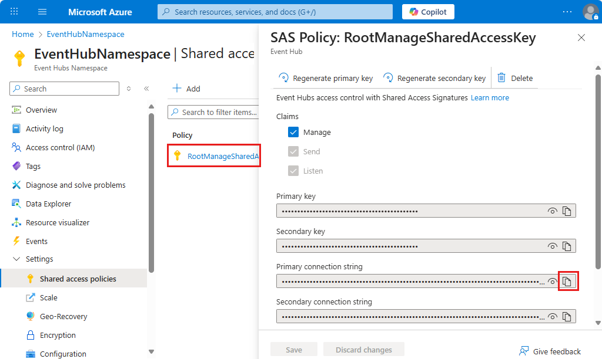

---
# required metadata
title: Connect to Azure Event Hubs - Azure Logic Apps | Microsoft Docs
description: Manage and monitor events with Azure Event Hubs and Azure Logic Apps 
author: ecfan
manager: cfowler
ms.author: estfan
ms.date: 02/06/2018
ms.topic: article
ms.service: logic-apps

# optional metadata
ms.reviewer: klam, LADocs
ms.suite: integration
tags: connectors
---

# Monitor, receive, and send events with Azure Event Hubs and Azure Logic Apps 

To set up an event monitor so that your logic app can detect events, receive events, 
and send events, connect to an [Azure Event Hub](https://azure.microsoft.com/services/event-hubs) 
from your logic app. Learn more about [Azure Event Hubs](../event-hubs/event-hubs-what-is-event-hubs.md) 
and [how pricing works for Logic Apps connectors](../logic-apps/logic-apps-pricing.md).

If you don't have an Azure subscription, 
<a href="https://azure.microsoft.com/free/" target="_blank">sign up for a free Azure account</a>. 
If you're new to logic apps, review 
[What is Azure Logic Apps](../logic-apps/logic-apps-overview.md) 
and [Quickstart: Create your first logic app](../logic-apps/quickstart-create-first-logic-app-workflow.md).
For connector-specific technical information, see the 
<a href="https://docs.microsoft.com/connectors/eventhubs/" target="blank">Azure Event Hubs connector reference</a>.

## Prerequisites

Before you can use the Event Hubs connector, you must have these items:

* An [Azure Event Hubs namespace and Event Hub](../event-hubs/event-hubs-create.md)

* The logic app where you want to access your Event Hub. 
To start your logic app with an Azure Event Hubs trigger, you need a 
[blank logic app](../logic-apps/quickstart-create-first-logic-app-workflow.md). 

## Check permissions and get connection string

For your logic app to access your Event Hub, 
check your permissions and get the connection string for your Event Hubs namespace.

1. Sign in to the [Azure portal](https://portal.azure.com "Azure portal"). 

2. Go to your Event Hubs *namespace*, not a specific Event Hub. 
On the namespace page, under **Settings**, choose **Shared access policies**. 
Under **Claims**, check that you have **Manage** permissions for that namespace.

   

3. If you want to later manually enter your connection information, 
get the connection string for your Event Hubs namespace. 
Choose **RootManageSharedAccessKey**. Next to your primary key connection string, 
choose the copy button. Save the connection string for later use.

   

   > [!TIP]
   > To confirm whether your connection string is 
   > associated with your Event Hubs namespace or with a specific event hub, 
   > check the connection string for the `EntityPath` parameter. 
   > If you find this parameter, the connection string is for a specific 
   > Event Hub "entity", and is not the correct string to use with your logic app.

## Add Event Hubs trigger

In Azure Logic Apps, every logic app must start with a 
[trigger](../logic-apps/logic-apps-overview.md#logic-app-concepts), 
which fires when a specific event happens or when a 
specific condition is met. Each time the trigger fires, 
the Logic Apps engine creates a logic app instance 
and starts running your app's workflow.

This example shows how you can start a logic app workflow
when new events are sent to your Event Hub. 

> [!NOTE]
> All Event Hub triggers are *long-polling* triggers, 
> which means that when a trigger fires, the trigger processes all the events
> and then waits for 30 seconds for more events to appear in your Event Hub.
> If no events are received in 30 seconds, the trigger run is skipped. 
> Otherwise, the trigger continues reading events until your Event Hub is empty.
> The next trigger poll happens based on the recurrence 
> interval that you specify in the trigger's properties.

1. In the Azure portal or Visual Studio, 
create a blank logic app, which opens Logic Apps Designer. 
This example uses the Azure portal.

2. In the search box, enter "event hubs" as your filter. 
From the triggers list, select the trigger you want. 

   This example uses this trigger: 
   **Event Hubs - When events are available in Event Hub**

   

3. If you're prompted for connection details, 
[create your Event Hub connection now](#create-connection). 
Or, if your connection already exists, 
provide the necessary information for the trigger.

   1. From the **Event Hub name** list, select the Event Hub you want to monitor.

      

   2. Select the interval and frequency for how often you want 
   the trigger to check the Event Hub.
 
   3. To optionally select some of the advanced trigger options, choose **Show advanced options**.
   
      

      | Property | Details | 
      |----------|---------| 
      | Content type  | Select the event's content type. The default is "application/octet-stream". |
      | Content schema | Enter the content schema in JSON for the events that are read from the Event Hub. |
      | Consumer group name | Enter the Event Hub [consumer group name](../event-hubs/event-hubs-features.md#consumer-groups) for reading events. If not specified, the default consumer group is used. |
      | Minimum partition key | Enter the minimum [partition](../event-hubs/event-hubs-features.md#partitions) ID to read. By default, all partitions are read. |
      | Maximum partition key | Enter the maximum [partition](../event-hubs/event-hubs-features.md#partitions) ID to read. By default, all partitions are read. |
      | Maximum events count | Enter a value for the maximum number of events. The trigger returns between one and the number of events specified by this property. |
      |||

4. When you're done, on the designer toolbar, choose **Save**.

Now, when your logic app checks the selected Event Hub and finds 
a new event, the trigger runs the actions in your logic app 
for the found event.

## Add Event Hubs action

In Azure Logic Apps, an [action](../logic-apps/logic-apps-overview.md#logic-app-concepts) 
is a step in your workflow that follows a trigger or another action. 
For this example, the logic app starts with the 
**Event Hubs - When events are available in Event Hub** trigger, 
which checks for new events in your Event Hub. 

1. In the Azure portal or Visual Studio, 
open your logic app in Logic Apps Designer. 
This example uses the Azure portal.

2. Under the trigger or action, choose **New step** > **Add an action**.

   To add an action between existing steps, 
   move your mouse over the connecting arrow. 
   Choose the plus sign (**+**) that appears, 
   and then choose **Add an action**.

3. In the search box, enter "event hubs" as your filter.
From the actions list, select the action you want. 

   For this example, select this action: **Event Hubs - Send event**

   

4. If you're prompted for connection details, 
[create your Event Hub connection now](#create-connection). 
Or, if your connection already exists, 
provide the necessary information for the action.

5. From the **Event Hub name** list, 
select the Event Hub where you want to send the event. 
Then, enter the event content and any other details.

   

6. When you're done, on the designer toolbar, choose **Save**.

## Connect to your Event Hub

[!INCLUDE [Create connection general intro](../../includes/connectors-create-connection-general-intro.md)] 

1. When you're prompted for connection information, 
provide these details:

   | Property | Value | Description | 
   |----------|-------|---------------|
   | Connection Name | <*connection-name*> | The name to create for your connection |
   | Event Hubs Namespace | <*event-hubs-namespace*> | Select the Event Hubs namespace you want to use | 
   |||| 

   Or, to manually enter the connection string, 
   choose **Manually enter connection information**. 
   Learn [how to find your connection string](#permissions-connection-string).

   For example:

   

2. Now select the Event Hubs policy to use, and choose **Create**.

   

3. After you create your connection, 
continue with [Add Event Hubs trigger](#add-trigger) or [Add Event Hubs action](#add-action).

## Connector reference

For technical details, such as triggers, actions, and limits, 
as described by the connector's Swagger file, 
see the [connector's reference page](/connectors/eventhubs/). 

## Get support

* For questions, visit the [Azure Logic Apps forum](https://social.msdn.microsoft.com/Forums/en-US/home?forum=azurelogicapps).
* To submit or vote on feature ideas, visit the [Logic Apps user feedback site](http://aka.ms/logicapps-wish).

## Next steps

* Learn about other [Logic Apps connectors](../connectors/apis-list.md)