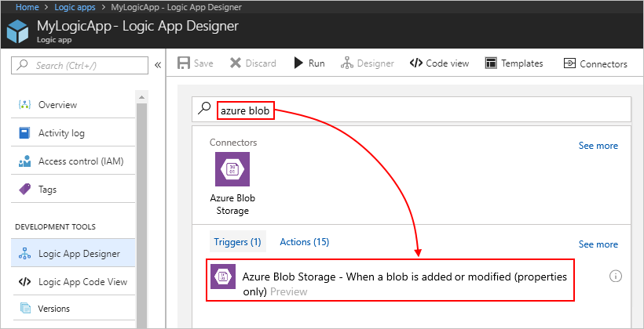
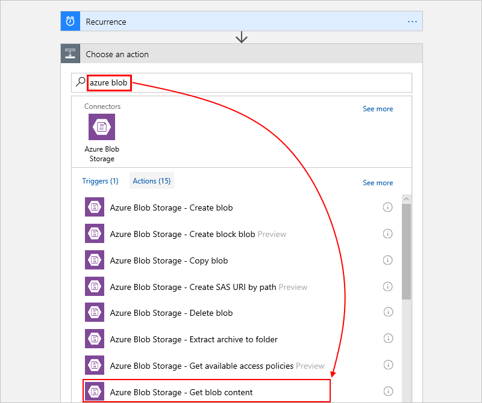
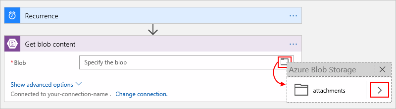

# Create and manage blobs in Azure blob storage with Azure Logic Apps

This article shows how you can access and manage files stored as blobs in your 
Azure storage account from inside a logic app with the Azure Blob Storage connector. 
That way, you can create logic apps that automate tasks and workflows 
for managing your files. For example, you can build logic apps that create, 
get, update, and delete files in your storage account.

Suppose that you have a tool that gets updated on an Azure website. 
which acts as the trigger for your logic app. When this event happens, 
you can have your logic app update some file in your blob storage container, 
which is an action in your logic app. 

> [!NOTE]
> Logic Apps doesn't support directly connecting to Azure storage 
> accounts through firewalls. To access these storage accounts, 
> use either option here: 
>
> * Create an [integration service environment](../logic-apps/connect-virtual-network-vnet-isolated-environment-overview.md), 
> which can connect to resources in an Azure virtual network. 
> 
> * If you already use API Management, you can use 
> this service for this scenario. For more info, see 
> [Simple enterprise integration architecture](http://aka.ms/aisarch).

If you're new to logic apps, review 
[What is Azure Logic Apps](../logic-apps/logic-apps-overview.md) 
and [Quickstart: Create your first logic app](../logic-apps/quickstart-create-first-logic-app-workflow.md).
For connector-specific technical information, see the 
<a href="https://docs.microsoft.com/connectors/azureblobconnector/" target="blank">Azure Blob Storage connector reference</a>.

## Prerequisites

* If you don't have an Azure subscription, 
<a href="https://azure.microsoft.com/free/" target="_blank">sign up for a free Azure account</a>. 

* An [Azure storage account and storage container](../storage/blobs/storage-quickstart-blobs-portal.md)

* The logic app where you need access to your Azure blob storage account. 
To start your logic app with an Azure Blob Storage trigger, you need a 
[blank logic app](../logic-apps/quickstart-create-first-logic-app-workflow.md). 

## Add blob storage trigger

In Azure Logic Apps, every logic app must start with a 
[trigger](../logic-apps/logic-apps-overview.md#logic-app-concepts), 
which fires when a specific event happens or when a 
specific condition is met. Each time the trigger fires, 
the Logic Apps engine creates a logic app instance 
and starts running your app's workflow.

This example shows how you can start a logic app workflow with the 
**Azure Blob Storage - When a blob is added or modified (properties only)** trigger 
when a blob's properties gets added or updated in your storage container. 

1. In the Azure portal or Visual Studio, 
create a blank logic app, which opens Logic App Designer. 
This example uses the Azure portal.

2. In the search box, enter "azure blob" as your filter. 
From the triggers list, select the trigger you want.

   This example uses this trigger: 
   **Azure Blob Storage - When a blob is added or modified (properties only)**

   

3. If you're prompted for connection details, 
[create your blob storage connection now](#create-connection). 
Or, if your connection already exists, 
provide the necessary information for the trigger.

   For this example, select the container and folder you want to monitor.

   1. In the **Container** box, select the folder icon.

   2. In the folder list, choose the right-angle bracket ( **>** ), 
   and then browse until you find and select the folder you want. 

      

   3. Select the interval and frequency for how often 
   you want the trigger to check the folder for changes.

4. When you're done, on the designer toolbar, choose **Save**.

5. Now continue adding one or more actions to your logic app 
for the tasks you want to perform with the trigger results.

## Add blob storage action

In Azure Logic Apps, an [action](../logic-apps/logic-apps-overview.md#logic-app-concepts) 
is a step in your workflow that follows a trigger or another action. 
For this example, the logic app starts with the 
[Recurrence trigger](../connectors/connectors-native-recurrence.md).

1. In the Azure portal or Visual Studio, 
open your logic app in Logic App Designer. 
This example uses the Azure portal.

2. In the Logic App Designer, under the trigger or action, 
choose **New step** > **Add an action**.

    

   To add an action between existing steps, 
   move your mouse over the connecting arrow. 
   Choose the plus sign (**+**) that appears, 
   and then choose **Add an action**.

3. In the search box, enter "azure blob" as your filter. 
From the actions list, select the action you want.

   This example uses this action: 
   **Azure Blob Storage - Get blob content**

    

4. If you're prompted for connection details, 
[create your Azure Blob Storage connection now](#create-connection). 
Or, if your connection already exists, 
provide the necessary information for the action. 

   For this example, select the file you want.

   1. From the **Blob** box, select the folder icon.
  
      

   2. Find and select the file you want based on the blob's **Id** number. You can find this **Id** number in the blob's metadata that is returned by the previously described blob storage trigger.

5. When you're done, on the designer toolbar, choose **Save**.
To test your logic app, make sure that the selected folder contains a blob.

This example only gets the contents for a blob. To view the contents, 
add another action that creates a file with the blob by using another connector. 
For example, add a OneDrive action that creates a file based on the blob contents.

## Connect to storage account

[!INCLUDE [Create connection general intro](../../includes/connectors-create-connection-general-intro.md)]

[!INCLUDE [Create a connection to Azure blob storage](../../includes/connectors-create-api-azureblobstorage.md)]

## Connector reference

For technical details, such as triggers, actions, and limits, 
as described by the connector's Swagger file, 
see the [connector's reference page](/connectors/azureblobconnector/). 

## Get support

* For questions, visit the [Azure Logic Apps forum](https://social.msdn.microsoft.com/Forums/en-US/home?forum=azurelogicapps).
* To submit or vote on feature ideas, visit the [Logic Apps user feedback site](http://aka.ms/logicapps-wish).

## Next steps

* Learn about other [Logic Apps connectors](../connectors/apis-list.md)
