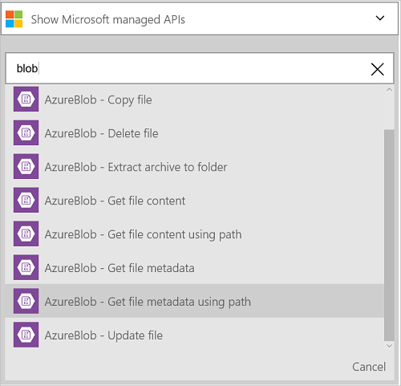
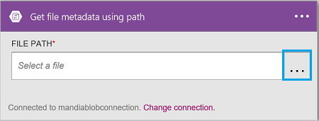

<properties
    pageTitle="Add the Azure blob storage Connector in your Logic Apps | Microsoft Azure"
    description="Overview of Azure blob storage Connector with REST API parameters"
    services=""
    documentationCenter="" 
    authors="MandiOhlinger"
    manager="erikre"
    editor=""
    tags="connectors"/>

<tags
   ms.service="multiple"
   ms.devlang="na"
   ms.topic="article"
   ms.tgt_pltfrm="na"
   ms.workload="na" 
   ms.date="07/18/2016"
   ms.author="mandia"/>

# Get started with the Azure blob storage connector
Azure Blob storage is a service for storing large amounts of unstructured data. Perform various actions such as upload, update, get, and delete blobs in Azure blob storage. 

- Build your workflow by uploading new projects, or getting files that have been  recently updated.
- Use actions to get file metadata, delete a file, copy files, and more. For example,  when a tool is updated in an Azure web site (a trigger), then update a file in blob storage (an action). 

This topic shows you how to use the blob storage connector in a logic app, and also lists the actions.

>[AZURE.NOTE] This version of the article applies to Logic Apps general availability (GA). 

Get started by [creating a logic app](../app-service-logic/app-service-logic-create-a-logic-app.md).

>[AZURE.INCLUDE [What you need to get started](../../includes/connectors-create-api-azureblobstorage.md)]

## Connect to Azure blob storage

Before your logic app can access any service, you first create a *connection* to the service. A connection provides connectivity between a logic app and another service. For example, to connect to Dropbox, you first create a Dropbox *connection*. To create a connection, you enter the credentials you normally use to access the service you are connecting to. So, in the Dropbox example, enter your Dropbox credentials to create the connection to Dropbox. 

When you add this connector to your logic apps, you create a connection to the blob storage account. The first time you add this connector, you are prompted for the connection information: 

  

#### Create the connection

1. Enter the storage account details. Properties with an asterisk are required.

	| Property | Details |
|---|---|
| Connection Name * | Enter any name for your connection. |
| Azure Storage Account Name * | Enter the storage account name. The storage account name is displayed in the storage properties in the Azure portal. |
| Azure Storage Account Access Key * | Enter the storage account key. The access keys are displayed in the storage properties in the Azure portal. |

	These credentials are used to authorize your logic app to connect, and access your data. Once complete, your connection details look similar to the following:  

	 

2. Select **Create**.

 
## Use a trigger

This connector does not have any triggers. Use other triggers to start the logic app, including a Recurrence trigger, an HTTP Webhook trigger, triggers available with other connectors, and more. [Create a logic app](../app-service-logic/app-service-logic-create-a-logic-app.md) provides an example.

## Use an action
	
An action is an operation carried out by the workflow defined in a logic app.

1. Select the plus sign. You see several choices: **Add an action**, **Add a condition**, or one of the **More** options.

	

2. Choose **Add an action**.

3. In the text box, type “blob” to get a list of all the available actions.

	 

4. In our example, choose **AzureBlob - Get file metadata using path**. If a connection already exists, then select the **...** (Show Picker) button to select a file.

	

	If you are prompted for the connection information, then enter the details to create the connection. [Create the connection](connectors-create-api-azureblobstorage.md#create-the-connection) in this topic describes these properties. 

	> [AZURE.NOTE] In this example, we get the metadata of a file. To see the metadata, add another action that creates a new file using another connector. For example, add a OneDrive action that creates a new "test" file based on the metadata. 

5. **Save** your changes (top left corner of the toolbar). Your logic app is saved and may be automatically enabled.

> [AZURE.TIP] [Storage Explorer](http://storageexplorer.com/) is a great tool to  manage multiple storage accounts.

## Technical Details

## Actions

|Action|Description|
|--- | ---|
|[Get file metadata](connectors-create-api-azureblobstorage.md#get-file-metadata)|This operation gets file metadata using file id.|
|[Update file](connectors-create-api-azureblobstorage.md#update-file)|This operation updates a file.|
|[Delete file](connectors-create-api-azureblobstorage.md#delete-file)|This operation deletes a file.|
|[Get file metadata using path](connectors-create-api-azureblobstorage.md#get-file-metadata-using-path)|This operation gets file metadata using the path.|
|[Get file content using path](connectors-create-api-azureblobstorage.md#get-file-content-using-path)|This operation gets file contents using the path.|
|[Get file content](connectors-create-api-azureblobstorage.md#get-file-content)|This operation gets file contents using id.|
|[Create file](connectors-create-api-azureblobstorage.md#create-file)|This operation uploads a file.|
|[Copy file](connectors-create-api-azureblobstorage.md#copy-file)|This operation copies a file to Azure Blob Storage.|
|[Extract archive to folder](connectors-create-api-azureblobstorage.md#extract-archive-to-folder)|This operation extracts an archive file into a folder (example: .zip).|

### Action details

In this section, see the specific details about each action, including any required or optional input properties, and any corresponding output associated with the connector.

#### Get file metadata
This operation gets file metadata using file id.  

|Property Name| Display Name|Description|
| ---|---|---|
|id*|File|Select a file|

An asterisk (*) means the property is required.

##### Output Details
BlobMetadata

| Property Name | Data Type |
|---|---|
|Id|string|
|Name|string|
|DisplayName|string|
|Path|string|
|LastModified|string|
|Size|integer|
|MediaType|string|
|IsFolder|boolean|
|ETag|string|
|FileLocator|string|

#### Update file
This operation updates a file.  

|Property Name| Display Name|Description|
| ---|---|---|
|id*|File|Select a file|
|body*|File content|Content of the file to update|

An asterisk (*) means the property is required.

##### Output Details
BlobMetadata

| Property Name | Data Type |
|---|---|
|Id|string|
|Name|string|
|DisplayName|string|
|Path|string|
|LastModified|string|
|Size|integer|
|MediaType|string|
|IsFolder|boolean|
|ETag|string|
|FileLocator|string|

#### Delete file
This operation deletes a file.  

|Property Name| Display Name|Description|
| ---|---|---|
|id*|File|Select a file|

An asterisk (*) means the property is required.

##### Output Details
None.

#### Get file metadata using path
This operation gets file metadata using the path.  

|Property Name| Display Name|Description|
| ---|---|---|
|path*|File path|Select a file|

An asterisk (*) means the property is required.

##### Output Details
BlobMetadata

| Property Name | Data Type |
|---|---|
|Id|string|
|Name|string|
|DisplayName|string|
|Path|string|
|LastModified|string|
|Size|integer|
|MediaType|string|
|IsFolder|boolean|
|ETag|string|
|FileLocator|string|

#### Get file content using path
This operation gets file contents using the path.  

|Property Name| Display Name|Description|
| ---|---|---|
|path*|File path|Select a file|

An asterisk (*) means the property is required.

##### Output Details
None.

#### Get file content
This operation gets file contents using id.  

|Property Name| Data Type|Description|
| ---|---|---|
|id*|string|Select a file|

An asterisk (*) means the property is required.

##### Output Details
None.

#### Create file
This operation uploads a file.  

|Property Name| Display Name|Description|
| ---|---|---|
|folderPath*|Folder path|Select a folder|
|name*|File name|Name of file to upload|
|body*|File content|Content of the file to upload|

An asterisk (*) means the property is required.

##### Output Details
BlobMetadata

| Property Name | Data Type | 
|---|---|
|Id|string|
|Name|string|
|DisplayName|string|
|Path|string|
|LastModified|string|
|Size|integer|
|MediaType|string|
|IsFolder|boolean|
|ETag|string|
|FileLocator|string|

#### Copy file
This operation copies a file to Azure Blob Storage.  

|Property Name| Display Name|Description|
| ---|---|---|
|source*|Source url|Specify Url to source file|
|destination*|Destination file path|Specify the destination file path, including target filename|
|overwrite|Overwrite?|Should an existing destination file be overwritten (true/false)?  |

An asterisk (*) means the property is required.

##### Output Details
BlobMetadata

| Property Name | Data Type |
|---|---|
|Id|string|
|Name|string|
|DisplayName|string|
|Path|string|
|LastModified|string|
|Size|integer|
|MediaType|string|
|IsFolder|boolean|
|ETag|string|
|FileLocator|string|

#### Extract archive to folder
This operation extracts an archive file into a folder (example: .zip).  

|Property Name| Display Name|Description|
| ---|---|---|
|source*|Source archive file path|Select an archive file|
|destination*|Destination folder path|Select the contents to extract|
|overwrite|Overwrite?|Should an existing destination file be overwritten (true/false)?|

An asterisk (*) means the property is required.

##### Output Details
BlobMetadata

| Property Name | Data Type |
|---|---|
|Id|string|
|Name|string|
|DisplayName|string|
|Path|string|
|LastModified|string|
|Size|integer|
|MediaType|string|
|IsFolder|boolean|
|ETag|string|
|FileLocator|string|

## HTTP responses

When making calls to the different actions, you may get certain responses. The following table outlines the responses and their descriptions:  

|Name|Description|
|---|---|
|200|OK|
|202|Accepted|
|400|Bad Request|
|401|Unauthorized|
|403|Forbidden|
|404|Not Found|
|500|Internal Server Error. Unknown error occurred|
|default|Operation Failed.|

## Next steps

[Create a logic app](../app-service-logic/app-service-logic-create-a-logic-app.md). Explore the other available connectors in Logic Apps at our [APIs list](apis-list.md).

