# Connect to Azure Blob Storage from workflows in Azure Logic Apps

[!INCLUDE [logic-apps-sku-consumption-standard](../../includes/logic-apps-sku-consumption-standard.md)]

This how-to guide shows how to access your Azure Blob Storage account and container from a workflow in Azure Logic Apps using the Azure Blob Storage connector. This connector provides triggers and actions that your workflow can use for blob operations. You can then create automated workflows that run when triggered by events in your storage container or in other systems, and run actions to work with data in your storage container. For example, you can access and manage files stored as blobs in your Azure storage account.

You can connect to Azure Blob Storage from a workflow in **Logic App (Consumption)** and **Logic App (Standard)** resource types. You can use the connector with logic app workflows in multi-tenant Azure Logic Apps, single-tenant Azure Logic Apps, and the integration service environment (ISE). With **Logic App (Standard)**, you can use either the **Azure Blob** *built-in* connector operations or the **Azure Blob Storage** managed connector operations.

## Connector technical reference

The Azure Blob Storage connector has different versions, based on [logic app type and host environment](../logic-apps/logic-apps-overview.md#resource-environment-differences).

| Logic app | Environment | Connector version |
|-----------|-------------|-------------------|
| **Consumption** | Multi-tenant Azure Logic Apps | Managed connector (Standard class). For more information, review the following documentation: <br><br>- [Azure Blob Storage managed connector reference](/connectors/azureblobconnector) <br>- [Managed connectors in Azure Logic Apps](managed.md) |
| **Consumption** | Integration service environment (ISE) | Managed connector (Standard class) and ISE version, which has different message limits than the Standard class. For more information, review the following documentation: <br><br>- [Azure Blob Storage managed connector reference](/connectors/azureblobconnector) <br>- [ISE message limits](../logic-apps/logic-apps-limits-and-config.md#message-size-limits) <br>- [Managed connectors in Azure Logic Apps](managed.md) |
| **Standard** | Single-tenant Azure Logic Apps and App Service Environment v3 (Windows plans only) | Managed connector (Azure-hosted) and built-in connector, which is [service provider based](../logic-apps/custom-connector-overview.md#service-provider-interface-implementation). The built-in version differs in the following ways: <br><br>- The built-in version connects directly to your Azure Storage account requiring only a connection string. <br><br>- The built-in version can directly access Azure virtual networks. <br><br>For more information, review the following documentation: <br><br>- [Azure Blob Storage managed connector reference](/connectors/azureblobconnector) <br>- [Azure Blob built-in connector reference](/azure/logic-apps/connectors/built-in/reference/azureblob/) <br>- [Built-in connectors in Azure Logic Apps](built-in.md) |

## Limitations

- For logic app workflows running in an [integration service environment (ISE)](../logic-apps/connect-virtual-network-vnet-isolated-environment-overview.md), this connector's ISE-labeled version uses the [ISE message limits](../logic-apps/logic-apps-limits-and-config.md#message-size-limits) instead.

- Azure Blob Storage *managed* connector actions can read or write files that are *50 MB or smaller*. To handle files larger than 50 MB but up to 1024 MB, Azure Blob Storage actions support [message chunking](../logic-apps/logic-apps-handle-large-messages.md). The Blob Storage action named [**Get blob content**](/connectors/azureblobconnector/#get-blob-content) implicitly uses chunking.

- While Azure Blob Storage *managed* and *built-in* triggers don't support chunking, the *built-in* triggers can handle files that are 50 MB or more. However, when a *managed* trigger requests file content, the trigger selects only files that are 50 MB or smaller. To get files larger than 50 MB, follow this pattern:

    1. Use a Blob trigger that returns file properties, such as [**When a blob is added or modified (properties only)**](/connectors/azureblobconnector/#when-a-blob-is-added-or-modified-(properties-only)).

    1. Follow the trigger with the Azure Blob Storage managed connector action named [**Get blob content**](/connectors/azureblobconnector/#get-blob-content), which reads the complete file and implicitly uses chunking.

## Prerequisites

- An Azure account and subscription. If you don't have an Azure subscription, [sign up for a free Azure account](https://azure.microsoft.com/free/?WT.mc_id=A261C142F).

- An [Azure storage account and blob container](../storage/blobs/storage-quickstart-blobs-portal.md)

- The logic app workflow from where you want to access your Azure Storage account. To start your workflow with an Azure Blob trigger, you need a blank workflow. To use an Azure Blob action, start your workflow with any trigger.

<a name="add-trigger"></a>

## Add a Blob trigger

A Consumption logic app workflow can use only the Azure Blob Storage managed connector. However, a Standard logic app workflow can use the Azure Blob Storage managed connector and the Azure blob built-in connector. Although both connector versions provide only one Blob trigger, the trigger name differs as follows, based on whether you're working with a Consumption or Standard workflow:

| Logic app | Connector version | Trigger name | Description |
|-----------|-------------------|--------------|-------------|
| Consumption | Managed connector only | **When a blob is added or modified (properties only)** | The trigger fires when a blob's properties are added or updated in your storage container's root folder. When you set up the managed trigger, the managed version ignores existing blobs in your storage container. |
| Standard | - Built-in connector <br><br>- Managed connector | - Built-in: **When a blob is added or updated** <br><br>- Managed: **When a blob is added or modified (properties only)** | - Built-in: The trigger fires when a blob is added or updated in your storage container, and fires for any nested folders in your storage container, not just the root folder. When you set up the built-in trigger, the built-in version processes all existing blobs in your storage container. <br><br>- Managed: The trigger fires when a blob's properties are added or updated in your storage container's root folder. When you set up the managed trigger, the managed version ignores existing blobs in your storage container. |

The following steps use the Azure portal, but with the appropriate Azure Logic Apps extension, you can also use the following tools to create logic app workflows:

- Consumption logic app workflows: [Visual Studio](../logic-apps/quickstart-create-logic-apps-with-visual-studio.md) or [Visual Studio Code](../logic-apps/quickstart-create-logic-apps-visual-studio-code.md)

- Standard logic app workflows: [Visual Studio Code](../logic-apps/create-single-tenant-workflows-visual-studio-code.md)

### [Consumption](#tab/consumption)

1. In the [Azure portal](https://portal.azure.com), open your Consumption logic app and blank workflow in the designer.

1. In the designer, under the search box, select **Standard**, and then [follow these general steps to add the Azure Blob Storage managed trigger you want](../logic-apps/create-workflow-with-trigger-or-action.md?tabs=consumption#add-trigger).

   This example continues with the trigger named **When a blob is added or modified (properties only)**.

1. If prompted, provide the following information for your connection to your storage account. When you're done, select **Create**.

   | Property | Required | Description |
   |----------|----------|-------------|
   | **Connection name** | Yes | A name for your connection |
   | **Authentication Type** | Yes | The [authentication type](../storage/common/authorize-data-access.md) for your storage account. For more information, review [Authentication types for triggers and actions that support authentication - Secure access and data](../logic-apps/logic-apps-securing-a-logic-app.md#authentication-types-supported-triggers-actions). |

   For example, this connection uses access key authentication and provides the access key value for the storage account along with the following property values:

   | Property | Required | Value | Description |
   |----------|----------|-------|-------------|
   | **Azure Storage Account name** | Yes, but only for access key authentication | <*storage-account-name*> | The name for the Azure storage account where your blob container exists. <br><br>**Note**: To find the storage account name, open your storage account resource in the Azure portal. In the resource menu, under **Security + networking**, select **Access keys**. Under **Storage account name**, copy and save the name. |
   | **Azure Storage Account Access Key** | Yes, <br>but only for access key authentication | <*storage-account-access-key*> | The access key for your Azure storage account. <br><br>**Note**: To find the access key, open your storage account resource in the Azure portal. In the resource menu, under **Security + networking**, select **Access keys** > **key1** > **Show**. Copy and save the primary key value. |

   [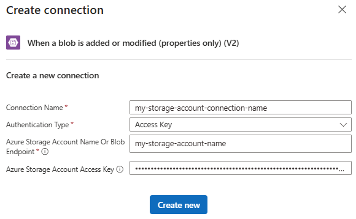](./media/connectors-create-api-azureblobstorage/consumption-trigger-create-connection.png#lightbox)

1. After the trigger information box appears, provide the necessary information.

   For the **Container** property value, select the folder icon to browse for your blob container. Or, enter the path manually using the syntax **/<*container-name*>**, for example:

   [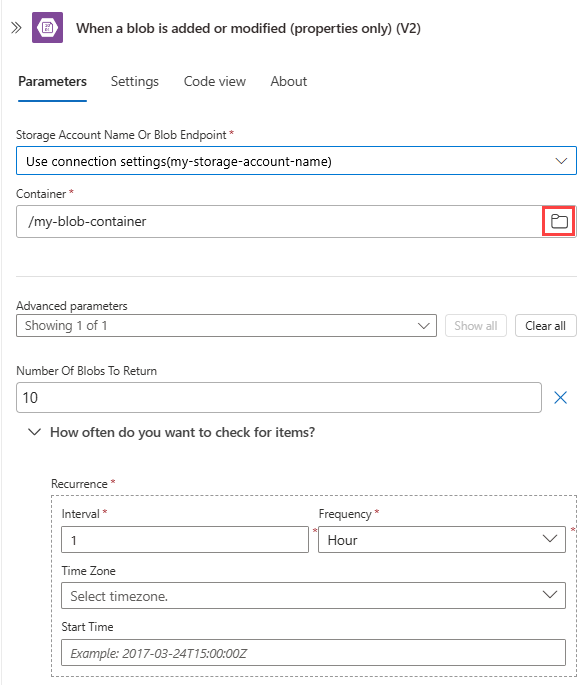](./media/connectors-create-api-azureblobstorage/consumption-trigger-information.png#lightbox)

1. To add other properties available for this trigger, open the **Add new parameter list**, and select the properties that you want.

   For more information, review [Azure Blob Storage managed connector trigger properties](/connectors/azureblobconnector/#when-a-blob-is-added-or-modified-(properties-only)-(v2)).

1. Add any other actions that your workflow requires.

1. When you're done, save your workflow. On the designer toolbar, select **Save**.

### [Standard](#tab/standard)

The steps to add and use a Blob trigger differ based on whether you want to use the built-in connector or the managed, Azure-hosted connector.

- [**Built-in trigger**](#built-in-connector-trigger): Describes the steps to add the built-in trigger.

- [**Managed trigger**](#managed-connector-trigger): Describes the steps to add the managed trigger.

<a name="built-in-connector-trigger"></a>

#### Built-in connector trigger

1. In the [Azure portal](https://portal.azure.com), open your Standard logic app and blank workflow in the designer.

1. In the designer, [follow these general steps to find and add the Azure Blob Storage built-in trigger you want](../logic-apps/create-workflow-with-trigger-or-action.md?tabs=standard#add-trigger).

   This example continues with the trigger named **When a blob is added or updated**.

1. If prompted, provide the following information for your connection to your storage account. When you're done, select **Create**.

   | Property | Required | Description |
   |----------|----------|-------------|
   | **Connection name** | Yes | A name for your connection |
   | **Authentication type** | Yes | The [authentication type](../storage/common/authorize-data-access.md) for your storage account. For more information, review [Authentication types for triggers and actions that support authentication - Secure access and data](../logic-apps/logic-apps-securing-a-logic-app.md#authentication-types-supported-triggers-actions). |

   For example, this connection uses connection string authentication and provides the connection string value for the storage account:

   | Property | Required | Value | Description |
   |----------|----------|-------|-------------|
   | **Storage account connection string** | Yes, <br>but only for connection string authentication | <*storage-account-connection-string*> | The connection string for your Azure storage account. <br><br>**Note**: To find the connection string, open your storage account resource in the Azure portal. In the resource menu, under **Security + networking**, select **Access keys** > **key1** > **Connection string** > **Show**. Copy and save the connection string for the primary key. |

   [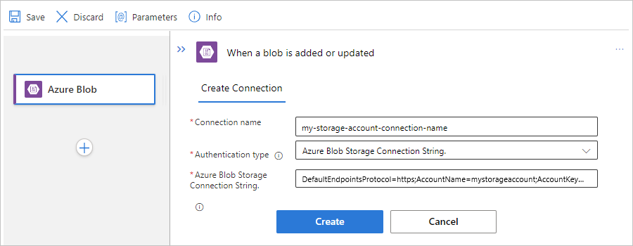](./media/connectors-create-api-azureblobstorage/standard-built-in-trigger-create-connection.png#lightbox)

1. After the trigger information box appears, provide the necessary information.

   For the **Blob path** property, enter the name of the folder that you want to monitor.

   1. To find the folder name, open your storage account in the Azure portal.

   1. In the navigation menu, under **Data Storage**, select **Containers**.

   1. Select your blob container. Find the name for the folder that you want to monitor.

   1. Return to the designer. In the **Blob path** property, enter the path for the container, folder, or blob, based on whether you're checking for new blobs or changes to an existing blob. The syntax varies based on the check that you want to run and any filtering that you want to use:

      | Task | Path syntax |
      |------|-------------|
      | Check the root folder and its nested subfolders for a newly added blob. | **<*container-name*>** |
      | Check the root folder for changes to a specific blob. | **<*container-name*>/<*blob-name*>.<*blob-extension*>** |
      | Check the root folder for changes to any blobs with the same extension, for example, **.txt**. | **<*container-name*>/{name}.txt** <br><br>**Important**: Make sure that you use **{name}** as a literal. |
      | Check the root folder for changes to any blobs with names starting with a specific string, for example, **Sample-**. | **<*container-name*>/Sample-{name}** <br><br>**Important**: Make sure that you use **{name}** as a literal. |
      | Check a subfolder for a newly added blob. | **<*container-name*>/<*subfolder*>/{blobname}.{blobextension}** <br><br>**Important**: Make sure that you use **{blobname}.{blobextension}** as a literal. |
      | Check a subfolder for changes to a specific blob. | **<*container-name*>/<*subfolder*>/<*blob-name*>.<*blob-extension*>** |

      For more syntax and filtering options, review [Azure Blob storage trigger for Azure Functions](../azure-functions/functions-bindings-storage-blob-trigger.md#blob-name-patterns).

      The following example shows a trigger setup that checks the root folder for a newly added blob:

      [](./media/connectors-create-api-azureblobstorage/standard-built-in-trigger-root-folder.png#lightbox)

      The following example shows a trigger setup that checks a subfolder for changes to an existing blob:

      [](./media/connectors-create-api-azureblobstorage/standard-built-in-trigger-subfolder-existing-blob.png#lightbox)

1. Add any other actions that your workflow requires.

1. When you're done, save your workflow. On the designer toolbar, select **Save**.

<a name="managed-connector-trigger"></a>

#### Managed connector trigger

1. In the [Azure portal](https://portal.azure.com), open your Standard logic app and blank workflow in the designer.

1. In the designer, [follow these general steps to find and add the Azure Blob Storage managed trigger you want](../logic-apps/create-workflow-with-trigger-or-action.md?tabs=standard#add-trigger).

   This example continues with the trigger named **When a blob is added or modified (properties only)**.

1. If prompted, provide the following information for your connection to your storage account. When you're done, select **Create**.

   | Property | Required | Description |
   |----------|----------|-------------|
   | **Connection name** | Yes | A name for your connection |
   | **Authentication Type** | Yes | The [authentication type](../storage/common/authorize-data-access.md) for your storage account. For more information, review [Authentication types for triggers and actions that support authentication - Secure access and data](../logic-apps/logic-apps-securing-a-logic-app.md#authentication-types-supported-triggers-actions). |

   For example, this connection uses access key authentication and provides the access key value for the storage account along with the following property values:

   | Property | Required | Value | Description |
   |----------|----------|-------|-------------|
   | **Azure Storage Account name** | Yes, <br>but only for access key authentication | <*storage-account-name*> | The name for the Azure storage account where your blob container exists. <br><br>**Note**: To find the storage account name, open your storage account resource in the Azure portal. In the resource menu, under **Security + networking**, select **Access keys**. Under **Storage account name**, copy and save the name. |
   | **Azure Storage Account Access Key** | Yes, <br>but only for access key authentication | <*storage-account-access-key*> | The access key for your Azure storage account. <br><br>**Note**: To find the access key, open your storage account resource in the Azure portal. In the resource menu, under **Security + networking**, select **Access keys** > **key1** > **Show**. Copy and save the primary key value. |

   [](./media/connectors-create-api-azureblobstorage/standard-managed-trigger-create-connection.png#lightbox)

1. After the trigger information box appears, provide the necessary information.

   For the **Container** property value, select the folder icon to browse for your blob storage container. Or, enter the path manually using the syntax **/<*container-name*>**, for example:

   [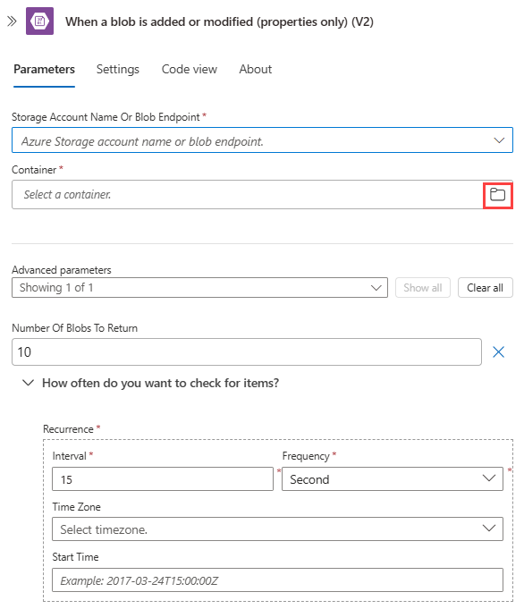](./media/connectors-create-api-azureblobstorage/standard-managed-trigger.png#lightbox)

1. To add other properties available for this trigger, open the **Add new parameter list** and select those properties. For more information, review [Azure Blob Storage managed connector trigger properties](/connectors/azureblobconnector/#when-a-blob-is-added-or-modified-(properties-only)-(v2)).

1. Add any other actions that your workflow requires.

1. When you're done, save your workflow. On the designer toolbar, select **Save**.

---

<a name="add-action"></a>

## Add a Blob action

A Consumption logic app workflow can use only the Azure Blob Storage managed connector. However, a Standard logic app workflow can use the Azure Blob Storage managed connector and the Azure blob built-in connector. Each version has multiple, but differently named actions. For example, both managed and built-in connector versions have their own actions to get file metadata and get file content.

- Managed connector actions: These actions run in a Consumption or Standard workflow.

- Built-in connector actions: These actions run only in a Standard workflow.

The following steps use the Azure portal, but with the appropriate Azure Logic Apps extension, you can also use the following tools to create and edit logic app workflows:

- Consumption logic app workflows: [Visual Studio](../logic-apps/quickstart-create-logic-apps-with-visual-studio.md) or [Visual Studio Code](../logic-apps/quickstart-create-logic-apps-visual-studio-code.md)

- Standard logic app workflows: [Visual Studio Code](../logic-apps/create-single-tenant-workflows-visual-studio-code.md)

### [Consumption](#tab/consumption)

1. In the [Azure portal](https://portal.azure.com), open your Consumption logic app and workflow in the designer.

1. If your workflow is blank, add the trigger that your scenario requires.

   This example uses the [**Recurrence** trigger](connectors-native-recurrence.md).

1. In the designer, [follow these general steps to find and add the Azure Blob Storage managed action you want](../logic-apps/create-workflow-with-trigger-or-action.md?tabs=consumption#add-action).

   This example continues with the action named **Get blob content**.

1. If prompted, provide the following information for your connection. When you're done, select **Create**.

   | Property | Required | Description |
   |----------|----------|-------------|
   | **Connection name** | Yes | A name for your connection |
   | **Authentication Type** | Yes | The [authentication type](../storage/common/authorize-data-access.md) for your storage account. For more information, review [Authentication types for triggers and actions that support authentication - Secure access and data](../logic-apps/logic-apps-securing-a-logic-app.md#authentication-types-supported-triggers-actions). |

   For example, this connection uses access key authentication and provides the access key value for the storage account along with the following property values:

   | Property | Required | Value | Description |
   |----------|----------|-------|-------------|
   | **Azure Storage Account name** | Yes, <br>but only for access key authentication | <*storage-account-name*> | The name for the Azure storage account where your blob container exists. <br><br>**Note**: To find the storage account name, open your storage account resource in the Azure portal. In the resource menu, under **Security + networking**, select **Access keys**. Under **Storage account name**, copy and save the name. |
   | **Azure Storage Account Access Key** | Yes, <br>but only for access key authentication | <*storage-account-access-key*> | The access key for your Azure storage account. <br><br>**Note**: To find the access key, open your storage account resource in the Azure portal. In the resource menu, under **Security + networking**, select **Access keys** > **key1** > **Show**. Copy and save the primary key value. |

   [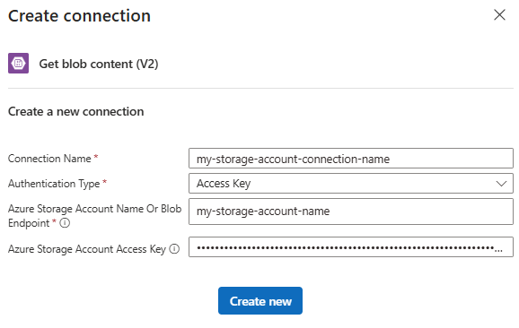](./media/connectors-create-api-azureblobstorage/consumption-action-create-connection.png#lightbox)

1. In the action information box, provide the necessary information.

   For example, in the **Get blob content** action, provide your storage account name. For the **Blob** property value, select the folder icon to browse for your storage container or folder. Or, enter the path manually.

   | Task | Blob path syntax |
   |------|------------------|
   | Get the content from a specific blob in the root folder. | **/<*container-name*>/<*blob-name*>** |
   | Get the content from a specific blob in a subfolder. | **/<*container-name*>/<*subfolder*>/<*blob-name*>** |

   The following example shows the action setup that gets the content from a blob in the root folder:

   [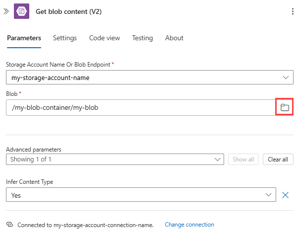](./media/connectors-create-api-azureblobstorage/consumption-action-root-folder.png#lightbox)

   The following example shows the action setup that gets the content from a blob in the subfolder:

   [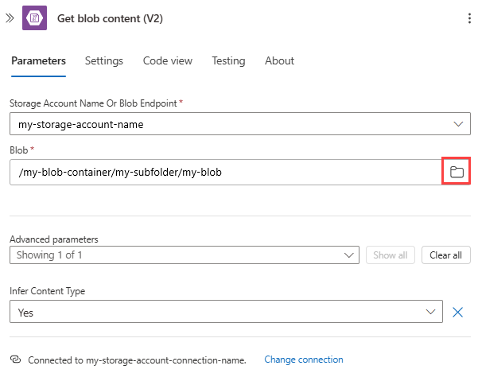](./media/connectors-create-api-azureblobstorage/consumption-action-sub-folder.png#lightbox)

1. Add any other actions that your workflow requires.

1. When you're done, save your workflow. On the designer toolbar, select **Save**.

### [Standard](#tab/standard)

The steps to add and use an Azure Blob action differ based on whether you want to use the built-in connector or the managed, Azure-hosted connector.

- [**Built-in action**](#built-in-connector-action): Describes the steps to add a built-in action.

- [**Managed action**](#managed-connector-action): Describes the steps to add a managed action.

<a name="built-in-connector-action"></a>

#### Built-in connector action

1. In the [Azure portal](https://portal.azure.com), open your Standard logic app and workflow in the designer.

1. If your workflow is blank, add the trigger that your scenario requires.

   This example uses the [**Recurrence** trigger](connectors-native-recurrence.md).

1. In the designer, [follow these general steps to find and add the Azure Blob Storage built-in action you want](../logic-apps/create-workflow-with-trigger-or-action.md?tabs=standard#add-action).

   This example continues with the action named **Read blob content**, which only reads the blob content. To later view the content, add a different action that creates a file with the blob content using another connector. For example, you can add a OneDrive action that creates a file based on the blob content.

1. If prompted, provide the following information for your connection to your storage account. When you're done, select **Create**.

   | Property | Required | Description |
   |----------|----------|-------------|
   | **Connection name** | Yes | A name for your connection |
   | **Authentication type** | Yes | The [authentication type](../storage/common/authorize-data-access.md) for your storage account. For more information, review [Authentication types for triggers and actions that support authentication - Secure access and data](../logic-apps/logic-apps-securing-a-logic-app.md#authentication-types-supported-triggers-actions). |

   For example, this connection uses connection string authentication and provides the connection string value for the storage account:

   | Property | Required | Value | Description |
   |----------|----------|-------|-------------|
   | **Storage account connection string** | Yes, <br>but only for connection string authentication | <*storage-account-connection-string*> | The connection string for your Azure storage account. <br><br>**Note**: To find the connection string, open your storage account resource in the Azure portal. In the resource menu, under **Security + networking**, select **Access keys** > **key1** > **Connection string** > **Show**. Copy and save the connection string for the primary key. |

   [](./media/connectors-create-api-azureblobstorage/standard-built-in-trigger-create-connection.png#lightbox)

1. In the action information box, provide the necessary information.

   For example, the **Read blob content** action requires the following property values:

   | Property | Required | Description |
   |----------|----------|-------------|
   | **Container name** | Yes | The name for the storage container that you want to use |
   | **Blob name** | Yes | The name or path for the blob that you want to use |

   The following example shows the information for a specific blob in the root folder:

   :::image type="content" source="./media/connectors-create-api-azureblobstorage/standard-built-in-action-root-folder.png" alt-text="Screenshot showing Standard workflow with Blob built-in action setup for root folder.":::

   The following example shows the information for a specific blob in a subfolder:

   :::image type="content" source="./media/connectors-create-api-azureblobstorage/standard-built-in-action-subfolder.png" alt-text="Screenshot showing Standard workflow with Blob built-in action setup for subfolder.":::

1. Add any other actions that your workflow requires.

1. When you're done, save your workflow. On the designer toolbar, select **Save**.

<a name="managed-connector-action"></a>

#### Managed connector action

1. In the [Azure portal](https://portal.azure.com), open your Standard logic app and workflow in the designer.

1. If your workflow is blank, add the trigger that your scenario requires.

   This example starts with the [**Recurrence** trigger](connectors-native-recurrence.md).

1. In the designer, [follow these general steps to find and add the Azure Blob Storage managed action you want](../logic-apps/create-workflow-with-trigger-or-action.md?tabs=standard#add-action).

   This example continues with the action named **Get blob content**.

1. If prompted, provide the following information for your connection to your storage account. When you're done, select **Create**.

   | Property | Required | Description |
   |----------|----------|-------------|
   | **Connection name** | Yes | A name for your connection |
   | **Authentication type** | Yes | The [authentication type](../storage/common/authorize-data-access.md) for your storage account. For more information, review [Authentication types for triggers and actions that support authentication - Secure access and data](../logic-apps/logic-apps-securing-a-logic-app.md#authentication-types-supported-triggers-actions). |

   For example, this connection uses access key authentication and provides the access key value for the storage account along with the following property values:

   | Property | Required | Value | Description |
   |----------|----------|-------|-------------|
   | **Azure Storage Account name** | Yes, <br>but only for access key authentication | <*storage-account-name*> | The name for the Azure storage account where your blob container exists. <br><br>**Note**: To find the storage account name, open your storage account resource in the Azure portal. In the resource menu, under **Security + networking**, select **Access keys**. Under **Storage account name**, copy and save the name. |
   | **Azure Storage Account Access Key** | Yes, <br>but only for access key authentication | <*storage-account-access-key*> | The access key for your Azure storage account. <br><br>**Note**: To find the access key, open your storage account resource in the Azure portal. In the resource menu, under **Security + networking**, select **Access keys** > **key1** > **Show**. Copy and save the primary key value. |

   [](./media/connectors-create-api-azureblobstorage/standard-managed-action-create-connection.png#lightbox)

1. In the action information box, provide the necessary information.

   For example, in the **Get blob content** action, provide your storage account name. For the **Blob** property value, select the folder icon to browse for your storage container or folder. Or, enter the path manually.

   | Task | Blob path syntax |
   |------|------------------|
   | Get the content from a specific blob in the root folder. | **/<*container-name*>/<*blob-name*>** |
   | Get the content from a specific blob in a subfolder. | **/<*container-name*>/<*subfolder*>/<*blob-name*>** |

   The following example shows the action setup that gets the content from a blob in the root folder:

   [](./media/connectors-create-api-azureblobstorage/standard-managed-action-root-folder.png#lightbox)

   The following example shows the action setup that gets the content from a blob in the subfolder:

   [](./media/connectors-create-api-azureblobstorage/standard-managed-action-sub-folder.png#lightbox)

1. Add any other actions that your workflow requires.

1. When you're done, save your workflow. On the designer toolbar, select **Save**.

---

## Access storage accounts behind firewalls

You can add network security to an Azure storage account by [restricting access with a firewall and firewall rules](../storage/common/storage-network-security.md). However, this setup creates a challenge for Azure and other Microsoft services that need access to the storage account. Local communication in the data center abstracts the internal IP addresses, so just permitting traffic through IP addresses might not be enough to successfully allow communication across the firewall. Based on which Azure Blob Storage connector you use, the following options are available:

- To access storage accounts behind firewalls using the Azure Blob Storage managed connector in Consumption and ISE-based logic apps, review the following documentation:

  - [Access storage accounts in same region with system-managed identities](#access-blob-storage-in-same-region-with-system-managed-identities)

  - [Access storage accounts in other regions](#access-storage-accounts-in-other-regions)

- To access storage accounts behind firewalls using the ISE-versioned Azure Blob Storage connector that's only available in an ISE-based logic app, review [Access storage accounts through trusted virtual network](#access-storage-accounts-through-trusted-virtual-network).

- To access storage accounts behind firewalls in Standard logic apps, review the following documentation:

  - Azure Blob Storage *built-in* connector: [Access storage accounts through virtual network integration](#access-storage-accounts-through-virtual-network-integration)

  - Azure Blob Storage *managed* connector: [Access storage accounts in other regions](#access-storage-accounts-in-other-regions)

### Access storage accounts in other regions

If you don't use managed identity authentication, logic app workflows can't directly access storage accounts behind firewalls when both the logic app resource and storage account exist in the same region. As a workaround, put your logic app resource in a different region than your storage account. Then, give access to the [outbound IP addresses for the managed connectors in your region](/connectors/common/outbound-ip-addresses#azure-logic-apps).

> [!NOTE]
> This solution doesn't apply to the Azure Table Storage connector and Azure Queue Storage connector. 
> Instead, to access your Table Storage or Queue Storage, [use the built-in HTTP trigger and action](../logic-apps/logic-apps-http-endpoint.md).

To add your outbound IP addresses to the storage account firewall, follow these steps:

1. Note the [managed connector outbound IP addresses](/connectors/common/outbound-ip-addresses#azure-logic-apps) for your logic app resource's region.

1. In the [Azure portal](https://portal.azure.com), find and open your storage account resource.

1. On the storage account navigation menu, under **Security + networking**, select **Networking**.

   1. Under **Allow access from**, select **Selected networks**, which shows the relevant settings.

   1. Under **Firewall**, add the IP addresses or ranges that need access. If you need to access the storage account from your computer, select **Add your client IP address**.

      [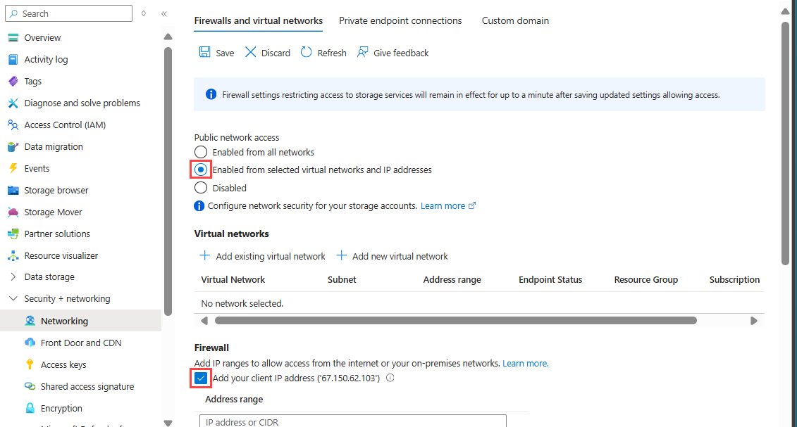](./media/connectors-create-api-azureblobstorage/storage-ip-configure.png#lightbox)

   1. When you're done, select **Save**.

### Access storage accounts through trusted virtual network

- Your logic app and storage account exist in the same region.

  You can put your storage account in an Azure virtual network by creating a private endpoint, and then add that virtual network to the trusted virtual networks list. To give your logic app access to the storage account through a [trusted virtual network](../virtual-network/virtual-networks-overview.md), you need to deploy that logic app to an [integration service environment (ISE)](../logic-apps/connect-virtual-network-vnet-isolated-environment-overview.md), which can connect to resources in a virtual network. You can then add the subnets in that ISE to the trusted list. ISE-based storage connectors, such as the ISE-versioned Azure Blob Storage connector, can directly access the storage container. This setup is the same experience as using the service endpoints from an ISE.

- Your logic app and storage account exist in different regions.

  You don't have to create a private endpoint. You can just permit traffic through the ISE outbound IPs on the storage account.

### Access storage accounts through virtual network integration

- Your logic app and storage account exist in the same region.

  You can put the storage account in an Azure virtual network by creating a private endpoint, and then add that virtual network to the trusted virtual networks list. To give your logic app access to the storage account, you have to [Set up outbound traffic using virtual network integration](../logic-apps/secure-single-tenant-workflow-virtual-network-private-endpoint.md#set-up-outbound) to enable connecting to resources in a virtual network. You can then add the virtual network to the storage account's trusted virtual networks list.

- Your logic app and storage account exist in different regions.

  You don't have to create a private endpoint. You can just permit traffic through the ISE outbound IPs on the storage account.

### Access Blob Storage in same region with system-managed identities

To connect to Azure Blob Storage in any region, you can use [managed identities for authentication](../active-directory/managed-identities-azure-resources/overview.md). You can create an exception that gives Microsoft trusted services, such as a managed identity, access to your storage account through a firewall.

  > [!NOTE]
  >
  > This solution doesn't apply to Standard logic apps. Even if you use a system-assigned managed identity with a Standard logic app, 
  > the Azure Blob Storage managed connector can't connect to a storage account in the same region.

To use managed identities in your logic app to access Blob Storage, follow these steps:

1. [Configure access to your storage account](#configure-storage-account-access).

1. [Create a role assignment for your logic app](#create-role-assignment-logic-app).

1. [Enable support for the managed identity in your logic app](#enable-managed-identity-support).

> [!NOTE]
>
> This solution has the following limitations:
>
> To authenticate your storage account connection, you have to set up a system-assigned managed identity. 
> A user-assigned managed identity won't work.

#### Configure storage account access

To set up the exception and managed identity support, first configure appropriate access to your storage account:

1. In the [Azure portal](https://portal.azure.com), find and open your storage account resource.

1. On the storage account navigation menu, under **Security + networking**, select **Networking**.

   1. Under **Allow access from**, select **Selected networks**, which shows the relevant settings.

   1. If you need to access the storage account from your computer, under **Firewall**, select **Add your client IP address**.

   1. Under **Exceptions**, select **Allow trusted Microsoft services to access this storage account**.

      [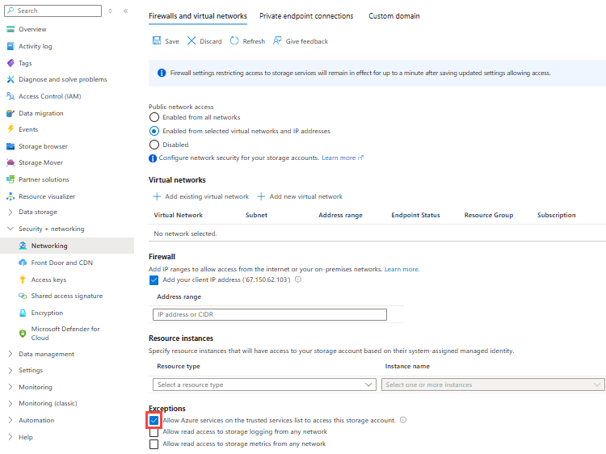](./media/connectors-create-api-azureblobstorage/storage-networking-configure.png#lightbox)

   1. When you're done, select **Save**.

> [!NOTE]
> If you receive a **403 Forbidden** error when you try to connect to the storage account from your workflow, 
> multiple possible causes exist. Try the following resolution before moving on to additional steps. First, 
> disable the setting **Allow trusted Microsoft services to access this storage account** and save your changes. 
> Then, re-enable the setting, and save your changes again.

<a name="create-role-assignment-logic-app"></a>

#### Create role assignment for logic app

Next, [enable managed identity support](../logic-apps/create-managed-service-identity.md) on your logic app resource.

The following steps are the same for Consumption logic apps in multi-tenant environments and Standard logic apps in single-tenant environments.

1. In the [Azure portal](https://portal.azure.com), open your logic app resource.

1. On the logic app resource navigation menu, under **Settings**, select **Identity.**

1. On the **System assigned** pane, set **Status** to **On**, if not already enabled, select **Save**, and confirm your changes. Under **Permissions**, select **Azure role assignments**.

   [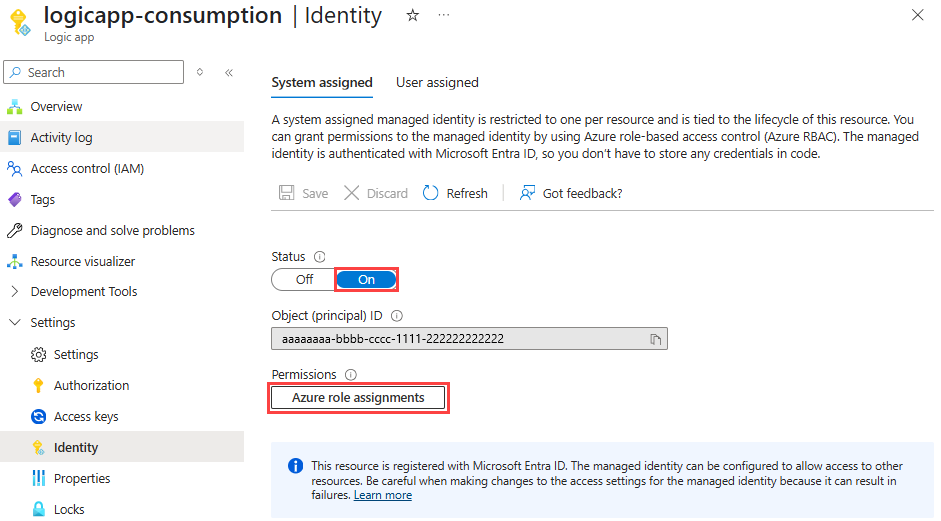](./media/connectors-create-api-azureblobstorage/role-assignment-add-1.png#lightbox)

1. On the **Azure role assignments** pane, select **Add role assignment**.

   [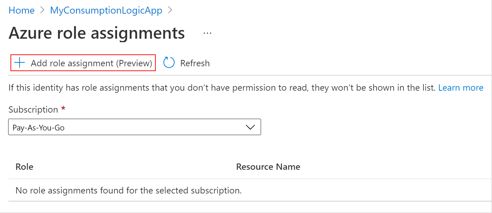](./media/connectors-create-api-azureblobstorage/role-assignment-add-2.png#lightbox)

1. On the **Add role assignments** pane, set up the new role assignment with the following values:

   | Property | Value | Description |
   |----------|-------|-------------|
   | **Scope** | <*resource-scope*> | The resource set where you want to apply the role assignment. For this example, select **Storage**. |
   | **Subscription** | <*Azure-subscription*> | The Azure subscription for your storage account. |
   | **Resource** | <*storage-account-name*> | The name for the storage account that you want to access from your logic app workflow. |
   | **Role** | <*role-to-assign*> | The role that your scenario requires for your workflow to work with the resource. This example requires **Storage Blob Data Contributor**, which allows read, write, and delete access to blob containers and date. For permissions details, move your mouse over the information icon next to a role in the drop-down menu. |

   [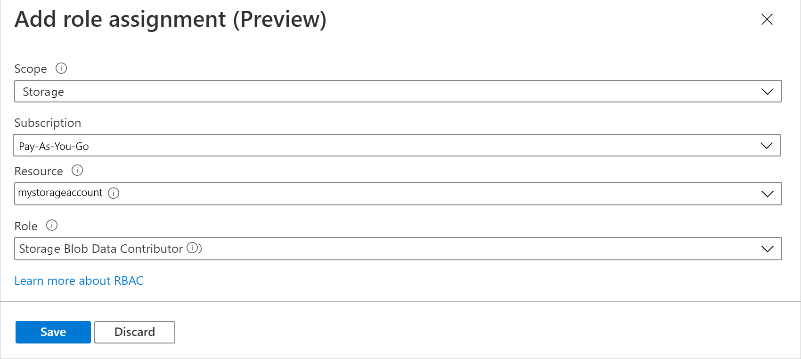](./media/connectors-create-api-azureblobstorage/role-assignment-configure.png#lightbox)

1. When you're done, select **Save** to finish creating the role assignment.

<a name="enable-managed-identity-support"></a>

#### Enable managed identity support on logic app

Next, complete the following steps:

1. If you have a blank workflow, add an Azure Blob Storage connector trigger. Otherwise, add an Azure Blob Storage connector action. Make sure that you create a new connection for the trigger or action, rather than use an existing connection.

1. Make sure that you [set the authentication type to use the managed identity](../logic-apps/create-managed-service-identity.md#authenticate-access-with-managed-identity).

1. After you configure the trigger or action, you can save the workflow and test the trigger or action.

## Troubleshoot problems with accessing storage accounts

- **"This request is not authorized to perform this operation."**

  The following error is a commonly reported problem that happens when your logic app and storage account exist in the same region. However, options are available to resolve this limitation as described in the section, [Access storage accounts behind firewalls](#access-storage-accounts-behind-firewalls).

  ```json
  {
     "status": 403,
     "message": "This request is not authorized to perform this operation.\\r\\nclientRequestId: a3da2269-7120-44b4-9fe5-ede7a9b0fbb8",
     "error": {
        "message": "This request is not authorized to perform this operation."
     },
     "source": "azureblob-ase.azconn-ase.p.azurewebsites.net"
  }
  ```

## Application Insights errors

- **404** and **409** errors

  If your Standard workflow uses an Azure Blob built-in action that adds a blob to your storage container, you might get **404** and **409** errors in Application Insights for failed requests. These errors are expected because the connector checks whether the blob file exists before adding the blob. The errors result when the file doesn't exist. Despite these errors, the built-in action successfully adds the blob.

## Next steps

- [Managed connectors in Azure Logic Apps](/connectors/connector-reference/connector-reference-logicapps-connectors)
- [Built-in connectors in Azure Logic Apps](built-in.md)