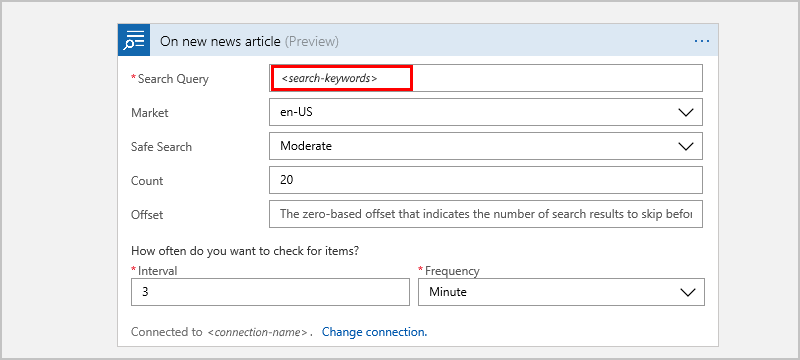
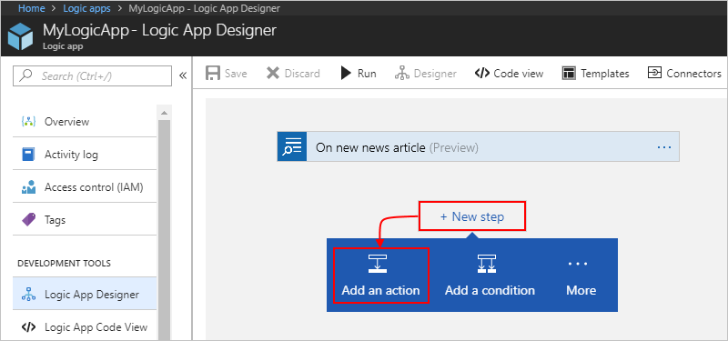
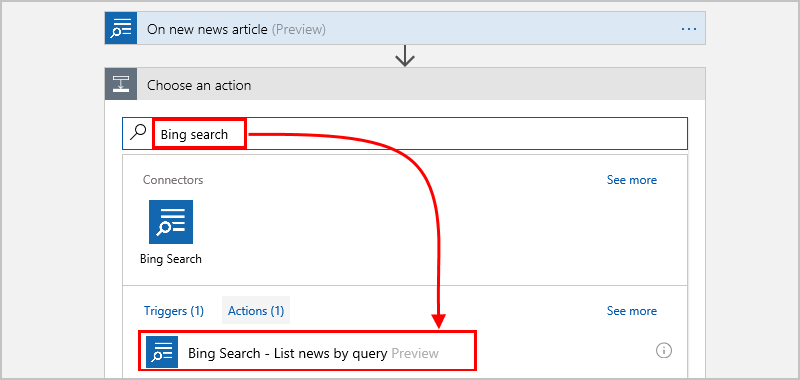
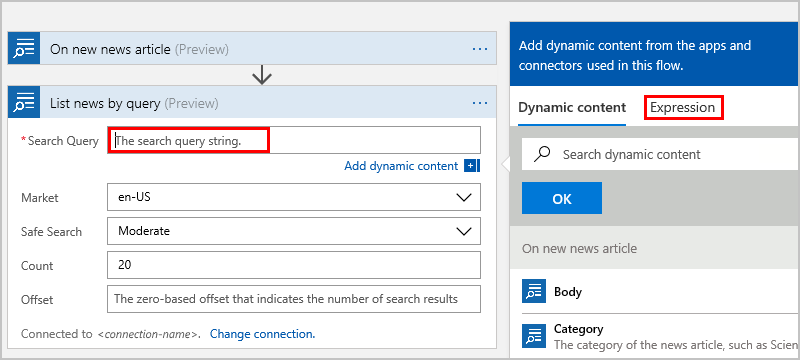
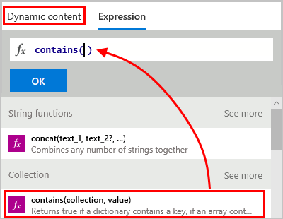
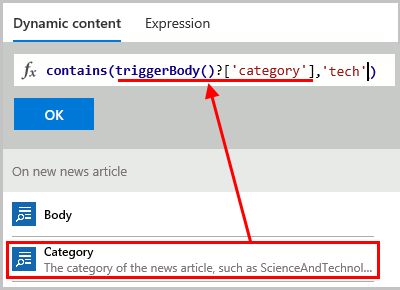
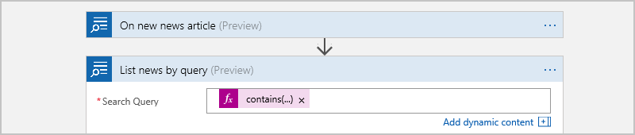
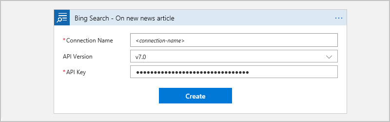

# Find news with Bing Search and Azure Logic Apps

This article shows how you can find news, videos, and other items through 
Bing Search from inside a logic app with the Bing Search connector. 
That way, you can create logic apps that automate tasks and workflows 
for processing search results and make those items available for other actions. 

For example, you can find news items based on search criteria, 
and have Twitter post those items as tweets in your Twitter feed.

If you don't have an Azure subscription, 
<a href="https://azure.microsoft.com/free/" target="_blank">sign up for a free Azure account</a>. 
If you're new to logic apps, review 
[What is Azure Logic Apps](../logic-apps/logic-apps-overview.md) 
and [Quickstart: Create your first logic app](../logic-apps/quickstart-create-first-logic-app-workflow.md).
For connector-specific technical information, see the 
<a href="https://docs.microsoft.com/connectors/bingsearch/" target="blank">Bing Search connector reference</a>.

## Prerequisites

* A [Cognitive Services account](../cognitive-services/cognitive-services-apis-create-account.md)

* A [Bing Search API key](https://azure.microsoft.com/try/cognitive-services/?api=bing-news-search-api), 
which provides access from your logic app to the Bing Search APIs

* The logic app where you want to access your Event Hub. 
To start your logic app with a Bing Search trigger, you need a 
[blank logic app](../logic-apps/quickstart-create-first-logic-app-workflow.md).

## Add a Bing Search trigger

In Azure Logic Apps, every logic app must start with a 
[trigger](../logic-apps/logic-apps-overview.md#logic-app-concepts), 
which fires when a specific event happens or when a 
specific condition is met. Each time the trigger fires, 
the Logic Apps engine creates a logic app instance 
and starts running your app's workflow.

1. In the Azure portal or Visual Studio, 
create a blank logic app, which opens Logic App Designer. 
This example uses the Azure portal.

2. In the search box, enter "Bing search" as your filter. 
From the triggers list, select the trigger you want.

   This example uses this trigger: 
   **Bing Search - On new news article**

   

3. If you're prompted for connection details, 
[create your Bing Search connection now](#create-connection).
Or, if your connection already exists, 
provide the necessary information for the trigger.

   For this example, provide criteria for returning 
   matching news articles from Bing Search.

   | Property | Required | Value | Description |
   |----------|----------|-------|-------------|
   | Search Query | Yes | <*search-words*> | Enter the search keywords you want to use. |
   | Market | Yes | <*locale*> | The search locale. The default is "en-US", but you can select another value. |
   | Safe Search | Yes | <*search-level*> | The filter level for excluding adult content. The default is "Moderate", but you select another level. |
   | Count | No | <*results-count*> | Return the specified number of results. The default is 20, but you can specify another value. The actual number of returned results might be less than the specified number. |
   | Offset | No | <*skip-value*> | The number of results to skip before returning results |
   |||||

   For example:

   

4. Select the interval and frequency for how often 
you want the trigger to check for results.

5. When you're done, on the designer toolbar, choose **Save**.

6. Now continue adding one or more actions to your logic app 
for the tasks you want to perform with the trigger results.

## Add a Bing Search action

In Azure Logic Apps, an [action](../logic-apps/logic-apps-overview.md#logic-app-concepts) 
is a step in your workflow that follows a trigger or another action. 
For this example, the logic app starts with a Bing Search trigger 
that returns news articles matching the specified criteria.

1. In the Azure portal or Visual Studio, 
open your logic app in Logic App Designer. 
This example uses the Azure portal.

2. Under the trigger or action, choose **New step** > **Add an action**.

   This example uses this trigger:

   **Bing Search - On new news article**

   

   To add an action between existing steps, 
   move your mouse over the connecting arrow. 
   Choose the plus sign (**+**) that appears, 
   and then choose **Add an action**.

3. In the search box, enter "Bing search" as your filter.
From the actions list, select the action you want.

   This example uses this action:

   **Bing Search - List news by query**

   

4. If you're prompted for connection details, 
[create your Bing Search connection now](#create-connection). 
Or, if your connection already exists, 
provide the necessary information for the action.

   For this example, provide the criteria for 
   returning a subset of the trigger's results.

   | Property | Required | Value | Description |
   |----------|----------|-------|-------------|
   | Search Query | Yes | <*search-expression*> | Enter an expression for querying the trigger results. You can select from the fields in the dynamic content list, or create an expression with the expression builder. |
   | Market | Yes | <*locale*> | The search locale. The default is "en-US", but you can select another value. |
   | Safe Search | Yes | <*search-level*> | The filter level for excluding adult content. The default is "Moderate", but you select another level. |
   | Count | No | <*results-count*> | Return the specified number of results. The default is 20, but you can specify another value. The actual number of returned results might be less than the specified number. |
   | Offset | No | <*skip-value*> | The number of results to skip before returning results |
   |||||

   For example, suppose you want those results whose category 
   name includes the word "tech".

   1. Click in the **Search Query** box so the dynamic content list appears. 
   From that list, choose **Expression** so the expression builder appears. 

      

      Now you can start creating your expression.

   2. From the functions list, select the **contains()** function, 
   which then appears in the expression box. Click **Dynamic content** 
   so that the field list reappears, but make sure your cursor stays 
   inside the parentheses.

      

   3. From the field list, select **Category**, which converts to a parameter. 
   Add a comma after the first parameter, and after the comma, add this word: `'tech'` 

      

   4. When you're done, choose **OK**.

      The expression now appears in the **Search Query** box in this format:

      

      In code view, this expression appears in this format:

      `"@{contains(triggerBody()?['category'],'tech')}"`

5. When you're done, on the designer toolbar, choose **Save**.

## Connect to Bing Search

[!INCLUDE [Create connection general intro](../../includes/connectors-create-connection-general-intro.md)]

1. When you're prompted for connection information, 
provide these details:

   | Property | Required | Value | Description |
   |----------|----------|-------|-------------|
   | Connection Name | Yes | <*connection-name*> | The name to create for your connection |
   | API Version | Yes | <*API-version*> | By default, the Bing Search API version is set to the current version. You can select an earlier version as necessary. |
   | API Key | Yes | <*API-key*> | The Bing Search API key that you got earlier. If you don't have a key, get your [API key now](https://azure.microsoft.com/try/cognitive-services/?api=bing-news-search-api). |  
   |||||  

   For example:

   

2. When you're done, choose **Create**.

## Connector reference

For technical details, such as triggers, actions, and limits, 
as described by the connector's OpenAPI (formerly Swagger) file, 
see the [connector's reference page](/connectors/bingsearch/).

## Get support

* For questions, visit the [Azure Logic Apps forum](https://social.msdn.microsoft.com/Forums/en-US/home?forum=azurelogicapps).
* To submit or vote on feature ideas, visit the [Logic Apps user feedback site](https://aka.ms/logicapps-wish).

## Next steps

* Learn about other [Logic Apps connectors](../connectors/apis-list.md)
