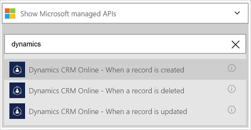
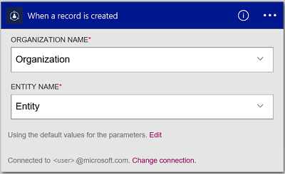
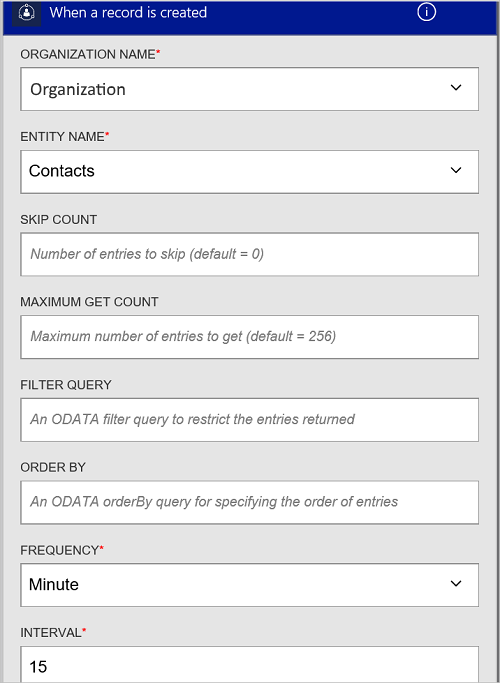
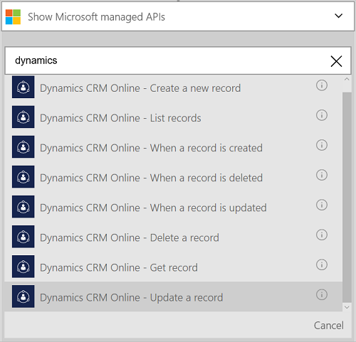
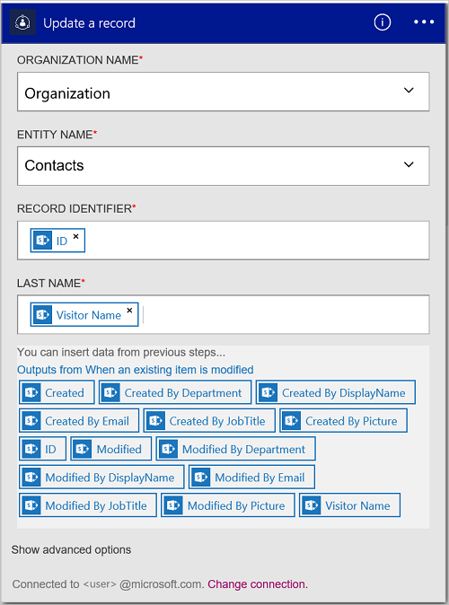

---
title: Add the Dynamics CRM Online connector to your Logic Apps | Microsoft Docs
description: Create Logic apps with Azure App service. The Dynamics CRM Online Connection Provider provides an API to work with entities on Dynamics CRM Online.
services: logic-apps
documentationcenter: ''
author: MandiOhlinger
manager: erikre
editor: ''
tags: connectors

ms.assetid: 0dc2abef-7d2c-4a2d-87ca-fad21367d135
ms.service: logic-apps
ms.devlang: na
ms.topic: article
ms.tgt_pltfrm: na
ms.workload: integration
ms.date: 08/15/2016
ms.author: mandia

---
# Get started with the Dynamics CRM Online connector
Connect to Dynamics CRM Online to create a new record, update an item, and more. With CRM Online, you can:

* Build your business flow based on the data you get from CRM Online. 
* Use actions that delete a record, get entities, and more. These actions get a response, and then make the output available for other actions. For example, when an item is updated in CRM, you can send an email using Office 365.

This topic shows you how to use the Dynamics CRM Online connector in a logic app, and also lists the triggers and actions.

> [!NOTE]
> This version of the article applies to Logic Apps general availability (GA).
> 
> 

To learn more about Logic Apps, see [What are logic apps](../app-service-logic/app-service-logic-what-are-logic-apps.md) and [create a logic app](../app-service-logic/app-service-logic-create-a-logic-app.md).

## Connect to Dynamics CRM Online
Before your logic app can access any service, you first create a *connection* to the service. A connection provides connectivity between a logic app and another service. For example, to connect to Dynamics, you first need a Dynamics CRM Online *connection*. To create a connection, enter the credentials you normally use to access the service you wish to connect to. So with Dynamics, enter the credentials to your Dynamics CRM Online account to create the connection.

### Create the connection
> [!INCLUDE [Steps to create a connection to Dynamics CRM Online Connection Provider](../../includes/connectors-create-api-crmonline.md)]
> 
> 

## Use a trigger
A trigger is an event that can be used to start the workflow defined in a logic app. Triggers "poll" the service at an interval and frequency that you want. [Learn more about triggers](../app-service-logic/app-service-logic-what-are-logic-apps.md#logic-app-concepts).

1. In the logic app, type "dynamics" to get a list of the triggers:  
   
    
2. Select **Dynamics CRM Online - When a record is created**. If a connection already exists, then select an organization and entity from the drop-down list.
   
    
   
    If you are prompted to sign in, then enter the sign in details to create the connection. [Create the connection](connectors-create-api-crmonline.md#create-the-connection) in this topic lists the steps. 
   
   > [!NOTE]
   > In this example, the logic app runs when a record is created. To see the results of this trigger, add another action that sends you an email. For example, add the Office 365 *Send an email* action that emails you when the new record is added. 
   > 
   > 
3. Select the **Edit** button and set the **Frequency** and **Interval** values. For example, if you want the trigger to poll every 15 minutes, then set the **Frequency** to **Minute**, and set the **Interval** to **15**. 
   
    
4. **Save** your changes (top left corner of the toolbar). Your logic app is saved and may be automatically enabled.

## Use an action
An action is an operation carried out by the workflow defined in a logic app. [Learn more about actions](../app-service-logic/app-service-logic-what-are-logic-apps.md#logic-app-concepts).

1. Select the plus sign. You see several choices: **Add an action**, **Add a condition**, or one of the **More** options.
   
    
2. Choose **Add an action**.
3. In the text box, type “dynamics” to get a list of all the available actions.
   
    
4. In our example, choose **Dynamics CRM Online - Update a record**. If a connection already exists, then choose the **Organization Name**, **Entity Name**, and other properties:  
   
    
   
    If you are prompted for the connection information, then enter the details to create the connection. [Create the connection](connectors-create-api-crmonline.md#create-the-connection) in this topic describes these properties. 
   
   > [!NOTE]
   > In this example, we update an existing record in CRM Online. You can use output from another trigger to update the record. For example, add the SharePoint *When an existing item is modified* trigger. Then add the CRM Online *Update a record* action that uses the SharePoint fields to update the existing record in CRM Online. 
   > 
   > 
5. **Save** your changes (top left corner of the toolbar). Your logic app is saved and may be automatically enabled.

## Technical Details
## Triggers
| Trigger | Description |
| --- | --- |
| [When a record is created](connectors-create-api-crmonline.md#when-a-record-is-created) |Triggers a flow when an object is created in CRM. |
| [When a record is updated](connectors-create-api-crmonline.md#when-a-record-is-updated) |Triggers a flow when an object is modified in CRM. |
| [When a record is deleted](connectors-create-api-crmonline.md#when-a-record-is-deleted) |Triggers a flow when an object is deleted in CRM. |

## Actions
| Action | Description |
| --- | --- |
| [List records](connectors-create-api-crmonline.md#list-records) |This operation gets the records for an entity. |
| [Create a new record](connectors-create-api-crmonline.md#create-a-new-record) |This operation creates a new record of an entity. |
| [Get record](connectors-create-api-crmonline.md#get-record) |This operation gets the specified record for an entity. |
| [Delete a record](connectors-create-api-crmonline.md#delete-a-record) |This operation deletes a record from an entity collection. |
| [Update a record](connectors-create-api-crmonline.md#update-a-record) |This operation updates an existing record for an entity. |

### Trigger and Action details
In this section, see the specific details about each trigger and action, including any required or optional input properties, and any corresponding output associated with the connector.

#### When a record is created
Triggers a flow when an object is created in CRM. 

| Property name | Display name | Description |
| --- | --- | --- |
| dataset* |Organization Name |Name of the CRM organization like Contoso |
| table* |Entity Name |Name of the entity |
| $skip |Skip Count |Number of entries to skip (default = 0) |
| $top |Maximum Get Count |Maximum number of entries to get (default = 256) |
| $filter |Filter Query |An ODATA filter query to restrict the entries returned |
| $orderby |Order By |An ODATA orderBy query for specifying the order of entries |

An asterisk (*) means the property is required.

##### Output Details
ItemsList

| Property Name | Data Type |
| --- | --- |
| value |array |

#### When a record is updated
Triggers a flow when an object is modified in CRM. 

| Property name | Display name | Description |
| --- | --- | --- |
| dataset* |Organization Name |Name of the CRM organization like Contoso |
| table* |Entity Name |Name of the entity |
| $skip |Skip Count |Number of entries to skip (default = 0) |
| $top |Maximum Get Count |Maximum number of entries to get (default = 256) |
| $filter |Filter Query |An ODATA filter query to restrict the entries returned |
| $orderby |Order By |An ODATA orderBy query for specifying the order of entries |

An asterisk (*) means the property is required.

##### Output Details
ItemsList

| Property Name | Data Type |
| --- | --- |
| value |array |

#### When a record is deleted
Triggers a flow when an object is deleted in CRM. 

| Property name | Display name | Description |
| --- | --- | --- |
| dataset* |Organization Name |Name of the CRM organization like Contoso |
| table* |Entity Name |Name of the entity |
| $skip |Skip Count |Number of entries to skip (default = 0) |
| $top |Maximum Get Count |Maximum number of entries to get (default = 256) |
| $filter |Filter Query |An ODATA filter query to restrict the entries returned |
| $orderby |Order By |An ODATA orderBy query for specifying the order of entries |

An asterisk (*) means the property is required.

##### Output Details
ItemsList

| Property Name | Data Type |
| --- | --- |
| value |array |

#### List records
This operation gets the records for an entity. 

| Property name | Display name | Description |
| --- | --- | --- |
| dataset* |Organization Name |Name of the CRM organization like Contoso |
| table* |Entity Name |Name of the entity |
| $skip |Skip Count |Number of entries to skip (default = 0) |
| $top |Maximum Get Count |Maximum number of entries to get (default = 256) |
| $filter |Filter Query |An ODATA filter query to restrict the entries returned |
| $orderby |Order By |An ODATA orderBy query for specifying the order of entries |

An asterisk (*) means the property is required.

##### Output Details
ItemsList

| Property Name | Data Type |
| --- | --- |
| value |array |

#### Create a new record
This operation creates a new record of an entity. 

| Property name | Display name | Description |
| --- | --- | --- |
| dataset* |Organization Name |Name of the CRM organization like Contoso |
| table* |Entity Name |Name of the entity |

An asterisk (*) means the property is required.

##### Output Details
None.

#### Get record
This operation gets the specified record for an entity. 

| Property name | Display name | Description |
| --- | --- | --- |
| dataset* |Organization Name |Name of the CRM organization like Contoso |
| table* |Entity Name |Name of the entity |
| id* |Item identifier |Specify the Identifier for the record |

An asterisk (*) means the property is required.

##### Output Details
None.

#### Delete a record
This operation deletes a record from an entity collection. 

| Property name | Display name | Description |
| --- | --- | --- |
| dataset* |Organization Name |Name of the CRM organization like Contoso |
| table* |Entity Name |Name of the entity |
| id* |Item identifier |Specify the identifier for the record |

An asterisk (*) means the property is required.

#### Update a record
This operation updates an existing record for an entity. 

| Property name | Display name | Description |
| --- | --- | --- |
| dataset* |Organization Name |Name of the CRM organization like Contoso |
| table* |Entity Name |Name of the entity |
| id* |Record identifier |Specify the identifier for the record |

An asterisk (*) means the property is required.

##### Output Details
None.

## HTTP responses
The actions and triggers can return one or more of the following HTTP status codes: 

| Name | Description |
| --- | --- |
| 200 |OK |
| 202 |Accepted |
| 400 |Bad Request |
| 401 |Unauthorized |
| 403 |Forbidden |
| 404 |Not Found |
| 500 |Internal Server Error. Unknown error occurred. |
| default |Operation Failed. |

## Next Steps
[Create a logic app](../app-service-logic/app-service-logic-create-a-logic-app.md). Explore the other available connectors in Logic Apps at our [APIs list](apis-list.md).

