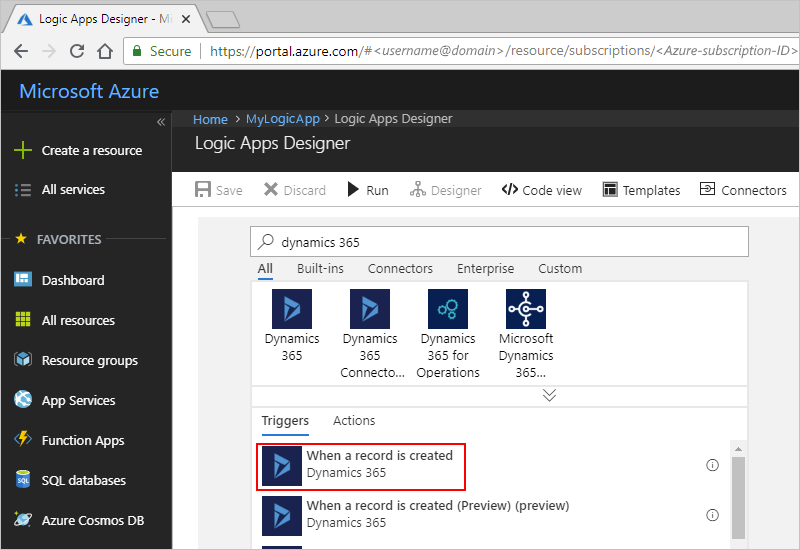
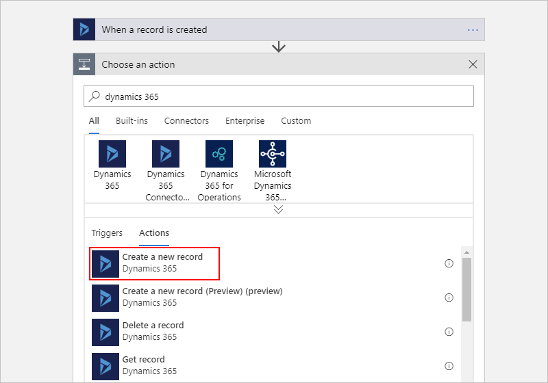
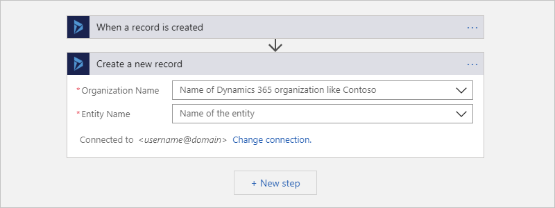
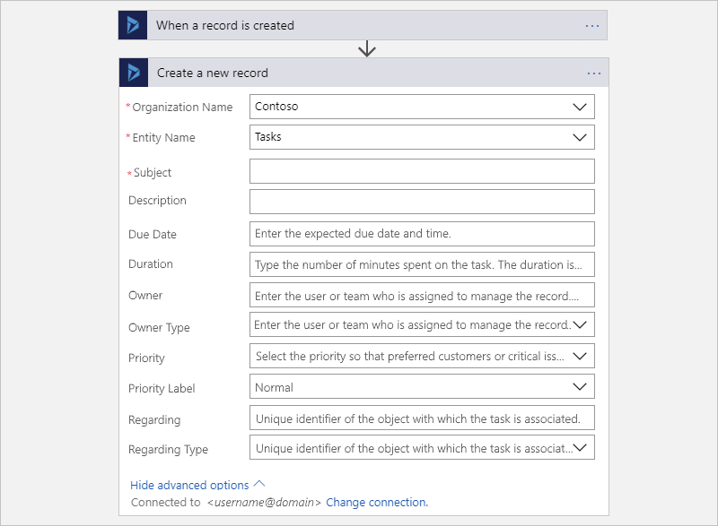
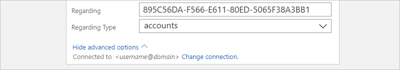

# Create and manage records in Dynamics 365 with Azure Logic Apps

With Azure Logic Apps and the Dynamics 365 connector, 
you can create automated tasks and workflows based on 
the data you get from Dynamics 365. Your workflows can create records, 
update items, return records, and more in your Dynamics 365 account. 
You can include actions in your logic apps that get responses from 
Dynamics 365 and make the output available for other actions. 
For example, when an item is updated in Dynamics 365, 
you can send an email using Office 365.

This article shows how you create a logic app that creates a task 
in Dynamics 365 whenever a new lead record is created in Dynamics 365.
If you're new to logic apps, review 
[What is Azure Logic Apps](../logic-apps/logic-apps-overview.md).

## Prerequisites

* An Azure subscription. If you don't have an Azure subscription, 
<a href="https://azure.microsoft.com/free/" target="_blank">sign up for a free Azure account</a>. 

* A [Dynamics 365 account](https://dynamics.microsoft.com)

* The logic app where you want to access your Dynamics 365 account. 
To start your logic app with an Dynamics 365 trigger, you need a 
[blank logic app](../logic-apps/quickstart-create-first-logic-app-workflow.md). 

* Basic knowledge about 
[how to create logic apps](../logic-apps/quickstart-create-first-logic-app-workflow.md)

## Add Dynamics 365 trigger

[!INCLUDE [Create connection general intro](../../includes/connectors-create-connection-general-intro.md)]

Add a trigger that detects when a new lead record appears in Dynamics 365.

1. In the [Azure portal](https://portal.azure.com), 
open your blank logic app in Logic App Designer, if not open already.

1. In the search box, enter `Dynamics 365` as your filter. 
For this example, under the triggers list, 
select this trigger: **When a record is created**

   

1. If you're prompted to sign in to Dynamics 365, sign in now.

1. Provide these trigger details:

   | Property | Description | 
   |----------|-------------|
   | **Organization Name** | The name for your organization's Dynamics 365 instance to monitor, for example, "Contoso" |
   | **Entity Name** | The name for the entity to monitor, for example, "Leads" | 
   | **How often do you want to check for items?** | The interval and frequency for how often your logic app checks for updates related to the trigger |
   | **Frequency** | The unit of time between intervals when checking for updates |
   | **Interval** | The number of seconds, minutes, hours, days, weeks, or months that pass before the next check |
   | | |

   

## Add Dynamics 365 action

Now add the action that creates a task record for the newly added lead record.

1. Under your trigger, choose **New step**.

1. In the search box, enter "Dynamics 365" as your filter. 
From the actions list, select this action: **Create a new record**

   

1. Provide these action details:

   | Property | Description | 
   |----------|-------------| 
   | **Organization Name** | The Dynamics 365 instance where you want to create the record, which doesn't have to be the same instance in your trigger |
   | **Entity Name** | The entity where you want to create the record, for example, **Tasks** | 
   | | |

   

1. When the **Subject** box appears in your action, 
click inside the **Subject** box so the dynamic content 
list appears. From this list, select the field values 
to include in the task from the new lead record:

   | Field | Description | 
   |-------|-------------| 
   | **Last name** | The last name from the lead as the primary contact in the record |
   | **Topic** | The descriptive name for the lead in the record | 
   | | | 

   

1. On the designer toolbar, choose **Save** for your logic app. 
To manually start the logic app, on the designer toolbar, choose **Run**.

    

1. Now create a lead record in Dynamics 365 so you can trigger your logic app's workflow.

## Add filter or query

To specify how to filter data in a Dynamics 365 action, 
choose **Show advanced options** in that action. 
You can then add a filter or order by query.
For example, you can use a filter query to get only the 
active accounts and order those records by account name. 
For this task, follow these steps:

1. Under **Filter query**, enter this OData filter query: `statuscode eq 1`

2. Under **Order By**, when the dynamic content list appears, 
select **Account Name**. 

   

For more information, see these Dynamics 365 Customer Engagement 
Web API Web API system query options: 

* [$filter](https://docs.microsoft.com/dynamics365/customer-engagement/developer/webapi/query-data-web-api#filter-results)
* [$orderby](https://docs.microsoft.com/dynamics365/customer-engagement/developer/webapi/query-data-web-api#order-results)

### Best practices for advanced options

When you add a value to a field in an action or trigger, 
your value's data type must match the field type whether 
you enter a value or select a value from the dynamic content list.

This table describes some of these field types and 
the required data types for the values you specify.

| Field type | Required data type | Description | 
|------------|--------------------|-------------|
| Text fields | Single line of text | These fields require a single line of text or dynamic content that has text type. 
Examples: Category and Sub-Category fields | 
| Integer fields | Whole number | Some fields require integer or dynamic content that is an integer type field. 
Examples: Percent Complete and Duration fields | 
| Date fields | Date and Time | Some fields require a date with mm/dd/yyyy format or dynamic content that is a date type field. 
Examples: Created On, Start Date, Actual Start, Last on Hold Time, Actual End, and Due Date fields | 
| Fields requiring both a record ID and lookup type | Primary key | Some fields that reference another entity record require both the record ID and the lookup type. | 
||||

Expanding on these field types, here are example fields in Dynamics 365 triggers and 
actions that conflict with values that you select from the dynamic content list. 
Instead, these fields require both a record ID and the lookup type.

| Field | Description | 
|-------|-------------|
| **Owner** | Must be either a valid user or team record ID. | 
| **Owner Type** | Must be either **systemusers** or **teams**. | 
| **Regarding** | Must be a valid record ID, such as an account ID or contact record ID. | 
| **Regarding Type** | Must be the lookup type for the record, such as **accounts** or **contacts**. | 
| **Customer** | Must be a valid account or contact record ID. | 
| **Customer Type** | Must be either **accounts** or **contacts**. | 
|||

Here is an example **Create a new record** action that creates a new task record: 

This action assigns the task record to a specific person or team, 
based on the record ID in the **Owner** field and the lookup type 
in the **Owner Type** field:

This action also adds an account record that's associated with the 
record ID adding that account and is specified in the **Regarding** 
field with the **accounts** lookup type in the **Regarding Type** field: 

## Find record ID

To find a record ID, follow these steps: 

1. In Dynamics 365, open a record, such as an account record.

2. On the actions toolbar, choose one of these steps:

   * Choose **Pop Out**.  
   * Choose **EMAIL A LINK** so you can copy the full URL into your default email program.

   The record ID appears in the URL between the `%7b` and `%7d` encoding characters:

   

## Troubleshooting

To find and review failed steps in your logic app, 
you can view your logic app's status and run details.

1. In the Azure portal, on your logic app's main menu, 
select **Overview**. 

   The **Runs history** section shows all the run statuses for your logic app. 

   

2. To view more information about any failed runs, 
choose the failed run event. 
To expand a failed step, click that step.

   

   The step details appear and can help troubleshoot the cause of the failure.

   

For more information about troubleshooting logic apps, see 
[Diagnosing logic app failures](../logic-apps/logic-apps-diagnosing-failures.md).

## Connector reference

For technical details, such as triggers, actions, and limits, 
as described by the connector's Swagger file, 
see the [connector's reference page](/connectors/crm/). 

## Get support

* For questions, visit the [Azure Logic Apps forum](https://social.msdn.microsoft.com/Forums/en-US/home?forum=azurelogicapps).
* To submit or vote on feature ideas, visit the [Logic Apps user feedback site](http://aka.ms/logicapps-wish).

## Next steps

* Learn about other [Logic Apps connectors](../connectors/apis-list.md)
