# Create a logic app with the Dynamics 365 connector

With Logic Apps you can connect to Dynamics 365 (online) and create useful business flows that create new records, update items, or return a list of records. With the Dynamics 365 connector, you can:

* Build your business flow based on the data you get from Dynamics 365 (online).
* Use actions that get a response and then make the output available for other actions. For example, when an item is updated in Dynamics 365 (online), you can send an email using Office 365.

This topic shows you how to create a logic app that creates a task in Dynamics 365 whenever a new lead is created in Dynamics 365.

## Prerequisites
* An Azure account.
* A Dynamics 365 (online) account.

## Walkthrough: Create a task whenever a new lead is created in Dynamics 365
1.	[Sign in to Azure](https://portal.azure.com).
2.	Type *Logic Apps* in the **Search** box, and then press ENTER.
3.	In the Logic App service area, click **Add**.

  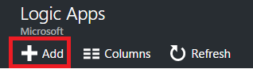

4.	Complete the **Name**, **Subscription**, **Resource Group**, and **Location** fields to create the logic app object, and then click **Create**.

5.	Select the new logic app. When you receive the **Deployment Succeeded** notification, click **Refresh**.

6.	Under Development Tools, click **Logic App Designer**, and then in the list of available templates click **Blank LogicApp**.

7.	Type *Dynamics 365*. In the list are several Dynamics 365 triggers, click **Dynamics 365 – When a record is created**.

8.	If you are prompted to sign-in to Dynamics 365, do so now.

9.	In the trigger details, enter the following information.

  * **Organization Name**. Select the Dynamics 365 instance that you want the logic app to listen to.

  * **Entity Name**. Select the entity that you want to listen to, which will act as a trigger to initiate the logic app. In this walkthrough, **Leads** is selected.

  * **How often do you want to check for items?** These values set how often the logic app checks for updates related to the trigger. The default setting is to check for updates every three minutes.

    * **Frequency**. Select seconds, minutes, hours, or days.

    * **Interval**. Enter a number that indicates the number of seconds, minutes, hours, or days pass before the next check.

    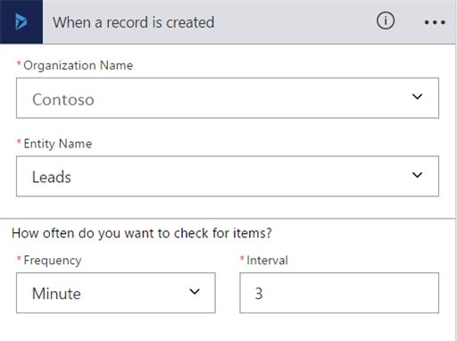

10.	Click **New step**, and then click **Add an action**.

11.	Type *Dynamics 365* and in the list click **Dynamics 365 – Create a new record**.

12.	Enter the following information.
  * **Organization Name**. Select the Dynamics 365 instance that you want the flow to create the record in. Notice that it doesn’t have to be the same instance where the event is triggered from.
  * **Entity Name**. Select the entity that you want to create a record when the event is triggered. In this walkthrough, **Tasks** is selected.

13.	A Subject box appears. When you click the box, a dynamic content pane appears where you can select either of the following fields.
  * **Last Name**. Selecting this field will insert the last name of the lead in to the Subject field of the task, when the task record is created.
  * **Topic**. Selecting this field will insert Topic field for the lead in to the Subject field of the task, when the task record is created.
Click **Topic** to add it to the **Subject** box.

  

14.	Click **Save** on the Logic App Designer toolbar.

  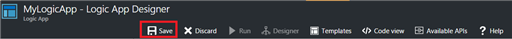

15.	To start the Logic App, click **Run**.

  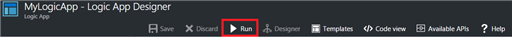

16. Now create a lead record in Dynamics 365 for Sales and see your flow in action!

## Using Advanced Options
When you add a step to a logic app, clicking **Show advanced options** allows you to control how the data is filtered in the step by adding a filter or order by query.

For example, you can use a filter query to retrieve only active accounts and order by the account name. To do this, enter the OData filter query **statuscode eq 1** and select **Account Name** from the dynamic content pane. More information: [MSDN: $filter](https://msdn.microsoft.com/library/gg309461.aspx#Anchor_1) and [$orderby](https://msdn.microsoft.com/library/gg309461.aspx#Anchor_2).

  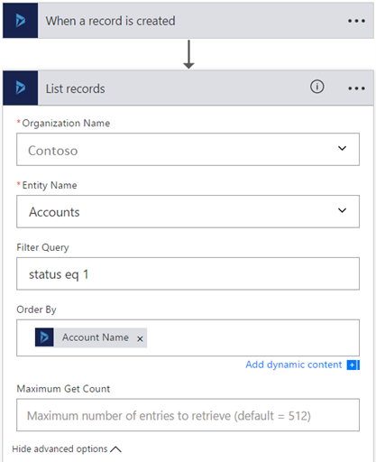

### Best practices when using advanced options
Notice that when you add a value to a field, you must match the field type whether you type a value or select it from the dynamic content that is displayed.

Field type  |How to use  |Where to find  |Name  |Data type  
---------|---------|---------|---------|---------
Text fields|Text fields require a single line of text or dynamic content that is a text type field. Examples include the Category and Sub-Category fields.|Settings > Customizations > Customize the System > Entities > Task > Fields |category |Single Line of Text.       
Integer fields | Some fields require integer or dynamic content that is an integer type field. Examples include Percent Complete and Duration. |Settings > Customizations > Customize the System > Entities > Task > Fields |percentcomplete |Whole Number         
Date fields | Some fields require a date entered in mm/dd/yyyy format or dynamic content that is a date type field. Examples include Created On, Start Date, Actual Start, Last on Hold Time, Actual End, and Due Date. | Settings > Customizations > Customize the System > Entities > Task > Fields |createdon |Date and Time         
Fields that require both a record ID and lookup type |Some fields that reference another entity record require both the record ID and the lookup type. |Settings > Customizations > Customize the System > Entities > Account > Fields  | accountid   | Primary Key

### More examples of fields that require both a record ID and lookup type
Expanding on the previous table, here are more examples of fields that don't work with values selected from the dynamic content list. Instead, these fields require both a record ID and lookup type entered into the fields in PowerApps.  
*  Owner and Owner Type. The Owner field must be a valid user or team record ID. The Owner Type must be either **systemusers** or **teams**.
* Customer and Customer Type. The Customer field must be a valid account or contact record ID. The Owner Type must be either **accounts** or **contacts**.
* Regarding and Regarding Type. The Regarding field must be a valid record ID, such as an account or contact record ID. The Regarding Type must be the lookup type for the record, such as **accounts** or **contacts**.

The following task creation action example adds an account record that corresponds to the record ID adding it to the regarding field of the task.

  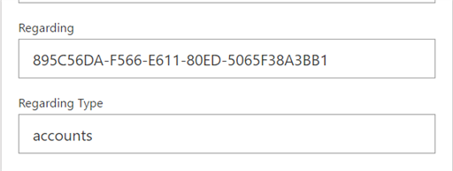

This example also assigns the task to a specific user based on the user's record ID.
  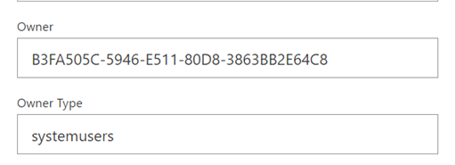

To find a record's ID, see the *Find the record ID* section below.

## Find the record ID
1. Open a record, such as an account record.

2. On the actions toolbar, click **Pop Out** .
Alternatively, on the actions toolbar click **EMAIL A LINK** to copy the full URL in to your default email program.

3. The record ID is displayed in between the %7b and %7d encoding characters of the URL.

  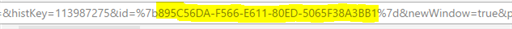

## Troubleshooting
To troubleshoot a failed step in a logic app, view the status details of the event.

1. In the Logic Apps area, click your logic app and then click **Overview**. The Summary area is displayed, which provides the run status for the logic app. If there are failed runs, click the failed event that you want to view more information.

  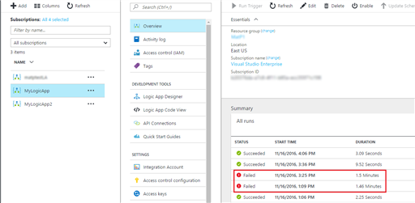

2. Click the failed step to expand it.

  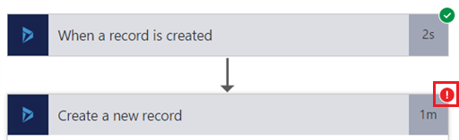

3. The details of the step are displayed that can help troubleshoot the cause of the failure.

    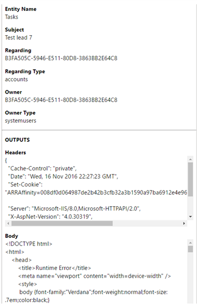

For more information about troubleshooting logic apps, see [Diagnosing logic app failures](../logic-apps/logic-apps-diagnosing-failures.md).

## Technical Details
## Triggers
| Trigger | Description |
| --- | --- |
| When a record is created |Triggers a flow when an object is created in Dynamics 365. |
| When a record is updated |Triggers a flow when an object is modified in Dynamics 365. |
| When a record is deleted |Triggers a flow when an object is deleted in Dynamics 365. |

## Actions
| Action | Description |
| --- | --- |
| List records |This operation gets the records for an entity. |
| Create a new record |This operation creates a new record of an entity. |
| Get record |This operation gets the specified record for an entity. |
| Delete a record |This operation deletes a record from an entity collection. |
| Update a record |This operation updates an existing record for an entity. |

### Trigger and Action details
In this section, see the specific details about each trigger and action, including any required or optional input properties, and any corresponding output associated with the connector.

#### When a record is created
Triggers a flow when an object is created in Dynamics 365.

| Property name | Display name | Description |
| --- | --- | --- |
| dataset* |Organization Name |Name of the Dynamics 365 organization like Contoso |
| table* |Entity Name |Name of the entity |
| $filter |Filter Query |An ODATA filter query to restrict the entries returned |
| $orderby |Order By |An ODATA orderBy query for specifying the order of entries |

An asterisk (*) means the property is required.

##### Output Details
ItemsList

| Property Name | Data Type |
| --- | --- |
| value |array |

#### When a record is updated
Triggers a flow when an object is modified in Dynamics 365.

| Property name | Display name | Description |
| --- | --- | --- |
| dataset* |Organization Name |Name of the Dynamics 365 organization like Contoso |
| table* |Entity Name |Name of the entity |

An asterisk (*) means the property is required.

##### Output Details
ItemsList

| Property Name | Data Type |
| --- | --- |
| value |array |

#### When a record is deleted
Triggers a flow when an object is deleted in Dynamics 365.

| Property name | Display name | Description |
| --- | --- | --- |
| dataset* |Organization Name |Name of the Dynamics 365 organization like Contoso |
| table* |Entity Name |Name of the entity |

An asterisk (*) means the property is required.

##### Output Details
ItemsList

| Property Name | Data Type |
| --- | --- |
| value |array |

#### List records
This operation gets the records for an entity.

| Property name | Display name | Description |
| --- | --- | --- |
| dataset* |Organization Name |Name of the Dynamics 365 organization like Contoso |
| table* |Entity Name |Name of the entity |
| $filter |Filter Query |An ODATA filter query to restrict the entries returned |
| $orderby |Order By |An ODATA orderBy query for specifying the order of entries |

An asterisk (*) means the property is required.

##### Output Details
ItemsList

| Property Name | Data Type |
| --- | --- |
| value |array |

#### Create a new record
This operation creates a new record of an entity.

| Property name | Display name | Description |
| --- | --- | --- |
| dataset* |Organization Name |Name of the Dynamics 365 organization like Contoso |
| table* |Entity Name |Name of the entity |

An asterisk (*) means the property is required.

##### Output Details
None.

#### Get record
This operation gets the specified record for an entity.

| Property name | Display name | Description |
| --- | --- | --- |
| dataset* |Organization Name |Name of the Dynamics 365 organization like Contoso |
| table* |Entity Name |Name of the entity |
| id* |Item identifier |Specify the Identifier for the record |

An asterisk (*) means the property is required.

##### Output Details
None.

#### Delete a record
This operation deletes a record from an entity collection.

| Property name | Display name | Description |
| --- | --- | --- |
| dataset* |Organization Name |Name of the Dynamics 365 organization like Contoso |
| table* |Entity Name |Name of the entity |
| id* |Item identifier |Specify the identifier for the record |

An asterisk (*) means the property is required.

#### Update a record
This operation updates an existing record for an entity.

| Property name | Display name | Description |
| --- | --- | --- |
| dataset* |Organization Name |Name of the Dynamics 365 organization like Contoso |
| table* |Entity Name |Name of the entity |
| id* |Record identifier |Specify the identifier for the record |

An asterisk (*) means the property is required.

##### Output Details
None.

## HTTP responses
The actions and triggers can return one or more of the following HTTP status codes:

| Name | Description |
| --- | --- |
| 200 |OK |
| 202 |Accepted |
| 400 |Bad Request |
| 401 |Unauthorized |
| 403 |Forbidden |
| 404 |Not Found |
| 500 |Internal Server Error. Unknown error occurred. |
| default |Operation Failed. |

## Next steps
Explore the other available connectors in Logic Apps at our [APIs list](apis-list.md).
