# Get started with the DB2 connector
Microsoft connector for DB2 connects Logic Apps to resources stored in an IBM DB2 database. This connector includes a Microsoft client to communicate with remote DB2 server computers across a TCP/IP network. This includes cloud databases, such as IBM Bluemix dashDB or IBM DB2 for Windows running in Azure virtualization, and on-premises databases using the on-premises data gateway. See the [supported list](connectors-create-api-db2.md#supported-db2-platforms-and-versions) of IBM DB2 platforms and versions (in this topic).

The DB2 connector supports the following database operations:

* List database tables
* Read one row using SELECT
* Read all rows using SELECT
* Add one row using INSERT
* Alter one row using UPDATE
* Remove one row using DELETE

This topic shows you how to use the connector in a logic app to process database operations.

To learn more about Logic Apps, see [create a logic app](../logic-apps/logic-apps-create-a-logic-app.md).

## Available actions
The DB2 connector supports the following logic app actions:

* GetTables
* GetRow
* GetRows
* InsertRow
* UpdateRow
* DeleteRow

## List tables
Creating a logic app for any operation is comprised of many steps performed through the Microsoft Azure portal.

Within the logic app, you can add an action to list tables in a DB2 database. The action instructs the connector to process a DB2 schema statement, such as `CALL SYSIBM.SQLTABLES`.

### Create a logic app
1. In the **Azure start board**, select **+** (plus sign), **Web + Mobile**, and then **Logic App**.
2. Enter the **Name**, such as `Db2getTables`, **Subscription**, **Resource group**, **Location**, and **App Service Plan**. Select **Pin to dashboard**, and then select **Create**.

### Add a trigger and action
1. In the **Logic Apps Designer**, select **Blank LogicApp** in the **Templates** list.
2. In the **triggers** list, select **Recurrence**. 
3. In the **Recurrence** trigger, select **Edit**, select **Frequency** drop-down to select **Day**, and then set the **Interval** to type **7**.  
4. Select the **+ New step** box, and then select **Add an action**.
5. In the **actions** list, type `db2` in the **Search for more actions** edit box, and then select **DB2 - Get tables (Preview)**.
   
   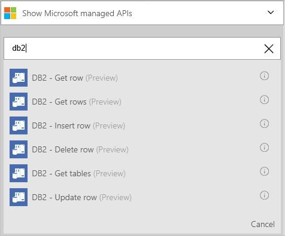  
6. In the **DB2 - Get tables** configuration pane, select **checkbox** to enable **Connect via on-premises data gateway**. Notice that the settings change from cloud to on-premises.
   
   * Type value for **Server**, in the form of address or alias colon port number. For example, type `ibmserver01:50000`.
   * Type value for **Database**. For example, type `nwind`.
   * Select value for **Authentication**. For example, select **Basic**.
   * Type value for **Username**. For example, type `db2admin`.
   * Type value for **Password**. For example, type `Password1`.
   * Select value for **Gateway**. For example, select **datagateway01**.
7. Select **Create**, and then select **Save**. 
   
    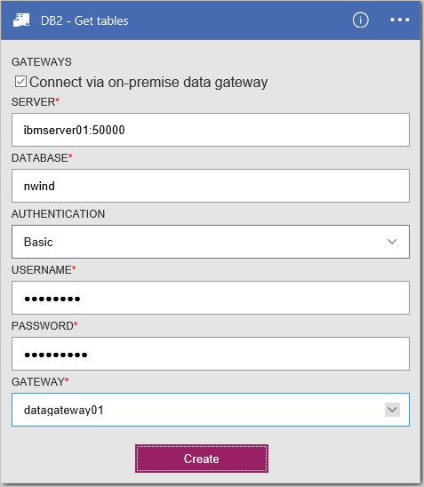
8. In the **Db2getTables** blade, within the **All runs** list under **Summary**, select the first-listed item (most recent run).
9. In the **Logic app run** blade, select **Run Details**. Within the **Action** list, select **Get_tables**. See the value for **Status**, which should be **Succeeded**. Select the **Inputs link** to view the inputs. Select the **Outputs link**, and view the outputs; which should include a list of tables.
   
   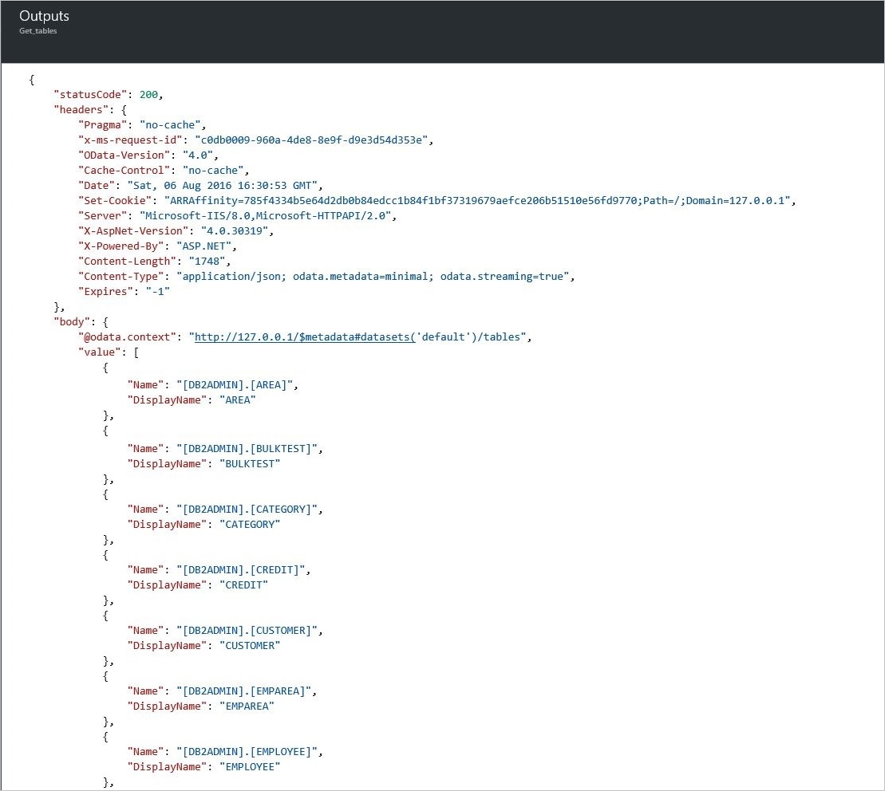

## Create the connections
This connector supports connections to databases hosted on-premises and in the cloud using the following connection properties. 

| Property | Description |
| --- | --- |
| server |Required. Accepts a string value that represents a TCP/IP address or alias, in either IPv4 or IPv6 format, followed (colon-delimited) by a TCP/IP port number. |
| database |Required. Accepts a string value that represents a DRDA Relational Database Name (RDBNAM). DB2 for z/OS accepts a 16-byte string (database is known as an IBM DB2 for z/OS location). DB2 for i5/OS accepts an 18-byte string (database is known as an IBM DB2 for i relational database). DB2 for LUW accepts an 8-byte string. |
| authentication |Optional. Accepts a list item value, either Basic or Windows (kerberos). |
| username |Required. Accepts a string value. DB2 for z/OS accepts an 8-byte string. DB2 for i accepts a 10-byte string. DB2 for Linux or UNIX accepts an 8-byte string. DB2 for Windows accepts a 30-byte string. |
| password |Required. Accepts a string value. |
| gateway |Required. Accepts a list item  value, representing the on-premises data gateway defined to Logic Apps within the storage group. |

## Create the on-premises gateway connection
This connector can access an on-premises DB2 database using the on-premises gateway. See gateway topics for more information. 

1. In the **Gateways** configuration pane, select **checkbox** to enable **Connect via gateway**. Notice that the settings change from cloud to on-premises.
2. Type value for **Server**, in the form of address or alias colon port number. For example, type `ibmserver01:50000`.
3. Type value for **Database**. For example, type `nwind`.
4. Select value for **Authentication**. For example, select **Basic**.
5. Type value for **Username**. For example, type `db2admin`.
6. Type value for **Password**. For example, type `Password1`.
7. Select value for **Gateway**. For example, select **datagateway01**.
8. Select **Create** to continue. 
   
    

## Create the cloud connection
This connector can access a cloud DB2 database. 

1. In the **Gateways** configuration pane, leave the **checkbox** disabled (unclicked) **Connect via gateway**. 
2. Type value for **Connection name**. For example, type `hisdemo2`.
3. Type value for **DB2 server name**, in the form of address or alias colon port number. For example, type `hisdemo2.cloudapp.net:50000`.
4. Type value for **DB2 database name**. For example, type `nwind`.
5. Type value for **Username**. For example, type `db2admin`.
6. Type value for **Password**. For example, type `Password1`.
7. Select **Create** to continue. 
   
    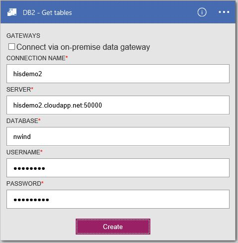

## Fetch all rows using SELECT
You can define a logic app action to fetch all rows in a DB2 table. This instructs the connector to process a DB2 SELECT statement, such as `SELECT * FROM AREA`.

### Create a logic app
1. In the **Azure start board**, select **+** (plus sign), **Web + Mobile**, and then **Logic App**.
2. Enter the **Name**, such as `Db2getRows`, **Subscription**, **Resource group**, **Location**, and **App Service Plan**. Select **Pin to dashboard**, and then select **Create**.

### Add a trigger and action
1. In the **Logic Apps Designer**, select **Blank LogicApp** in the **Templates** list.
2. In the **triggers** list, select **Recurrence**. 
3. In the **Recurrence** trigger, select **Edit**, select **Frequency** drop-down to select **Day**, and then select **Interval** to type **7**. 
4. Select the **+ New step** box, and then select **Add an action**.
5. In the **actions** list, type `db2` in the **Search for more actions** edit box, and then select **DB2 - Get rows (Preview)**.
6. In the **Get rows (Preview)** action, select **Change connection**.
7. In the **Connections** configuration pane, select **Create new**. 
   
    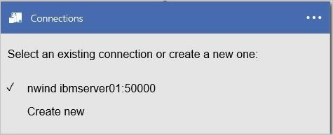
8. In the **Gateways** configuration pane, leave the **checkbox** disabled (unclicked) **Connect via gateway**.
   
   * Type value for **Connection name**. For example, type `HISDEMO2`.
   * Type value for **DB2 server name**, in the form of address or alias colon port number. For example, type `HISDEMO2.cloudapp.net:50000`.
   * Type value for **DB2 database name**. For example, type `NWIND`.
   * Type value for **Username**. For example, type `db2admin`.
   * Type value for **Password**. For example, type `Password1`.
9. Select **Create** to continue.
   
    
10. In the **Table name** list, select the **down arrow**, and then select **AREA**.
11. Optionally, select **Show advanced options** to specify query options.
12. Select **Save**. 
    
    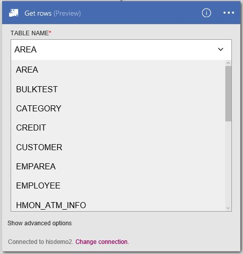
13. In the **Db2getRows** blade, within the **All runs** list under **Summary**, select the first-listed item (most recent run).
14. In the **Logic app run** blade, select **Run Details**. Within the **Action** list, select **Get_rows**. See the value for **Status**, which should be **Succeeded**. Select the **Inputs link** to view the inputs. Select the **Outputs link**, and view the outputs; which should include a list of rows.
    
    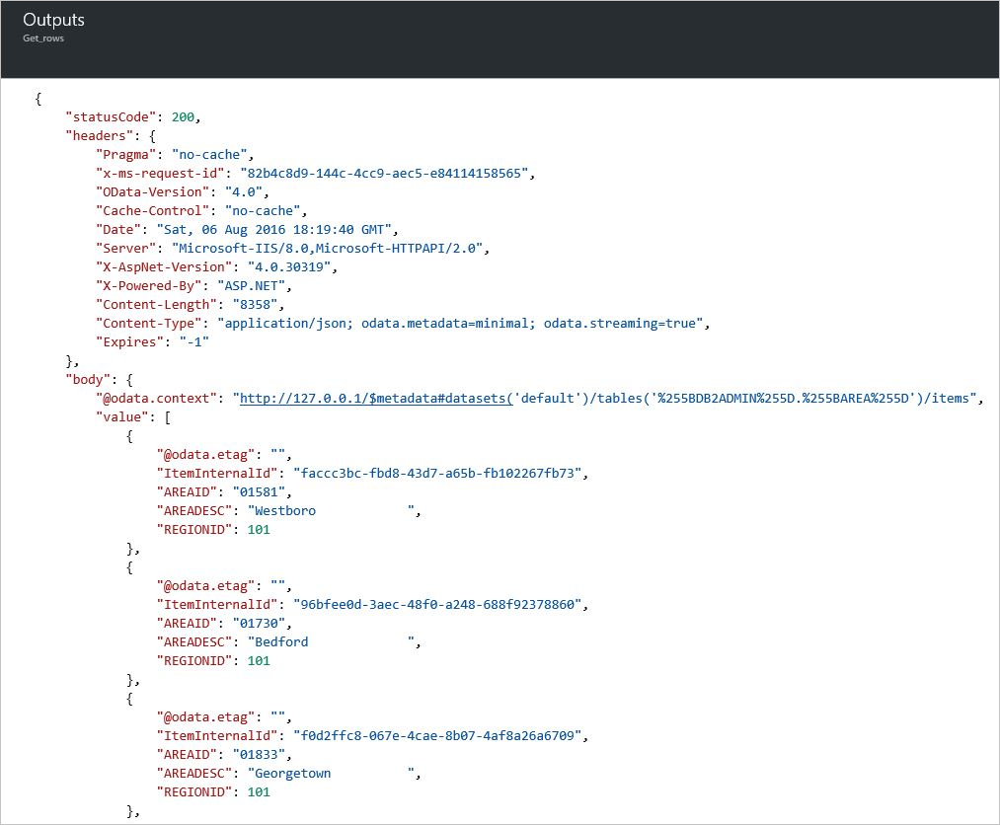

## Add one row using INSERT
You can define a logic app action to add one row in a DB2 table. This action instructs the connector to process a DB2 INSERT statement, such as `INSERT INTO AREA (AREAID, AREADESC, REGIONID) VALUES ('99999', 'Area 99999', 102)`.

### Create a logic app
1. In the **Azure start board**, select **+** (plus sign), **Web + Mobile**, and then **Logic App**.
2. Enter the **Name**, such as `Db2insertRow`, **Subscription**, **Resource group**, **Location**, and **App Service Plan**. Select **Pin to dashboard**, and then select **Create**.

### Add a trigger and action
1. In the **Logic Apps Designer**, select **Blank LogicApp** in the **Templates** list.
2. In the **triggers** list, select **Recurrence**. 
3. In the **Recurrence** trigger, select **Edit**, select **Frequency** drop-down to select **Day**, and then select **Interval** to type **7**. 
4. Select the **+ New step** box, and then select **Add an action**.
5. In the **actions** list, type **db2** in the **Search for more actions** edit box, and then select **DB2 - Insert row (Preview)**.
6. In the **DB2 - Insert row (Preview)** action, select **Change connection**. 
7. In the **Connections** configuration pane, select a connection. For example, select **hisdemo2**.
   
    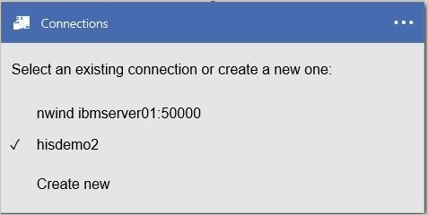
8. In the **Table name** list, select the **down arrow**, and then select **AREA**.
9. Enter values for all required columns (see red asterisk). For example, type `99999` for **AREAID**, type `Area 99999`, and type `102` for **REGIONID**. 
10. Select **Save**.
    
    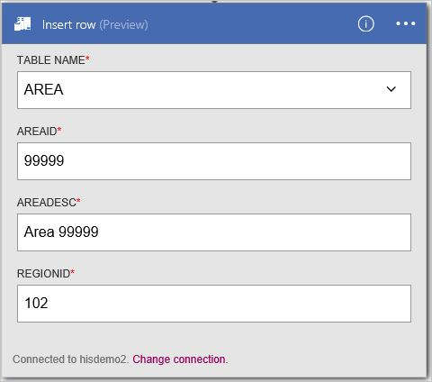
11. In the **Db2insertRow** blade, within the **All runs** list under **Summary**, select the first-listed item (most recent run).
12. In the **Logic app run** blade, select **Run Details**. Within the **Action** list, select **Get_rows**. See the value for **Status**, which should be **Succeeded**. Select the **Inputs link** to view the inputs. Select the **Outputs link**, and view the outputs; which should include the new row.
    
    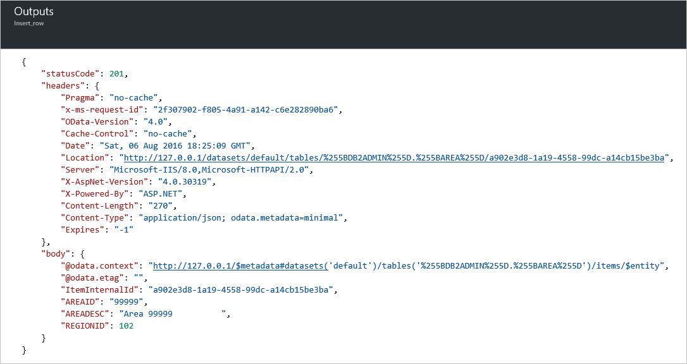

## Fetch one row using SELECT
You can define a logic app action to fetch one row in a DB2 table. This action instructs the connector to process a DB2 SELECT WHERE statement, such as `SELECT FROM AREA WHERE AREAID = '99999'`.

### Create a logic app
1. In the **Azure start board**, select **+** (plus sign), **Web + Mobile**, and then **Logic App**.
2. Enter the **Name** (e.g. "**Db2getRow**"), **Subscription**, **Resource group**, **Location**, and **App Service Plan**. Select **Pin to dashboard**, and then select **Create**.

### Add a trigger and action
1. In the **Logic Apps Designer**, select **Blank LogicApp** in the **Templates** list. 
2. In the **triggers** list, select **Recurrence**. 
3. In the **Recurrence** trigger, select **Edit**, select **Frequency** drop-down to select **Day**, and then select **Interval** to type **7**. 
4. Select the **+ New step** box, and then select **Add an action**.
5. In the **actions** list, type **db2** in the **Search for more actions** edit box, and then select **DB2 - Get rows (Preview)**.
6. In the **Get rows (Preview)** action, select **Change connection**. 
7. In the **Connections** configurations pane, select an existing connection. For example, select **hisdemo2**.
   
    
8. In the **Table name** list, select the **down arrow**, and then select **AREA**.
9. Enter values for all required columns (see red asterisk). For example, type `99999` for **AREAID**. 
10. Optionally, select **Show advanced options** to specify query options.
11. Select **Save**. 
    
    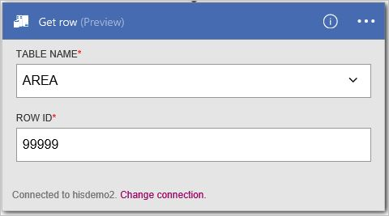
12. In the **Db2getRow** blade, within the **All runs** list under **Summary**, select the first-listed item (most recent run).
13. In the **Logic app run** blade, select **Run Details**. Within the **Action** list, select **Get_rows**. See the value for **Status**, which should be **Succeeded**. Select the **Inputs link** to view the inputs. Select the **Outputs link**, and view the outputs; which should include row.
    
    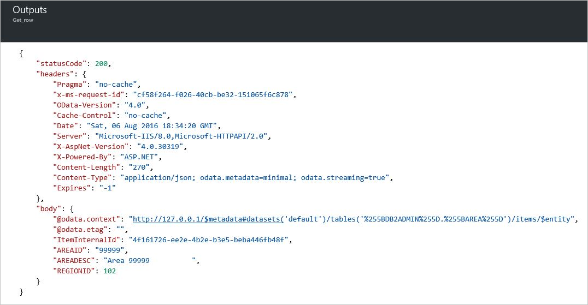

## Change one row using UPDATE
You can define a logic app action to change one row in a DB2 table. This action instructs the connector to process a DB2 UPDATE statement, such as `UPDATE AREA SET AREAID = '99999', AREADESC = 'Area 99999', REGIONID = 102)`.

### Create a logic app
1. In the **Azure start board**, select **+** (plus sign), **Web + Mobile**, and then **Logic App**.
2. Enter the **Name**, such as `Db2updateRow`, **Subscription**, **Resource group**, **Location**, and **App Service Plan**. Select **Pin to dashboard**, and then select **Create**.

### Add a trigger and action
1. In the **Logic Apps Designer**, select **Blank LogicApp** in the **Templates** list.
2. In the **triggers** list, select **Recurrence**. 
3. In the **Recurrence** trigger, select **Edit**, select **Frequency** drop-down to select **Day**, and then select **Interval** to type **7**. 
4. Select the **+ New step** box, and then select **Add an action**.
5. In the **actions** list, type **db2** in the **Search for more actions** edit box, and then select **DB2 - Update row (Preview)**.
6. In the **DB2 - Update row (Preview)** action, select **Change connection**. 
7. In the **Connections** configurations pane, select to select an existing connection. For example, select **hisdemo2**.
   
    
8. In the **Table name** list, select the **down arrow**, and then select **AREA**.
9. Enter values for all required columns (see red asterisk). For example, type `99999` for **AREAID**, type `Updated 99999`, and type `102` for **REGIONID**. 
10. Select **Save**. 
    
    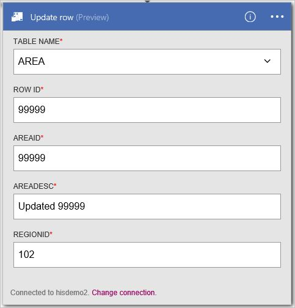
11. In the **Db2updateRow** blade, within the **All runs** list under **Summary**, select the first-listed item (most recent run).
12. In the **Logic app run** blade, select **Run Details**. Within the **Action** list, select **Get_rows**. See the value for **Status**, which should be **Succeeded**. Select the **Inputs link** to view the inputs. Select the **Outputs link**, and view the outputs; which should include the new row.
    
    

## Remove one row using DELETE
You can define a logic app action to remove one row in a DB2 table. This action instructs the connector to process a DB2 DELETE statement, such as `DELETE FROM AREA WHERE AREAID = '99999'`.

### Create a logic app
1. In the **Azure start board**, select **+** (plus sign), **Web + Mobile**, and then **Logic App**.
2. Enter the **Name**, such as `Db2deleteRow`, **Subscription**, **Resource group**, **Location**, and **App Service Plan**. Select **Pin to dashboard**, and then select **Create**.

### Add a trigger and action
1. In the **Logic Apps Designer**, select **Blank LogicApp** in the **Templates** list. 
2. In the **triggers** list, select **Recurrence**. 
3. In the **Recurrence** trigger, select **Edit**, select **Frequency** drop-down to select **Day**, and then select **Interval** to type **7**. 
4. Select the **+ New step** box, and then select **Add an action**.
5. In the **actions** list, select **db2** in the **Search for more actions** edit box, and then select **DB2 - Delete row (Preview)**.
6. In the **DB2 - Delete row (Preview)** action, select **Change connection**. 
7. In the **Connections** configurations pane, select an existing connection. For example, select **hisdemo2**.
   
    
8. In the **Table name** list, select the **down arrow**, and then select **AREA**.
9. Enter values for all required columns (see red asterisk). For example, type `99999` for **AREAID**. 
10. Select **Save**. 
    
    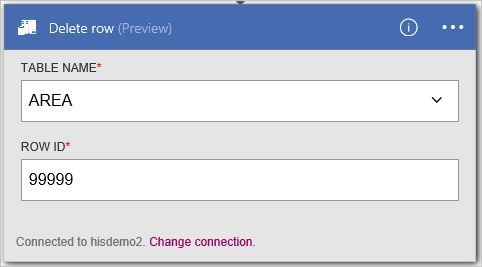
11. In the **Db2deleteRow** blade, within the **All runs** list under **Summary**, select the first-listed item (most recent run).
12. In the **Logic app run** blade, select **Run Details**. Within the **Action** list, select **Get_rows**. See the value for **Status**, which should be **Succeeded**. Select the **Inputs link** to view the inputs. Select the **Outputs link**, and view the outputs; which should include the deleted row.
    
    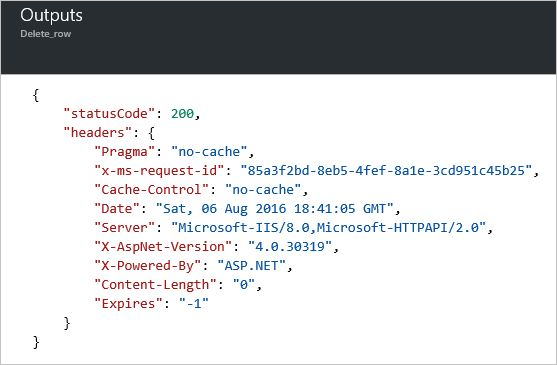

## Supported DB2 platforms and versions
This connector supports the following IBM DB2 platforms and versions, as well as IBM DB2 compatible products (e.g. IBM Bluemix dashDB) that support Distributed Relational Database Architecture (DRDA) SQL Access Manager (SQLAM) version 10 and 11:

* IBM DB2 for z/OS 11.1
* IBM DB2 for z/OS 10.1
* IBM DB2 for i 7.3
* IBM DB2 for i 7.2
* IBM DB2 for i 7.1
* IBM DB2 for LUW 11
* IBM DB2 for LUW 10.5

## Connector-specific details

View any triggers and actions defined in the swagger, and also see any limits in the [connector details](/connectors/db2/). 

## Next steps
[Create a logic app](../logic-apps/logic-apps-create-a-logic-app.md). Explore the other available connectors in Logic Apps at our [APIs list](apis-list.md).

