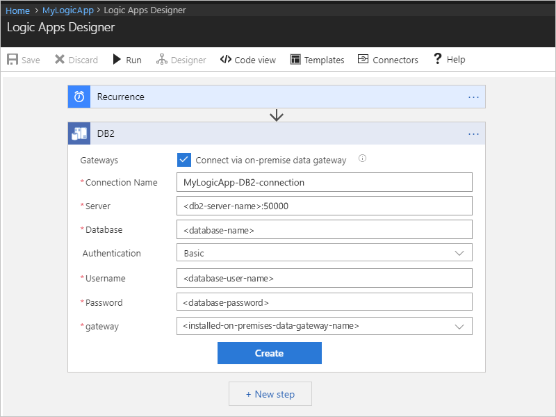
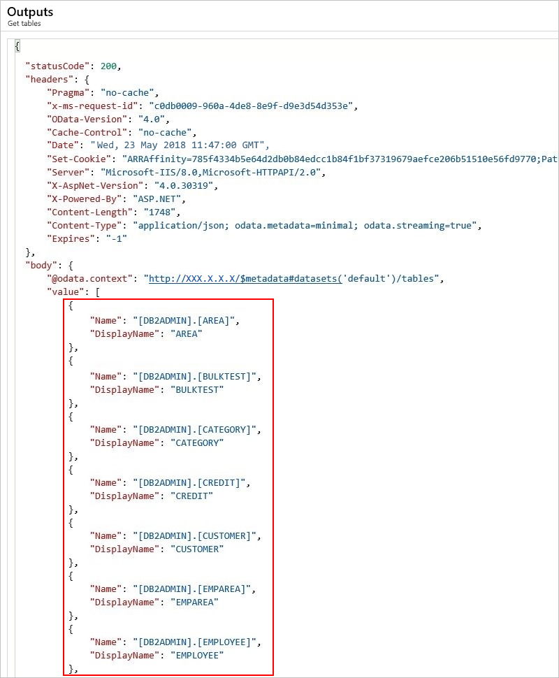
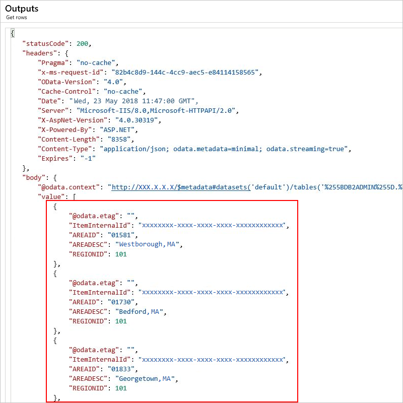
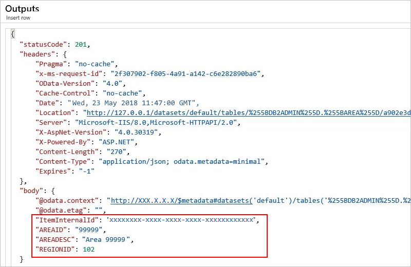

# Manage IBM DB2 resources with Azure Logic Apps

With Azure Logic Apps and the IBM DB2 connector, you can create automated 
tasks and workflows based on the resources stored in your DB2 database. 
Your workflows can connect to the resources in your database, read and 
list your database tables, add rows, change rows, delete rows, and more. 
You can include actions in your logic apps that get responses 
from your database and make the output available for other actions. 

This article shows how you can create a logic app that performs 
various database operations. If you're new to logic apps, review 
[What is Azure Logic Apps](../logic-apps/logic-apps-overview.md).

## Supported platforms and versions

The DB2 connector includes a Microsoft client that 
communicates with remote DB2 servers across a TCP/IP network. 
You can use this connector for accessing cloud databases such 
as IBM Bluemix dashDB or IBM DB2 for Windows running in Azure virtualization. 
You can also access on-premises DB2 databases after you 
[install and set up the on-premises data gateway](../logic-apps/logic-apps-gateway-connection.md). 

The IBM DB2 connector supports these IBM DB2 platforms and versions along 
with IBM DB2 compatible products, such as IBM Bluemix dashDB, 
that support Distributed Relational Database Architecture (DRDA) 
SQL Access Manager (SQLAM) versions 10 and 11:

| Platform | Version | 
|----------|---------|
| IBM DB2 for z/OS | 11.1, 10.1 |
| IBM DB2 for i | 7.3, 7.2, 7.1 |
| IBM DB2 for LUW | 11, 10.5 |
|||

## Supported database operations

The IBM DB2 connector supports these database operations, 
which map to the corresponding actions in the connector:

| Database operation | Connector action | 
|--------------------|------------------|
| List database tables | Get tables | 
| Read one row using SELECT | Get row | 
| Read all rows using SELECT | Get rows | 
| Add one row using INSERT | Insert row | 
| Edit one row using UPDATE | Update row | 
| Remove one row using DELETE | Delete row | 
|||

## Prerequisites

* An Azure subscription. If you don't have an Azure subscription, 
<a href="https://azure.microsoft.com/free/" target="_blank">sign up for a free Azure account</a>. 

* An IBM DB2 database, either cloud-based or on-premises

* Basic knowledge about 
[how to create logic apps](../logic-apps/quickstart-create-first-logic-app-workflow.md)

* The logic app where you want to access your DB2 database. 
This connector doesn't provide any triggers, so you must use 
a different trigger to start your logic app. In this article, 
the examples use the **Recurrence** trigger.

## Add DB2 action - Get tables

1. In the [Azure portal](https://portal.azure.com), open your 
logic app in the Logic App Designer, if not already open.

1. Under the trigger, choose **New step**.

1. In the search box, enter "db2" as your filter. For this example, 
under the actions list, select this action: **Get tables (Preview)**
   
   

   You're now prompted to provide connection details for your DB2 database. 

1. Follow the steps for creating connections for [cloud databases](#cloud-connection) 
or [on-premises databases](#on-premises-connection).

## Connect to cloud DB2

To set up your connection, provide these connection details when prompted, 
choose **Create**, and then save your logic app:

| Property | Required | Description | 
|----------|----------|-------------| 
| **Connect via on-premise gateway** | No | Applies only for on-premises connections. | 
| **Connection Name** | Yes | The name for your connection, for example, "MyLogicApp-DB2-connection" |
| **Server** | Yes | The address or alias colon port number for your DB2 server, for example, "myDB2server.cloudapp.net:50000" 

**Note**: This value is a string that represents a TCP/IP address or alias, either in IPv4 or IPv6 format, followed by a colon and a TCP/IP port number. |
| **Database** | Yes | The name for your database 

**Note**: This value is a string that represents a DRDA Relational Database Name (RDBNAM): 
- DB2 for z/OS accepts a 16-byte string where the database is known as an "IBM DB2 for z/OS" location.  - DB2 for i accepts an 18-byte string where the database is known as an "IBM DB2 for i" relational database.  - DB2 for LUW accepts an 8-byte string.|
| **Username** | Yes | Your user name for the database 

**Note**: This value is a string whose length is based on the specific database: 

- DB2 for z/OS accepts an 8-byte string.  - DB2 for i accepts a 10-byte string.  - DB2 for Linux or UNIX accepts an 8-byte string.  - DB2 for Windows accepts a 30-byte string. | 
| **Password** | Yes | Your password for the database | 
|||| 

For example:

## Connect to on-premises DB2

Before creating your connection, you must already have your on-premises data gateway installed. 
Otherwise, you can't finish setting up your connection. If you have your gateway installation, 
continue with providing these connection details, and then choose **Create**.

| Property | Required | Description | 
|----------|----------|-------------| 
| **Connect via on-premise gateway** | Yes | Applies when you want an on-premises connection and shows the on-premises connection properties. | 
| **Connection Name** | Yes | The name for your connection, for example, "hisdemo" | 
| **Server** | Yes | The address or alias colon port number for your DB2 server, for example, "ibmserver01:50000" 

**Note**: This value is a string that represents a TCP/IP address or alias, either in IPv4 or IPv6 format, followed by a colon and a TCP/IP port number. | 
| **Database** | Yes | The name for your database | 
| **Authentication** | Yes | The authentication type for your connection, for example, "Basic" 

**Note**: Select this value from the list, which includes Basic or Windows (Kerberos). | 
| **Username** | Yes | Your user name for the database | 
| **Password** | Yes | Your password for the database | 
| **Gateway** | Yes | The name for your installed on-premises data gateway 

**Note**: Select this value from the list, which includes all the installed data gateways within your Azure subscription and resource group. | 
|||| 

For example:

### View output tables

To run your logic app manually, on the designer toolbar, choose **Run**. 
After your logic app finishes running, you can view the output from the run.

1. On your logic app menu, choose **Overview**. 

1. Under **Summary**, in the **Runs history** section, 
select the most recent run, which is the first item in the list. 

1. Under **Logic app run**, choose **Run Details**. 

   You can now review the status, inputs, 
   and outputs for each step in your logic app. 

1. Expand the **Get tables** action.

1. To view the inputs, choose **Show raw inputs**. 

1. To view the outputs, choose **Show raw outputs**. 

   The outputs include a list of tables. 
   
   

## Get row

To fetch one row in a DB2 database table, use the **Get row** action in your logic app. 
This action runs a DB2 `SELECT WHERE` statement, for example, 
`SELECT FROM AREA WHERE AREAID = '99999'`.

1. If you've never used DB2 actions before in your logic app, 
review the steps in the [Add DB2 action - Get tables](#add-db2-action) 
section, but add the **Get row** action instead, and then return here to continue. 

   After you add the **Get row** action, here is how your example logic app appears:

   

1. Specify values for all the required properties (*). 
After you select a table, the action shows the relevant 
properties that are specific to records in that table.

   | Property | Required | Description | 
   |----------|----------|-------------| 
   | **Table name** | Yes | The table that has the row you want, such as "AREA" in this example | 
   | **Row ID** | Yes | The ID for the record you want, such as "99999" in this example | 
   |||| 

   

1. When you're done, on the designer toolbar, choose **Save**. 

### View output row

To run your logic app manually, on the designer toolbar, choose **Run**. 
After your logic app finishes running, you can view the output from the run.

1. On your logic app menu, choose **Overview**. 

1. Under **Summary**, in the **Runs history** section, 
select the most recent run, which is the first item in the list. 

1. Under **Logic app run**, choose **Run Details**. 

   You can now review the status, inputs, 
   and outputs for each step in your logic app. 

1. Expand the **Get row** action.

1. To view the inputs, choose **Show raw inputs**. 

1. To view the outputs, choose **Show raw outputs**. 

   The outputs include your specified row. 
   
   

## Get rows

To fetch all rows in a DB2 database table, use the **Get rows** action in your logic app. 
This action runs a DB2 `SELECT` statement, for example, `SELECT * FROM AREA`.

1. If you've never used DB2 actions before in your logic app, 
review the steps in the [Add DB2 action - Get tables](#add-db2-action) 
section, but add the **Get rows** action instead, and then return here to continue. 

   After you add the **Get rows** action, here is how your example logic app appears:

   

1. Open the **Table name** list, and then select the table you want, 
which is "AREA" in this example: 

   

1. To specify a filter or query for results, choose **Show advanced options**.

1. When you're done, on the designer toolbar, choose **Save**. 

### View output rows

To run your logic app manually, on the designer toolbar, choose **Run**. 
After your logic app finishes running, you can view the output from the run.

1. On your logic app menu, choose **Overview**. 

1. Under **Summary**, in the **Runs history** section, 
select the most recent run, which is the first item in the list. 

1. Under **Logic app run**, choose **Run Details**. 

   You can now review the status, inputs, 
   and outputs for each step in your logic app. 

1. Expand the **Get rows** action.

1. To view the inputs, choose **Show raw inputs**. 

1. To view the outputs, choose **Show raw outputs**. 

   The outputs include all the records in your specified table.
   
   

## Insert row

To add a single row to a DB2 database table, 
use the **Insert row** action in your logic app. 
This action runs a DB2 `INSERT` statement, for example, 
`INSERT INTO AREA (AREAID, AREADESC, REGIONID) VALUES ('99999', 'Area 99999', 102)`.

1. If you've never used DB2 actions before in your logic app, 
review the steps in the [Add DB2 action - Get tables](#add-db2-action) 
section, but add the **Insert row** action instead, and then return here to continue. 

   After you add the **Insert row** action, here is how your example logic app appears:

   

1. Specify values for all the required properties (*). 
After you select a table, the action shows the relevant 
properties that are specific to records in that table. 

   For this example, here are the properties:

   | Property | Required | Description | 
   |----------|----------|-------------| 
   | **Table name** | Yes | The table where to add the record, such as "AREA" | 
   | **Area ID** | Yes | The ID for the record to add, such as "99999" | 
   | **Area description** | Yes | The description for the record to add, such as "Area 99999" | 
   | **Region ID** | Yes | The ID for the region you want, such as "102" | 
   |||| 

   For example:

   

1. When you're done, on the designer toolbar, choose **Save**. 

### View insert row outputs

To run your logic app manually, on the designer toolbar, choose **Run**. 
After your logic app finishes running, you can view the output from the run.

1. On your logic app menu, choose **Overview**. 

1. Under **Summary**, in the **Runs history** section, 
select the most recent run, which is the first item in the list. 

1. Under **Logic app run**, choose **Run Details**. 

   You can now review the status, inputs, 
   and outputs for each step in your logic app. 

1. Expand the **Insert row** action.

1. To view the inputs, choose **Show raw inputs**. 

1. To view the outputs, choose **Show raw outputs**. 

   The outputs include the row you added to your specified table.
   
   

## Update row

You can define a logic app action to change one row in a DB2 table. This action instructs the connector to process a DB2 UPDATE statement, such as `UPDATE AREA SET AREAID = '99999', AREADESC = 'Area 99999', REGIONID = 102)`.

1. In the **Table name** list, select the **down arrow**, and then select **AREA**.
1. Enter values for all required columns (see red asterisk). For example, type `99999` for **AREAID**, type `Updated 99999`, and type `102` for **REGIONID**. 
1. Select **Save**. 
    
    
1. In the **Db2updateRow** blade, within the **All runs** list under **Summary**, select the first-listed item (most recent run).
1. In the **Logic app run** blade, select **Run Details**. Within the **Action** list, select **Get_rows**. See the value for **Status**, which should be **Succeeded**. Select the **Inputs link** to view the inputs. Select the **Outputs link**, and view the outputs; which should include the new row.
    
    

## Delete row

You can define a logic app action to remove one row in a DB2 table. This action instructs the connector to process a DB2 DELETE statement, such as `DELETE FROM AREA WHERE AREAID = '99999'`.

1. In the **Table name** list, select the **down arrow**, and then select **AREA**.
1. Enter values for all required columns (see red asterisk). For example, type `99999` for **AREAID**. 
1. Select **Save**. 
    
    
1. In the **Db2deleteRow** blade, within the **All runs** list under **Summary**, select the first-listed item (most recent run).
1. In the **Logic app run** blade, select **Run Details**. Within the **Action** list, select **Get_rows**. See the value for **Status**, which should be **Succeeded**. Select the **Inputs link** to view the inputs. Select the **Outputs link**, and view the outputs; which should include the deleted row.
    
    

## Connector reference

For technical details, such as triggers, actions, and limits, 
as described by the connector's Swagger file, 
see the [connector's reference page](/connectors/db2/). 

## Get support

* For questions, visit the [Azure Logic Apps forum](https://social.msdn.microsoft.com/Forums/en-US/home?forum=azurelogicapps).
* To submit or vote on feature ideas, visit the [Logic Apps user feedback site](http://aka.ms/logicapps-wish).

## Next steps

* Learn about other [Logic Apps connectors](../connectors/apis-list.md)
