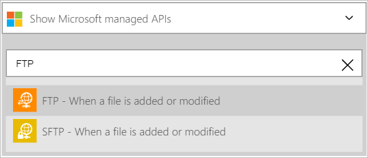
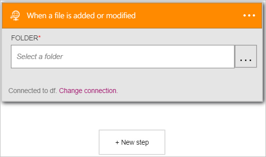
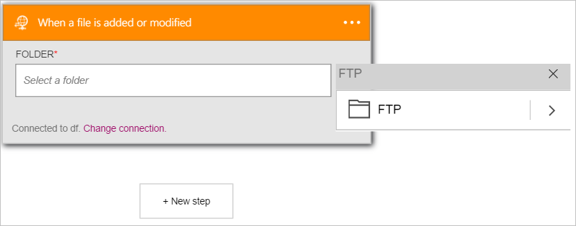
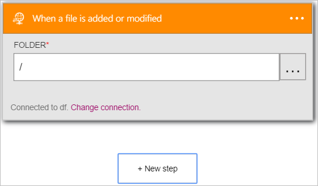
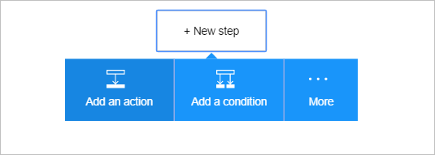
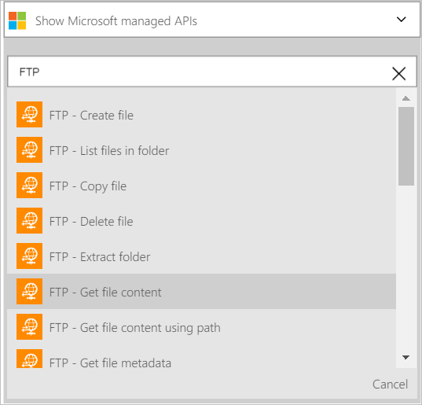
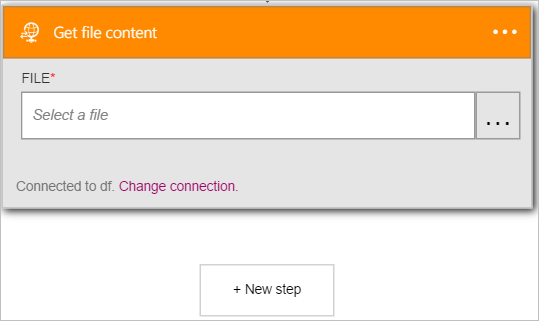
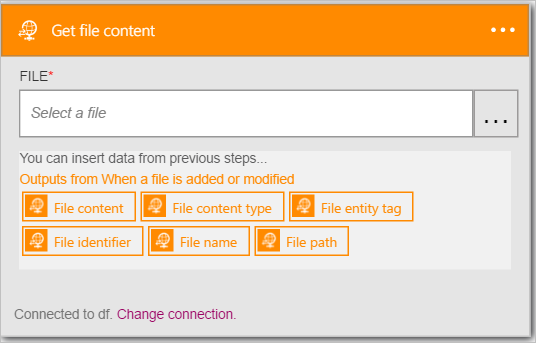
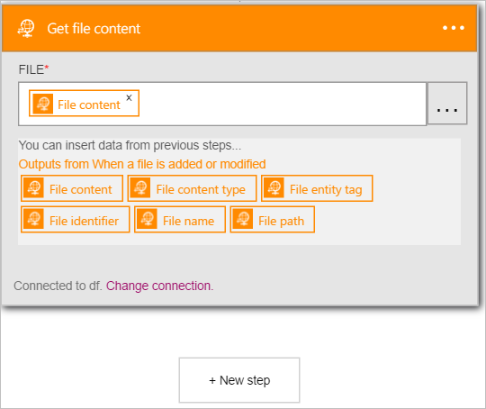

<properties
pageTitle="Learn how to use the FTP connector in logic apps| Microsoft Azure"
description="Create logic apps with Azure App service. Connect to FTP server to manage your files. You can perform various actions such as upload, update, get, and delete files in FTP server."
services="logic-apps"	
documentationCenter=".net,nodejs,java" 	
authors="msftman"	
manager="erikre"	
editor=""
tags="connectors" />

<tags
ms.service="logic-apps"
ms.devlang="multiple"
ms.topic="article"
ms.tgt_pltfrm="na"
ms.workload="integration"
ms.date="07/22/2016"
ms.author="deonhe"/>

# Get started with the FTP connector

Use the FTP connector to monitor, manage and create files on an  FTP server. 

To use [any connector](./apis-list.md), you first need to create a logic app. You can get started by [creating a logic app now](../app-service-logic/app-service-logic-create-a-logic-app.md).

## Connect to FTP

Before your logic app can access any service, you first need to create a *connection* to the service. A [connection](./connectors-overview.md) provides connectivity between a logic app and another service.  

### Create a connection to FTP

>[AZURE.INCLUDE [Steps to create a connection to FTP](../../includes/connectors-create-api-ftp.md)]

## Use a FTP trigger

A trigger is an event that can be used to start the workflow defined in a logic app. [Learn more about triggers](../app-service-logic/app-service-logic-what-are-logic-apps.md#logic-app-concepts).  

>[AZURE.IMPORTANT]The FTP connector requires an FTP server that  is accessible from the Internet and is configured to operate with PASSIVE mode. Also, the FTP connector is **not compatible with implicit FTPS (FTP over SSL)**. The FTP connector only supports explicit FTPS (FTP over SSL).  

In this example, I will show you how to use the **FTP - When a file is added or modified** trigger to initiate a logic app workflow when a file is added to, or modified on, an FTP server. In an enterprise example, you could use this trigger to monitor an FTP folder for new files that represent orders from customers.  You could then use an FTP connector action such as **Get file content** to get the contents of the order for further processing and storage in your orders database.

1. Enter *ftp* in the search box on the logic apps designer then select the **FTP - When a file is added or modified**  trigger   
  
The **When a file is added or modified** control opens up  
  
- Select the **...** located on the right side of the control. This opens the folder picker control  
  
- Select the **>** (right arrow) and browse to find the folder that you want to monitor for new or modified files. Select the folder and notice the folder is now displayed in the **Folder** control.  
   

At this point, your logic app has been configured with a trigger that will begin a run of the other triggers and actions in the workflow when a file is either modified or created in the specific FTP folder. 

>[AZURE.NOTE]For a logic app to be functional, it must contain at least one trigger and one action. Follow the steps in the next section to add an action.  

## Use a FTP action

An action is an operation carried out by the workflow defined in a logic app. [Learn more about actions](../app-service-logic/app-service-logic-what-are-logic-apps.md#logic-app-concepts).  

Now that you have added a trigger, follow these steps to add an action that will get the contents of the new or modified file found by the trigger.    

1. Select **+ New step** to add the the action to get the contents of the file on the FTP server  
- Select the **Add an action** link.  
  
- Enter *FTP* to search for all actions related to FTP.
- Select **FTP - Get file content**  as the action to take when a new or modified file is found in the FTP folder.      
  
The **Get file content** control opens. **Note**: you will be prompted to authorize your logic app to access your FTP server account if you have not done so previously.  
   
- Select the **File** control (the white space located below **FILE***). Here, you can use any of the various properties from the new or modified file found on the FTP server.  
- Select the **File content** option.  
   
-  The control is updated, indicating that the **FTP - Get file content** action will get the *file content* of the new or modified file on the FTP server.      
     
- Save your work then add a file to the FTP folder to test your workflow.    

At this point, the logic app has been configured with a trigger to monitor a folder on an FTP server and initiate the workflow when it finds either a new file or a modified file on the FTP server. 

The logic app also has been configured with an action to get the contents of the new or modified file.

You can now add another action such as the [SQL Server - insert row](./connectors-create-api-sqlazure.md#insert-row) action to insert the contents of the new or modified file into a SQL database table.  

## Technical Details

Here are the details about the triggers, actions and responses that this connection supports:

## FTP triggers

FTP has the following trigger(s):  

|Trigger | Description|
|--- | ---|
|[When a file is added or modified](connectors-create-api-ftp.md#when-a-file-is-added-or-modified)|This operation triggers a flow when a file is added or modified in a folder.|

## FTP actions

FTP has the following actions:

|Action|Description|
|--- | ---|
|[Get file metadata](connectors-create-api-ftp.md#get-file-metadata)|This operation gets the metadata for a file.|
|[Update file](connectors-create-api-ftp.md#update-file)|This operation updates a file.|
|[Delete file](connectors-create-api-ftp.md#delete-file)|This operation deletes a file.|
|[Get file metadata using path](connectors-create-api-ftp.md#get-file-metadata-using-path)|This operation gets the metadata of a file using the path.|
|[Get file content using path](connectors-create-api-ftp.md#get-file-content-using-path)|This operation gets the content of a file using the path.|
|[Get file content](connectors-create-api-ftp.md#get-file-content)|This operation gets the content of a file.|
|[Create file](connectors-create-api-ftp.md#create-file)|This operation creates a file.|
|[Copy file](connectors-create-api-ftp.md#copy-file)|This operation copies a file to an FTP server.|
|[List files in folder](connectors-create-api-ftp.md#list-files-in-folder)|This operation gets the list of files and subfolders in a folder.|
|[List files in root folder](connectors-create-api-ftp.md#list-files-in-root-folder)|This operation gets the list of files and subfolders in the root folder.|
|[Extract folder](connectors-create-api-ftp.md#extract-folder)|This operation extracts an archive file into a folder (example: .zip).|
### Action details

Here are the details for the actions and triggers for this connector, along with their responses:

### Get file metadata
This operation gets the metadata for a file. 

|Property Name| Display Name|Description|
| ---|---|---|
|id*|File|Select a file|

An * indicates that a property is required

#### Output Details

BlobMetadata

| Property Name | Data Type |
|---|---|---|
|Id|string|
|Name|string|
|DisplayName|string|
|Path|string|
|LastModified|string|
|Size|integer|
|MediaType|string|
|IsFolder|boolean|
|ETag|string|
|FileLocator|string|

### Update file
This operation updates a file. 

|Property Name| Display Name|Description|
| ---|---|---|
|id*|File|Select a file|
|body*|File content|Content of the file|

An * indicates that a property is required

#### Output Details

BlobMetadata

| Property Name | Data Type |
|---|---|---|
|Id|string|
|Name|string|
|DisplayName|string|
|Path|string|
|LastModified|string|
|Size|integer|
|MediaType|string|
|IsFolder|boolean|
|ETag|string|
|FileLocator|string|

### Delete file
This operation deletes a file. 

|Property Name| Display Name|Description|
| ---|---|---|
|id*|File|Select a file|

An * indicates that a property is required

### Get file metadata using path
This operation gets the metadata of a file using the path. 

|Property Name| Display Name|Description|
| ---|---|---|
|path*|File path|Select a file|

An * indicates that a property is required

#### Output Details

BlobMetadata

| Property Name | Data Type |
|---|---|---|
|Id|string|
|Name|string|
|DisplayName|string|
|Path|string|
|LastModified|string|
|Size|integer|
|MediaType|string|
|IsFolder|boolean|
|ETag|string|
|FileLocator|string|

### Get file content using path
This operation gets the content of a file using the path. 

|Property Name| Display Name|Description|
| ---|---|---|
|path*|File path|Select a file|

An * indicates that a property is required

### Get file content
This operation gets the content of a file. 

|Property Name| Display Name|Description|
| ---|---|---|
|id*|File|Select a file|

An * indicates that a property is required

### Create file
This operation creates a file. 

|Property Name| Display Name|Description|
| ---|---|---|
|folderPath*|Folder path|Select a folder|
|name*|File name|Name of the file|
|body*|File content|Content of the file|

An * indicates that a property is required

#### Output Details

BlobMetadata

| Property Name | Data Type |
|---|---|---|
|Id|string|
|Name|string|
|DisplayName|string|
|Path|string|
|LastModified|string|
|Size|integer|
|MediaType|string|
|IsFolder|boolean|
|ETag|string|
|FileLocator|string|

### Copy file
This operation copies a file to an FTP server. 

|Property Name| Display Name|Description|
| ---|---|---|
|source*|Source url|Url to source file|
|destination*|Destination file path|Destination file path, including target filename|
|overwrite|Overwrite?|Overwrites the destination file if set to 'true'|

An * indicates that a property is required

#### Output Details

BlobMetadata

| Property Name | Data Type |
|---|---|---|
|Id|string|
|Name|string|
|DisplayName|string|
|Path|string|
|LastModified|string|
|Size|integer|
|MediaType|string|
|IsFolder|boolean|
|ETag|string|
|FileLocator|string|

### When a file is added or modified
This operation triggers a flow when a file is added or modified in a folder. 

|Property Name| Display Name|Description|
| ---|---|---|
|folderId*|Folder|Select a folder|

An * indicates that a property is required

### List files in folder
This operation gets the list of files and subfolders in a folder. 

|Property Name| Display Name|Description|
| ---|---|---|
|id*|Folder|Select a folder|

An * indicates that a property is required

#### Output Details

BlobMetadata

| Property Name | Data Type |
|---|---|---|
|Id|string|
|Name|string|
|DisplayName|string|
|Path|string|
|LastModified|string|
|Size|integer|
|MediaType|string|
|IsFolder|boolean|
|ETag|string|
|FileLocator|string|

### List files in root folder
This operation gets the list of files and subfolders in the root folder. 

There are no parameters for this call

#### Output Details

BlobMetadata

| Property Name | Data Type |
|---|---|---|
|Id|string|
|Name|string|
|DisplayName|string|
|Path|string|
|LastModified|string|
|Size|integer|
|MediaType|string|
|IsFolder|boolean|
|ETag|string|
|FileLocator|string|

### Extract folder
This operation extracts an archive file into a folder (example: .zip). 

|Property Name| Display Name|Description|
| ---|---|---|
|source*|Source archive file path|Path to the archive file|
|destination*|Destination folder path|Path to the destination folder|
|overwrite|Overwrite?|Overwrites the destination files if set to 'true'|

An * indicates that a property is required

#### Output Details

BlobMetadata

| Property Name | Data Type |
|---|---|---|
|Id|string|
|Name|string|
|DisplayName|string|
|Path|string|
|LastModified|string|
|Size|integer|
|MediaType|string|
|IsFolder|boolean|
|ETag|string|
|FileLocator|string|

## HTTP responses

The actions and triggers above can return one or more of the following HTTP status codes: 

|Name|Description|
|---|---|
|200|OK|
|202|Accepted|
|400|Bad Request|
|401|Unauthorized|
|403|Forbidden|
|404|Not Found|
|500|Internal Server Error. Unknown error occurred.|
|default|Operation Failed.|

## Next Steps
[Create a logic app](../app-service-logic/app-service-logic-create-a-logic-app.md)