# Create, monitor, and manage FTP files by using Azure Logic Apps

With Azure Logic Apps and the FTP connector, you can create automated tasks and workflows that create, monitor, send, and receive files through your account on an FTP server, along with other actions, for example:

* Monitor when files are added or changed.
* Get, create, copy, update, list, and delete files.
* Get file content and metadata.
* Extract archives to folders.

You can use triggers that get responses from your FTP server and make the output available to other actions. You can use run actions in your logic apps for managing files on your FTP server. You can also have other actions use the output from FTP actions. For example, if you regularly get files from your FTP server, you can send email about those files and their content by using the Office 365 Outlook connector or Outlook.com connector. If you're new to logic apps, review [What is Azure Logic Apps](../logic-apps/logic-apps-overview.md).

## Limitations

* The FTP connector supports only explicit FTP over SSL (FTPS) and isn't compatible with implicit FTPS.

* By default, FTP actions can read or write files that are *50 MB or smaller*. To handle files larger than 50 MB, FTP actions support [message chunking](../logic-apps/logic-apps-handle-large-messages.md). The **Get file content** action implicitly uses chunking.

* FTP triggers don't support chunking. When requesting file content, triggers select only files that are 50 MB or smaller. To get files larger than 50 MB, follow this pattern:

  * Use an FTP trigger that returns file properties, such as **When a file is added or modified (properties only)**.

  * Follow the trigger with the FTP **Get file content** action, which reads the complete file and implicitly uses chunking.

* If you have an on-premises FTP server, consider creating an [integration service environment (ISE)](../logic-apps/connect-virtual-network-vnet-isolated-environment-overview.md) or using [Azure App Service Hybrid connections](../app-service/app-service-hybrid-connections.md), which both let you access on-premises data sources without using an on-premises data gateway.

## How FTP triggers work

FTP triggers work by polling the FTP file system and looking for any file that was changed since the last poll. Some tools let you preserve the timestamp when the files change. In these cases, you have to disable this feature so your trigger can work. Here are some common settings:

| SFTP client | Action |
|-------------|--------|
| Winscp | Go to **Options** > **Preferences** > **Transfer** > **Edit** > **Preserve timestamp** > **Disable** |
| FileZilla | Go to **Transfer** > **Preserve timestamps of transferred files** > **Disable** |
|||

When a trigger finds a new file, the trigger checks that the new file is complete, and not partially written. For example, a file might have changes in progress when the trigger checks the file server. To avoid returning a partially written file, the trigger notes the timestamp for the file that has recent changes, but doesn't immediately return that file. The trigger returns the file only when polling the server again. Sometimes, this behavior might cause a delay that is up to twice the trigger's polling interval.

## Prerequisites

* An Azure subscription. If you don't have an Azure subscription, [sign up for a free Azure account](https://azure.microsoft.com/free/).

* Your FTP host server address and account credentials

  The FTP connector requires that your FTP server is accessible from the internet and set up to operate in *passive* mode. Your credentials let your logic app create a connection and access your FTP account.

* Basic knowledge about [how to create logic apps](../logic-apps/quickstart-create-first-logic-app-workflow.md)

* The logic app where you want to access your FTP account. To start with an FTP trigger, [create a blank logic app](../logic-apps/quickstart-create-first-logic-app-workflow.md). To use an FTP action, start your logic app with another trigger, for example, the **Recurrence** trigger.

## Connect to FTP

[!INCLUDE [Create connection general intro](../../includes/connectors-create-connection-general-intro.md)]

1. Sign in to the [Azure portal](https://portal.azure.com), and open your logic app in Logic App Designer.

1. For blank logic apps, in the search box, enter `ftp` as your filter. From the **Triggers** list, select the trigger that you want.

   -or-

   For existing logic apps, under the last step where you want to add an action, select **New step**, and then select **Add an action**. In the search box, enter `ftp` as your filter. From the **Actions** list, select the action that you want.

   To add an action between steps, move your pointer over the arrow between steps. Select the plus sign (**+**) that appears, and then select **Add an action**.

1. Provide your connection information, and select **Create**.

1. Provide the information for your selected trigger or action and continue building your logic app's workflow.

## Examples

### Add FTP trigger

The **When a file is added or modified (properties only)** trigger starts a logic app workflow when the trigger detects that a file is added or changed on an FTP server. For example, you can add a condition that checks the file's content and decides whether to get that content, based on whether that content meets a specified condition. Finally, you can add an action that gets the file's content, and put that content into a different folder on the SFTP server.

For example, you can use this trigger to monitor an FTP folder for new files that describe customer orders. You can then use an FTP action such as **Get file metadata** to get the properties for that new file, and then use **Get file content** to get the content from that file for further processing and store that order in an orders database.

Here is an example that shows how to use the **When a file is added or modified (properties only)** trigger.

1. Sign in to the [Azure portal](https://portal.azure.com), and open your logic app in Logic App Designer, if not open already.

1. For blank logic apps, in the search box, enter `ftp` as your filter. Under the triggers list, select this trigger: **When a filed is added or modified (properties only)**

   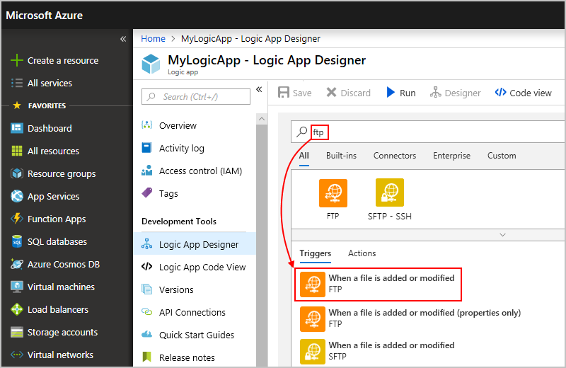

1. Provide the necessary details for your connection, and then select **Create**.

   By default, this connector transfers files in text format. To transfer files in binary format, for example, where and when encoding is used, select **Binary Transport**.

   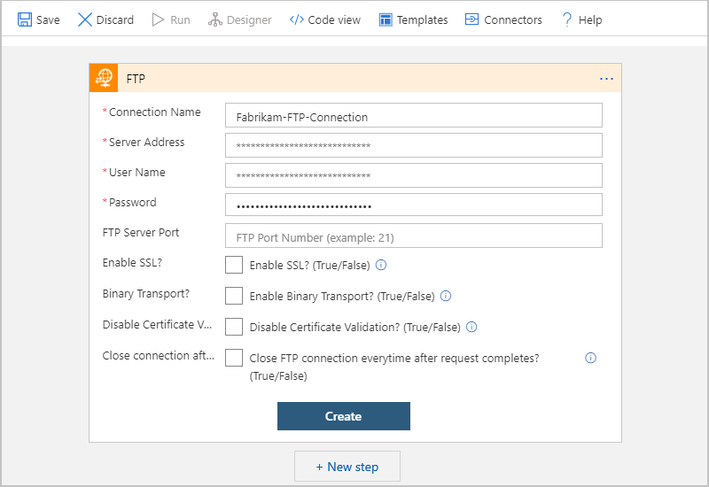

1. In the **Folder** box, select the folder icon so that a list appears. To find the folder you want to monitor for new or edited files, select the right angle arrow (**>**), browse to that folder, and then select the folder.

   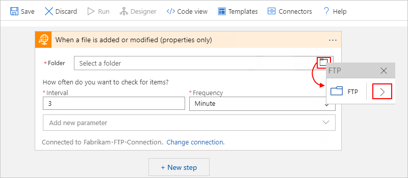

   Your selected folder appears in the **Folder** box.

   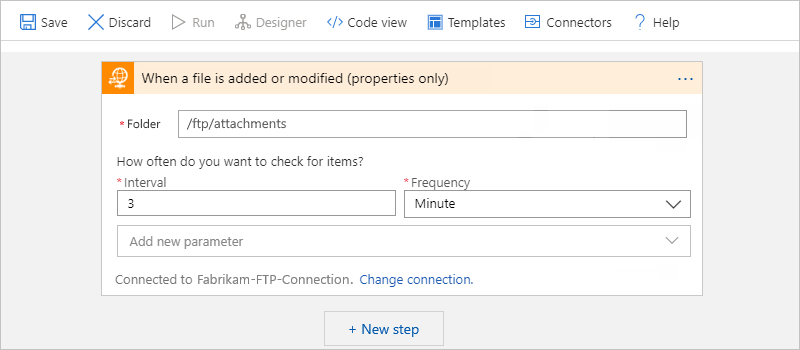

1. Save your logic app. On the designer toolbar, select **Save**.

Now that your logic app has a trigger, add the actions you want to run when your logic app finds a new or edited file. For this example, you can add an FTP action that gets the new or updated content.

### Add FTP action

The **Get file metadata** action gets the properties for a file that's on your FTP server and the **Get file content** action gets the file content based on the information about that file on your FTP server. For example, you can add the trigger from the previous example and these actions to get the file's content after that file is added or edited.

1. Under the trigger or any other actions, select **New step**.

1. In the search box, enter `ftp` as your filter. Under the actions list, select this action: **Get file metadata**

   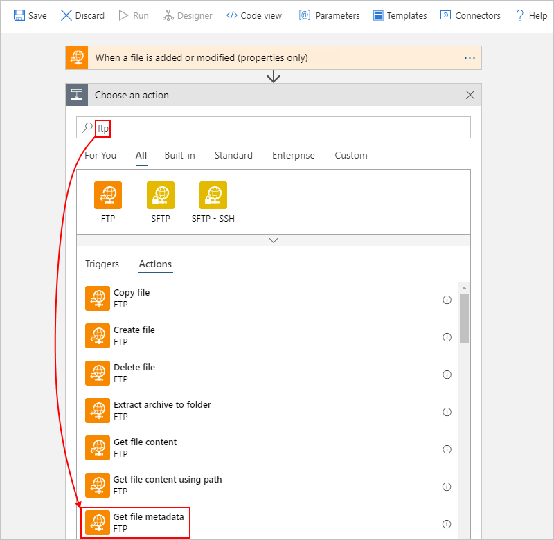

1. If you already have a connection to your FTP server and account, go to the next step. Otherwise, provide the necessary details for that connection, and then select **Create**.

   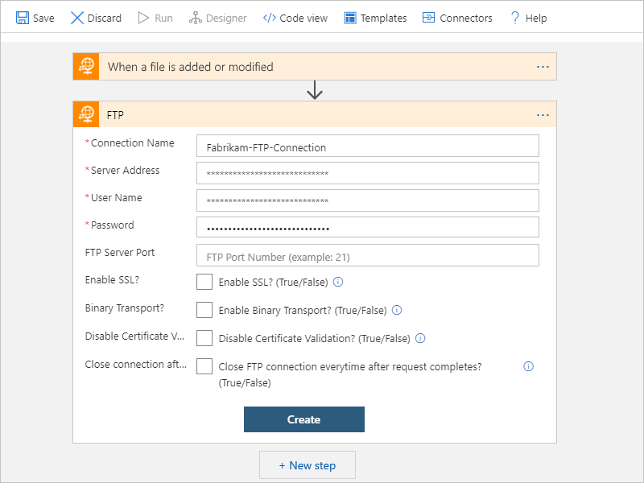

1. After the **Get file metadata** action appears, click inside the **File** box so that the dynamic content list appears. You can now select properties for the outputs from previous steps. In the dynamic content list, under **Get file metadata**, select the **List of Files Id** property, which references the collection where the file was added or updated.

   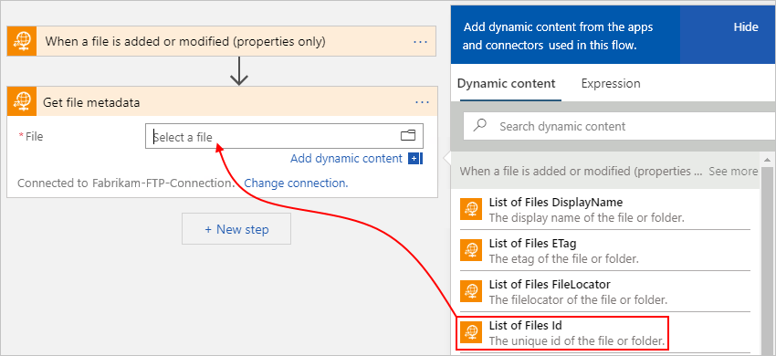

   The **List of Files Id** property now appears in the **File** box.

   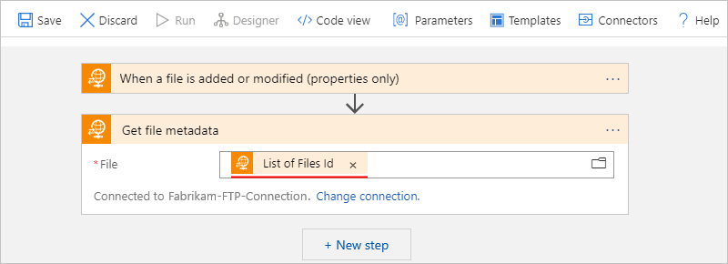

1. Now add this FTP action: **Get file content**

   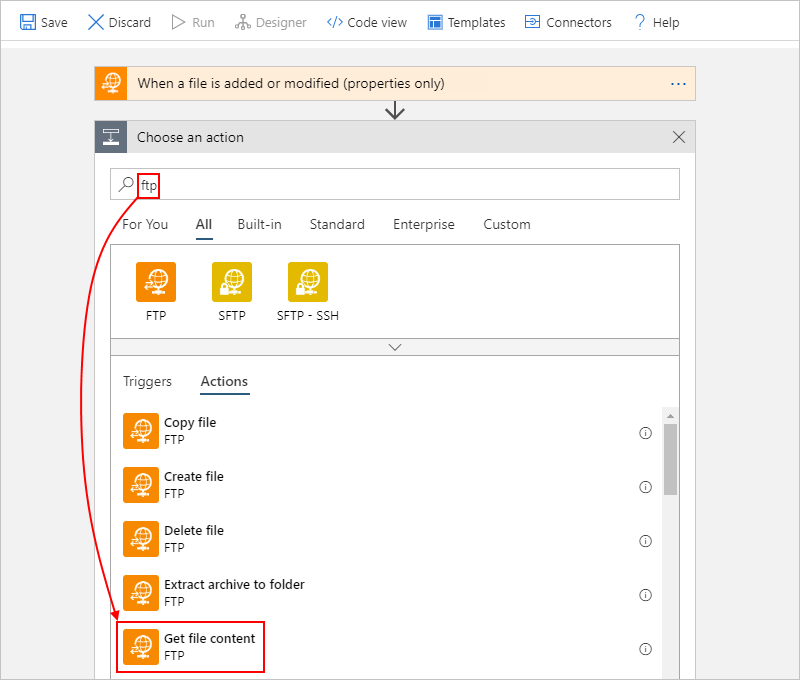

1. After the **Get file content** action appears, click inside the **File** box so that the dynamic content list appears. You can now select properties for the outputs from previous steps. In the dynamic content list, under **Get file metadata**, select the **Id** property, which references the file that was added or updated.

   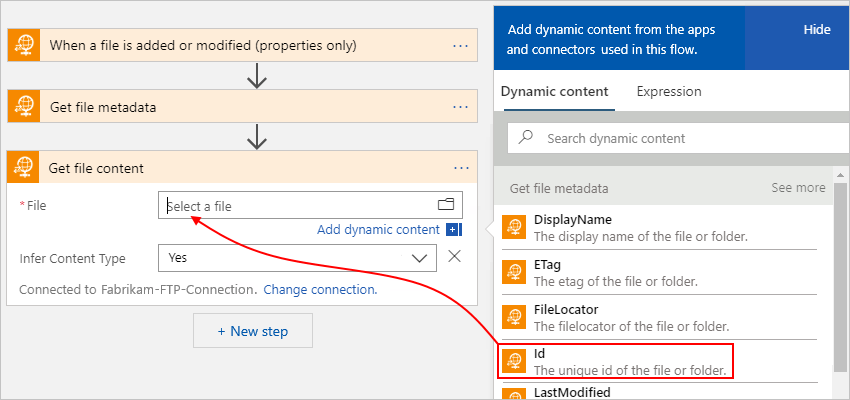

   The **Id** property now appears in the **File** box.

   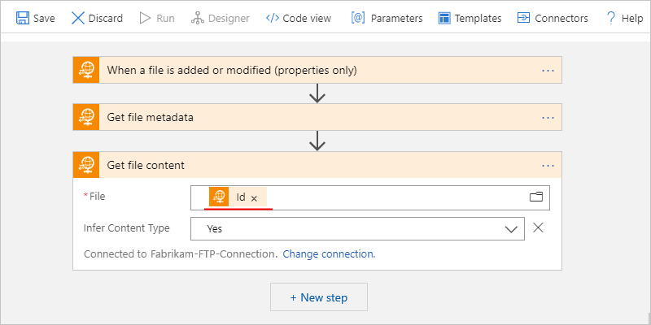

1. Save your logic app.

## Test your logic app

To check that your workflow returns the content that you expect, add another action that sends you the content from the uploaded or updated file.

1. Under the **Get file content** action, add an action that can send you the file's contents. This example adds the **Send an email** action for the Office 365 Outlook.

   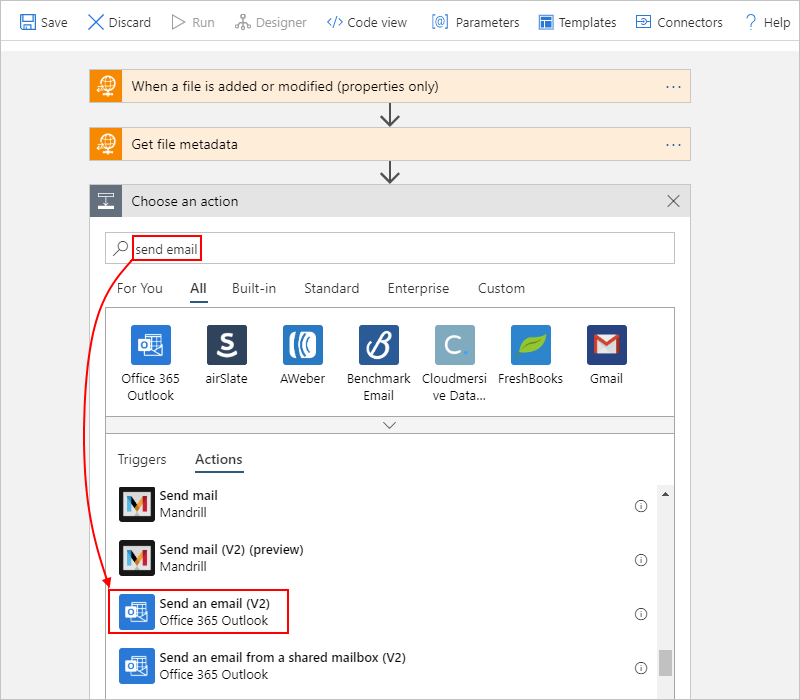

1. After the action appears, provide the information and include the properties that you want to test. For example, include the **File content** property, which appears in the dynamic content list after you select **See more** in the **Get file content** section.

   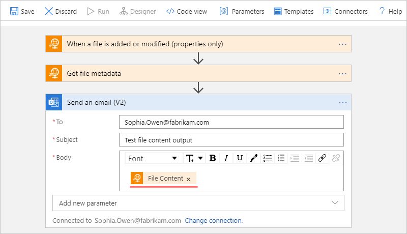

1. Save your logic app. To run and trigger the logic app, on the toolbar, select **Run**, and then add a file to the FTP folder that your logic app now monitors.

## Connector reference

For technical details about triggers, actions, and limits, which are described by the connector's OpenAPI (formerly Swagger) description, review the [connector's reference page](/connectors/ftpconnector/).

## Next steps

* Learn about other [Logic Apps connectors](../connectors/apis-list.md)
