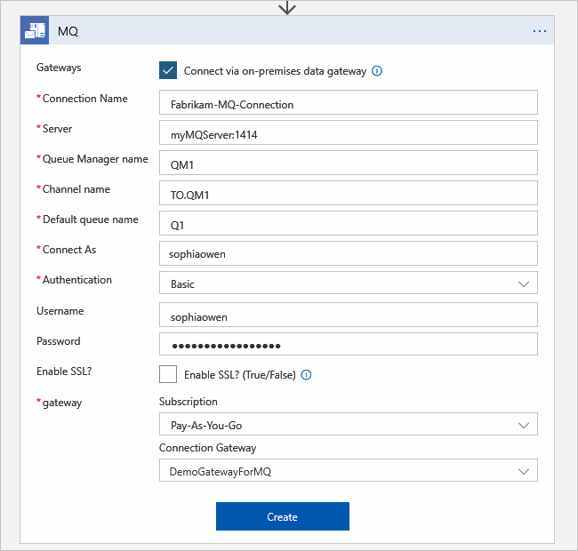
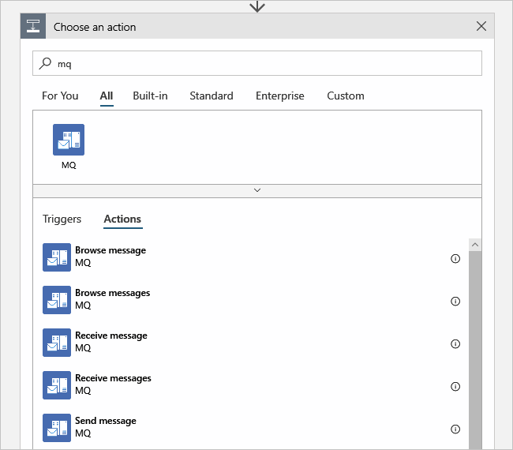
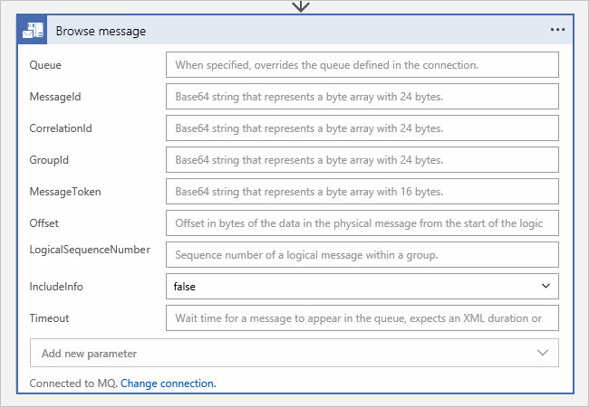
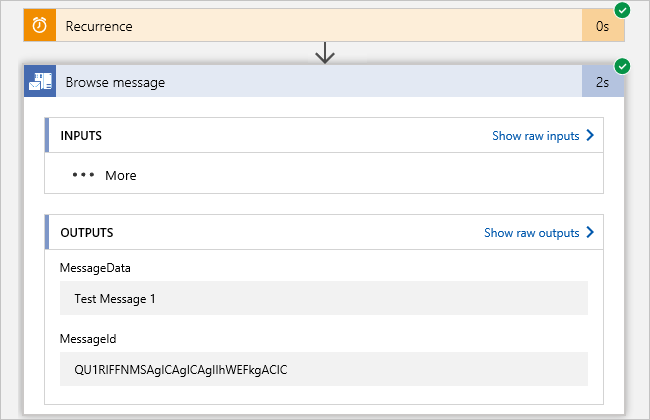
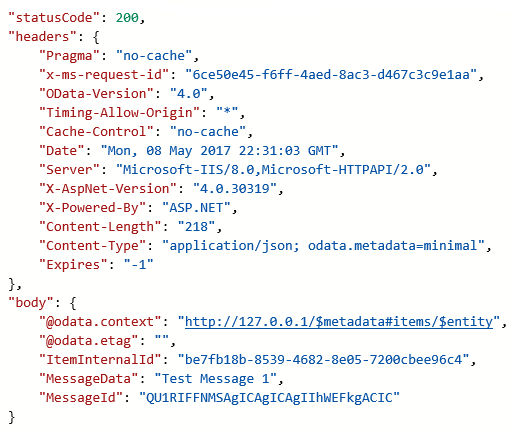
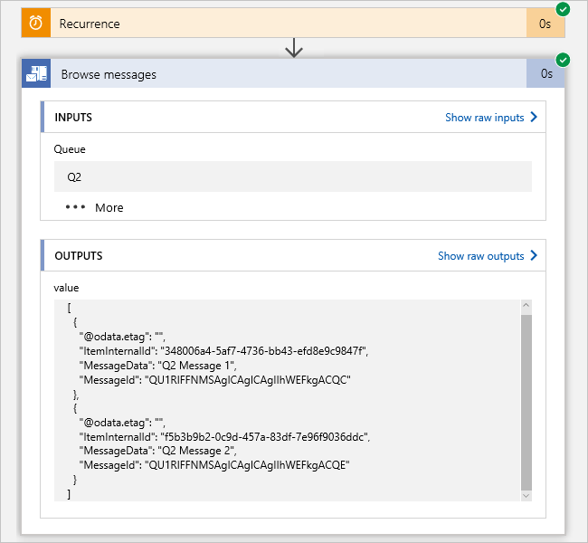
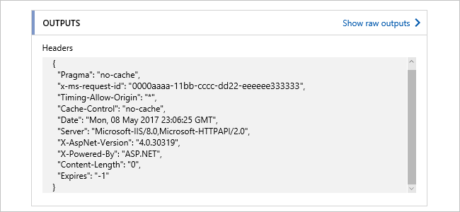
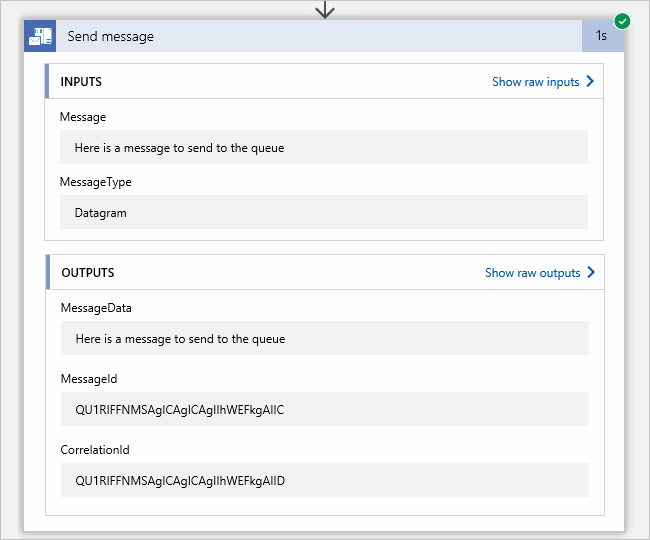

# Connect to an IBM MQ server from Azure Logic Apps

The IBM MQ connector sends and retrieves messages stored in an IBM MQ server on premises or in Azure. This connector includes a Microsoft MQ client that communicates with a remote IBM MQ server across a TCP/IP network. This article provides a starter guide to use the MQ connector. You can start by browsing a single message on a queue and then try other actions.

The IBM MQ connector includes these actions but provides no triggers:

- Browse a single message without deleting the message from the IBM MQ server.
- Browse a batch of messages without deleting the messages from the IBM MQ server.
- Receive a single message and delete the message from the IBM MQ server.
- Receive a batch of messages and delete the messages from the IBM MQ server.
- Send a single message to the IBM MQ server.

Here are the officially supported IBM WebSphere MQ versions:

  * MQ 7.5
  * MQ 8.0
  * MQ 9.0
  * MQ 9.1

## Prerequisites

* If you're using an on-premises MQ server, [install the on-premises data gateway](../logic-apps/logic-apps-gateway-install.md) on a server within your network. The server where the on-premises data gateway is installed must also have .NET Framework 4.6 installed for the MQ connector to work.

  After you finish installing the gateway, you must also create a resource in Azure for the on-premises data gateway. For more information, see [Set up the data gateway connection](../logic-apps/logic-apps-gateway-connection.md).

  If your MQ server is publicly available or available within Azure, you don't have to use the data gateway.

* The logic app where you want to add the MQ action. This logic app must use the same location as your on-premises data gateway connection and must already have a trigger that starts your workflow.

  The MQ connector doesn't have any triggers, so you must add a trigger to your logic app first. For example, you can use the Recurrence trigger. If you're new to logic apps, try this [quickstart to create your first logic app](../logic-apps/quickstart-create-first-logic-app-workflow.md).

## Create MQ connection

If you don't already have an MQ connection when you add an MQ action, you're prompted to create the connection, for example:

1. If you're connecting to an on-premises MQ server, select **Connect via on-premises data gateway**.

1. Provide the connection information for your MQ server.

   * For **Server**, you can enter the MQ server name, or enter the IP address followed by a colon and the port number.

   * To use Secure Sockets Layer (SSL), select **Enable SSL?**.

     The MQ connector currently supports only server authentication, not client authentication. For more information, see [Connection and authentication problems](#connection-problems).

1. In the **gateway** section, follow these steps:

   1. From the **Subscription** list, select the Azure subscription associated with your Azure gateway resource.

   1. From the **Connection Gateway** list, select the Azure gateway resource that you want to use.

1. When you're done, select **Create**.

### Connection and authentication problems

When your logic app tries connecting to your on-premises MQ server, you might get this error:

`"MQ: Could not Connect the Queue Manager '<queue-manager-name>': The Server was expecting an SSL connection."`

* If you're using the MQ connector directly in Azure, the MQ server needs to use a certificate that's issued by a trusted [certificate authority](https://www.ssl.com/faqs/what-is-a-certificate-authority/).

* If you're using the on-premises data gateway, try to use a certificate that's issued by a trusted [certificate authority](https://www.ssl.com/faqs/what-is-a-certificate-authority/) when possible. However, if this option isn't possible, you could use a self-signed certificate, which is isn't issued by a trusted [certificate authority](https://www.ssl.com/faqs/what-is-a-certificate-authority/) and is considered less secure.

  To install the server's self-signed certificate, you can use the **Windows Certification Manager** (certmgr.msc) tool. For this scenario, on your local computer where the on-premises data gateway service is running, you need to install the certificate in your **Local Computer** certificates store at the **Trusted Root Certification Authorities** level.

  1. On the computer where the on-premises-data gateway service is running, open the start menu, find and select **Manage user certificates**.

  1. After the Windows Certification Manager tool opens, go to the **Certificates - Local Computer** >  **Trusted Root Certification Authorities** folder, and install the certificate.

     > [!IMPORTANT]
     > Make sure that you install certificate in the **Certificates - Local Computer** > **Trusted Root Certification Authorities** store.

* The MQ server requires that you define the cipher specification that you want to use for TLS/SSL connections. However, SslStream in .NET doesn't permit you to specify the order for cipher specifications. To work around this limitation, you can change your MQ server configuration to match the first cipher specification in the suite that the connector sends in the TLS/SSL negotiation.

  When you try the connection, the MQ server logs an event message that indicates the connection failed because the other end used the incorrect cipher specification. The event message contains the cipher specification that appears first in the list. Update the cipher specification in the channel configuration to match the cipher specification in the event message.

## Browse single message

1. In your logic app, under the trigger or another action, select **New step**.

1. In the search box, enter `mq`, and select the **Browse message** action.

   

1. If you haven't already created an MQ connection, you're prompted to [create that connection](#create-connection).

1. After you create the connection, set up the **Browse message** action's properties:

   | Property | Description |
   |----------|-------------|
   | **Queue** | If different from the queue specified in the connection, specify that queue. |
   | **MessageId**, **CorrelationId**, **GroupId**, and other properties | Browse for a message that's based on the different MQ message properties |
   | **IncludeInfo** | To include additional message information in the output, select **true**. To omit additional message information in the output, select **false**. |
   | **Timeout** | Enter a value to determine how long to wait for a message to arrive in an empty queue. If nothing is entered, the first message in the queue is retrieved, and there is no time spent waiting for a message to appear. |
   |||

   For example:

   

1. When you're done, on the designer toolbar, select **Save**. To test your app, select **Run**.

   After the run finishes, the designer shows the workflow steps and their status so that you can review the output.

1. To view the details about each step, click the step's title bar. To review more information about a step's output, select **Show raw outputs**.

   

   Here is some sample raw output:

   

1. If you set **IncludeInfo** to **true**, additional output is shown:

   

## Browse multiple messages

The **Browse messages** action includes a **BatchSize** option to indicate how many messages to return from the queue. If **BatchSize** has no value, all messages are returned. The returned output is an array of messages.

1. Follow the previous steps, but add the **Browse messages** action instead.

1. If you haven't already created an MQ connection, you're prompted to [create that connection](#create-connection). Otherwise, by default, the first previously configured connection is used. To create a new connection, select **Change connection**. Or, select a different connection.

1. Provide the information for the action.

1. Save and run the logic app.

   After the logic app finishes running, here is some sample output from the **Browse messages** action:

   

## Receive single message

The **Receive message** action has the same inputs and outputs as the **Browse message** action. When you use **Receive message**, the message is deleted from the queue.

## Receive multiple messages

The **Receive messages** action has the same inputs and outputs as the **Browse messages** action. When you use **Receive messages**, the messages are deleted from the queue.

> [!NOTE]
> When running a browse or a receive action on a queue that doesn't have any messages, 
> the action fails with this output:
>
> 

## Send message

1. Follow the previous steps, but add the **Send message** action instead.

1. If you haven't already created an MQ connection, you're prompted to [create that connection](#create-connection). Otherwise, by default, the first previously configured connection is used. To create a new connection, select **Change connection**. Or, select a different connection.

1. Provide the information for the action. For **MessageType**, select a valid message type: **Datagram**, **Reply**, or **Request**

   

1. Save and run the logic app.

   After the logic app finishes running, here is some sample output from the **Send message** action:

   

## Connector reference

For technical details about actions and limits, which are described by the connector's Swagger description, 
review the connector's [reference page](/connectors/mq/).

## Next steps

* Learn about other [Logic Apps connectors](../connectors/apis-list.md)
