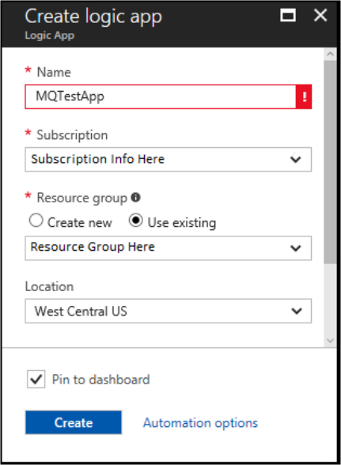

 
---
title: Learn how to use the MQ connector in Azure Logic Apps | Microsoft Docs
description: Connect to an on-premises or Azure MQ server from your logic app workflow to browse, receive, and send messages to WebSphere MQ
services: logic-apps
author: valthom
manager: anneta
documentationcenter: ''
editor: ''
tags: connectors

ms.assetid:
ms.service: logic-apps
ms.devlang: na
ms.topic: article
ms.tgt_pltfrm: na
ms.workload:  integration
ms.date: 06/01/2017
ms.author: valthom; ladocs
---

# Connect to an IBM MQ server from logic apps using the MQ connector 

Microsoft Connector for MQ sends and retrieves messages stored in an MQ Server on-premises, or in Azure. This connector includes a Microsoft MQ client that communicates with a remote IBM MQ server across a TCP/IP network. This document is a starter guide to use the MQ connector. We recommended you begin by browsing a single message on a queue, and then trying the other actions.    

The MQ connector includes the following actions. There are no triggers.

-	Browse a single message without deleting the message from the IBM MQ Server
-	Browse a batch of messages without deleting the messages from the IBM MQ Server
-	Receive a single message and delete the message from the IBM MQ Server
-	Receive a batch of messages and delete the messages from the IBM MQ Server
-	Send a single message to the IBM MQ Server 

## Prerequisites

* If using an on-premises MQ server, [install the on-premises data gateway](../logic-apps/logic-apps-gateway-install.md) on a server within your network. If the MQ Server is publicly available, or available within Azure, then the data gateway is not used or required.

    > [!NOTE]
    > The server where the On-Premises Data Gateway is installed must also have .Net Framework 4.6 installed for the MQ Connector to function.

* Create the Azure resource for the on-premises data gateway - [Set up the data gateway connection](../logic-apps/logic-apps-gateway-connection.md).

* Officially supported IBM WebSphere MQ versions:
   * MQ 7.5
   * MQ 8.0

## Create a logic app

1. In the **Azure start board**, select **+** (plus sign), **Web + Mobile**, and then **Logic App**. 
2. Enter the **Name**, such as MQTestApp, **Subscription**, **Resource group**, and **Location** (use the location where the on-premises Data Gateway connection is configured). Select **Pin to dashboard**, and select **Create**.  

## Add a trigger

> [!NOTE]
> The MQ Connector does not have any triggers. So, use another trigger to start your logic app, such as the **Recurrence** trigger. 

1. The **Logic Apps Designer** opens, select **Recurrence** in the list of common triggers.
2. Select **Edit** within the Recurrence Trigger. 
3. Set the **Frequency** to **Day**, and set the **Interval** to **7**. 

## Browse a single message
1. Select **+ New step**, and select **Add an action**.
2. In the search box, type `mq`, and then select **MQ - Browse message**.  

3. If there isn't an existing MQ connection, then create the connection:  

    1. Select **Connect via on-premise data gateway**, and enter the properties of your MQ server.  
    For **Server**, you can enter the MQ server name, or enter the IP address followed by a colon and the port number. 
    2. The **gateway** dropdown lists any existing gateway connections that have been configured. Select your gateway.
    3. Select **Create** when finished. Your connection looks similar to the following:   
    

4. In the action properties, you can:  

    * Use the **Queue** property to access a different queue name than what is defined in the connection
    * Use the **MessageId**, **CorrelationId**, **GroupId**, and other properties to browse for a message based on the different MQ message properties
    * Set **IncludeInfo** to **True** to include additional message information in the output. Or, set it to **False** to not include additional message information in the output.
    * Enter a **Timeout** value to determine how long to wait for a message to arrive in an empty queue. If nothing is entered, the first message in the queue is retrieved, and there is no time spent waiting for a message to appear.  
    

5. **Save** your changes, and then **Run** your logic app:  

6. After a few seconds, the steps of the run are shown, and you can look at the output. Select the green checkmark to see details of each step. Select **See raw outputs** to see additional details on the output data.  
  

    Raw output:  
    

7. When the **IncludeInfo** option is set to true, the following output is displayed:  

## Browse multiple messages
The **Browse messages** action includes a **BatchSize** option to indicate how many messages should be returned from the queue.  If **BatchSize** has no entry, all messages are returned. The returned output is an array of messages.

1. When adding the **Browse messages** action, the first connection that is configured is selected by default. Select **Change connection** to create a new connection, or select a different connection.

2. The output of Browse messages shows:  

## Receive a single message
The **Receive message** action has the same inputs and outputs as the **Browse message** action. When using 
**Receive message**, the message is deleted from the queue.

## Receive multiple messages
The **Receive messages** action has the same inputs and outputs as the **Browse messages** action. When using 
**Receive messages**, the messages are deleted from the queue.

If there are no messages in the queue when doing a browse or a receive, the step fails with the following output:  

## Send a message
1. When adding the **Send message** action, the first connection that is configured is selected by default. Select **Change connection** to create a new connection, or select a different connection. The valid **Message Types** are **Datagram**, **Reply**, or **Request**.  

2. The output of Send message looks like the following:  

## Connector-specific details

View any triggers and actions defined in the swagger, and also see any limits in the [connector details](/connectors/mq/).

## Next steps
[Create a logic app](../logic-apps/logic-apps-create-a-logic-app.md). Explore the other available connectors in Logic Apps at our [APIs list](apis-list.md).
