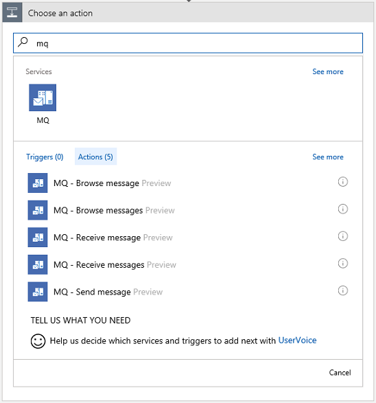
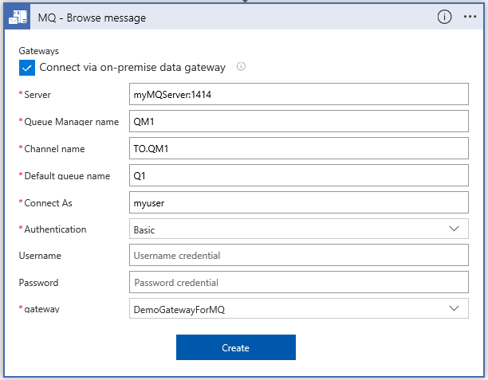
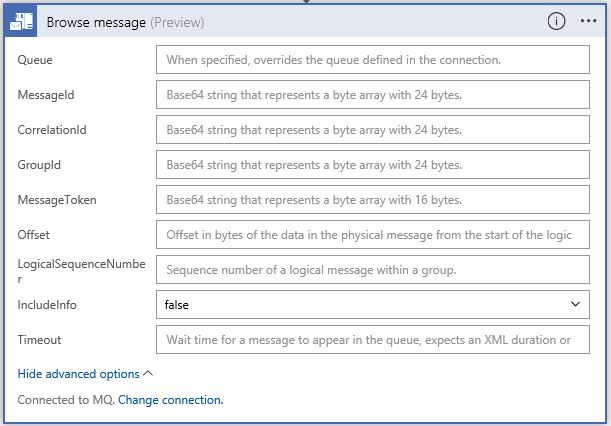
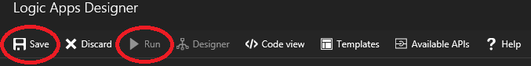
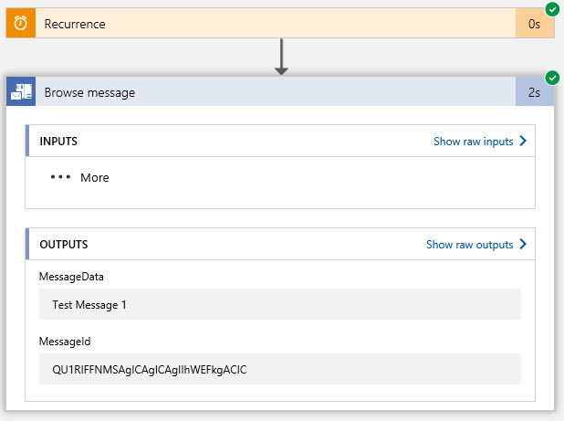
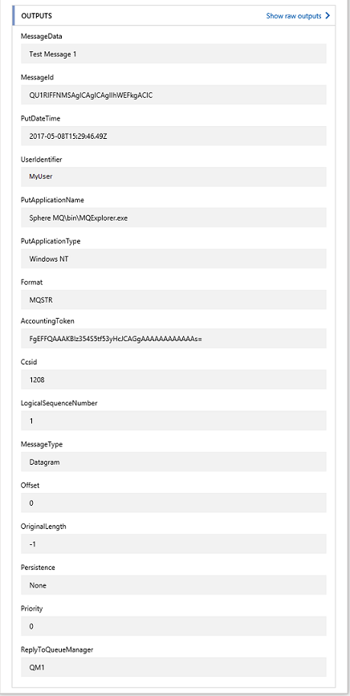
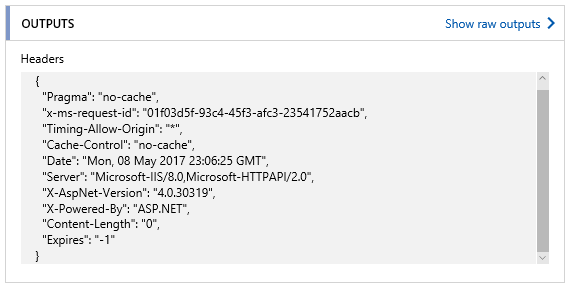
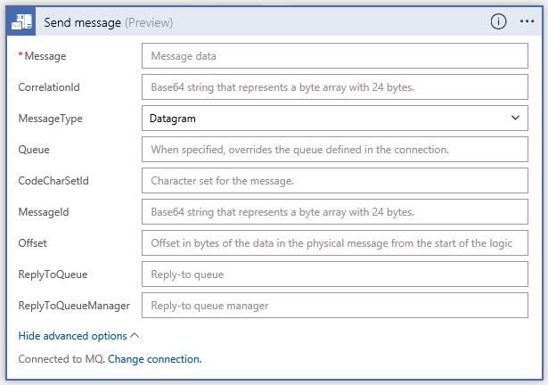
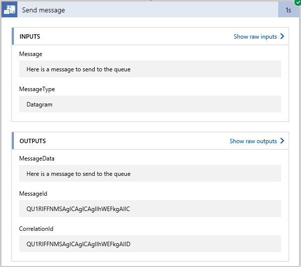

# Connect to an IBM MQ server from Azure Logic Apps

The IBM MQ connector sends and retrieves messages stored in an IBM MQ server on premises or in Azure. This connector includes a Microsoft MQ client that communicates with a remote IBM MQ server across a TCP/IP network. This article provides a starter guide to use the MQ connector. You can start by browsing a single message on a queue and then try other actions.

The IBM MQ connector includes these actions but provides no triggers:

- Browse a single message without deleting the message from the IBM MQ server
- Browse a batch of messages without deleting the messages from the IBM MQ server
- Receive a single message and delete the message from the IBM MQ server
- Receive a batch of messages and delete the messages from the IBM MQ server
- Send a single message to the IBM MQ server

## Prerequisites

* If you're using an on-premises MQ server, [install the on-premises data gateway](../logic-apps/logic-apps-gateway-install.md) on a server within your network. The server where the on-premises data gateway is installed must also have .NET Framework 4.6 installed for the MQ connector to work. You must also create a resource in Azure for the on-premises data gateway. For more information, see [Set up the data gateway connection](../logic-apps/logic-apps-gateway-connection.md).

  However, if your MQ server is publicly available or available within Azure, you don't have to use the data gateway.

* Officially supported IBM WebSphere MQ versions:

  * MQ 7.5
  * MQ 8.0
  * MQ 9.0

* The logic app where you want to add the MQ action. This logic app must use the same location as your on-premises data gateway connection and must already have a trigger that starts your workflow. 

  The MQ connector doesn't have any triggers, so you must add a trigger to your logic app first. For example, you can use the Recurrence trigger. If you're new to logic apps, try this [quickstart to create your first logic app](../logic-apps/quickstart-create-first-logic-app-workflow.md). 

## Browse a single message

1. In your logic app, under the trigger or another action, choose **New step**. 

1. In the search box, type "mq", and select this action: **Browse message**

   

1. If you don't have an existing MQ connection, create the connection:  

   1. In the action, select **Connect via on-premises data gateway**.
   
   1. Enter the properties for your MQ server.  

      For **Server**, you can enter the MQ server name, or enter the IP address followed by a colon and the port number.
    
   1. Open the **gateway** list, which shows any previously configured gateway connections. Select your gateway.
    
   1. When you're done, choose **Create**. 
   
      Your connection looks like this example:

      

1. Set up the action's properties:

   * **Queue**: Specify a queue that's different from the connection.

   * **MessageId**, **CorrelationId**, **GroupId**, and other properties: Browse for a message based on the different MQ message properties

   * **IncludeInfo**: Specify **True** to include additional message information in the output. Or, specify **False** to not include additional message information in the output.

   * **Timeout**: Enter a value to determine how long to wait for a message to arrive in an empty queue. If nothing is entered, the first message in the queue is retrieved, and there is no time spent waiting for a message to appear.

     

1. **Save** your changes, and then **Run** your logic app.

   

   After the run finishes, the steps from the run are shown, and you can review the output.

1. To review the details for each step, choose the green checkmark. To review more information about the output data, choose **Show raw outputs**.

     

   Here is some sample raw output:

   

1. If you set **IncludeInfo** to true, the following output is displayed:

   

## Browse multiple messages

The **Browse messages** action includes a **BatchSize** option to indicate how many messages should be returned from the queue.  If **BatchSize** has no entry, all messages are returned. The returned output is an array of messages.

1. When you add the **Browse messages** action, the first previously configured connection is selected by default. To create a new connection, choose **Change connection**. Or, select a different connection.

1. After the logic app run finishes, here is some sample output from the **Browse messages** action:

   

## Receive single message

The **Receive message** action has the same inputs and outputs as the **Browse message** action. When using **Receive message**, the message is deleted from the queue.

## Receive multiple messages

The **Receive messages** action has the same inputs and outputs as the **Browse messages** action. When using **Receive messages**, the messages are deleted from the queue.

If there are no messages in the queue when doing a browse or a receive, the step fails with this output:  

## Send message

When you add the **Send messages** action, the first previously configured connection is selected by default. To create a new connection, choose **Change connection**. Or, select a different connection.

1. Select a valid message type: **Datagram**, **Reply**, or **Request**  

   

1. After the logic app finishes running, here is some sample output from the **Send message** action:

   

## Connector reference

For technical details about actions and limits, which are 
described by the connector's OpenAPI (formerly Swagger) description, 
review the connector's [reference page](/connectors/mq/).

## Next steps

* Learn about other [Logic Apps connectors](../connectors/apis-list.md)
