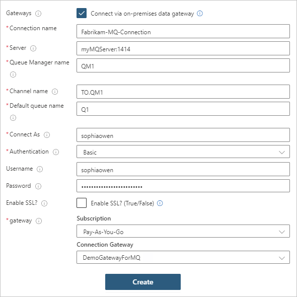
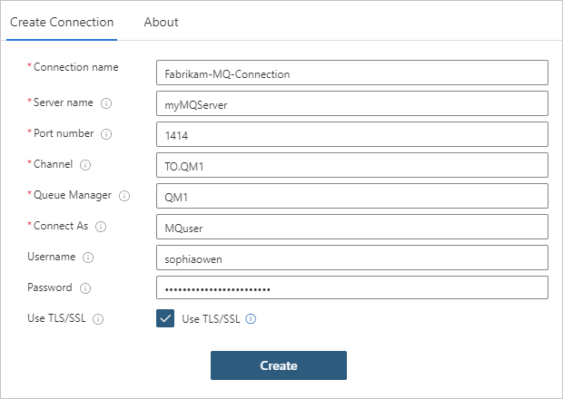

# Connect to an IBM MQ server from a workflow in Azure Logic Apps

[!INCLUDE [logic-apps-sku-consumption-standard](../../includes/logic-apps-sku-consumption-standard.md)]

The MQ connector helps you connect your logic app workflows to an IBM MQ server that's either on premises or in Azure. You can then have your workflows receive and send messages stored in your MQ server. This article provides a get started guide to using the MQ connector by showing how to connect to your MQ server and add an MQ action to your workflow. For example, you can start by browsing a single message in a queue and then try other actions.

This connector includes a Microsoft MQ client that communicates with a remote MQ server across a TCP/IP network. You can connect to the following IBM WebSphere MQ versions:

* MQ 7.5
* MQ 8.0
* MQ 9.0, 9.1, and 9.2

## Available operations

* Consumption logic app: You can connect to an MQ server only by using the *managed* MQ connector. This connector provides only actions, no triggers.

* Standard logic app: You can connect to an MQ server by using either the managed MQ connector, which includes *only* actions, or the *built-in* MQ operations, which include triggers *and* actions.

For more information about the difference between a managed connector and built-in operations, review [key terms in Logic Apps](../logic-apps/logic-apps-overview.md#logic-app-concepts).

#### [Managed](#tab/managed)

The following list describes only some of the managed operations available for MQ:

* Browse a single message or an array of messages without deleting from the MQ server. For multiple messages, you can specify the maximum number of messages to return per batch. Otherwise, all messages are returned.
* Delete a single or an array of messages from the MQ server.
* Receive a single message or an array of messages and then delete from the MQ server.
* Send a single message to the MQ server.

For all the managed connector operations and other technical information, such as properties, limits, and so on, review the [MQ connector's reference page](/connectors/mq/).

#### [Built-in](#tab/built-in)

The following list describes only some of the built-in operations available for MQ:

* When a message is available in a queue, take some action.
* When one or more messages are received from a queue (auto-complete), take some action.
* When one or more messages are received from a queue (peek-lock), take some action.
* Receive a single message or an array of messages from a queue. For multiple messages, you can specify the maximum number of messages to return per batch and the maximum batch size in KB.
* Send a single message or an array of messages to the MQ server.

These built-in MQ operations also have the following capabilities plus the benefits from all the other capabilities for logic apps in the [single-tenant Logic Apps service](../logic-apps/single-tenant-overview-compare.md):

* Transport Layer Security (TLS) encryption for data in transit
* Message encoding for both the send and receive operations
* Support for Azure virtual network integration when your logic app uses the Azure Functions Premium plan

---

## Limitations

* The MQ connector doesn't support segmented messages.

* The MQ connector doesn't use the message's **Format** field and doesn't make any character set conversions. The connector only puts whatever data appears in the message field into a JSON message and sends the message along.

## Prerequisites

* An Azure account and subscription. If you don't have an Azure subscription, [sign up for a free Azure account](https://azure.microsoft.com/free/?WT.mc_id=A261C142F).

* If you're using an on-premises MQ server, [install the on-premises data gateway](../logic-apps/logic-apps-gateway-install.md) on a server within your network. For the MQ connector to work, the server with the on-premises data gateway also must have .NET Framework 4.6 installed.

  After you install the gateway, you must also create a data gateway resource in Azure. The MQ connector uses this resource to access your MQ server. For more information, review [Set up the data gateway connection](../logic-apps/logic-apps-gateway-connection.md). 

  > [!NOTE]
  > You don't need the gateway in the following scenarios:
  > 
  > * You're going to use the built-in operations, not the managed connector.
  > * Your MQ server is publicly available or available in Azure.

* The logic app workflow where you want to access your MQ server. Your logic app resource must have the same location as your gateway resource in Azure.

  The MQ connector doesn't have any triggers, so either your workflow must already start with a trigger, or you first have to add a trigger to your workflow. For example, you can use the [Recurrence trigger](../connectors/connectors-native-recurrence.md).

  If you're new to Azure Logic Apps, try this [quickstart to create an example logic app workflow](../logic-apps/quickstart-create-first-logic-app-workflow.md), which runs in the multi-tenant Logic Apps service.

## Create an MQ connection 

When you add an MQ action for the first time, you're prompted to create a connection to your MQ server.

> [!NOTE]
> The MQ connector currently supports only server authentication, not client authentication. 
> For more information, see [Connection and authentication problems](#connection-problems).

#### [Managed](#tab/managed)

1. If you're connecting to an on-premises MQ server, select **Connect via on-premises data gateway**.

1. Provide the connection information for your MQ server.

   | Property | On-premises or Azure | Description |
   |----------|----------------------|-------------|
   | **Gateways** | On-premises only | Select **Connect via on-premises data gateway**. |
   | **Connection name** | Both | The name to use for your connection |
   | **Server** | Both | Either of the following values: 

- MQ server host name  - IP address followed by a colon and the port number |
   | **Queue Manager name** | Both | The Queue Manager that you want to use |
   | **Channel name** | Both | The channel for connecting to the Queue Manager |
   | **Default queue name** | Both | The default name for the queue |
   | **Connect As** | Both | The username for connecting to the MQ server |
   | **Username** | Both | Your username credential |
   | **Password** | Both | Your password credential |
   | **Enable SSL?** | On-premises only | Use Transport Layer Security (TLS) or Secure Sockets Layer (SSL) |
   | **Gateway - Subscription** | On-premises only | The Azure subscription associated with your gateway resource in Azure |
   | **Gateway - Connection Gateway** | On-premises only | The gateway resource to use |
   ||||

   For example:

   

1. When you're done, select **Create**.

#### [Built-in](#tab/built-in)

1. Provide the connection information for your MQ server.

   | Property | On-premises or Azure | Description |
   |----------|----------------------|-------------|
   | **Connection name** | Both | The name to use for your connection |
   | **Server name** | Both | The MQ server name or IP address |
   | **Port number** | Both | The TCP port number for connecting to the Queue Manager on the host |
   | **Channel** | Both | The channel for connecting to the Queue Manager |
   | **Queue Manager name** | Both | The Queue Manager that you want to use |
   | **Default queue name** | Both | The default name for the queue |
   | **Connect As** | Both | The username for connecting to the MQ server |
   | **Username** | Both | Your username credential |
   | **Password** | Both | Your password credential |
   | **Use TLS** | Both | Use Transport Layer Security (TLS) |
   ||||

   For example:

   

1. When you're done, select **Create**.

---

## Add an MQ action

In Azure Logic Apps, an action follows the trigger or another action and performs some operation in your workflow. The following steps describe the general way to add an action, for example, **Browse a single message**.

1. In the Logic Apps Designer, open your workflow, if not already open.

1. Under the trigger or another action, add a new step.

   To add a step between existing steps, move your mouse over the arrow. Select the plus sign (+) that appears, and then select **Add an action**.

1. In the operation search box, enter `mq`. From the actions list, select the action named **Browse message**.

1. If you're prompted to create a connection to your MQ server, [provide the requested connection information](#create-connection).

1. In the action, provide the property values that the action needs.

   For more properties, open the **Add new parameter** list, and select the properties that you want to add.

1. When you're done, on the designer toolbar, select **Save**.

1. To test your workflow, on the designer toolbar, select **Run**.

   After the run finishes, the designer shows the workflow's run history along with the status for step.

1. To review the inputs and outputs for each step that ran (not skipped), expand or select the step.

   * To review more input details, select **Show raw inputs**.
   * To review more output details, select **Show raw outputs**. If you set **IncludeInfo** to **true**, more output is included.

## Troubleshoot problems

### Failures with browse or receive actions

If you run a browse or receive action on an empty queue, the action fails with the following header outputs:

### Connection and authentication problems

When your workflow tries connecting to your on-premises MQ server, you might get this error:

`"MQ: Could not Connect the Queue Manager '<queue-manager-name>': The Server was expecting an SSL connection."`

* If you're using the MQ connector directly in Azure, the MQ server needs to use a certificate that's issued by a trusted [certificate authority](https://www.ssl.com/faqs/what-is-a-certificate-authority/).

* The MQ server requires that you define the cipher specification to use with TLS connections. However, for security purposes and to include the best security suites, the Windows operating system sends a set of supported cipher specifications.

  The operating system where the MQ server runs chooses the suites to use. To make the configuration match, you have to change your MQ server setup so that the cipher specification matches the option chosen in the TLS negotiation.

  When you try to connect, the MQ server logs an event message that the connection attempt failed because the MQ server chose the incorrect cipher specification. The event message contains the cipher specification that the MQ server chose from the list. In the channel configuration, update the cipher specification to match the cipher specification in the event message.

## Connector reference

For all the operations in the managed connector and other technical information, such as properties, limits, and so on, review the [MQ connector's reference page](/connectors/mq/).

## Next steps

* Learn about other [Logic Apps connectors](../connectors/apis-list.md)
