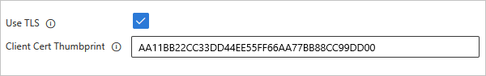

# Connect to an IBM MQ server from a workflow in Azure Logic Apps

[!INCLUDE [logic-apps-sku-consumption-standard](../../includes/logic-apps-sku-consumption-standard.md)]

This article shows how to access an Azure-hosted or on-premises MQ server from a workflow in Azure Logic Apps using the MQ connector. You can then create automated workflows that receive and send messages stored in your MQ server. For example, your workflow can browse for a single message in a queue and then run other actions.

The MQ connector provides a wrapper around a Microsoft MQ client, which includes all the messaging capabilities to communicate with a remote MQ server across a TCP/IP network. This connector defines the connections, operations, and parameters to call the MQ client.

## Supported IBM WebSphere MQ versions

* MQ 7.5
* MQ 8.0
* MQ 9.0, 9.1, and 9.2

## Connector technical reference

The MQ connector has different versions, based on [logic app type and host environment](../logic-apps/logic-apps-overview.md#resource-environment-differences).

| Logic app | Environment | Connection version |
|-----------|-------------|--------------------|
| **Consumption** | Multi-tenant Azure Logic Apps and Integration Service Environment (ISE) | Managed connector, which appears in the designer under the **Enterprise** label. This connector provides only actions, not triggers. In on-premises MQ server scenarios, the managed connector supports server only authentication with TLS (SSL) encryption.   For more information, review the following documentation:   - [MQ managed connector reference](/connectors/mq)  - [Managed connectors in Azure Logic Apps](managed.md) |
| **Standard** | 	Single-tenant Azure Logic Apps and App Service Environment v3 (ASE v3 with Windows plans only) | Managed connector, which appears in the connector gallery under **Runtime** > **Shared**, and the built-in connector, which appears in the connector gallery under **Runtime** > **In-App** and is [service provider-based](../logic-apps/custom-connector-overview.md#service-provider-interface-implementation). The built-in version differs in the following ways:   - The built-in version includes actions *and* triggers.   - The built-in connector can directly connect to an MQ server and access Azure virtual networks by using a connection string without an on-premises data gateway.   - The built-in version supports both server authentication and server-client authentication with TLS (SSL) encryption for data in transit, message encoding for both the send and receive operations, and Azure virtual network integration.   For more information, review the following documentation:   - [MQ managed connector reference](/connectors/mq)  - [MQ built-in connector reference](/azure/logic-apps/connectors/built-in/reference/mq/)  - [Built-in connectors in Azure Logic Apps](built-in.md) |

## Authentication with TLS (SSL) encryption

Based on whether you use the MQ managed connector (Consumption or Standard workflows) or the MQ built-in connector (Standard workflows only), the MQ connector supports one or both of the following authentication directions:

| Authentication | Supported logic app type and MQ connector | Process |
|----------------|-------------------------------------------|---------|
| Server only  (one-way) | - Consumption: Managed only   - Standard: Managed or built-in | For server authentication, your MQ server sends a private key certificate, either publicly trusted or non-publicly trusted, to your logic app client for validation. The MQ connector validates the incoming server certificate for authenticity against public key certificates, known also as a "signer" certificates, by using standard .NET SSL stream validation.   The logic app doesn't send a client certificate. |
| Server-client  (two-way) | - Consumption: Not supported   - Standard: Built-in only | For server authentication, see the previous row.   For client authentication, the logic app client sends a private key certificate to your MQ server for validation. The MQ server validates the incoming client certificate for authenticity also by using a public key certificate. |

### Notes about private key and public key certificates

- The certificate that requires validation is always a private key certificate. The certificate used to perform the validation is always a public key certificate. 

- A publicly trusted private key certificate is issued by a recognized [Certificate Authority](https://www.ssl.com/faqs/what-is-a-certificate-authority/). A non-publicly trusted private key certificate includes self-signed, private CA, and similar certificates. 

- To validate a private key certificate sent from your MQ server, the MQ connector uses public key certificates that usually exist on your logic app's virtual machine host in the host's [Trusted Root Certification Authorities (CA) Store](/windows-hardware/drivers/install/trusted-root-certification-authorities-certificate-store).

  However, if the host doesn't have all the required public key certificates, or if your MQ server sends a non-publicly trusted private key certificate, you need to take extra steps. For more information, see [Prerequisites](#prerequisites).

- To validate a client's private key certificate sent from your Standard logic app, the MQ server uses public key certificates that exist in your MQ server's certificate store. To add a private key certificate for your logic app to use as a client certificate, see [Add a private key certificate](#add-private-key-certificate).

## Limitations

* Authentication with TLS (SSL) encryption

  | MQ connector | Supported authentication direction |
  |--------------|------------------------------------|
  | Managed | Server only (one-way) |
  | Built-in | - Server-client (two-way)  - Server-only (one-way) |

* Server certificate validation

  The MQ built-in connector doesn't validate the server certificate's expiration date nor certificate chain.

* Character set conversions

  - The MQ managed connector doesn't make any character set conversions nor use the message's **Format** field. The connector only copies whatever data appears in the message field and sends the message along.

  - The MQ built-in connector can make character set conversions, but only when the data format is a string. If you supply a different character set ID (code page), the connector attempts to convert the data to the new code page.

* The MQ connector doesn't support segmented messages.

For more information, review the [MQ managed connector reference](/connectors/mq) or the [MQ built-in connector reference](/azure/logic-apps/connectors/built-in/reference/mq/).

## Prerequisites

* An Azure account and subscription. If you don't have an Azure subscription, [sign up for a free Azure account](https://azure.microsoft.com/free/?WT.mc_id=A261C142F).

* To connect with an on-premises MQ server, you must [install the on-premises data gateway](../logic-apps/logic-apps-gateway-install.md) on a server within your network. For the MQ connector to work, the server with the on-premises data gateway also must have .NET Framework 4.6 installed.

  After you install the gateway, you must also create a data gateway resource in Azure. The MQ connector uses this resource to access your MQ server. For more information, review [Set up the data gateway connection](../logic-apps/logic-apps-gateway-connection.md). 

  > [!NOTE]
  >
  > You don't need the gateway in the following scenarios:
  > 
  > * Your MQ server is publicly available or available in Azure.
  > * You're going to use the MQ built-in connector, not the managed connector.

* The logic app resource and workflow where you want to access your MQ server.

  * To use the MQ managed connector with the on-premises data gateway, your logic app resource must use the same location as your gateway resource in Azure.

  * To use the MQ managed connector, which doesn't provide any triggers, make sure that your workflow starts with a trigger or that you first add a trigger to your workflow. For example, you can use the [Recurrence trigger](../connectors/connectors-native-recurrence.md).

  * To use a trigger from the MQ built-in connector, make sure that you start with a blank workflow.

* Certificate requirements for authentication with TLS (SSL) encryption

  * MQ managed connector

    | MQ server | Requirements |
    |-----------|--------------|
    | Azure-hosted MQ server | The MQ server must send a private key certificate that's issued by a trusted [certificate authority](https://www.ssl.com/faqs/what-is-a-certificate-authority/) to your logic app client for validation. |
    | On-premises MQ server using on-premises data gateway | To send a non-publicly trusted private key certificate such as a self-signed or private CA certificate, you have to add the certificate to the [Trusted Root Certification Authorities (CA) Store](/windows-hardware/drivers/install/trusted-root-certification-authorities-certificate-store) on the local computer with the on-premises data gateway installation. For this task, you can use [Windows Certificate Manager (certmgr.exe)](/dotnet/framework/tools/certmgr-exe-certificate-manager-tool). |

  * MQ built-in connector

    Standard logic apps use [Azure App Service](../app-service/overview.md) as the host platform and to handle certificates. For Standard logic apps on any [WS* plan](../logic-apps/logic-apps-pricing.md#standard-pricing-tiers), you can add public, private, custom, or self-signed certificates to the [local machine certificate store](/windows-hardware/drivers/install/local-machine-and-current-user-certificate-stores). However, if you have to add certificates to the Trusted Root CA Store on the virtual machine host where your Standard logic app runs, App Service requires that your logic app run in an isolated [App Service Environment v3 (ASE) with a Windows-only](../app-service/environment/overview.md) and an [ASE-based App Service plan](../app-service/overview-hosting-plans.md). For more information, see [Certificates and the App Service Environment](../app-service/environment/overview-certificates.md).

    * MQ server authentication

      The following table describes the certificate prerequisites, based on your scenario:

      | Incoming MQ server certificate | Requirements |
      |--------------------------------|---------------|
      | Publicly trusted private key certificate issued by a trusted [certificate authority](https://www.ssl.com/faqs/what-is-a-certificate-authority/) | Usually, your logic app doesn't need any other setup because your logic app's virtual machine host usually has the required public key certificates to validate the incoming MQ server's private key certificate. To check that these public key certificates exist, follow the steps to [View and confirm thumbprints for existing public key certificates](#view-existing-public-key-certificates).   If the virtual machine host doesn't have all the required public key certificates to validate the incoming MQ server's private key certificate and any chaining certificates, complete the following steps:   1. Recreate your Standard logic app using an [Azure App Service Environment v3 (ASE) with a Windows-only and ASE-based App Service plan](../app-service/environment/overview.md).   2. Manually [add the required public key certificates to the host's Trusted Root CA Store](#view-existing-public-key-certificates). |
      | Non-publicly trusted private key certificate, such as a self-signed or private CA certificate | Your logic app's virtual machine host won't have the required public key certificates in the host's Trusted Root CA Store to validate the MQ server's certificate chain. In this case, complete the following steps:   1. Recreate your Standard logic app using an [Azure App Service Environment v3 (ASE) with a Windows-only and ASE-based App Service plan](../app-service/environment/overview.md).   2. Manually [add the required public key certificates to the host's Trusted Root CA Store](#view-existing-public-key-certificates).   For more information, see the following documentation:  - [Certificate bindings and the App Service Environment](../app-service/environment/certificates.md)  - [Add and manage TLS/SSL certificates in Azure App Service](../app-service/configure-ssl-certificate.md) |

    * Logic app client authentication

      You can add a private key certificate to send as the client certificate and then specify the certificate's thumbprint value in the connection details for the MQ built-in connector. For more information, see [add a private key certificate](#add-private-key-certificate).

    **Recommendation**: Upgrade to MQ server 9.0 or later. Also, on your MQ server, make sure to set up the server-connection channel with a cipher suite that matches the cipher specification used by your client connection, for example, **ANY_TLS12_OR_HIGHER**. For more information, see the next item about [Cipher requirements](#cipher-requirements).

* Cipher specification requirements

  The MQ server requires that you define the cipher specification for connections that use TLS (SSL) encryption. This cipher specification must match the cipher suites that are supported, chosen, and used by the operating system where the MQ server runs. Ultimately, the cipher specification used by the client connection must match the cipher suites set up on the server-connection channel on the MQ server.

  For more information, see [Connection and authentication problems](#connection-problems).

## Add an MQ trigger (Standard logic app only)

The following steps apply only to Standard logic app workflows, which can use triggers provided by the MQ built-in connector. The MQ managed connector doesn't include any triggers.

These steps use the Azure portal, but with the appropriate Azure Logic Apps extension, you can also use [Visual Studio Code](../logic-apps/create-single-tenant-workflows-visual-studio-code.md) to create a Standard logic app workflow.

1. In the [Azure portal](https://portal.azure.com), open your blank logic app workflow in the designer.

1. On the designer, select **Choose an operation**, if not selected.

1. Under the **Choose an operation** search box, select **Built-in**. In the search box, enter **mq**.

1. From the triggers list, select the [MQ trigger](/azure/logic-apps/connectors/built-in/reference/mq/#triggers) that you want to use.

1. Provide the [information to authenticate your connection](/azure/logic-apps/connectors/built-in/reference/mq/#authentication). When you're done, select **Create**.

1. When the trigger information box appears, provide the required [information for your trigger](/azure/logic-apps/connectors/built-in/reference/mq/#triggers).

1. When you're done, save your workflow. On the designer toolbar, select **Save**.

## Add an MQ action

A Consumption logic app workflow can use only the MQ managed connector. However, a Standard logic app workflow can use the MQ managed connector and the MQ built-in connector. Each version has multiple actions. For example, both managed and built-in connector versions have their own actions to browse a message.

* Managed connector actions: These actions run in a Consumption or Standard logic app workflow.

* Built-in connector actions: These actions run only in a Standard logic app workflow.

The following steps use the Azure portal, but with the appropriate Azure Logic Apps extension, you can also use the following tools to create logic app workflows:

* Consumption logic app workflows: [Visual Studio](../logic-apps/quickstart-create-logic-apps-with-visual-studio.md) or [Visual Studio Code](../logic-apps/quickstart-create-logic-apps-visual-studio-code.md)

* Standard logic app workflows: [Visual Studio Code](../logic-apps/create-single-tenant-workflows-visual-studio-code.md)

### [Consumption](#tab/consumption)

1. In the [Azure portal](https://portal.azure.com/), open your logic app workflow in the designer.

1. In your workflow where you want to add an MQ action, follow one of these steps:

   * To add an action under the last step, select **New step**.

   * To add an action between steps, move your pointer over the connecting arrow so that the plus sign (**+**) appears. Select the plus sign, and then select **Add an action**.

1. Under the **Choose an operation** search box, select **Enterprise**. In the search box, enter **mq**.

1. From the actions list, select the [MQ action](/connectors/mq/#actions) that you want to use.

1. Provide the [information to authenticate your connection](/connectors/mq/#creating-a-connection). When you're done, select **Create**.

1. When the action information box appears, provide the required [information for your action](/connectors/mq/#actions).

1. When you're done, save your workflow. On the designer toolbar, select **Save**.

### [Standard](#tab/standard)

The steps to add and use an MQ action differ based on whether your workflow uses the built-in connector or the managed, Azure-hosted connector.

* [Built-in connector](#add-built-in-action): Describes the steps to add an action for the MQ built-in connector.

* [Managed connector](#add-managed-action): Describes the steps to add an action for the MQ managed connector.

#### Add an MQ built-in connector action

1. In the [Azure portal](https://portal.azure.com/), open your logic app workflow in the designer.

1. In your workflow where you want to add an MQ action, follow one of these steps:

   * To add an action under the last step, select the plus sign (**+**), and then select **Add an action**.

   * To add an action between steps, select the plus sign (**+**) between those steps, and then select **Add an action**.

1. On the **Add an action** pane, under the **Choose an operation** search box, select **Built-in**. In the search box, enter **mq**.

1. From the actions list, select the [MQ action](/azure/logic-apps/connectors/built-in/reference/mq/#actions) that you want to use.

1. Provide the [information to authenticate your connection](/azure/logic-apps/connectors/built-in/reference/mq/#authentication). When you're done, select **Create**.

1. When the action information box appears, provide the required [information for your action](/azure/logic-apps/connectors/built-in/reference/mq/#actions).

1. When you're done, save your workflow. On the designer toolbar, select **Save**.

#### Add an MQ managed connector action

1. In the [Azure portal](https://portal.azure.com/), open your logic app workflow in the designer.

1. In your workflow where you want to add an MQ action, follow one of these steps:

   * To add an action under the last step, select **New step**.

   * To add an action between steps, move your mouse over the connecting arrow between those steps, select the plus sign (**+**) that appears between those steps, and then select **Add an action**.

1. Under the **Choose an operation** search box, select **Azure**. In the search box, enter **mq**.

1. From the actions list, select the [MQ action](/connectors/mq/#actions) that you want to use.

1. Provide the [information to authenticate your connection](/connectors/mq/#creating-a-connection). When you're done, select **Create**.

1. When the action information box appears, provide the required [information for your action](/connectors/mq/#actions).

1. When you're done, save your workflow. On the designer toolbar, select **Save**.

---

## Test your workflow

To check that your workflow returns the results that you expect, run your workflow, and then review the outputs from your workflow's run history.

1. Run your workflow.

   * Consumption logic app: On the workflow designer toolbar, select **Run Trigger** > **Run**.

   * Standard logic app: On workflow resource menu, select **Overview**. On the **Overview** pane toolbar, select **Run Trigger** > **Run**.

   After the run finishes, the designer shows the workflow's run history along with the status for each step.

1. To review the inputs and outputs for each step that ran (not skipped), expand or select the step.

   * To review more input details, select **Show raw inputs**.

   * To review more output details, select **Show raw outputs**. If you set **IncludeInfo** to **true**, more output is included.

## View and add certificates for authentication with TLS (SSL) encryption

The following information applies only to Standard logic app workflows for the MQ built-in connector using either server-only or server-client authentication with TLS (SSL) encryption.

### View and confirm thumbprints for existing public key certificates

To check that the thumbprints for the required public key certificates exist on your Standard logic app's virtual machine host in the Trusted Root CA Store, follow these steps to run the [`cert` PowerShell script](/powershell/module/microsoft.powershell.security/about/about_certificate_provider) from your Standard logic app's resource menu.

1. In the [Azure portal](https://portal.azure.com), open your Standard logic app resource. On the logic app resource menu, under **Development Tools**, select **Advanced Tools** > **Go**.

1. From the Kudu **Debug console** menu, select **PowerShell**.

1. After the PowerShell window appears, from the PowerShell command prompt, run the following script:

   `dir cert:\localmachine\root`

   The PowerShell window lists the existing thumbprints and descriptions, for example:

   

## Add a public key certificate

To add a public key certificate to the Trusted Root CA Store on that virtual machine host where your Standard logic app runs, follow these steps:

1. In the [Azure portal](https://portal.azure.com), open your Standard logic app resource. On the logic app resource menu, under **Settings**, select **TLS/SSL settings (classic)**.

1. On the **TLS/SSL settings (classic)** page, select the **Public Key Certificates (.cer)** tab, and then select **Upload Public Key Certificate**.

1. On the **Add Public Key Certificate (.cer)** pane that opens, enter a name to describe the certificate. Find and select the public key certificate file (.cer). When you're done, select **Upload**.

1. After you add the certificate, from the **Thumbprint** column, copy the certificate's thumbprint value.

   

1.	On the logic app resource menu, select **Configuration**.

1. On the **Application settings** tab, select **New application setting**. Add a new application setting named **WEBSITE_LOAD_ROOT_CERTIFICATES**, and enter the certificate's thumbprint value that you previously copied. If you have multiple certificate thumbprint values, make sure to separate each value with a comma (**,**).

   For more information, see [Edit host and app settings for Standard logic apps in single-tenant Azure Logic Apps](../logic-apps/edit-app-settings-host-settings.md#manage-app-settings).

   > [!NOTE]
   >
   > If you specify a thumbprint for a private CA certificate, the MQ built-in connector doesn't run any certificate validation, 
   > such as checking the certificate's expiration date or source. If standard .NET SSL validation fails, the connector 
   > only compares any thumbprint value that's passed in against the value in the **WEBSITE_LOAD_ROOT_CERTIFICATES** setting.

1. If the added certificate doesn't appear in the public key certificates list, on the toolbar, select **Refresh**.

## Add a private key certificate

To add a private key certificate to the Trusted Root CA Store on virtual machine host where your Standard logic app runs, follow these steps:

1. In the [Azure portal](https://portal.azure.com), open your logic app resource. On the logic app resource menu, under **Settings**, select **TLS/SSL settings (classic)**.

1. On the **TLS/SSL settings (classic)** page, select the **Private Key Certificates (.pfx)** tab, and then select **Upload Certificate**.

1. On the **Add Private Key Certificate (.pfx)** pane that opens, find and select the private key certificate file (.pfx), and then enter the certificate password. When you're done, select **Upload**.

1. After you add the certificate, from the **Thumbprint** column, copy the certificate's thumbprint value.

   

1.	On the logic app resource menu, select **Configuration**.

1. On the **Application settings** tab, select **New application setting**. Add a new application setting named **WEBSITE_LOAD_CERTIFICATES**, and enter the certificate's thumbprint value that you previously copied.

   For more information, see [Edit host and app settings for Standard logic apps in single-tenant Azure Logic Apps](../logic-apps/edit-app-settings-host-settings.md#manage-app-settings).

1. If the added certificate doesn't appear in the private key certificates list, on the toolbar, select **Refresh**.

1. When you create a connection using the MQ built-in connector, in the connection information box, select **Use TLS**.

1. In the **Client Cert Thumbprint** property, enter the previously copied thumbprint value for the private key certificate, which enables server-client (two-way) authentication. If you don't enter a thumbprint value, the connector uses server-only (one-way) authentication.

   

## Troubleshoot problems

### Failures with browse or receive actions

If you run a browse or receive action on an empty queue, the action fails with the following header outputs:

### Connection and authentication problems

When your workflow uses the MQ managed connector to connect to your on-premises MQ server, you might get the following error:

`"MQ: Could not Connect the Queue Manager '<queue-manager-name>': The Server was expecting an SSL connection."`

* The MQ server needs to provide a certificate that's issued by a trusted [certificate authority](https://www.ssl.com/faqs/what-is-a-certificate-authority/).

* The MQ server requires that you define the cipher specification to use with TLS connections. However, for security purposes and to include the best security suites, the Windows operating system sends a set of supported cipher specifications.

  The operating system where the MQ server runs chooses the suites to use. To make the configuration match, you have to change your MQ server setup so that the cipher specification matches the option chosen in the TLS negotiation.

  When you try to connect, the MQ server logs an event message that the connection attempt failed because the MQ server chose the incorrect cipher specification. The event message contains the cipher specification that the MQ server chose from the list. In the server-connection channel configuration, update the cipher specification to match the cipher specification in the event message.

## Next steps

* [Managed connectors in Azure Logic Apps](/connectors/connector-reference/connector-reference-logicapps-connectors)
* [Built-in connectors in Azure Logic Apps](built-in.md)
