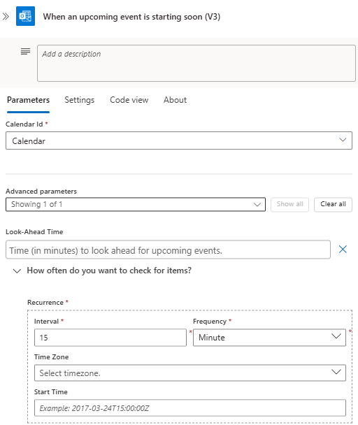
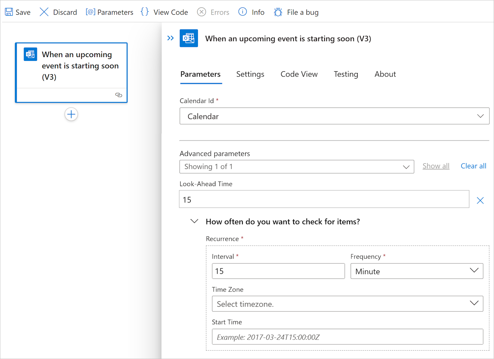
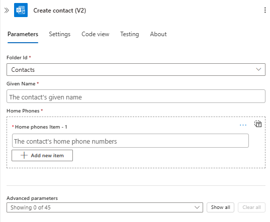
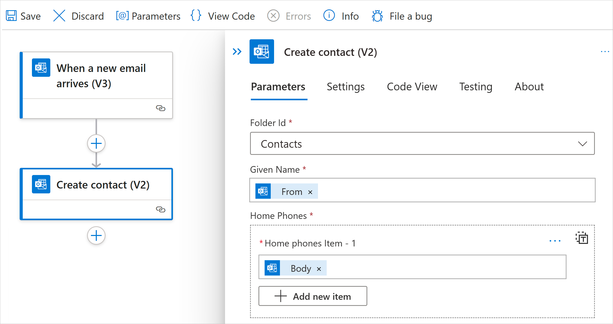

# Connect to Office 365 Outlook from Azure Logic Apps

[!INCLUDE [logic-apps-sku-consumption-standard](../../includes/logic-apps-sku-consumption-standard.md)]

To automate tasks for your Office 365 Outlook account in workflows using Azure Logic Apps, you can add operations from the [Office 365 Outlook connector](/connectors/office365connector/) to your workflow. For example, your workflow can perform the following tasks:

* Get, send, and reply to email.
* Schedule meetings on your calendar.
* Add and edit contacts.

This guide shows how to add an Office 365 Outlook trigger or action to your workflow in Azure Logic Apps.

> [!NOTE]
>
> The Office 365 Outlook connector works only with a [work or school account](https://support.microsoft.com/office/what-account-to-use-with-office-and-you-need-one-914e6610-2763-47ac-ab36-602a81068235#bkmk_msavsworkschool), for example, @fabrikam.onmicrosoft.com.  
> If you have an @outlook.com or @hotmail.com account, use the [Outlook.com connector](../connectors/connectors-create-api-outlook.md). 
> To connect to Outlook with a different user account, such as a service account, see [Connect using other accounts](#connect-using-other-accounts).

## Connector technical reference

For information about this connector's operations and any limits, based on the connector's Swagger file, see the [connector's reference page](/connectors/office365/).

## Prerequisites

* An Azure account and subscription. If you don't have an Azure subscription, [sign up for a free Azure account](https://azure.microsoft.com/free/?WT.mc_id=A261C142F).

* Your Microsoft Office 365 account for Outlook where you sign in with a [work or school account](https://support.microsoft.com/office/what-account-to-use-with-office-and-you-need-one-914e6610-2763-47ac-ab36-602a81068235#bkmk_msavsworkschool).

  > [!NOTE]
  >
  > If you're using [Microsoft Azure operated by 21Vianet](https://portal.azure.cn), 
  > Microsoft Entra authentication works only with an account for 
  > Microsoft Office 365 operated by 21Vianet (.cn), not .com accounts.

* The logic app workflow from where you want to access your Outlook account. To add an Office 365 Outlook trigger, you have to start with a blank workflow. To add an Office 365 Outlook action, your workflow can start with any trigger.

## Add an Office 365 Outlook trigger

Based on whether you have a Consumption or Standard logic app workflow, follow the corresponding steps:

### [Consumption](#tab/consumption)

1. In the [Azure portal](https://portal.azure.com), open your blank logic app workflow in the designer.

1. [Follow these general steps to add the Office 365 Outlook trigger](../logic-apps/create-workflow-with-trigger-or-action.md?tabs=consumption#add-trigger) that you want to your workflow.

   This example continues with the trigger named **When an upcoming event is starting soon**. This *polling* trigger regularly checks for any updated calendar event in your email account, based on the specified schedule.

1. If prompted, sign in to your Office 365 Outlook account, which creates a connection. To connect with a different user account, such as a service account, see [Connect using other accounts](#connect-using-other-accounts).

   > [!NOTE]
   >
   > Your connection doesn't expire until revoked, even if you change your sign-in credentials. 
   > For more information, see [Configurable token lifetimes in Microsoft Entra ID](../active-directory/develop/configurable-token-lifetimes.md).

1. In the trigger information box, provide the required information, for example:

   | Parameter | Required | Value | Description |
   |-----------|----------|-------|-------------|
   | **Calendar Id** | Yes | **Calendar** | The calendar to check |
   | **Interval** | Yes | **15** | The number of intervals |
   | **Frequency** | Yes | **Minute** | The unit of time |

   To add other available parameters, such as **Time zone**, open the **Add new parameter** list, and select the parameters that you want.

   

1. Save your workflow. On the designer toolbar, select **Save**.

### [Standard](#tab/standard)

1. In the [Azure portal](https://portal.azure.com), open your blank logic app workflow in the designer.

1. [Follow these general steps to add the Office 365 Outlook trigger](../logic-apps/create-workflow-with-trigger-or-action.md?tabs=standard#add-trigger) that you want to your workflow.

   This example continues with the trigger named **When an upcoming event is starting soon**. This *polling* trigger regularly checks for any updated calendar event in your email account, based on the specified schedule.

1. If prompted, sign in to your Office 365 Outlook account, which creates a connection. To connect with a different user account, such as a service account, see [Connect using other accounts](#connect-using-other-accounts).

   > [!NOTE]
   >
   > Your connection doesn't expire until revoked, even if you change your sign-in credentials. 
   > For more information, see [Configurable token lifetimes in Microsoft Entra ID](../active-directory/develop/configurable-token-lifetimes.md).

1. In the trigger information box, provide the required information, for example:

   | Parameter | Required | Value | Description |
   |-----------|----------|-------|-------------|
   | **Calendar Id** | Yes | **Calendar** | The calendar to check |
   | **Interval** | Yes | **15** | The number of intervals |
   | **Frequency** | Yes | **Minute** | The unit of time |

   To add other available parameters, such as **Time zone**, open the **Add new parameter** list, and select the parameters that you want.

   

1. Save your workflow. On the designer toolbar, select **Save**.

---

You can now add any other actions that your workflow requires. For example, you can add the Twilio **Send message** action, which sends a text when a calendar event starts in 15 minutes.

## Add an Office 365 Outlook action

Based on whether you have a Consumption or Standard logic app workflow, follow the corresponding steps:

### [Consumption](#tab/consumption)

1. In the [Azure portal](https://portal.azure.com), open your logic app and workflow in the designer.

   This example continues with the Office 365 Outlook trigger named **When a new email arrives**.

1. [Follow these general steps to add the Office 365 Outlook action](../logic-apps/create-workflow-with-trigger-or-action.md?tabs=consumption#add-action) that you want to your workflow.

   This example continues with the Office 365 Outlook action named **Create contact**. This operation creates a new contact in Office 365 Outlook. You can use the output from a previous operation in the workflow to create the contact.

1. If prompted, sign in to your Office 365 Outlook account, which creates a connection. To connect with a different user account, such as a service account, see [Connect using other accounts](#connect-using-other-accounts).

   > [!NOTE]
   >
   > Your connection doesn't expire until revoked, even if you change your sign-in credentials. 
   > For more information, see [Configurable token lifetimes in Microsoft Entra ID](../active-directory/develop/configurable-token-lifetimes.md).

1. In the trigger information box, provide the required information, for example:

   | Parameter | Required | Value | Description |
   |-----------|----------|-------|-------------|
   | **Folder Id** | Yes | **Contacts** | The folder where the action creates the new contact |
   | **Given name** | Yes | <*contact-name*> | The name to give the contact |
   | **Home phones** | Yes | <*home-phone-number*> | The home phone number for the contact |

   This example selects the **Contacts** folder where the action creates the new contact and uses trigger outputs for the remaining parameter values:

   

   To add other available parameters, open the **Add new parameter** list, and select the parameters that you want.

1. Save your workflow. On the designer toolbar, select **Save**.

### [Standard](#tab/standard)

1. In the [Azure portal](https://portal.azure.com), open your logic app and workflow in the designer.

   This example continues with the Office 365 Outlook trigger named **When a new email arrives**.

1. [Follow these general steps to add the Office 365 Outlook action](../logic-apps/create-workflow-with-trigger-or-action.md?tabs=standard#add-action) that you want to your workflow.

   This example continues with the Office 365 Outlook action named **Create contact**. This operation creates a new contact in Office 365 Outlook. You can use the output from a previous operation in the workflow to create the contact.

1. If prompted, sign in to your Office 365 Outlook account, which creates a connection. To connect with a different user account, such as a service account, see [Connect using other accounts](#connect-using-other-accounts).

   > [!NOTE]
   >
   > Your connection doesn't expire until revoked, even if you change your sign-in credentials. 
   > For more information, see [Configurable token lifetimes in Microsoft Entra ID](../active-directory/develop/configurable-token-lifetimes.md).

1. In the trigger information box, provide the required information, for example:

   | Parameter | Required | Value | Description |
   |-----------|----------|-------|-------------|
   | **Folder Id** | Yes | **Contacts** | The folder where the action creates the new contact |
   | **Given name** | Yes | <*contact-name*> | The name to give the contact |
   | **Home phones** | Yes | <*home-phone-number*> | The home phone number for the contact |

   This example selects the **Contacts** folder where the action creates the new contact and uses trigger outputs for the remaining parameter values:

   

   To add other available parameters, open the **Add new parameter** list, and select the parameters that you want.

1. Save your workflow. On the designer toolbar, select **Save**.

---

## Connect using other accounts

If you try connecting to Outlook by using a different account than the one currently signed in to Azure, you might get [single sign-on (SSO)](../active-directory/manage-apps/what-is-single-sign-on.md) errors. This problem happens when you sign in to the Azure portal with one account, but use a different account to create the connection. The designer expects that you use the account that's signed in to the Azure portal. To resolve this problem, you have these options:

* Set up the other account with the **Contributor** role in your logic app's resource group.

  1. In the Azure portal, open your logic app's resource group.

  1. On the resource group menu, select **Access control (IAM)**.

  1. Assign the **Contributor** role to the other account.
  
     For more information, see [Assign Azure roles using the Azure portal](../role-based-access-control/role-assignments-portal.md).

  1. After you set up this role, sign in to the Azure portal with the account that now has Contributor permissions. You can now use this account to create the connection to Outlook.

* Set up the other account so that your work or school account has "send as" permissions.

   If you have admin permissions, on the service account's mailbox, set up your work or school account with either **Send as** or **Send on behalf of** permissions. For more information, see [Give mailbox permissions to another user - Admin Help](/microsoft-365/admin/add-users/give-mailbox-permissions-to-another-user). You can then create the connection by using your work or school account. Now, in triggers or actions where you can specify the sender, you can use the service account's email address.

   For example, the **Send an email** action has an optional parameter, **From (Send as)**, which you can add to the action and use your service account's email address as the sender. To add this parameter, follow these steps:

   1. In the **Send an email** action, open the **Add a parameter** list, and select the **From (Send as)** parameter.

   1. After the parameter appears on the action, enter the service account's email address.

## Next steps

* [Managed connectors for Azure Logic Apps](managed.md)
* [Built-in connectors for Azure Logic Apps](built-in.md)
