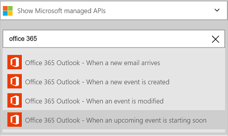
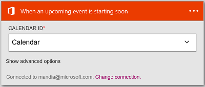
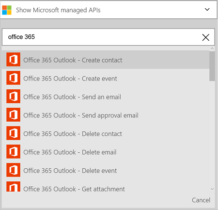
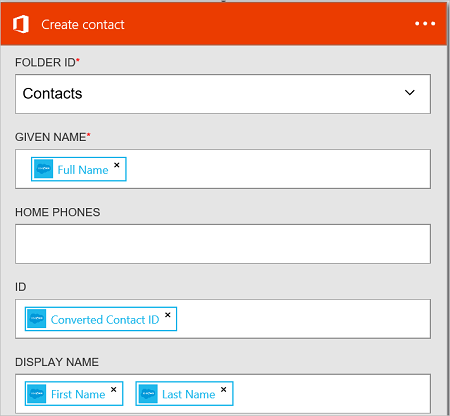

<properties
    pageTitle="Add the Office 365 Outlook connector in your Logic Apps | Microsoft Azure"
    description="Create logic apps with Azure App service. Office 365 connector enables interaction with Office 365. For example: creating, editing, and updating contacts and calendar items."
    services=""    
    documentationCenter=""     
    authors="MandiOhlinger"    
    manager="erikre"    
    editor="" 
    tags="connectors" />

<tags
ms.service="app-service-logic"
ms.devlang="na"
ms.topic="article"
ms.tgt_pltfrm="na"
ms.workload="integration"
ms.date="07/21/2016"
ms.author="mandia"/>

# Get started with the Office 365 Outlook connector 

The Office 365 Outlook connector enables interaction with Outlook in Office 365. Use this connector to create, edit, and update contacts and calendar items, and also get, send, and reply to email.

With Office 365 Outlook, you can:

- Build your workflow using the email and calendar features within Office 365. 
- Use triggers to start your workflow when there is a new email, when a calendar item is updated, and more.
- Use actions to send an email, create a new calendar event, and more. For example, when there is a new object in Salesforce (a trigger), send an email to your Office 365 Outlook (an action). 

This topic shows you how to use the Office 365 Outlook connector in a logic app, and also lists the triggers and actions.

>[AZURE.NOTE] This version of the article applies to Logic Apps general availability (GA).

## Connect to Office 365

Before your logic app can access any service, you first create a *connection* to the service. A connection provides connectivity between a logic app and another service. For example, to connect to Office 365 Outlook, you first need an Office 365 *connection*. To create a connection, enter the credentials you normally use to access the service you wish to connect to. So with Office 365 Outlook, enter the credentials to your Office 365 account to create the connection.

## Create the connection

>[AZURE.INCLUDE [Steps to create a connection to Office 365](../../includes/connectors-create-api-office365-outlook.md)]

## Use a trigger

A trigger is an event that can be used to start the workflow defined in a logic app. [Learn more about triggers](../app-service-logic/app-service-logic-what-are-logic-apps.md#logic-app-concepts).

1. In the logic app, type "office 365" to get a list of the triggers:  

	

2. Select **Office 365 Outlook - When an upcoming event is starting soon**. If a connection already exists, then select a calendar from the drop-down list.

	

	If you are prompted to sign in, then enter the sign in details to create the connection. [Create the connection](connectors-create-api-office365-outlook.md#create-the-connection) in this topic lists the steps. 

	> [AZURE.NOTE] In this example, the logic app runs when a calendar event is updated. To see the results of this trigger, add another action that sends you a text message. For example, add the Twilio *Send message* action that texts you when the calendar event is starting in 15 minutes. 

3. **Save** your changes (top left corner of the toolbar). Your logic app is saved and may be automatically enabled.

## Use an action

An action is an operation carried out by the workflow defined in a logic app. [Learn more about actions](../app-service-logic/app-service-logic-what-are-logic-apps.md#logic-app-concepts).

1. Select the plus sign. You see several choices: **Add an action**, **Add a condition**, or one of the **More** options.

	

2. Choose **Add an action**.

3. In the text box, type “office 365” to get a list of all the available actions.

	 

4. In our example, choose **Office 365 Outlook - Create contact**. If a connection already exists, then choose the **Folder ID**, **Given Name**, and other properties:  

	

	If you are prompted for the connection information, then enter the details to create the connection. [Create the connection](connectors-create-api-office365-outlook.md#create-the-connection) in this topic describes these properties. 

	> [AZURE.NOTE] In this example, we create a new contact in Office 365 Outlook. You can use output from another trigger to create the contact. For example, add the SalesForce *When an object is created* trigger. Then add the Office 365 Outlook *Create contact* action that uses the SalesForce fields to create the new new contact in Office 365. 

5. **Save** your changes (top left corner of the toolbar). Your logic app is saved and may be automatically enabled.

## Technical Details

Here are the details about the triggers, actions and responses that this connection supports:

## Office 365 triggers

|Trigger | Description|
|--- | ---|
|[When an upcoming event is starting soon](connectors-create-api-office365-outlook.md#when-an-upcoming-event-is-starting-soon)|This operation triggers a flow when an upcoming calendar event is starting.|
|[When a new email arrives](connectors-create-api-office365-outlook.md#when-a-new-email-arrives)|This operation triggers a flow when a new email arrives|
|[When a new event is created](connectors-create-api-office365-outlook.md#when-a-new-event-is-created)|This operation triggers a flow when a new event is created in a calendar.|
|[When an event is modified](connectors-create-api-office365-outlook.md#when-an-event-is-modified)|This operation triggers a flow when an event is modified in a calendar.|

## Office 365 actions

|Action|Description|
|--- | ---|
|[Get emails](connectors-create-api-office365-outlook.md#get-emails)|This operation gets emails from a folder.|
|[Send an email](connectors-create-api-office365-outlook.md#send-an-email)|This operation sends an email message.|
|[Delete email](connectors-create-api-office365-outlook.md#delete-email)|This operation deletes an email by id.|
|[Mark as read](connectors-create-api-office365-outlook.md#mark-as-read)|This operation marks an email as having been read.|
|[Reply to email](connectors-create-api-office365-outlook.md#reply-to-email)|This operation replies to an email.|
|[Get attachment](connectors-create-api-office365-outlook.md#get-attachment)|This operation gets an email attachment by id.|
|[Send email with options](connectors-create-api-office365-outlook.md#send-email-with-options)|This operation sends an email with multiple options and waits for the recipient to respond back with one of the options.|
|[Send approval email](connectors-create-api-office365-outlook.md#send-approval-email)|This operation sends an approval email and waits for a response from the recipient.|
|[Get calendars](connectors-create-api-office365-outlook.md#get-calendars)|This operation lists available calendars.|
|[Get events](connectors-create-api-office365-outlook.md#get-events)|This operation gets events from a calendar.|
|[Create event](connectors-create-api-office365-outlook.md#create-event)|This operation creates a new event in a calendar.|
|[Get event](connectors-create-api-office365-outlook.md#get-event)|This operation gets a specific event from a calendar.|
|[Delete event](connectors-create-api-office365-outlook.md#delete-event)|This operation deletes an event in a calendar.|
|[Update event](connectors-create-api-office365-outlook.md#update-event)|This operation updates an event in a calendar.|
|[Get contact folders](connectors-create-api-office365-outlook.md#get-contact-folders)|This operation lists available contacts folders.|
|[Get contacts](connectors-create-api-office365-outlook.md#get-contacts)|This operation gets contacts from a contacts folder.|
|[Create contact](connectors-create-api-office365-outlook.md#create-contact)|This operation creates a new contact in a contacts folder.|
|[Get contact](connectors-create-api-office365-outlook.md#get-contact)|This operation gets a specific contact from a contacts folder.|
|[Delete contact](connectors-create-api-office365-outlook.md#delete-contact)|This operation deletes a contact from a contacts folder.|
|[Update contact](connectors-create-api-office365-outlook.md#update-contact)|This operation updates a contact in a contacts folder.|

### Action details

In this section, see the specific details about each trigger and action, including any required or optional input properties, and any corresponding output associated with the connector.

#### When an upcoming event is starting soon
This operation triggers a flow when an upcoming calendar event is starting. 

|Property Name| Display Name|Description|
| ---|---|---|
|table*|Calendar id|Unique identifier of the calendar|
|lookAheadTimeInMinutes|Look ahead time|Time (in minutes) to look ahead for upcoming events|

An asterisk (*) means the property is required.

##### Output Details
CalendarItemsList: The list of calendar items

| Property Name | Data Type | Description |
|---|---|---|
|value|array|List of calendar items|

#### Get emails
This operation gets emails from a folder. 

|Property Name| Display Name|Description|
| ---|---|---|
|folderPath|Folder Path|Path of the folder to retrieve emails (default: 'Inbox')|
|top|Top|Number of emails to retrieve (default: 10)|
|fetchOnlyUnread|Fetch Only Unread Messages|Retrieve only unread emails?|
|includeAttachments|Include Attachments|If set to true, attachments will also be retrieved along with the email|
|searchQuery|Search Query|Search query to filter emails|
|skip|Skip|Number of emails to skip (default: 0)|
|skipToken|Skip Token|Skip token to fetch new page|

An asterisk (*) means the property is required.

##### Output Details
ReceiveMessage: Receive Email Message

| Property Name | Data Type | Description |
|---|---|---|
|From|string|From|
|To|string|To|
|Subject|string|Subject|
|Body|string|Body|
|Importance|string|Importance|
|HasAttachment|boolean|Has Attachment|
|Id|string|Message Id|
|IsRead|boolean|Is Read|
|DateTimeReceived|string|Date time received|
|Attachments|array|Attachments|
|Cc|string|Specify email addresses separated by semicolons like someone@contoso.com|
|Bcc|string|Specify email addresses separated by semicolons like someone@contoso.com|
|IsHtml|boolean|Is Html|

#### Send an email
This operation sends an email message. 

|Property Name| Display Name|Description|
| ---|---|---|
|emailMessage*|Email|Email|

An asterisk (*) means the property is required.

##### Output Details
None.

#### Delete email
This operation deletes an email by id. 

|Property Name| Display Name|Description|
| ---|---|---|
|messageId*|Message Id|Id of the email to delete|

An asterisk (*) means the property is required.

##### Output Details
None.

#### Mark as read
This operation marks an email as having been read. 

|Property Name| Display Name|Description|
| ---|---|---|
|messageId*|Message Id|Id of the email to be marked as read|

An asterisk (*) means the property is required.

##### Output Details
None.

#### Reply to email
This operation replies to an email. 

|Property Name| Display Name|Description|
| ---|---|---|
|messageId*|Message Id|Id of the email to reply to|
|comment*|Comment|Reply comment|
|replyAll|Reply All|Reply to all recipients|

An asterisk (*) means the property is required.

##### Output Details
None.

#### Get attachment
This operation gets an email attachment by id. 

|Property Name| Display Name|Description|
| ---|---|---|
|messageId*|Message Id|Id of the email|
|attachmentId*|Attachment Id|Id of the attachment to download|

An asterisk (*) means the property is required.

##### Output Details
None.

#### When a new email arrives
This operation triggers a flow when a new email arrives.

|Property Name| Display Name|Description|
| ---|---|---|
|folderPath|Folder Path|Email folder to retrieve (default: Inbox)|
|to|To|Recipient email addresses|
|from|From|From address|
|importance|Importance|Importance of the email (High, Normal, Low) (default: Normal)|
|fetchOnlyWithAttachment|Has Attachments|Retrieve only emails with an attachment|
|includeAttachments|Include Attachments|Include attachments|
|subjectFilter|Subject Filter|String to look for in the subject|

An asterisk (*) means the property is required.

##### Output Details
TriggerBatchResponse[ReceiveMessage]

| Property Name | Data Type |
|---|---|
|value|array|

#### Send email with options
This operation sends an email with multiple options and waits for the recipient to respond back with one of the options. 

|Property Name| Display Name|Description|
| ---|---|---|
|optionsEmailSubscription*|Subscription request for options email|Subscription request for options email|

An asterisk (*) means the property is required.

##### Output Details
SubscriptionResponse: Model for Approval Email Subscription

| Property Name | Data Type | Description |
|---|---|---|
|id|string|Id of the subscription|
|resource|string|Resource of the subscription request|
|notificationType|string|Notification Type|
|notificationUrl|string|Notification Url|

#### Send approval email
This operation sends an approval email and waits for a response from the recipient. 

|Property Name| Display Name|Description|
| ---|---|---|
|approvalEmailSubscription*|Subscription request for approval email|Subscription request for approval email|

An asterisk (*) means the property is required.

##### Output Details
SubscriptionResponse: Model for Approval Email Subscription

| Property Name | Data Type | Description |
|---|---|---|
|id|string|Id of the subscription|
|resource|string|Resource of the subscription request|
|notificationType|string|Notification Type|
|notificationUrl|string|Notification Url|

#### Get calendars
This operation lists available calendars. 

There are no parameters for this call.

##### Output Details
TablesList

| Property Name | Data Type |
|---|---|
|value|array|

#### Get events
This operation gets events from a calendar. 

|Property Name| Display Name|Description|
| ---|---|---|
|table*|Calendar id|Select a calendar|
|$filter|Filter Query|An ODATA filter query to restrict the entries returned|
|$orderby|Order By|An ODATA orderBy query for specifying the order of entries|
|$skip|Skip Count|Number of entries to skip (default = 0)|
|$top|Maximum Get Count|Maximum number of entries to retrieve (default = 256)|

An asterisk (*) means the property is required.

##### Output Details
CalendarEventList: The list of calendar items

| Property Name | Data Type | Description |
|---|---|---|
|value|array|List of calendar items|

#### Create event
This operation creates a new event in a calendar. 

|Property Name| Display Name|Description|
| ---|---|---|
|table*|Calendar id|Select a calendar|
|item*|Item|Event to create|

An asterisk (*) means the property is required.

##### Output Details
CalendarEvent: Connector specific calendar event model class.

| Property Name | Data Type | Description |
|---|---|---|
|Id|string|The Event's unique identifier.|
|Attendees|array|List of attendees for the event.|
|Body|not defined|The body of the message associated with the event.|
|BodyPreview|string|The preview of the message associated with the event.|
|Categories|array|The categories associated with the event.|
|ChangeKey|string|Identifies the version of the event object. Every time the event is changed, ChangeKey changes as well.|
|DateTimeCreated|string|The date and time that the event was created.|
|DateTimeLastModified|string|The date and time that the event was last modified.|
|End|string|The end time of the event.|
|EndTimeZone|string|Specifies the time zone of the meeting end time. This value must be as defined in Windows (example: 'Pacific Standard Time').|
|HasAttachments|boolean|Set to true if the event has attachments.|
|Importance|string|The importance of the event: Low, Normal or High.|
|IsAllDay|boolean|Set to true if the event lasts all day.|
|IsCancelled|boolean|Set to true if the event has been canceled.|
|IsOrganizer|boolean|Set to true if the message sender is also the organizer.|
|Location|not defined|The location of the event.|
|Organizer|not defined|The organizer of the event.|
|Recurrence|not defined|The recurrence pattern for the event.|
|Reminder|integer|Time in minutes before event start to remind.|
|ResponseRequested|boolean|Set to true if the sender would like a response when the event is accepted or declined.|
|ResponseStatus|not defined|Indicates the type of response sent in response to an event message.|
|SeriesMasterId|string|Unique identifier for Series Master event type.|
|ShowAs|string|Shows as free or busy.|
|Start|string|The start time of the event.|
|StartTimeZone|string|Specifies the time zone of the meeting start time. This value must be as defined in Windows (example: "Pacific Standard Time").|
|Subject|string|Event subject.|
|Type|string|The event type: Single Instance, Occurrence, Exception, or Series Master.|
|WebLink|string|The preview of the message associated with the event.|

#### Get event
This operation gets a specific event from a calendar. 

|Property Name| Display Name|Description|
| ---|---|---|
|table*|Calendar id|Select a calendar|
|id*|Item id|Select an event|

An asterisk (*) means the property is required.

##### Output Details
CalendarEvent: Connector specific calendar event model class.

| Property Name | Data Type | Description |
|---|---|---|
|Id|string|The Event's unique identifier.|
|Attendees|array|List of attendees for the event.|
|Body|not defined|The body of the message associated with the event.|
|BodyPreview|string|The preview of the message associated with the event.|
|Categories|array|The categories associated with the event.|
|ChangeKey|string|Identifies the version of the event object. Every time the event is changed, ChangeKey changes as well.|
|DateTimeCreated|string|The date and time that the event was created.|
|DateTimeLastModified|string|The date and time that the event was last modified.|
|End|string|The end time of the event.|
|EndTimeZone|string|Specifies the time zone of the meeting end time. This value must be as defined in Windows (example: 'Pacific Standard Time').|
|HasAttachments|boolean|Set to true if the event has attachments.|
|Importance|string|The importance of the event: Low, Normal or High.|
|IsAllDay|boolean|Set to true if the event lasts all day.|
|IsCancelled|boolean|Set to true if the event has been canceled.|
|IsOrganizer|boolean|Set to true if the message sender is also the organizer.|
|Location|not defined|The location of the event.|
|Organizer|not defined|The organizer of the event.|
|Recurrence|not defined|The recurrence pattern for the event.|
|Reminder|integer|Time in minutes before event start to remind.|
|ResponseRequested|boolean|Set to true if the sender would like a response when the event is accepted or declined.|
|ResponseStatus|not defined|Indicates the type of response sent in response to an event message.|
|SeriesMasterId|string|Unique identifier for Series Master event type.|
|ShowAs|string|Shows as free or busy.|
|Start|string|The start time of the event.|
|StartTimeZone|string|Specifies the time zone of the meeting start time. This value must be as defined in Windows (example: "Pacific Standard Time").|
|Subject|string|Event subject.|
|Type|string|The event type: Single Instance, Occurrence, Exception, or Series Master.|
|WebLink|string|The preview of the message associated with the event.|

#### Delete event
This operation deletes an event in a calendar. 

|Property Name| Display Name|Description|
| ---|---|---|
|table*|Calendar id|Select a calendar|
|id*|Id|Select an event|

An asterisk (*) means the property is required.

##### Output Details
None.

#### Update event
This operation updates an event in a calendar. 

|Property Name| Display Name|Description|
| ---|---|---|
|table*|Calendar id|Select a calendar|
|id*|Id|Select an event|
|item*|Item|Event to update|

An asterisk (*) means the property is required.

##### Output Details
CalendarEvent: Connector specific calendar event model class.

| Property Name | Data Type | Description |
|---|---|---|
|Id|string|The Event's unique identifier.|
|Attendees|array|List of attendees for the event.|
|Body|not defined|The body of the message associated with the event.|
|BodyPreview|string|The preview of the message associated with the event.|
|Categories|array|The categories associated with the event.|
|ChangeKey|string|Identifies the version of the event object. Every time the event is changed, ChangeKey changes as well.|
|DateTimeCreated|string|The date and time that the event was created.|
|DateTimeLastModified|string|The date and time that the event was last modified.|
|End|string|The end time of the event.|
|EndTimeZone|string|Specifies the time zone of the meeting end time. This value must be as defined in Windows (example: 'Pacific Standard Time').|
|HasAttachments|boolean|Set to true if the event has attachments.|
|Importance|string|The importance of the event: Low, Normal or High.|
|IsAllDay|boolean|Set to true if the event lasts all day.|
|IsCancelled|boolean|Set to true if the event has been canceled.|
|IsOrganizer|boolean|Set to true if the message sender is also the organizer.|
|Location|not defined|The location of the event.|
|Organizer|not defined|The organizer of the event.|
|Recurrence|not defined|The recurrence pattern for the event.|
|Reminder|integer|Time in minutes before event start to remind.|
|ResponseRequested|boolean|Set to true if the sender would like a response when the event is accepted or declined.|
|ResponseStatus|not defined|Indicates the type of response sent in response to an event message.|
|SeriesMasterId|string|Unique identifier for Series Master event type.|
|ShowAs|string|Shows as free or busy.|
|Start|string|The start time of the event.|
|StartTimeZone|string|Specifies the time zone of the meeting start time. This value must be as defined in Windows (example: "Pacific Standard Time").|
|Subject|string|Event subject.|
|Type|string|The event type: Single Instance, Occurrence, Exception, or Series Master.|
|WebLink|string|The preview of the message associated with the event.|

#### When a new event is created
This operation triggers a flow when a new event is created in a calendar. 

|Property Name| Display Name|Description|
| ---|---|---|
|table*|Calendar id|Select a calendar|
|$filter|Filter Query|An ODATA filter query to restrict the entries returned|
|$orderby|Order By|An ODATA orderBy query for specifying the order of entries|
|$skip|Skip Count|Number of entries to skip (default = 0)|
|$top|Maximum Get Count|Maximum number of entries to retrieve (default = 256)|

An asterisk (*) means the property is required.

##### Output Details
CalendarItemsList: The list of calendar items

| Property Name | Data Type | Description |
|---|---|---|
|value|array|List of calendar items|

#### When an event is modified
This operation triggers a flow when an event is modified in a calendar. 

|Property Name| Display Name|Description|
| ---|---|---|
|table*|Calendar id|Select a calendar|
|$filter|Filter Query|An ODATA filter query to restrict the entries returned|
|$orderby|Order By|An ODATA orderBy query for specifying the order of entries|
|$skip|Skip Count|Number of entries to skip (default = 0)|
|$top|Maximum Get Count|Maximum number of entries to retrieve (default = 256)|

An asterisk (*) means the property is required.

##### Output Details
CalendarItemsList: The list of calendar items

| Property Name | Data Type | Description |
|---|---|---|
|value|array|List of calendar items|

#### Get contact folders
This operation lists available contacts folders. 

There are no parameters for this call.

##### Output Details
TablesList

| Property Name | Data Type |
|---|---|
|value|array|

#### Get contacts
This operation gets contacts from a contacts folder. 

|Property Name| Display Name|Description|
| ---|---|---|
|table*|Folder id|Unique identifier of the contacts folder to retrieve|
|$filter|Filter Query|An ODATA filter query to restrict the entries returned|
|$orderby|Order By|An ODATA orderBy query for specifying the order of entries|
|$skip|Skip Count|Number of entries to skip (default = 0)|
|$top|Maximum Get Count|Maximum number of entries to retrieve (default = 256)|

An asterisk (*) means the property is required.

##### Output Details
ContactList: The list of contacts

| Property Name | Data Type | Description |
|---|---|---|
|value|array|List of contacts|

#### Create contact
This operation creates a new contact in a contacts folder. 

|Property Name| Display Name|Description|
| ---|---|---|
|table*|Folder id|Select a contacts folder|
|item*|Item|Contact to create|

An asterisk (*) means the property is required.

##### Output Details
Contact: Contact

| Property Name | Data Type | Description |
|---|---|---|
|Id|string|The contact's unique identifier.|
|ParentFolderId|string|The ID of the contact's parent folder|
|Birthday|string|The contact's birthday.|
|FileAs|string|The name the contact is filed under.|
|DisplayName|string|The contact's display name.|
|GivenName|string|The contact's given name.|
|Initials|string|The contact's initials.|
|MiddleName|string|The contact's middle name.|
|NickName|string|The contact's nickname.|
|Surname|string|The contact's surname.|
|Title|string|The contact's title.|
|Generation|string|The contact's generation.|
|EmailAddresses|array|The contact's email addresses.|
|ImAddresses|array|The contact's instant messaging (IM) addresses.|
|JobTitle|string|The contact's job title.|
|CompanyName|string|The name of the contact's company.|
|Department|string|The contact's department.|
|OfficeLocation|string|The location of the contact's office.|
|Profession|string|The contact's profession.|
|BusinessHomePage|string|The business home page of the contact.|
|AssistantName|string|The name of the contact's assistant.|
|Manager|string|The name of the contact's manager.|
|HomePhones|array|The contact's home phone numbers.|
|BusinessPhones|array|The contact's business phone numbers|
|MobilePhone1|string|The contact's mobile phone number.|
|HomeAddress|not defined|The contact's home address.|
|BusinessAddress|not defined|The contact's business address.|
|OtherAddress|not defined|Other addresses for the contact.|
|YomiCompanyName|string|The phonetic Japanese company name of the contact.|
|YomiGivenName|string|The phonetic Japanese given name (first name) of the contact.|
|YomiSurname|string|The phonetic Japanese surname (last name) of the contact|
|Categories|array|The categories associated with the contact.|
|ChangeKey|string|Identifies the version of the event object|
|DateTimeCreated|string|The time the contact was created.|
|DateTimeLastModified|string|The time the contact was modified.|

#### Get contact
This operation gets a specific contact from a contacts folder. 

|Property Name| Display Name|Description|
| ---|---|---|
|table*|Folder id|Select a contacts folder|
|id*|Item id|Unique identifier of a contact to retrieve|

An asterisk (*) means the property is required.

##### Output Details
Contact: Contact

| Property Name | Data Type | Description |
|---|---|---|
|Id|string|The contact's unique identifier.|
|ParentFolderId|string|The ID of the contact's parent folder|
|Birthday|string|The contact's birthday.|
|FileAs|string|The name the contact is filed under.|
|DisplayName|string|The contact's display name.|
|GivenName|string|The contact's given name.|
|Initials|string|The contact's initials.|
|MiddleName|string|The contact's middle name.|
|NickName|string|The contact's nickname.|
|Surname|string|The contact's surname.|
|Title|string|The contact's title.|
|Generation|string|The contact's generation.|
|EmailAddresses|array|The contact's email addresses.|
|ImAddresses|array|The contact's instant messaging (IM) addresses.|
|JobTitle|string|The contact's job title.|
|CompanyName|string|The name of the contact's company.|
|Department|string|The contact's department.|
|OfficeLocation|string|The location of the contact's office.|
|Profession|string|The contact's profession.|
|BusinessHomePage|string|The business home page of the contact.|
|AssistantName|string|The name of the contact's assistant.|
|Manager|string|The name of the contact's manager.|
|HomePhones|array|The contact's home phone numbers.|
|BusinessPhones|array|The contact's business phone numbers|
|MobilePhone1|string|The contact's mobile phone number.|
|HomeAddress|not defined|The contact's home address.|
|BusinessAddress|not defined|The contact's business address.|
|OtherAddress|not defined|Other addresses for the contact.|
|YomiCompanyName|string|The phonetic Japanese company name of the contact.|
|YomiGivenName|string|The phonetic Japanese given name (first name) of the contact.|
|YomiSurname|string|The phonetic Japanese surname (last name) of the contact|
|Categories|array|The categories associated with the contact.|
|ChangeKey|string|Identifies the version of the event object|
|DateTimeCreated|string|The time the contact was created.|
|DateTimeLastModified|string|The time the contact was modified.|

#### Delete contact
This operation deletes a contact from a contacts folder. 

|Property Name| Display Name|Description|
| ---|---|---|
|table*|Folder id|Select a contacts folder|
|id*|Id|Unique identifier of contact to delete|

An asterisk (*) means the property is required.

##### Output Details
None.

#### Update contact
This operation updates a contact in a contacts folder. 

|Property Name| Display Name|Description|
| ---|---|---|
|table*|Folder id|Select a contacts folder|
|id*|Id|Unique identifier of contact to update|
|item*|Item|Contact item to update|

An asterisk (*) means the property is required.

##### Output Details
Contact: Contact

| Property Name | Data Type | Description |
|---|---|---|
|Id|string|The contact's unique identifier.|
|ParentFolderId|string|The ID of the contact's parent folder|
|Birthday|string|The contact's birthday.|
|FileAs|string|The name the contact is filed under.|
|DisplayName|string|The contact's display name.|
|GivenName|string|The contact's given name.|
|Initials|string|The contact's initials.|
|MiddleName|string|The contact's middle name.|
|NickName|string|The contact's nickname.|
|Surname|string|The contact's surname.|
|Title|string|The contact's title.|
|Generation|string|The contact's generation.|
|EmailAddresses|array|The contact's email addresses.|
|ImAddresses|array|The contact's instant messaging (IM) addresses.|
|JobTitle|string|The contact's job title.|
|CompanyName|string|The name of the contact's company.|
|Department|string|The contact's department.|
|OfficeLocation|string|The location of the contact's office.|
|Profession|string|The contact's profession.|
|BusinessHomePage|string|The business home page of the contact.|
|AssistantName|string|The name of the contact's assistant.|
|Manager|string|The name of the contact's manager.|
|HomePhones|array|The contact's home phone numbers.|
|BusinessPhones|array|The contact's business phone numbers|
|MobilePhone1|string|The contact's mobile phone number.|
|HomeAddress|not defined|The contact's home address.|
|BusinessAddress|not defined|The contact's business address.|
|OtherAddress|not defined|Other addresses for the contact.|
|YomiCompanyName|string|The phonetic Japanese company name of the contact.|
|YomiGivenName|string|The phonetic Japanese given name (first name) of the contact.|
|YomiSurname|string|The phonetic Japanese surname (last name) of the contact|
|Categories|array|The categories associated with the contact.|
|ChangeKey|string|Identifies the version of the event object|
|DateTimeCreated|string|The time the contact was created.|
|DateTimeLastModified|string|The time the contact was modified.|

## HTTP responses

The actions and triggers above can return one or more of the following HTTP status codes: 

|Name|Description|
|---|---|
|200|OK|
|202|Accepted|
|400|Bad Request|
|401|Unauthorized|
|403|Forbidden|
|404|Not Found|
|500|Internal Server Error. Unknown error occurred|
|default|Operation Failed.|

## Next Steps

[Create a logic app](../app-service-logic/app-service-logic-create-a-logic-app.md). Explore the other available connectors in Logic Apps at our [APIs list](apis-list.md).