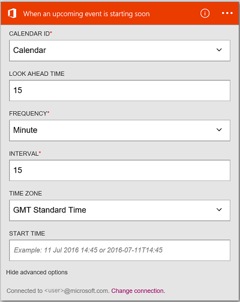

---
# required metadata
title: Connect to Office 365 Outlook - Azure Logic Apps | Microsoft Docs
description: Manage email, contacts, and calendars with Office 365 REST APIs and Azure Logic Apps 
author: ecfan
manager: jeconnoc
ms.author: estfan
ms.date: 10/18/2016
ms.topic: article
ms.service: logic-apps
services: logic-apps

# optional metadata
ms.reviewer: klam, LADocs
ms.suite: integration
tags: connectors
---

# Get started with the Office 365 Outlook connector
The Office 365 Outlook connector enables interaction with Outlook in Office 365. Use this connector to create, edit, and update contacts and calendar items, and also get, send, and reply to email.

With Office 365 Outlook, you:

* Build your workflow using the email and calendar features within Office 365. 
* Use triggers to start your workflow when there is a new email, when a calendar item is updated, and more.
* Use actions to send an email, create a new calendar event, and more. For example, when there is a new object in Salesforce (a trigger), send an email to your Office 365 Outlook (an action). 

This article shows you how to use the Office 365 Outlook connector in a logic app, and also lists the triggers and actions.

> [!NOTE]
> This version of the article applies to Logic Apps general availability (GA).
> 
> 

To learn more about Logic Apps, see [What are logic apps](../logic-apps/logic-apps-overview.md) and [create a logic app](../logic-apps/quickstart-create-first-logic-app-workflow.md).

## Connect to Office 365
Before your logic app can access any service, you first create a *connection* to the service. A connection provides connectivity between a logic app and another service. For example, to connect to Office 365 Outlook, you first need an Office 365 *connection*. To create a connection, enter the credentials you normally use to access the service you wish to connect to. So with Office 365 Outlook, enter the credentials to your Office 365 account to create the connection.

## Create the connection
> [!INCLUDE [Steps to create a connection to Office 365](../../includes/connectors-create-api-office365-outlook.md)]
> 
> 

## Use a trigger
A trigger is an event that can be used to start the workflow defined in a logic app. Triggers "poll" the service at an interval and frequency that you want. [Learn more about triggers](../logic-apps/logic-apps-overview.md#logic-app-concepts).

1. In the logic app, type "office 365" to get a list of the triggers:  
   
    
2. Select **Office 365 Outlook - When an upcoming event is starting soon**. If a connection already exists, then select a calendar from the drop-down list.
   
    
   
    If you are prompted to sign in, then enter the sign in details to create the connection. [Create the connection](connectors-create-api-office365-outlook.md#create-the-connection) in this topic lists the steps. 
   
   > [!NOTE]
   > In this example, the logic app runs when a calendar event is updated. To see the results of this trigger, add another action that sends you a text message. For example, add the Twilio *Send message* action that texts you when the calendar event is starting in 15 minutes. 
   > 
   > 
3. Select the **Edit** button and set the **Frequency** and **Interval** values. For example, if you want the trigger to poll every 15 minutes, then set the **Frequency** to **Minute**, and set the **Interval** to **15**. 
   
    
4. **Save** your changes (top left corner of the toolbar). Your logic app is saved and may be automatically enabled.

## Use an action
An action is an operation carried out by the workflow defined in a logic app. [Learn more about actions](../logic-apps/logic-apps-overview.md#logic-app-concepts).

1. Select the plus sign. You see several choices: **Add an action**, **Add a condition**, or one of the **More** options.
   
    
2. Choose **Add an action**.
3. In the text box, type “office 365” to get a list of all the available actions.
   
     
4. In our example, choose **Office 365 Outlook - Create contact**. If a connection already exists, then choose the **Folder ID**, **Given Name**, and other properties:  
   
    
   
    If you are prompted for the connection information, then enter the details to create the connection. [Create the connection](connectors-create-api-office365-outlook.md#create-the-connection) in this topic describes these properties. 
   
   > [!NOTE]
   > In this example, we create a new contact in Office 365 Outlook. You can use output from another trigger to create the contact. For example, add the SalesForce *When an object is created* trigger. Then add the Office 365 Outlook *Create contact* action that uses the SalesForce fields to create the new contact in Office 365. 
   > 
   > 
5. **Save** your changes (top left corner of the toolbar). Your logic app is saved and may be automatically enabled.

## Connector-specific details

View any triggers and actions defined in the swagger, and also see any limits in the [connector details](/connectors/office365connector/). 

## Next Steps
[Create a logic app](../logic-apps/quickstart-create-first-logic-app-workflow.md). Explore the other available connectors in Logic Apps at our [APIs list](apis-list.md).

