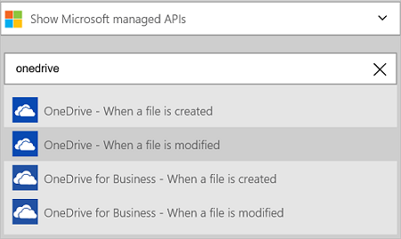
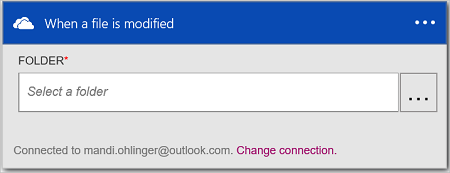
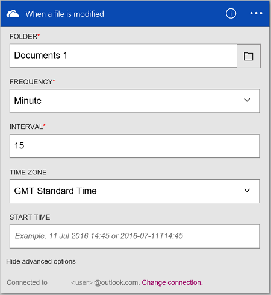
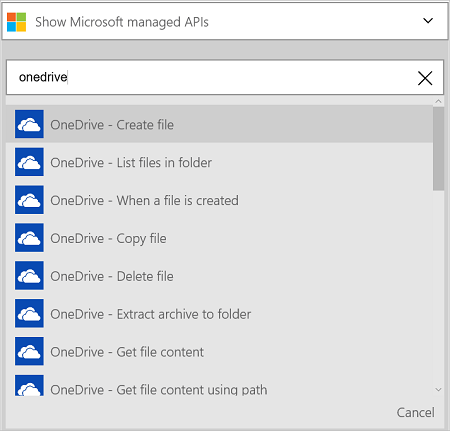
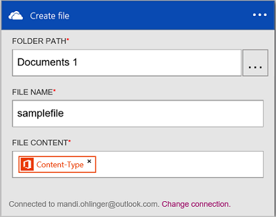
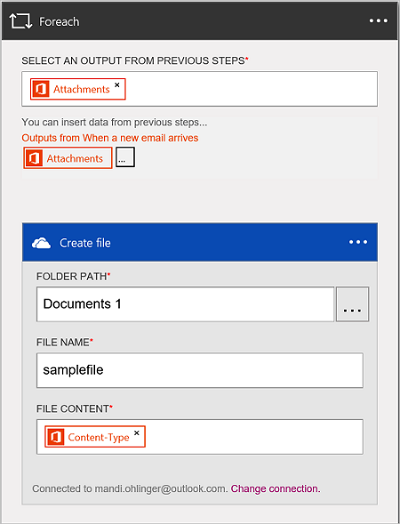

# Access and manage files in OneDrive connector by using Azure Logic Apps

By using [Azure Logic Apps](../logic-apps/logic-apps-overview.md) and the [OneDrive connector](/connectors/onedriveconnector/), you can create automated tasks and workflows to manage your files, including upload, get, delete files, and more. With OneDrive, you can perform these tasks:

* Build your workflow by storing files in OneDrive, or update existing files in OneDrive. 
* Use triggers to start your workflow when a file is created or updated within your OneDrive.
* Use actions to create a file, delete a file, and more. For example, when a new Office 365 email is received with an attachment (a trigger), create a new file in OneDrive (an action).

This article shows you how to use the OneDrive connector in a logic app, and also lists the triggers and actions.

To learn more about Logic Apps, see [What are logic apps](../logic-apps/logic-apps-overview.md) and [create a logic app](../logic-apps/quickstart-create-first-logic-app-workflow.md).

## Connect to OneDrive

Before your logic app can access any service, you first create a *connection* to the service. A connection provides connectivity between a logic app and another service. For example, to connect to OneDrive, you first need a OneDrive *connection*. To create a connection, enter the credentials you normally use to access the service you wish to connect to. So, with OneDrive, enter the credentials to your OneDrive account  to create the connection.

### Create the connection

[!INCLUDE [Steps to create a connection to OneDrive](../../includes/connectors-create-api-onedrive.md)]

## Use a trigger

A trigger is an event that can be used to start the workflow defined in a logic app. Triggers "poll" the service at an interval and frequency that you want. [Learn more about triggers](../logic-apps/logic-apps-overview.md#logic-app-concepts).

1. In the Logic App Designer, type `onedrive` to get a list of the triggers:  

   

2. Select **When a file is modified**. If a connection already exists, then select the Show Picker button to select a folder.

   

   If you are prompted to sign in, then enter the sign in details to create the connection. [Create the connection](connectors-create-api-onedrive.md#create-the-connection) in this article lists the steps.

   In this example, the logic app runs when a file in the folder you choose is updated. To see the results of this trigger, add another action that sends you an email. For example, add the Office 365 Outlook *Send an email* action that emails you when a file is updated.

3. Select the **Edit** button and set the **Frequency** and **Interval** values. For example, if you want the trigger to poll every 15 minutes, then set the **Frequency** to **Minute**, and set the **Interval** to **15**. 

   

4. **Save** your changes (top left corner of the toolbar). Your logic app is saved and may be automatically enabled.

## Use an action

An action is an operation carried out by the workflow defined in a logic app. [Learn more about actions](../logic-apps/logic-apps-overview.md#logic-app-concepts).

1. Select the plus sign. You see several choices: **Add an action**, **Add a condition**, or one of the **More** options.

   

2. Choose **Add an action**.

3. In the search box, type `onedrive` to get a list of all the available actions.

    

4. In our example, choose **OneDrive - Create file**. If a connection already exists, then select the **Folder Path** to put the file, enter the **File Name**, and choose the **File Content** you want:  

   

   If you are prompted for the connection information, enter the details to [create the connection as described](#create-the-connection) in this topic.

   In this example, you create a new file in a OneDrive folder. You can use output from another trigger to create the OneDrive file. For example, add the Office 365 Outlook *When a new email arrives* trigger. Then add the OneDrive *Create file* action that uses the Attachments and Content-Type fields within a ForEach to create the new file in OneDrive.

   

5. **Save** your changes (top left corner of the toolbar). Your logic app is saved and may be automatically enabled.

## Connector-specific details

View any triggers and actions defined in the swagger, and also see any limits in the [connector details](/connectors/onedriveconnector/).

## Next steps

* [Connectors for Azure Logic Apps](apis-list.md)