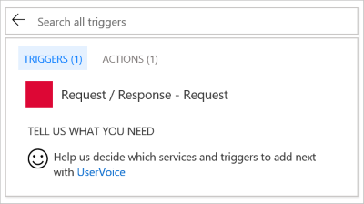
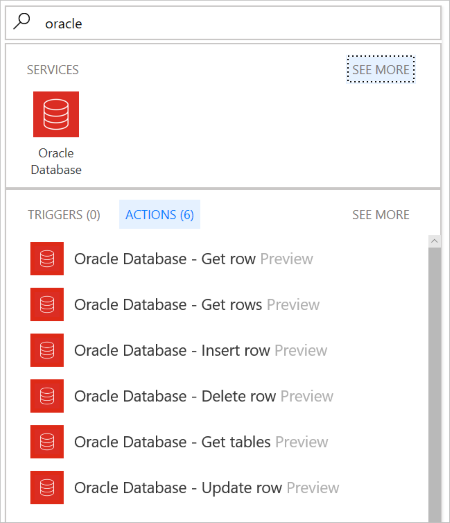
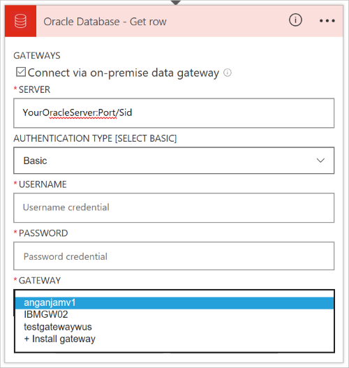
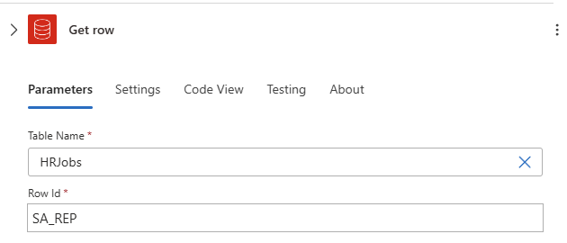
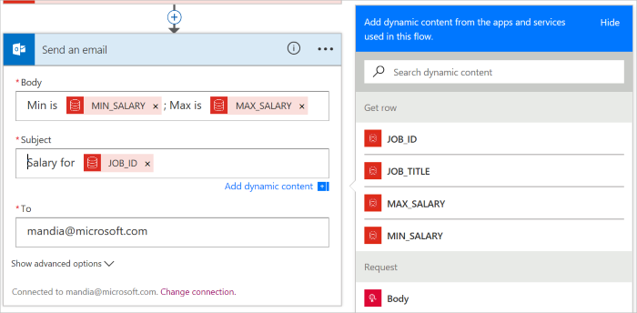
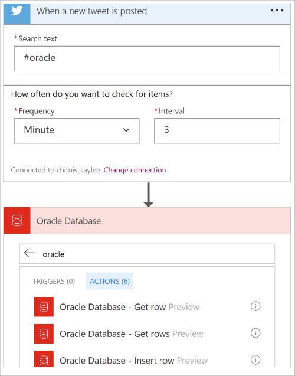
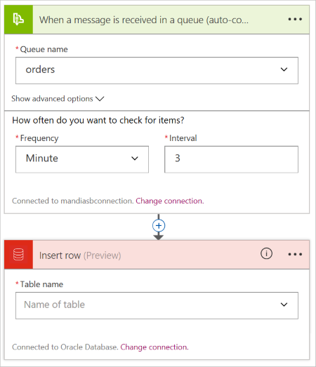

---
# required metadata
title: Connect to Oracle Database - Azure Logic Apps | Microsoft Docs
description: Insert and manage records with Oracle Database REST APIs and Azure Logic Apps 
author: ecfan
manager: jeconnoc
ms.author: estfan
ms.date: 03/29/2017
ms.topic: article
ms.service: logic-apps
services: logic-apps

# optional metadata
ms.reviewer: klam, LADocs
ms.suite: integration
tags: connectors
---

# Get started with the Oracle Database connector

Using the Oracle Database connector, you create organizational workflows that use data in your existing database. This connector can connect to an on-premises Oracle Database, or an Azure virtual machine with Oracle Database installed. With this connector, you can:

* Build your workflow by adding a new customer to a customers database, or updating an order in an orders database.
* Use actions to get a row of data, insert a new row, and even delete. For example, when a record is created in Dynamics CRM Online (a trigger), then insert a row in an Oracle Database (an action). 

This article shows you how to use the Oracle Database connector in a logic app.

## Prerequisites

* Supported Oracle versions: 
    * Oracle 9 and later
    * Oracle client software 8.1.7 and later

* Install the on-premises data gateway. [Connect to on-premises data from logic apps](../logic-apps/logic-apps-gateway-connection.md) lists the steps. The gateway is required to connect to an on-premises Oracle Database, or an Azure VM with Oracle DB installed. 

    > [!NOTE]
    > The on-premises data gateway acts as a bridge, and provides a secure data transfer between on-premises data (data that is not in the cloud) and your logic apps. The same gateway can be used with multiple services, and multiple data sources. So, you may only need to install the gateway once.

* Install the Oracle Client on the machine where you installed the on-premises data gateway. Be sure to install the 64-bit Oracle Data Provider for .NET from Oracle:  

  [64-bit ODAC 12c Release 4 (12.1.0.2.4) for Windows x64](https://www.oracle.com/technetwork/database/windows/downloads/index-090165.html)

    > [!TIP]
    > If the Oracle client is not installed, an error occurs when you try to create or use the connection. See the common errors in this article.

## Add the connector

> [!IMPORTANT]
> This connector does not have any triggers. It has only actions. So when you create your logic app, add another trigger to start your logic app, such as **Schedule - Recurrence**, or **Request / Response - Response**. 

1. In the [Azure portal](https://portal.azure.com), create a blank logic app.

2. At the start of your logic app, select the **Request / Response - Request** trigger: 

    

3. Select **Save**. When you save, a request URL is automatically generated. 

4. Select **New step**, and select **Add an action**. Type in `oracle` to see the available actions: 

    

    > [!TIP]
    > This is also the quickest way to see the triggers and actions available for any connector. Type in part of the connector name, such as `oracle`. The designer lists any triggers and any actions. 

5. Select one of the actions, such as **Oracle Database - Get row**. Select **Connect via on-premises data gateway**. Enter the Oracle server name, authentication method, username, password, and select the gateway:

    

6. Once connected, select a table from the list, and enter the row ID to your table. You need to know the identifier to the table. If you don't know, contact your Oracle DB administrator, and get the output from `select * from yourTableName`. This gives you the identifiable information you need to proceed.

    In the following example, job data is being returned from a Human Resources database: 

    

7. In this next step, you can use any of the other connectors to build your workflow. If you want to test getting data from Oracle, then send yourself an email with the Oracle data using one of the send email connectors, such Office 365 or Gmail. Use the dynamic tokens from the Oracle table to build the `Subject` and `Body` of your email:

    

8. **Save** your logic app, and then select **Run**. Close the designer, and look at the runs history for the status. If it fails, select the failed message row. The designer opens, and shows you which step failed, and also shows the error information. If it succeeds, then you should receive an email with the information you added.

### Workflow ideas

* You want to monitor the #oracle hashtag, and put the tweets in a database so they can be queried, and used within other applications. In a logic app, add the `Twitter - When a new tweet is posted` trigger, and enter the **#oracle** hashtag. Then, add the `Oracle Database - Insert row` action, and select your table:

    

* Messages are sent to a Service Bus queue. You want to get these messages, and put them in a database. In a logic app, add the `Service Bus - when a message is received in a queue` trigger, and select the queue. Then, add the `Oracle Database - Insert row` action, and select your table:

    

## Common errors

#### **Error**: Cannot reach the Gateway

**Cause**: The on-premises data gateway is not able to connect to the cloud. 

**Mitigation**: Make sure your gateway is running on the on-premises machine where you installed it, and that it can connect to the internet.  We recommend not installing the gateway on a computer that may be turned off or sleep. You can also restart the on-premises data gateway service (PBIEgwService).

#### **Error**: The provider being used is deprecated: 'System.Data.OracleClient requires Oracle client software version 8.1.7 or greater.'. See [https://go.microsoft.com/fwlink/p/?LinkID=272376](https://go.microsoft.com/fwlink/p/?LinkID=272376) to install the official provider.

**Cause**: The Oracle client SDK is not installed on the machine where the on-premises data gateway is running.  

**Resolution**: Download and install the Oracle client SDK on the same computer as the on-premises data gateway.

#### **Error**: Table '[Tablename]' does not define any key columns

**Cause**: The table does not have any primary key.  

**Resolution**: The Oracle Database connector requires that a table with a primary key column be used.

#### Currently not supported

* Views 
* Any table with composite keys
* Nested object types in tables
 
## Connector-specific details

View any triggers and actions defined in the swagger, and also see any limits in the [connector details](/connectors/oracle/). 

## Get some help

The [Azure Logic Apps forum](https://social.msdn.microsoft.com/Forums/en-US/home?forum=azurelogicapps) is a great place to ask questions, answer questions, and see what other Logic Apps users are doing. 

You can help improve Logic Apps and connectors by voting and submitting your ideas at [https://aka.ms/logicapps-wish](https://aka.ms/logicapps-wish). 

## Next steps
[Create a logic app](../logic-apps/quickstart-create-first-logic-app-workflow.md), and explore the available connectors in Logic Apps at [APIs list](apis-list.md).
