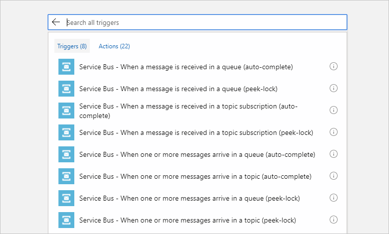
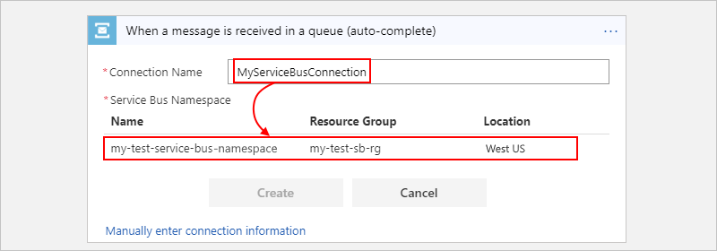
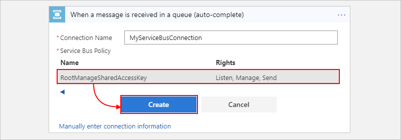
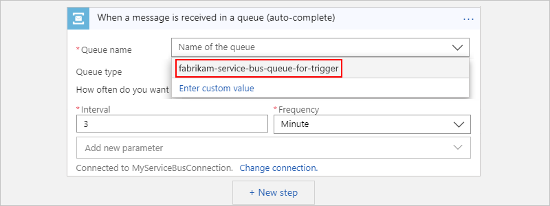
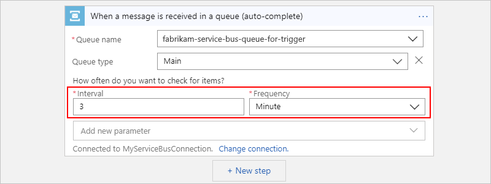
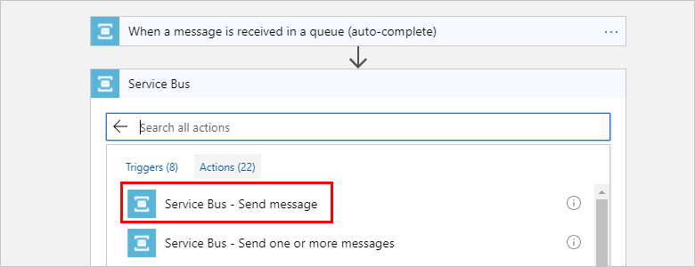
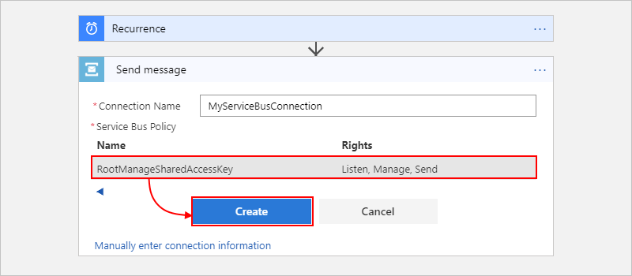
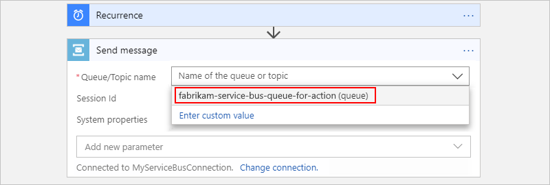
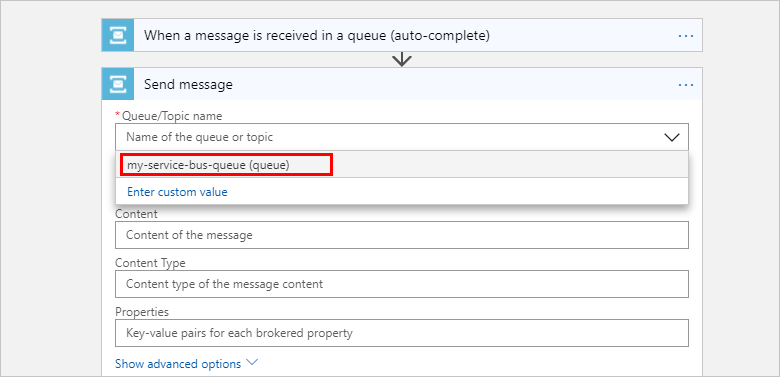

# Exchange messages in the cloud by using Azure Logic Apps and Azure Service Bus

With [Azure Logic Apps](../logic-apps/logic-apps-overview.md) and the [Azure Service Bus](../service-bus-messaging/service-bus-messaging-overview.md) connector, you can create automated tasks and workflows that transfer data, such as sales and purchase orders, journals, and inventory movements across applications for your organization. The connector not only monitors, sends, and manages messages, but also performs actions with queues, sessions, topics, subscriptions, and so on, for example:

* Monitor when messages arrive (auto-complete) or are received (peek-lock) in queues, topics, and topic subscriptions.
* Send messages.
* Create and delete topic subscriptions.
* Manage messages in queues and topic subscriptions, for example, get, get deferred, complete, defer, abandon, and dead-letter.
* Renew locks on messages and sessions in queues and topic subscriptions.
* Close sessions in queues and topics.

You can use triggers that get responses from Service Bus and make the output available to other actions in your logic apps. You can also have other actions use the output from Service Bus actions. If you're new to Service Bus and Logic Apps, review [What is Azure Service Bus?](../service-bus-messaging/service-bus-messaging-overview.md) and [What is Azure Logic Apps](../logic-apps/logic-apps-overview.md)?

[!INCLUDE [Warning about creating infinite loops](../../includes/connectors-infinite-loops.md)]

## Prerequisites

* An Azure subscription. If you don't have an Azure subscription, [sign up for a free Azure account](https://azure.microsoft.com/free/).

* A Service Bus namespace and messaging entity, such as a queue. These items and your logic app need to use the same Azure subscription. If you don't have these items, learn how to [create your Service Bus namespace and a queue](../service-bus-messaging/service-bus-create-namespace-portal.md).

* Basic knowledge about [how to create logic apps](../logic-apps/quickstart-create-first-logic-app-workflow.md)

* The logic app where you use the Service Bus namespace and messaging entity. Your logic app and the service bus need to use the same Azure subscription. To start your workflow with a Service Bus trigger, [create a blank logic app](../logic-apps/quickstart-create-first-logic-app-workflow.md). To use a Service Bus action in your workflow, start your logic app with another trigger, for example, the [Recurrence trigger](../connectors/connectors-native-recurrence.md).

## Check permissions

Confirm that your logic app has permissions for accessing your Service Bus namespace.

1. Sign in to the [Azure portal](https://portal.azure.com).

1. Go to your Service Bus *namespace*. On the namespace page, under **Settings**, select **Shared access policies**. Under **Claims**, check that you have **Manage** permissions for that namespace.

   

1. Get the connection string for your Service Bus namespace. You need this string when you provide the connection information in your logic app.

   1. On the **Shared access policies** pane, select **RootManageSharedAccessKey**.
   
   1. Next to your primary connection string, select the copy button. Save the connection string for later use.

      

   > [!TIP]
   > To confirm whether your connection string is associated with 
   > your Service Bus namespace or a messaging entity, such as a queue, 
   > search the connection string for the `EntityPath` parameter. 
   > If you find this parameter, the connection string is for a specific entity, 
   > and isn't the correct string to use with your logic app.

## Add Service Bus trigger

[!INCLUDE [Create connection general intro](../../includes/connectors-create-connection-general-intro.md)]

1. Sign in to the [Azure portal](https://portal.azure.com), and open your blank logic app in the Logic App Designer.

1. In the search box, enter "azure service bus" as your filter. From the triggers list, select the trigger that you want.

   For example, to trigger your logic app when a new item gets sent to a Service Bus queue, select the **When a message is received in a queue (auto-complete)** trigger.

   

   All Service Bus triggers are *long-polling* triggers. This description means that when the trigger fires, the trigger processes all the messages and then waits 30 seconds for more messages to appear in the queue or topic subscription. If no messages appear in 30 seconds, the trigger run is skipped. Otherwise, the trigger continues reading messages until the queue or topic subscription is empty. The next trigger poll is based on the recurrence interval specified in the trigger's properties.

   Some triggers, such as the **When one or more messages arrive in a queue (auto-complete)** trigger, can return one or more messages. When these triggers fire, they return between one and the number of messages that's specified by the trigger's **Maximum message count** property.

1. If your trigger is connecting to your Service Bus namespace for the first time, follow these steps when the Logic App Designer prompts you for connection information.

   1. Provide a name for your connection, and select your Service Bus namespace.

      

      To manually enter the connection string instead, select **Manually enter connection information**. If you don't have your connection string, learn [how to find your connection string](#permissions-connection-string).

   1. Select your Service Bus policy, and select **Create**.

      

   1. Select the messaging entity you want, such as a queue or topic. For this example, select your Service Bus queue.
   
      

1. Provide the necessary information for your selected trigger. To add other available properties to the action, open the **Add new parameter** list, and select the properties that you want.

   For this example's trigger, select the polling interval and frequency for checking the queue.

   

   For more information about available triggers and properties, see the connector's [reference page](/connectors/servicebus/).

1. Continue building your logic app by adding the actions that you want.

   For example, you can add an action that sends email when a new message arrives. When your trigger checks your queue and finds a new message, your logic app runs your selected actions for the found message.

## Add Service Bus action

[!INCLUDE [Create connection general intro](../../includes/connectors-create-connection-general-intro.md)]

1. Sign in to the [Azure portal](https://portal.azure.com), and open your logic app in the Logic App Designer.

1. Under the step where you want to add an action, select **New step**.

   Or, to add an action between steps, move your pointer over the arrow between those steps. Select the plus sign (**+**) that appears, and select **Add an action**.

1. Under **Choose an action**, in the search box, enter "azure service bus" as your filter. From the actions list, select the action that you want. 

   For this example, select the **Send message** action.

    

1. If your action is connecting to your Service Bus namespace for the first time, follow these steps when the Logic App Designer prompts you for connection information.

   1. Provide a name for your connection, and select your Service Bus namespace.

      

      To manually enter the connection string instead, select **Manually enter connection information**. If you don't have your connection string, learn [how to find your connection string](#permissions-connection-string).

   1. Select your Service Bus policy, and select **Create**.

      

   1. Select the messaging entity you want, such as a queue or topic. For this example, select your Service Bus queue.

      

1. Provide the necessary details for your selected action. To add other available properties to the action, open the **Add new parameter** list, and select the properties that you want.

   For example, select the **Content** and **Content Type** properties so that you add them to the action. Then, specify the content for the message that you want to send.

   

   For more information about available actions and their properties, see the connector's [reference page](/connectors/servicebus/).

1. Continue building your logic app by adding any other actions that you want.

   For example, you can add an action that sends email to confirm that your message was sent.

1. Save your logic app. On the designer toolbar, select **Save**.

## Connector reference

The Service Bus connector can save up to 1,500 unique sessions at a time from a service bus to the connector cache. If the session count exceeds this limit, old sessions are removed from the cache. For more information, see [Message sessions](../service-bus-messaging/message-sessions.md).

For other technical details about triggers, actions, and limits, which are described by the connector's OpenAPI (formerly Swagger) description, review the connector's [reference page](/connectors/servicebus/). For more about Azure Service Bus Messaging, see [What is Azure Service Bus](../service-bus-messaging/service-bus-messaging-overview.md)?

## Next steps

* Learn about other [Logic Apps connectors](../connectors/apis-list.md)
