# Connect to Azure Service Bus from workflows in Azure Logic Apps

[!INCLUDE [logic-apps-sku-consumption-standard](../../includes/logic-apps-sku-consumption-standard.md)]

This article shows how to access Azure Service Bus from a workflow in Azure Logic Apps with the Service Bus connector. You can then create automated workflows that run when triggered by events in a service bus or run actions to manage service bus items, for example:

* Monitor when messages arrive (auto-complete) or are received (peek-lock) in queues, topics, and topic subscriptions.
* Send messages.
* Create and delete topic subscriptions.
* Manage messages in queues and topic subscriptions, for example, get, get deferred, complete, defer, abandon, and dead-letter.
* Renew locks on messages and sessions in queues and topic subscriptions.
* Close sessions in queues and topics.

You can use triggers that get responses from Azure Service Bus and make the output available to other actions in your workflows. You can also have other actions use the output from Service Bus actions.

<a name="connector-reference"></a>

## Connector technical reference

The Service Bus connector has different versions, based on [logic app workflow type and host environment](../logic-apps/logic-apps-overview.md#resource-environment-differences).

| Logic app | Environment | Connector version |
|-----------|-------------|-------------------|
| **Consumption** | Multi-tenant Azure Logic Apps | Managed connector (Standard class). For more information, review the following documentation: <br><br>- [Service Bus managed connector reference](/connectors/servicebus/) <br>- [Managed connectors in Azure Logic Apps](managed.md) |
| **Consumption** | Integration service environment (ISE) | Managed connector (Standard class) and ISE version, which has different message limits than the Standard class. For more information, review the following documentation: <br><br>- [SQL Server managed connector reference](/connectors/sql) <br>- [ISE message limits](../logic-apps/logic-apps-limits-and-config.md#message-size-limits) <br>- [Managed connectors in Azure Logic Apps](managed.md) |
| **Standard** | Single-tenant Azure Logic Apps and App Service Environment v3 (Windows plans only) | Managed connector (Azure-hosted) and built-in connector, which is [service provider based](../logic-apps/custom-connector-overview.md#service-provider-interface-implementation). The built-in version usually provides better performance, capabilities, pricing, and so on. <br><br>For more information, review the following documentation: <br><br>- [Service Bus managed connector reference](/connectors/servicebus/) <br>- [Service Bus built-in connector operations](#built-in-connector-operations) section later in this article <br>- [Built-in connectors in Azure Logic Apps](built-in.md) |

## Prerequisites

* An Azure account and subscription. If you don't have an Azure subscription, [sign up for a free Azure account](https://azure.microsoft.com/free/?WT.mc_id=A261C142F).

* A Service Bus namespace and messaging entity, such as a queue. For more information, review the following documentation:

  * [Create a Service Bus namespace](../service-bus-messaging/service-bus-create-namespace-portal.md)

  * [Create a Service Bus namespace and queue](../service-bus-messaging/service-bus-quickstart-portal.md)

  * [Create a Service Bus namespace and topic with subscription](../service-bus-messaging/service-bus-queues-topics-subscriptions.md)

* The logic app workflow where you connect to your Service Bus namespace and messaging entity. To start your workflow with a Service Bus trigger, you have to start with a blank workflow. To use a Service Bus action in your workflow, start your workflow with any trigger.

* If your logic app resource uses a managed identity for authenticating access to your Service Bus namespace and messaging entity, make sure that you've assigned role permissions at the corresponding levels. For example, to access a queue, the managed identity requires a role that has the necessary permissions for that queue.

  Each managed identity that accesses a *different* messaging entity should have a separate connection to that entity. If you use different Service Bus actions to send and receive messages, and those actions require different permissions, make sure to use different connections.

  For more information about managed identities, review [Authenticate access to Azure resources with managed identities in Azure Logic Apps](../logic-apps/create-managed-service-identity.md).

## Considerations for Azure Service Bus operations

### Infinite loops

[!INCLUDE [Warning about creating infinite loops](../../includes/connectors-infinite-loops.md)]

### Peek-lock

In Standard logic app workflows, peek-lock operations are available only for *stateless* workflows, not stateful workflows.

### Limit on saved sessions in connector cache

Per [Service Bus messaging entity, such as a subscription or topic](../service-bus-messaging/service-bus-queues-topics-subscriptions.md), the Service Bus connector can save up to 1,500 unique sessions at a time to the connector cache. If the session count exceeds this limit, old sessions are removed from the cache. For more information, see [Message sessions](../service-bus-messaging/message-sessions.md).

<a name="sequential-convoy"></a>

### Send correlated messages in order

When you need to send related messages in a specific order, you can create a workflow using Service Bus connector and the [*sequential convoy* pattern](/azure/architecture/patterns/sequential-convoy). Correlated messages have a property that defines the relationship between those messages, such as the ID for the [session](../service-bus-messaging/message-sessions.md) in Azure Service Bus.

When you create a Consumption logic app workflow, you can select the **Correlated in-order delivery using service bus sessions** template, which implements the sequential convoy pattern. For more information, see [Send related messages in order](../logic-apps/send-related-messages-sequential-convoy.md).

### Large message support

Large message support is available only for Standard workflows when you use the Service Bus built-in connector operations. For example, you can receive and large messages using the built-in triggers and actions respectively.

For the Service Bus managed connector, the maximum message size is limited to 1 MB, even when you use a premium tier Service Bus namespace.

### Increase timeout for receiving and sending messages

In Standard workflows that use the Service Bus built-in operations, you can increase the timeout for receiving and sending messages. For example, to increase the timeout for receiving a message, [change the following setting in the Azure Functions extension](../azure-functions/functions-bindings-service-bus.md#install-bundle):

```json
{
   "version": "2.0",
   "extensionBundle": {
      "id": "Microsoft.Azure.Functions.ExtensionBundle.Workflows",
      "version": "[1.*, 2.0.0)"
   },
   "extensions": {
      "serviceBus": {
         "batchOptions": {
            "operationTimeout": "00:15:00"
         }
      }  
   }
}
```

To increase the timeout for sending a message, [add the `ServiceProviders.ServiceBus.MessageSenderOperationTimeout` app setting](../logic-apps/edit-app-settings-host-settings.md).

### Service Bus triggers

* For the Service Bus managed connector, all triggers are *long-polling*. This trigger type processes all the messages and then waits 30 seconds for more messages to appear in the queue or topic subscription. If no messages appear in 30 seconds, the trigger run is skipped. Otherwise, the trigger continues reading messages until the queue or topic subscription is empty. The next trigger poll is based on the recurrence interval specified in the trigger's properties.

* Some triggers, such as the **When one or more messages arrive in a queue (auto-complete)** trigger, can return one or more messages. When these triggers fire, they return between one and the number of messages that's specified by the trigger's **Maximum message count** property.

  > [!NOTE]
  >
  > The auto-complete trigger automatically completes a message, but completion happens only at the next call 
  > to Service Bus. This behavior can affect your workflow design. For example, avoid changing the concurrency 
  > on the auto-complete trigger because this change might result in duplicate messages if your workflow enters 
  > a throttled state. Changing the concurrency control creates the following conditions:
  >
  > * Throttled triggers are skipped with the `WorkflowRunInProgress` code.
  >
  > * The completion operation won't run.
  >
  > * The next trigger run occurs after the polling interval.
  >
  > You have to set the service bus lock duration to a value that's longer than the polling interval. 
  > However, despite this setting, the message still might not complete if your workflow remains in a 
  > throttled state at next polling interval.
  >
  > However, if you [turn on a Service Bus trigger's concurrency setting](../logic-apps/logic-apps-workflow-actions-triggers.md#change-trigger-concurrency), 
  > the default value for the `maximumWaitingRuns` property is 10. Based on the Service Bus entity's lock duration setting 
  > and the run duration for your workflow, this default value might be too large and might cause a "lock lost" exception. 
  > To find the optimal value for your scenario, start testing with a value of 1 or 2 for the `maximumWaitingRuns` property. 
  > To change the maximum waiting runs value, review [Change waiting runs limit](../logic-apps/logic-apps-workflow-actions-triggers.md#change-waiting-runs).

<a name="permissions-connection-string"></a>

## Step 1 - Check access to Service Bus namespace

To confirm that your logic app resource has permissions to access your Service Bus namespace, use the following steps:

1. In the [Azure portal](https://portal.azure.com), open your Service Bus *namespace*.

1. On the namespace menu, under **Settings**, select **Shared access policies**. Under **Claims**, check that you have **Manage** permissions for that namespace.

   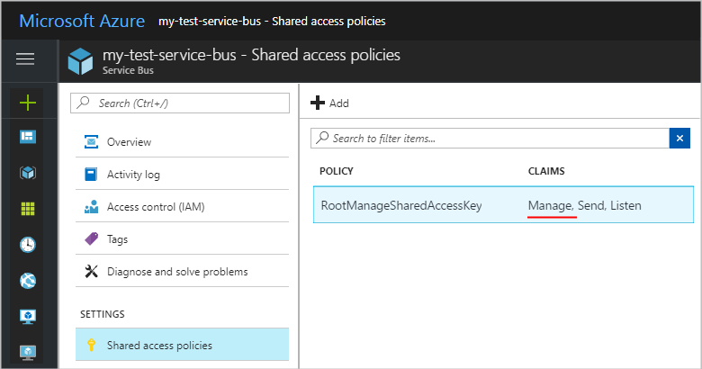

## Step 2 - Get connection authentication requirements

Later, when you add a Service Bus trigger or action for the first time, you're prompted for connection information, including the connection authentication type. Based on your logic app workflow type, Service Bus connector version, and selected authentication type, you'll need the following items:

<a name="managed-connector-auth"></a>

### Managed connector authentication (Consumption and Standard workflows)

| Authentication type | Required information |
|---------------------|----------------------|
| **Access Key** | The connection string for your Service Bus namespace. For more information, review [Get connection string for Service Bus namespace](#get-connection-string) |
| **Azure AD Integrated** | The endpoint URL for your Service Bus namespace. For more information, review [Get endpoint URL for Service Bus namespace](#get-endpoint-url). |
| **Logic Apps Managed Identity** | The endpoint URL for your Service Bus namespace. For more information, review [Get endpoint URL for Service Bus namespace](#get-endpoint-url). |

<a name="built-in-connector-auth"></a>

### Built-in connector authentication (Standard workflows only)

| Authentication type | Required information |
|---------------------|----------------------|
| **Connection String** | The connection string for your Service Bus namespace. For more information, review [Get connection string for Service Bus namespace](#get-connection-string) |
| **Active Directory OAuth** | - The fully qualified name for your Service Bus namespace, for example, **<*your-Service-Bus-namespace*>.servicebus.windows.net**. For more information, review [Get fully qualified name for Service Bus namespace](#get-fully-qualified-namespace). For the other property values, review [Azure Active Directory Open Authentication](../logic-apps/logic-apps-securing-a-logic-app.md#azure-active-directory-oauth-authentication). |
| **Managed identity** | The fully qualified name for your Service Bus namespace, for example, **<*your-Service-Bus-namespace*>.servicebus.windows.net**. For more information, review [Get fully qualified name for Service Bus namespace](#get-fully-qualified-namespace). |

<a name="get-connection-string"></a>

### Get connection string for Service Bus namespace

1. In the [Azure portal](https://portal.azure.com), open your Service Bus *namespace*.

1. On the namespace menu, under **Settings**, select **Shared access policies**.

1. On the **Shared access policies** pane, select **RootManageSharedAccessKey**.

1. Next to your primary connection string, select the copy button.

   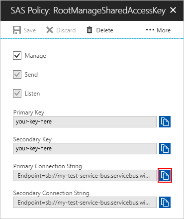

   > [!NOTE]
   >
   > To check that the string is for the namespace, not a specific messaging entity, search the 
   > connection string for the `EntityPath` parameter. If you find this parameter, the connection 
   > string is for a specific entity, and isn't the correct string to use with your workflow.

1. Save the connection string for later use.

<a name="get-endpoint-url"></a>

### Get endpoint URL for Service Bus namespace

1. In the [Azure portal](https://portal.azure.com), open your Service Bus *namespace*.

1. On the namespace menu, under **Settings**, select **Properties**.

1. In the **Properties** section, find the **Service bus endpoint** property, and copy the URL.

1. Save the URL for later use.

<a name="get-fully-qualified-namespace"></a>

### Get fully qualified name for Service Bus namespace

1. In the [Azure portal](https://portal.azure.com), open your Service Bus *namespace*.

1. On the namespace menu, select **Overview**.

1. On the **Overview** pane, find the **Host name** property, and copy the fully qualified name, which looks like **<*your-Service-Bus-namespace*>.servicebus.windows.net**.

<a name="add-trigger"></a>

## Step 3: Option 1 - Add a Service Bus trigger

The following steps use the Azure portal, but with the appropriate Azure Logic Apps extension, you can also use the following tools to create logic app workflows:

* Consumption logic app workflows: [Visual Studio](../logic-apps/quickstart-create-logic-apps-with-visual-studio.md) or [Visual Studio Code](../logic-apps/quickstart-create-logic-apps-visual-studio-code.md)

* Standard logic app workflows: [Visual Studio Code](../logic-apps/create-single-tenant-workflows-visual-studio-code.md)

### [Consumption](#tab/consumption)

1. In the [Azure portal](https://portal.azure.com), and open your blank logic app workflow in the designer.

1. On the designer, under the search box, select **Standard**. In the search box, enter **azure service bus**.

1. From the triggers list, select the trigger that you want.

   This example continues with the trigger named **When a message is received in a queue (auto-complete)**.

   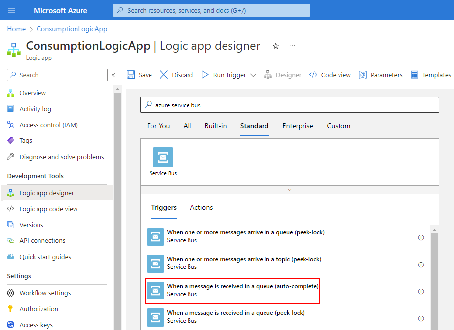

1. If prompted, provide the following information for your connection. When you're done, select **Create**.

   | Property | Required | Description |
   |----------|----------|-------------|
   | **Connection name** | Yes | A name for your connection |
   | **Authentication Type** | Yes | The type of authentication to use for accessing your Service Bus namespace. For more information, review [Managed connector authentication](#managed-connector-auth). |

   For example, this connection uses access key authentication and provides the connection string for a Service Bus namespace:

   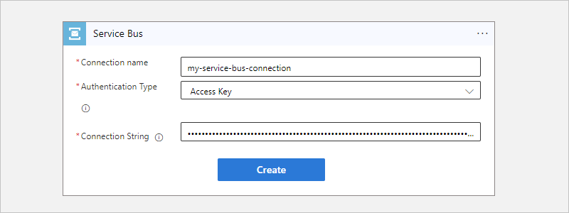

1. After the trigger information box appears, provide the necessary information, for example:

   | Property | Required | Description |
   |----------|----------|-------------|
   | **Queue name** | Yes | The selected queue to access |
   | **Queue type** | No | The type for the selected queue |
   | **How often do you want to check for items?** | Yes | The polling interval and frequency to check the queue for items |

   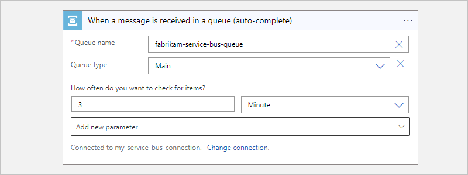

1. To add any other available properties to the trigger, open the **Add new parameter** list, and select the properties that you want.

1. Add any actions that your workflow needs.

   For example, you can add an action that sends email when a new message arrives. When your trigger checks your queue and finds a new message, your workflow runs your selected actions for the found message.

1. When you're done, save your workflow. On the designer toolbar, select **Save**.

### [Standard](#tab/standard)

The steps to add and use a Service Bus trigger differ based on whether you want to use the built-in connector or the managed, Azure-hosted connector.

* [**Built-in trigger**](#built-in-connector-trigger): Describes the steps to add the built-in trigger.

* [**Managed trigger**](#managed-connector-trigger): Describes the steps to add the managed trigger.

<a name="built-in-connector-trigger"></a>

#### Built-in connector trigger

1. In the [Azure portal](https://portal.azure.com), and open your blank logic app workflow in the designer.

1. On the designer, select **Choose an operation**.

1. On the **Add a trigger** pane, under the search box, select **Built-in**. In the search box, enter **service bus**.

1. From the triggers list, select the trigger that you want.

   This example continues with the trigger named **When messages are available in a queue**.

   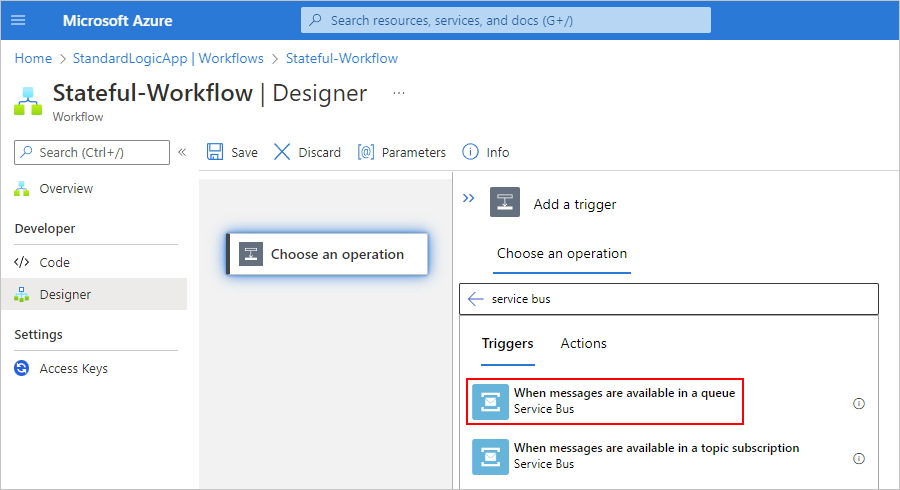

1. If prompted, provide the following information for your connection. When you're done, select **Create**.

   | Property | Required | Description |
   |----------|----------|-------------|
   | **Connection name** | Yes | A name for your connection |
   | **Authentication Type** | Yes | The type of authentication to use for accessing your Service Bus namespace. For more information, review [Built-in connector authentication](#built-in-connector-auth). |

   For example, this connection uses connection string authentication and provides the connection string for a Service Bus namespace:

   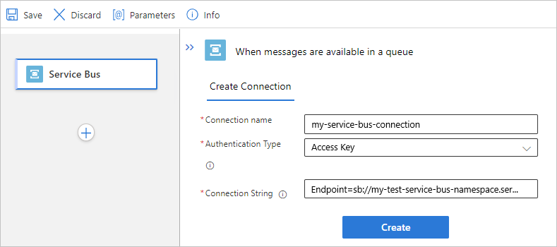

1. After the trigger information box appears, provide the necessary information, for example:

   | Property | Required | Description |
   |----------|----------|-------------|
   | **Queue name** | Yes | The selected queue to access |
   | **IsSessionsEnabled** | No | - **No** (default) if not connecting to a session-aware queue <br>- **Yes** if otherwise |

   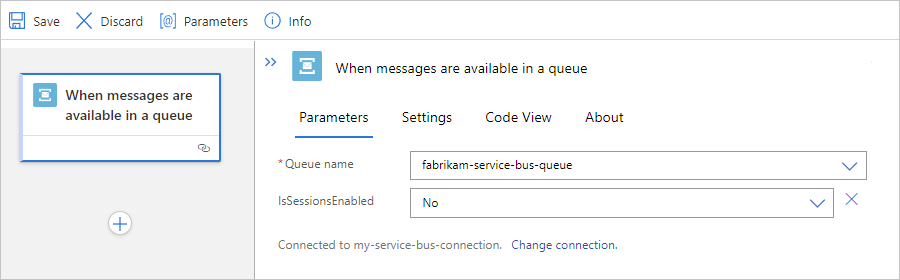

   > [!NOTE]
   >
   > This Service Bus trigger follows the *push trigger* pattern, which means that the trigger waits and listens 
   > for events or data that meet the specified condition before running a workflow. The trigger doesn't check 
   > for events or data based on a specified schedule. For more information, review [Triggers](introduction.md#triggers).

1. Add any actions that your workflow needs.

   For example, you can add an action that sends email when a new message arrives. When your trigger checks your queue and finds a new message, your workflow runs your selected actions for the found message.

1. When you're done, save your workflow. On the designer toolbar, select **Save**.

<a name="managed-connector-trigger"></a>

#### Managed connector trigger

1. In the [Azure portal](https://portal.azure.com), and open your blank logic app workflow in the designer.

1. On the designer, select **Choose an operation**.

1. On the **Add a trigger** pane, under the search box, select **Azure**. In the search box, enter **azure service bus**.

1. From the triggers list, select the trigger that you want.

   This example continues with the trigger named **When a message is received in a queue (auto-complete)**.

   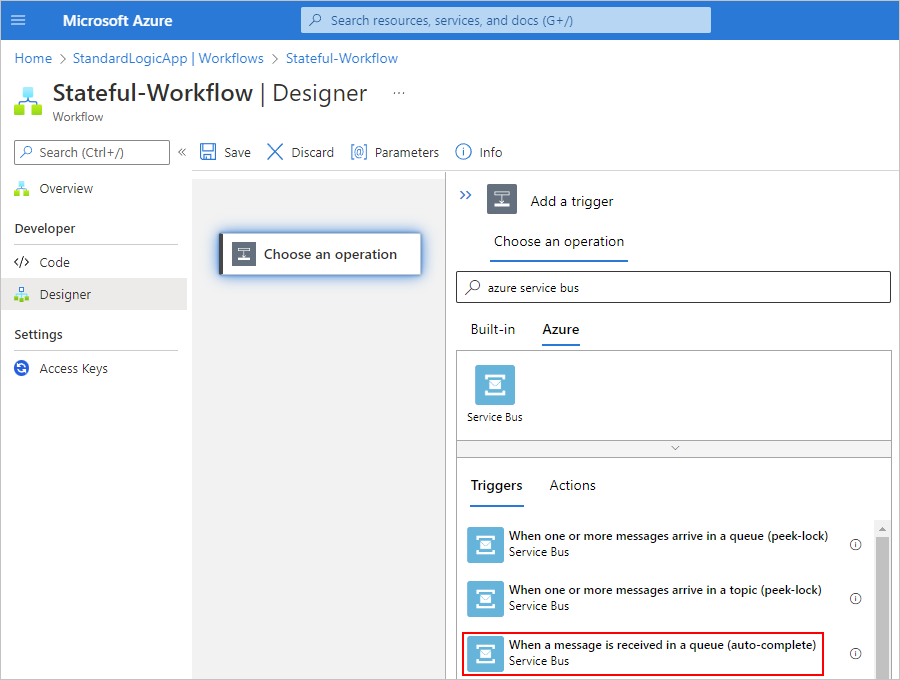

1. If prompted, provide the following information for your connection. When you're done, select **Create**.

   | Property | Required | Description |
   |----------|----------|-------------|
   | **Connection name** | Yes | A name for your connection |
   | **Authentication Type** | Yes | The type of authentication to use for accessing your Service Bus namespace. For more information, review [Managed connector authentication](#managed-connector-auth). |

   For example, this connection uses access key authentication and provides the connection string for a Service Bus namespace:

   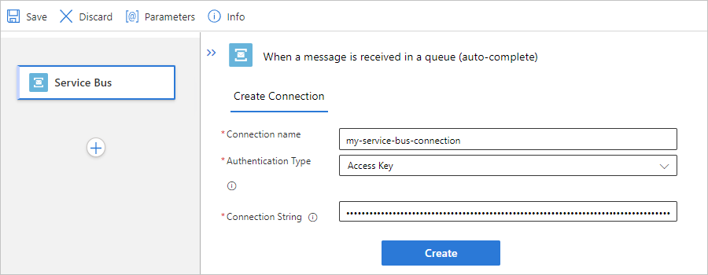

1. After the trigger information box appears, provide the necessary information, for example:

   | Property | Required | Description |
   |----------|----------|-------------|
   | **Queue name** | Yes | The selected queue to access |
   | **Queue type** | No | The type for the selected queue |
   | **How often do you want to check for items?** | Yes | The polling interval and frequency to check the queue for items |

   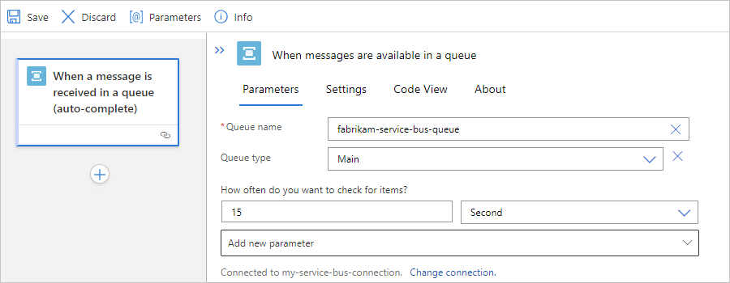

1. To add any other available properties to the trigger, open the **Add new parameter** list, and select the properties that you want.

1. Add any actions that your workflow needs.

   For example, you can add an action that sends email when a new message arrives. When your trigger checks your queue and finds a new message, your workflow runs your selected actions for the found message.

1. When you're done, save your workflow. On the designer toolbar, select **Save**.

---

<a name="add-action"></a>

## Step 3: Option 2 - Add a Service Bus action

The following steps use the Azure portal, but with the appropriate Azure Logic Apps extension, you can also use the following tools to create logic app workflows:

* Consumption logic app workflows: [Visual Studio](../logic-apps/quickstart-create-logic-apps-with-visual-studio.md) or [Visual Studio Code](../logic-apps/quickstart-create-logic-apps-visual-studio-code.md)

* Standard logic app workflows: [Visual Studio Code](../logic-apps/create-single-tenant-workflows-visual-studio-code.md)

### [Consumption](#tab/consumption)

1. In the [Azure portal](https://portal.azure.com), open your logic app workflow in the designer.

1. Under the trigger or action where you want to add the action, select **New step**.

   Or, to add an action between steps, move your pointer over the connecting arrow. Select the plus sign (**+**) that appears, and then select **Add an action**.

1. Under the **Choose an operation** search box, select **Standard**. In the search box, enter **azure service bus**. From the actions list, select the action that you want.

   This example continues with the **Send message** action.

   

1. If prompted, provide the following information for your connection. When you're done, select **Create**.

   | Property | Required | Description |
   |----------|----------|-------------|
   | **Connection name** | Yes | A name for your connection |
   | **Authentication Type** | Yes | The type of authentication to use for accessing your Service Bus namespace. For more information, review [Managed connector authentication](#managed-connector-auth). |

   For example, this connection uses access key authentication and provides the connection string for a Service Bus namespace:

   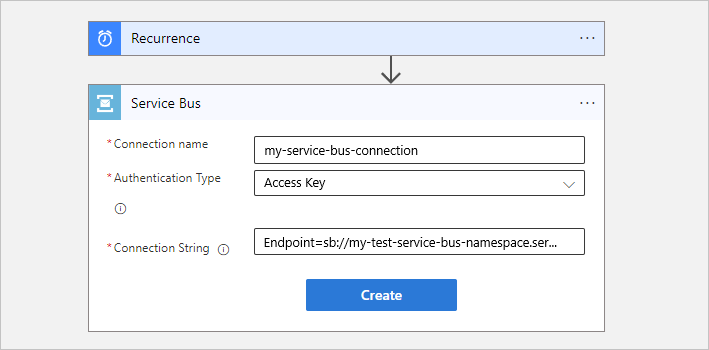

1. After the action information box appears, provide the necessary information, for example:

   | Property | Required | Description |
   |----------|----------|-------------|
   | **Queue/Topic name** | Yes | The selected queue or topic destination for sending the message |
   | **Session Id** | No | The session ID if sending the message to a session-aware queue or topic  |
   | **System properties** | No | - **None** <br>- **Run Details**: Add metadata property information about the run as custom properties in the message. |

   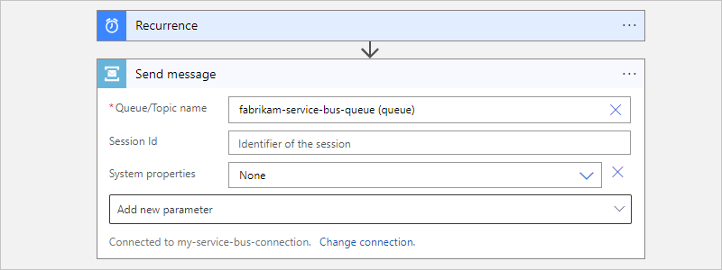

1. To add any other available properties to the action, open the **Add new parameter** list, and select the properties that you want.

1. Add any other actions that your workflow needs.

   For example, you can add an action that sends email to confirm that your message was sent.

1. When you're done, save your workflow. On the designer toolbar, select **Save**.

### [Standard](#tab/standard)

The steps to add and use a Service Bus action differ based on whether you want to use the built-in connector or the managed, Azure-hosted connector.

* [**Built-in action**](#built-in-connector-action): Describes the steps to add a built-in action.

* [**Managed action**](#managed-connector-action): Describes the steps to add a managed action.

<a name="built-in-connector-action"></a>

#### Built-in connector action

1. In the [Azure portal](https://portal.azure.com), and open your logic app workflow in the designer.

1. Under the trigger or action where you want to add the action, select the plus sign (**+**), and then select **Add an action**.

   Or, to add an action between existing steps, select the plus sign (**+**) on the connecting arrow, and then select **Add an action**.

1. On the **Add an action** pane, under the search box, select **Built-in**. In the search box, enter **service bus**.

1. From the actions list, select the action that you want.

   This example continues with the action named **Send message**.

   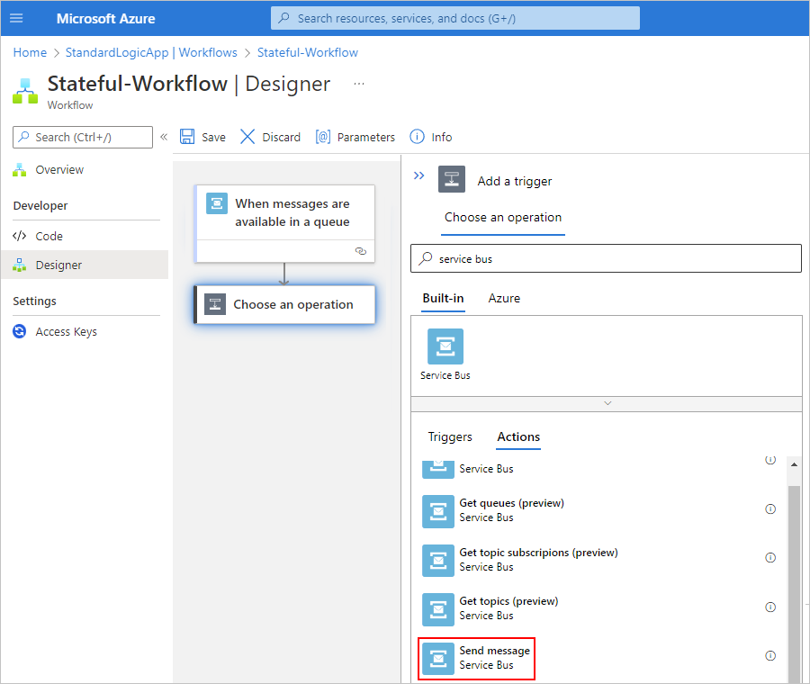

1. If prompted, provide the following information for your connection. When you're done, select **Create**.

   | Property | Required | Description |
   |----------|----------|-------------|
   | **Connection name** | Yes | A name for your connection |
   | **Authentication Type** | Yes | The type of authentication to use for accessing your Service Bus namespace. For more information, review [Built-in connector authentication](#built-in-connector-auth). |

   For example, this connection uses connection string authentication and provides the connection string for a Service Bus namespace:

   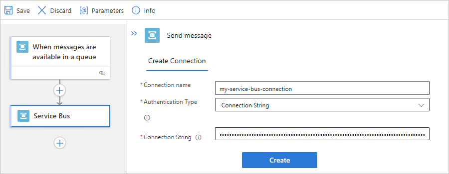

1. After the action information box appears, provide the necessary information, for example:

   | Property | Required | Description |
   |----------|----------|-------------|
   | **Queue or topic name** | Yes | The selected queue to access |

   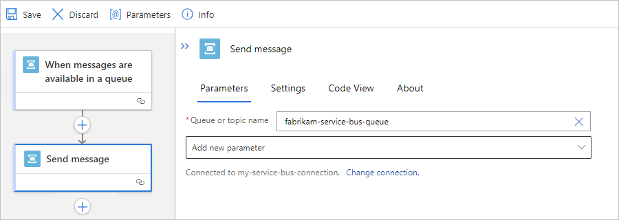

1. To add any other available properties to the action, open the **Add new parameter** list, and select the properties that you want.

1. Add any other actions that your workflow needs.

   For example, you can add an action that sends email to confirm that your message was sent.

1. When you're done, save your workflow. On the designer toolbar, select **Save**.

<a name="managed-connector-action"></a>

#### Managed connector action

1. In the [Azure portal](https://portal.azure.com), open your logic app workflow in the designer.

1. Under the trigger or action where you want to add the action, select **New step**.

   Or, to add an action between steps, move your pointer over the connecting arrow. Select the plus sign (**+**) that appears, and then select **Add an action**.

1. Under the **Choose an operation** search box, select **Azure**. In the search box, enter **azure service bus**.

1. From the actions list, select the action that you want.

   This example continues with the action named **Send message**.

   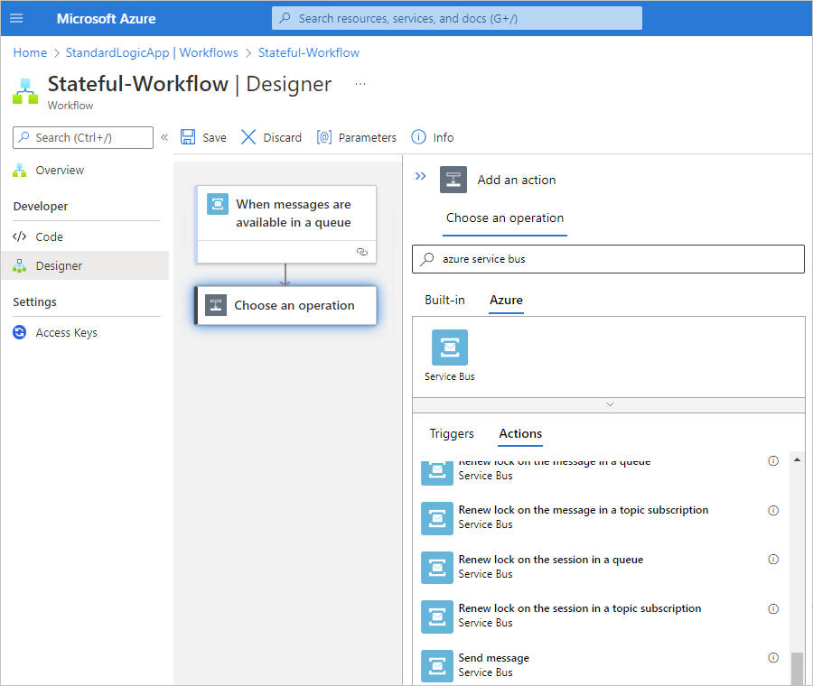

1. If prompted, provide the following information for your connection. When you're done, select **Create**.

   | Property | Required | Description |
   |----------|----------|-------------|
   | **Connection name** | Yes | A name for your connection |
   | **Authentication Type** | Yes | The type of authentication to use for accessing your Service Bus namespace. For more information, review [Managed connector authentication](#managed-connector-auth). |

   For example, this connection uses access key authentication and provides the connection string for a Service Bus namespace:

   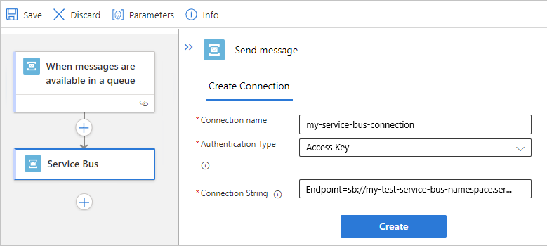

1. After the action information box appears, provide the necessary information, for example:

   | Property | Required | Description |
   |----------|----------|-------------|
   | **Queue/Topic name** | Yes | The selected queue or topic destination for sending the message |
   | **Session Id** | No | The session ID if sending the message to a session-aware queue or topic  |
   | **System properties** | No | - **None** <br>- **Run Details**: Add metadata property information about the run as custom properties in the message. |

   

1. To add any other available properties to the action, open the **Add new parameter** list, and select the properties that you want.

1. Add any other actions that your workflow needs.

   For example, you can add an action that sends email to confirm that your message was sent.

1. When you're done, save your workflow. On the designer toolbar, select **Save**.

---

<a name="built-in-connector-operations"></a>

## Service Bus built-in connector operations

The Service Bus built-in connector is available only for Standard logic app workflows and provides the following triggers and actions:

| Trigger | Description |
|-------- |-------------|
| When messages are available in a queue | Start a workflow when one or more messages are available in a queue. |
| When messages are available in a topic subscription | Start a workflow when one or more messages are available in a topic subscription. |

These Service Bus triggers follow the *push trigger* pattern, which means that the trigger waits and listens for events or data that meet the specified condition before running a workflow. The trigger doesn't check for events or data based on a specified schedule. For more information, review [Triggers](introduction.md#triggers).

| Action | Description |
|--------|-------------|
| Send message | Send a message to a queue or topic. |
| Send multiple messages | Send more than one message to a queue or topic. |

<a name="built-in-connector-app-settings"></a>

## Service Bus built-in connector app settings

In a Standard logic app resource, the Service Bus built-in connector includes app settings that control various thresholds, such as timeout for sending messages and number of message senders per processor core in the message pool. For more information, review [Reference for app settings - local.settings.json](../logic-apps/edit-app-settings-host-settings.md#reference-local-settings-json).

## Troubleshooting

### Delays in updates to your workflow taking effect

If a Service Bus trigger's polling interval is small, such as 10 seconds, updates to your workflow might not take effect for up to 10 minutes. To work around this problem, you can disable the logic app resource, make the changes, and then enable the logic app resource again.

### No session available

Occasionally, operations such as completing a message or renewing a session produce the following error:

``` json
{
  "status": 400,
  "message": "No session available to complete the message with the lock token 'ce440818-f26f-4a04-aca8-555555555555'. clientRequestId: facae905-9ba4-44f4-a42a-888888888888",
  "error": {
    "message": "No session available to complete the message with the lock token 'ce440818-f26f-4a04-aca8-555555555555'."
  }
}
```

The Service Bus connector uses in-memory cache to support all operations associated with the sessions. The Service Bus message receiver is cached in the memory of the role instance (virtual machine) that receives the messages. To process all requests, all calls for the connection get routed to this same role instance. This behavior is required because all the Service Bus operations in a session require the same receiver that receives the messages for a specific session.

The chance exists that requests might not get routed to the same role instance, due to reasons such as an infrastructure update, connector deployment, and so on. If this event happens, requests fail because the receiver that performs the operations in the session isn't available in the role instance that serves the request.

As long as this error happens only occasionally, the error is expected. When the error happens, the message is still preserved in the service bus. The next trigger or workflow run tries to process the message again.

## Next steps

* [Managed connectors for Azure Logic Apps](/connectors/connector-reference/connector-reference-logicapps-connectors)
* [Built-in connectors for Azure Logic Apps](built-in.md)
* [What are connectors in Azure Logic Apps](introduction.md)