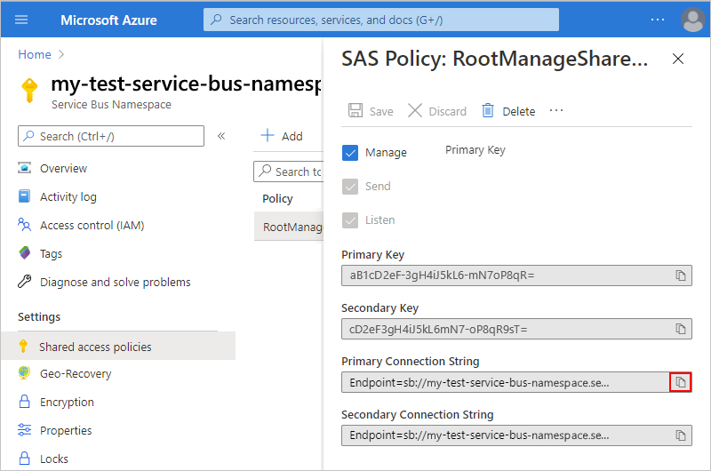

# Exchange messages in the cloud with Azure Service Bus and Azure Logic Apps

With Azure Logic Apps and the Azure Service Bus connector, 
you can create automated tasks and workflows that transfer data, 
such as sales and purchase orders, journals, and inventory movements 
across applications for your organization. The connector not only monitors, 
sends, and manages messages, but also performs actions with queues, sessions, 
topics, subscriptions, and so on, for example:

* Monitor when messages arrive (auto-complete) or are received 
(peek-lock) in queues, topics, and topic subscriptions. 
* Send messages.
* Create and delete topic subscriptions.
* Manage messages in queues and topic subscriptions, for example, 
get, get deferred, complete, defer, abandon, and dead-letter.
* Renew locks on messages and sessions in queues and topic subscriptions.
* Close sessions in queues and topics.

You can use triggers that get responses from Service Bus and 
make the output available to other actions in your logic apps. 
You can also have other actions use the output from Service Bus actions. 
If you're new to Service Bus and Logic Apps, review 
[What is Azure Service Bus?](../service-bus-messaging/service-bus-messaging-overview.md) 
and [What is Azure Logic Apps?](../logic-apps/logic-apps-overview.md).

## Prerequisites

* An Azure subscription. If you don't have an Azure subscription, 
<a href="https://azure.microsoft.com/free/" target="_blank">sign up for a free Azure account</a>. 

* A Service Bus namespace and messaging entity, such as a queue. 
If you don't have these items, learn how to 
[create your Service Bus namespace and a queue](../service-bus-messaging/service-bus-create-namespace-portal.md). 

  These items must exist in the same Azure subscription 
  as your logic apps that use these items.

* Basic knowledge about 
[how to create logic apps](../logic-apps/quickstart-create-first-logic-app-workflow.md)

* The logic app where you want to use Service Bus. Your logic app 
must exist in the same Azure subscription as your service bus. 
To start with a Service Bus trigger, [create a blank logic app](../logic-apps/quickstart-create-first-logic-app-workflow.md). 
To use a Service Bus action, start your logic app with another trigger, 
for example, the **Recurrence** trigger.

## Check permissions

Confirm that your logic app has permissions for accessing your Service Bus namespace. 

1. Sign in to the [Azure portal](https://portal.azure.com). 

2. Go to your Service Bus *namespace*. On the namespace page, 
under **Settings**, select **Shared access policies**. 
Under **Claims**, check that you have **Manage** permissions for that namespace

   

3. Get the connection string for your Service Bus namespace. 
You need this string when you enter your connection information in your logic app.

   1. Select **RootManageSharedAccessKey**. 
   
   1. Next to your primary connection string, 
   choose the copy button. Save the connection string for later use.

      

   > [!TIP]
   > To confirm whether your connection string is associated with 
   > your Service Bus namespace or a messaging entity, such as a queue, 
   > search the connection string for the `EntityPath` parameter. 
   > If you find this parameter, the connection string is for a specific entity, 
   > and isn't the correct string to use with your logic app.

## Add trigger or action

[!INCLUDE [Create connection general intro](../../includes/connectors-create-connection-general-intro.md)]

1. Sign in to the [Azure portal](https://portal.azure.com), 
and open your logic app in Logic App Designer, if not open already.

1. To add a *trigger* to a blank logic app, in the search box, 
enter "Azure Service Bus" as your filter. 
Under the triggers list, select the trigger you want. 

   For example, to trigger your logic app when a new item 
   gets sent to a Service Bus queue, select this trigger: 
   **When a message is received in a queue (auto-complete)**

   

   > [!NOTE]
   > Some triggers can return one or messages, for example, the trigger, 
   > **When one or more messages arrive in a queue (auto-complete)**. 
   > When these triggers fire, they return between one 
   > and the number of messages specified by the 
   > trigger's **Maximum message count** property.

   *All Service Bus triggers are long-polling triggers*, 
   which means when the trigger fires, the trigger 
   processes all the messages and then waits 30 seconds for 
   more messages to appear in the queue or topic subscription. 
   If no messages appear in 30 seconds, the trigger run is skipped. 
   Otherwise, the trigger continues reading messages until the 
   queue or topic subscription is empty. The next trigger poll is 
   based on the recurrence interval specified in the trigger's properties.

1. To add an *action* to an existing logic app, follow these steps: 

   1. Under the last step where you want to add an action, choose **New step**. 

      To add an action between steps, move your 
      pointer over the arrow between steps. 
      Choose the plus sign (**+**) that appears, 
      and then select **Add an action**.

   1. In the search box, enter "Azure Service Bus" as your filter. 
   Under the actions list, select the action you want. 
 
      For example, select this action: **Send message**

       

1. If you're connecting your logic app to your Service 
Bus namespace for the first time, the Logic App Designer 
now prompts you for your connection information. 

   1. Provide a name for your connection, and select your Service Bus namespace.

      

      To manually enter the connection string instead, 
      choose **Manually enter connection information**. 
      If you don't have your connection string, learn 
      [how to find your connection string](#permissions-connection-string).

   1. Now select your Service Bus policy, and then choose **Create**.

      

1. For this example, select the messaging entity you want, 
such as a queue or topic. In this example, select your Service Bus queue. 
   
   

1. Provide the necessary details for your trigger or action. 
For this example, follow the relevant steps for your trigger or action: 

   * **For the sample trigger**: Set the polling interval and 
   frequency for checking the queue.

     

     When you're done, continue building your logic app's workflow 
     by adding the actions you want. For example, you can add an 
     action that sends email when a new message arrives.
     When your trigger checks your queue and finds a new message, 
     your logic app runs your selected actions for the found message.

   * **For the sample action**: Enter the message content and any other details. 

     

     When you're done, continue building your logic app's workflow 
     by adding any other actions you want. For example, you can add 
     an action that sends email confirming your message was sent.

1. Save your logic app. On the designer toolbar, choose **Save**.

## Connector reference

For technical details about triggers, actions, and limits, which are 
described by the connector's OpenAPI (formerly Swagger) description, 
review the connector's [reference page](/connectors/servicebus/).

## Get support

* For questions, visit the [Azure Logic Apps forum](https://social.msdn.microsoft.com/Forums/en-US/home?forum=azurelogicapps).
* To submit or vote on feature ideas, visit the [Logic Apps user feedback site](http://aka.ms/logicapps-wish).

## Next steps

* Learn about other [Logic Apps connectors](../connectors/apis-list.md)